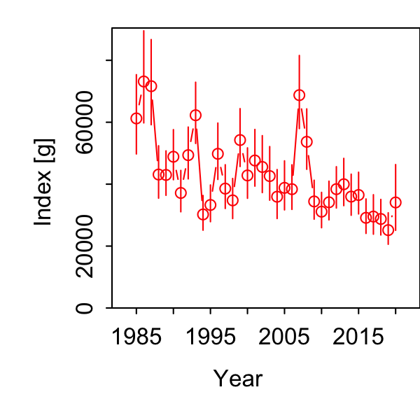
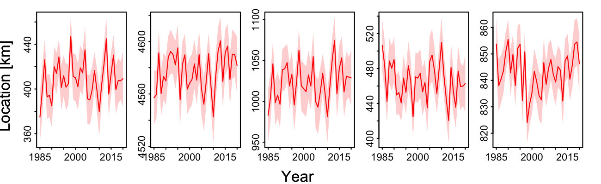
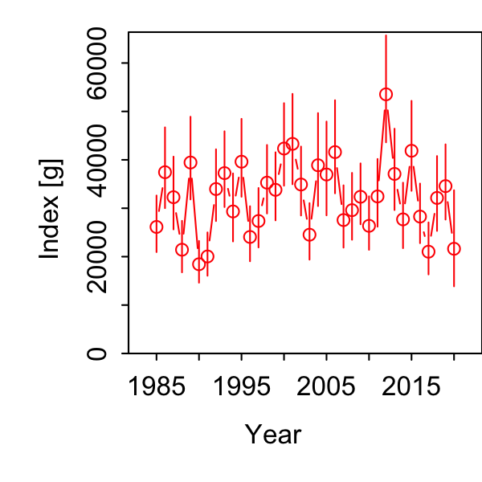
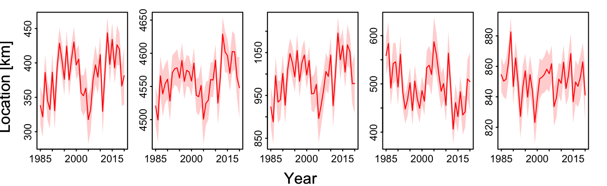

```{r setup, include=FALSE}
knitr::opts_chunk$set(echo = TRUE,
                      message = FALSE,
                      warning = FALSE)

library(here)
library(sf)
library(rnaturalearth)
library(raster)
library(smoothr)
library(gridExtra)
library(tidyverse)

library(DT)
#library(pdftools)
#library(patchwork)
#library(ggiraph)

#library(ecodata)
#library(VAST)
```

## Thoughts from the WG in January

Not just add NEAMAP but also let model estimate any q adjustments for Albatross/Bigelow years

While we are there consider mean (and variance?) of predator length as a catchabiliy covariate

Is there output that can translate into inshore/offshore availability for the aggregate univariate index? 

Center of gravity plot, partition index into quadrants? Need to realign NE SE instead of N and E and track the SE axis (lower inshore, higher offshore) see https://github.com/James-Thorson-NOAA/VAST/wiki/Define-new-axes-for-range-edge-and-centroid

And a coastline for NEUS already developed here
https://github.com/afredston/range-edge-niches/blob/master/scripts/get_axes_of_measurement.R#L33

Use fit$ model output components for density and define portions of extrapolation grid as inshore and offshore, find density in each over time

Options for defining inshore vs offshore (discussion with Mike, Katie, and Tony as summarized by Tony):
1. An inshore band representing old Albatross strata (current NEAMAP) strata,  
2. An inshore band representing the inshore strata sampled by the Bigelow, 
3. a 3 mile boundary (representng availability to recreational fishery-MRIP).  


Timeline:

*  Finalize index 30 April

*  Working paper finalized 1 October 

*  Review 14-18 November 2022

## Add NEAMAP

Ensure NEAMAP data colums align with current dataset. Also, add vessel column and fix declon to be negative in nefsc.

```{r}
# current dataset, fix declon, add vessel
nefsc_bluepyagg_stn <- readRDS(here("fhdat/bluepyagg_stn.rds")) %>%
  mutate(declon = -declon,
         vessel = case_when(year<2009 ~ "AL",
                            year>=2009 ~ "HB", 
                            TRUE ~ as.character(NA)))


# NEAMAP add vessel and rename
neamap_bluepreyagg_stn <- read_csv(here("fhdat/NEAMAP_Mean stomach weights_Bluefish Prey.csv")) %>%
  mutate(vessel = "NEAMAP") %>%
  rename(id = station,
         sumbluepywt = sumbluepreywt,
         nbluepysp = nbfpreyspp,
         #npreysp = ,
         npiscsp = npiscspp,
         nstomtot = nstomtot, 
         meanbluepywt = meanbluepreywt,
         meanpisclen = meanpisclen.simple, 
         #varpisclen = ,
         season_ng = season,
         declat  = lat,
         declon = lon,
         bottemp = bWT,
         #surftemp = , 
         setdepth = depthm) 
  
  
# combine  
bluepyagg_stn <-  nefsc_bluepyagg_stn %>%
  bind_rows(neamap_bluepreyagg_stn) 

saveRDS(bluepyagg_stn, here("fhdat/bluepyagg_stn_all.rds"))


```

Get 28,596 observations but one nefsc has a NA year so no vessel assigned--check this. (Two stations from cruise 201202, missing lat and long so drop.)

This script uses the full dataset and compares different vessel effect parameterizations. This treats vessel differences as overdispersion in the first and or second linear predictor.

```{r, code = readLines(here("VASTunivariate_bfp_addneamap.R")), eval=F}
```

Outputs are in [this google folder](https://drive.google.com/drive/folders/1ns2VdOWWZmVKpvCJC3PZu2D-CHXXUIfJ?usp=sharing).

Next option is to use vessel as a catchabilty covariate instead.

Altenatively, adding the predator length covariate may more directly model vessel differences in predator catch that affect stomach contents than modeling a vessel catchability covariate direclty. This was the appropach taken by @ng_predator_2021. They found that predator length covariates were strongly supported as catchability covariates (larger predators being more likely to have more prey in stomachs).

This script uses predator mean length as a catchability covariate, with the option to add number of distinct predator types, and temperature as well.

The rationale for including number of predator species is that more species "sampling" the prey field may result in more prey in stomachs. 

*It turns out including bottom temperature leaves out a lot of data, so for now I will not use this.* If the WG wants to explore it I'll need to do runs with only the subset of data with temperature to compare with vessel effects, or use a different bottom temperature dataset like Charles Perretti did for summer flounder.  If we use it, the rationale for including bottom temperature is that predator metabolism and consumption changes with temperature, although this may not be linear depending on the temperature range. 

```{r, code = readLines(here("VASTunivariate_bfp_allsurvs_lencov.R")), eval=F}
```

Initial run with length and number of predators has a lower AIC than runs with overdispersion for vessel effects.

We'll compare all runs with NEAMAP added and overdispersion vs catchability covariates here (using maximum likelihood to calculate AIC instead of REML because we are not changing the random effects):

```{r}
# from each output folder in pyindex, 
outdir <- here("pyindex")
moddirs <- list.dirs(outdir) 
moddirs <- moddirs[-1]
# keep folder name
modnames <- list.dirs(outdir, full.names = FALSE)

# function to apply extracting info
getmodinfo <- function(d.name){
  # read settings
  modpath <- stringr::str_split(d.name, "/", simplify = TRUE)
  modname <- modpath[length(modpath)]
  
  settings <- read.table(file.path(d.name, "settings.txt"), comment.char = "",
    fill = TRUE, header = FALSE)
  
  n_x <- as.numeric(as.character(settings[(which(settings[,1]=="$n_x")+1),2]))
  grid_size_km <- as.numeric(as.character(settings[(which(settings[,1]=="$grid_size_km")+1),2]))
  max_cells <- as.numeric(as.character(settings[(which(settings[,1]=="$max_cells")+1),2]))
  use_anisotropy <- as.character(settings[(which(settings[,1]=="$use_anisotropy")+1),2])
  fine_scale <- as.character(settings[(which(settings[,1]=="$fine_scale")+1),2])
  bias.correct <- as.character(settings[(which(settings[,1]=="$bias.correct")+1),2])
  
  #FieldConfig
  if(settings[(which(settings[,1]=="$FieldConfig")+1),1]=="Component_1"){
    omega1 <- as.character(settings[(which(settings[,1]=="$FieldConfig")+2),2])
    omega2 <- as.character(settings[(which(settings[,1]=="$FieldConfig")+3),1])
    epsilon1 <- as.character(settings[(which(settings[,1]=="$FieldConfig")+4),2])
    epsilon2 <- as.character(settings[(which(settings[,1]=="$FieldConfig")+5),1])
    beta1 <- as.character(settings[(which(settings[,1]=="$FieldConfig")+6),2])
    beta2 <- as.character(settings[(which(settings[,1]=="$FieldConfig")+7),1])
  }
  
  if(settings[(which(settings[,1]=="$FieldConfig")+1),1]=="Omega1"){
    omega1 <- as.character(settings[(which(settings[,1]=="$FieldConfig")+3),1])
    omega2 <- as.character(settings[(which(settings[,1]=="$FieldConfig")+4),1])
    epsilon1 <- as.character(settings[(which(settings[,1]=="$FieldConfig")+3),2])
    epsilon2 <- as.character(settings[(which(settings[,1]=="$FieldConfig")+4),2])
    beta1 <- "IID"
    beta2 <- "IID"
  }
  
  
  #RhoConfig
  rho_beta1 <- as.numeric(as.character(settings[(which(settings[,1]=="$RhoConfig")+3),1]))
  rho_beta2 <- as.numeric(as.character(settings[(which(settings[,1]=="$RhoConfig")+3),2]))
  rho_epsilon1 <- as.numeric(as.character(settings[(which(settings[,1]=="$RhoConfig")+4),1]))
  rho_epsilon2 <- as.numeric(as.character(settings[(which(settings[,1]=="$RhoConfig")+4),2]))
  
  # read parameter estimates, object is called parameter_Estimates
  load(file.path(d.name, "parameter_estimates.RData"))
  
  AIC <- parameter_estimates$AIC[1]  
  converged <- parameter_estimates$Convergence_check[1]
  fixedcoeff <- unname(parameter_estimates$number_of_coefficients[2])
  randomcoeff <- unname(parameter_estimates$number_of_coefficients[3])
  
  
  # return model atributes as a dataframe
  out <- data.frame(modname = modname,
                    n_x = n_x,
                    grid_size_km = grid_size_km,
                    max_cells = max_cells,
                    use_anisotropy = use_anisotropy,
                    fine_scale =  fine_scale,
                    bias.correct = bias.correct,
                    omega1 = omega1,
                    omega2 = omega2,
                    epsilon1 = epsilon1,
                    epsilon2 = epsilon2,
                    beta1 = beta1,
                    beta2 = beta2,
                    rho_epsilon1 = rho_epsilon1,
                    rho_epsilon2 = rho_epsilon2,
                    rho_beta1 = rho_beta1,
                    rho_beta2 = rho_beta2,
                    AIC = AIC,
                    converged = converged,
                    fixedcoeff = fixedcoeff,
                    randomcoeff = randomcoeff
  )
  	
	return(out)

}

# combine into one table for comparison

modselect <- purrr::map_dfr(moddirs, getmodinfo)


```

Only compare the models which include NEAMAP data:

```{r}

# only compare AIC for the 500 knot models with neamap included
modselect.500.allsurvs <- modselect %>%
  filter(n_x == 500) %>%
  filter(str_detect(modname, c("wneamap|allsurvs"))) %>%
  mutate(season = case_when(str_detect(modname, "fall") ~ "Fall",
                            str_detect(modname, "spring") ~ "Spring",
                            TRUE ~ as.character(NA))) %>%
  mutate(converged2 = case_when(str_detect(converged, "no evidence") ~ "likely",
                                str_detect(converged, "is likely not") ~ "unlikely",
                                TRUE ~ as.character(NA))) %>%
  group_by(season) %>%
  mutate(deltaAIC = AIC-min(AIC)) %>%
  arrange(AIC) %>%
  dplyr::select(modname, season, deltaAIC, fixedcoeff,
         randomcoeff, use_anisotropy,
         omega1, omega2, epsilon1, epsilon2,
         beta1, beta2, AIC, converged2)

DT::datatable(modselect.500.allsurvs, rownames = FALSE, 
              options= list(pageLength = 25, scrollX = TRUE))
```


Best fit model(s)? allsurvs is a check that should be identical to wneamap, and it is.

Including predator mean length and number of predator species seems to fit better than including either alone, vessel overdispersion parameters, or no covariates.


## Realign center of gravity along NEUS coastline

Following the excellent instructions of Alexa Fredston at Rutgers, we can use the NE coast as an axis for calculating center of gravity to realign the calculations as alongshore and inshore/offshore.

From https://github.com/James-Thorson-NOAA/VAST/wiki/Define-new-axes-for-range-edge-and-centroid and using the coastline from https://github.com/afredston/range-edge-niches/blob/master/scripts/get_axes_of_measurement.R 

Get coastline, make supplemental figure from [Fredson et al. 2021](https://onlinelibrary.wiley.com/doi/10.1111/gcb.15614):

```{r}

# First get the coastline, verbatim lines 15-43 here
# https://github.com/afredston/range-edge-niches/blob/master/scripts/get_axes_of_measurement.R 

usamap <- rnaturalearth::ne_countries(scale = "small", country = "united states of america", returnclass = "sf")[1] %>% 
  st_cast("MULTILINESTRING") # get basic map of the country 

## Northeast:

# set bounding boxes
neus.xmin=-78
neus.xmax=-66
neus.ymin=35
neus.ymax=45

neus.bbox1 <- st_set_crs(st_as_sf(as(raster::extent(neus.xmin, neus.xmax, neus.ymin, neus.ymax), "SpatialPolygons")), st_crs(usamap))
neus.bbox2 <- st_set_crs(st_as_sf(as(raster::extent(-78, -74, 42, 45), "SpatialPolygons")), st_crs(usamap)) # smaller bounding box to get rid of extra lines on the map 

neusmap <- usamap %>% 
  st_intersection(neus.bbox1) %>%  
  st_difference(neus.bbox2) # gets rid of extra non coastal line 

# if WG wants a different smooth, change below based on fig
neus.smoothgeom <- neusmap %>% 
  smoothr::smooth(method="ksmooth", smoothness=8) %>% # smoother was applied incrementally more until the Chesapeake went away 
  as("Spatial") %>% 
  geom()

neus.geomdists <- pointDistance(neus.smoothgeom[-nrow(neus.smoothgeom), c("x", "y")], neus.smoothgeom[-1, c("x", "y")], lonlat=TRUE)
neus.coastdistdat <- data.frame(neus.smoothgeom[, c('x','y')], seglength=c(0, neus.geomdists))
neus.coastdistdat$lengthfromhere <- rev(cumsum(rev(neus.coastdistdat[,"seglength"])))
# first row should match st_length(smoothmap)

write_rds(neus.coastdistdat, here("spatialdat","neus_coastdistdat.rds"))

# plot it, lines 114-129 https://github.com/afredston/range-edge-niches/blob/master/scripts/get_axes_of_measurement.R

usoutline <- rnaturalearth::ne_states("united states of america", returnclass = "sf") %>% 
  st_sf()

# iterate over NEUS smoothness values that we used 
neus_smoothplot <- function(smoothval){
  out <- ggplot() +
    geom_sf(data=usoutline, color="#999999") +
    geom_sf(data=neusmap %>% 
              smoothr::smooth(method="ksmooth", smoothness=smoothval), color="darkblue", lwd=1.5) + 
    scale_x_continuous(limits=c(neus.xmin, neus.xmax)) +
    scale_y_continuous(limits=c(neus.ymin, neus.ymax)) +
    theme_bw() +
    labs(title=paste0("Smoothness=", smoothval)) +
    theme(axis.text.x=element_text(angle=45)) 
}

neus.smoothmap.list <- lapply(seq(1, 8, 1), neus_smoothplot)

neus.smoothmap <- do.call("grid.arrange", c(neus.smoothmap.list, ncol=3))


```

Apply to model. Now following steps in https://github.com/James-Thorson-NOAA/VAST/wiki/Define-new-axes-for-range-edge-and-centroid we first set up the model to get default coordinates but don't run it, create the custom axis using the coastline object above, then pass the custom axis to the model and run it.

We'll first test with the previously running model without the additional complication of NEAMAP.

```{r, code = readLines(here("VASTunivariate_bfp_tiltaxis.R")), eval=F}
```

This is giving us alongshore center of gravity. We also want the rotated inshore-offshore center of gravity. For that I need to add another coordinate?

Alternatively, rotate the axes to be offset 45 degrees from Northings and Eastings?

Following the example for the [Bering Sea linear axis](https://github.com/James-Thorson-NOAA/VAST/wiki/Define-new-axes-for-range-edge-and-centroid), we add two lines. The along shelf axis directly follows [Kevin Friedland's axis for measuring species distribution change](https://noaa-edab.github.io/tech-doc/species-distribution-indicators.html#methods-51):

>The along-shelf axis begins at 76.53°W 34.60°N and terminates at 65.71°W 43.49°N.

And the offshore axis is perpendicular to the alongshore axis, originating from its center. Code to rotate a geographic feature from xhttps://geocompr.robinlovelace.net/geometric-operations.html#affine-transformations, a portion of a great book featuring `sf` functions and usage: [Geocomputation with R](https://geocompr.robinlovelace.net/index.html)

```{r}
# set line endpoints 
neus.alongshore.lon <- c(-76.53,-65.71)
neus.alongshore.lat <- c(34.60,43.49)

# draw line
neus.alongshore.line <- data.frame(neus.alongshore.lon, neus.alongshore.lat) %>%
  rename('x'=neus.alongshore.lon,'y'=neus.alongshore.lat) %>%
  st_as_sf(coords=c('x','y')) %>%
  summarise() %>%
  st_cast("LINESTRING") %>% 
  smoothr::densify(n=99) %>% # choose number of line segments: here it's 99 for 100 points
  st_cast("MULTIPOINT") 

neus.alongshore.points <- data.frame(st_coordinates(neus.alongshore.line)) %>%
  rename("x"=X, "y"=Y)

neus.alongshore.dists <- pointDistance(neus.alongshore.points[-nrow(neus.alongshore.points), c("x", "y")], neus.alongshore.points[-1, c("x", "y")], lonlat=TRUE)

neus.alongshore.axisdistdat <- data.frame(neus.alongshore.points[, c('x','y')], seglength=c(0, neus.alongshore.dists))
neus.alongshore.axisdistdat$lengthfromhere <- rev(cumsum(rev(neus.alongshore.axisdistdat[,"seglength"])))

#plot to ensure it's right!
# ggplot() +
#     geom_sf(data=neusmap, color="#999999") +
#     geom_sf(data=neus.alongshore.line %>% st_set_crs(st_crs(neusmap)), color="darkblue", lwd=1.5) + 
#     #scale_x_continuous(limits=c(neus.xmin, neus.xmax)) +
#     #scale_y_continuous(limits=c(neus.ymin, neus.ymax)) +
#     theme_bw() +
#     #labs(title=paste0("Smoothness=", smoothval)) +
#     theme(axis.text.x=element_text(angle=45))

#find perpendicular axis at midpoint of alongshore line
# since we made this line 100 units, center is at ~50
halfway <- neus.alongshore.axisdistdat[50,]

# or we could calculate it properly
mid.lat <- sum(neus.alongshore.lat)/2
mid.lon <- sum(neus.alongshore.lon)/2

# or use a built in function
midpoint.alongshore <- st_centroid(neus.alongshore.line)

# rotate alongshore line 90 degress at midpoint
# functions see https://geocompr.robinlovelace.net/geometric-operations.html
rotation = function(a){
  r = a * pi / 180 #degrees to radians
  matrix(c(cos(r), sin(r), -sin(r), cos(r)), nrow = 2, ncol = 2)
} 

#nz_rotate = (nz_sfc - nz_centroid_sfc) * rotation(30) + nz_centroid_sfc

neus.alongshore.line_sfc <- st_geometry(neus.alongshore.line)
midpoint.alongshore_sfc <- st_centroid(neus.alongshore.line_sfc)

neus.offshore.line <- (neus.alongshore.line_sfc - midpoint.alongshore_sfc) * rotation(90) + midpoint.alongshore_sfc

ggplot() +
    geom_sf(data=neusmap, color="#999999") +
    geom_sf(data=neus.alongshore.line_sfc %>% st_set_crs(st_crs(neusmap)), 
            color="darkblue", 
            #col=viridisLite::viridis(25)[cut(as.numeric(neus.alongshore.line_sfc),25)],
            lwd=1.5) +
    geom_sf(data=neus.offshore.line %>% st_set_crs(st_crs(neusmap)), 
            color="darkblue", 
            #ol=viridisLite::viridis(25)[cut(as.numeric(neus.alongshore.line_sfc),25)],
            lwd=1.5) +
    #scale_x_continuous(limits=c(neus.xmin, neus.xmax)) +
    #scale_y_continuous(limits=c(neus.ymin, neus.ymax)) +
    theme_bw() +
    #labs(title=paste0("Smoothness=", smoothval)) +
    theme(axis.text.x=element_text(angle=45))

neus.offshore.points <- data.frame(st_coordinates(neus.offshore.line)) %>%
  rename("x"=X, "y"=Y)

neus.offshore.dists <- pointDistance(neus.offshore.points[-nrow(neus.offshore.points), c("x", "y")], neus.offshore.points[-1, c("x", "y")], lonlat=TRUE)

neus.offshore.axisdistdat <- data.frame(neus.offshore.points[, c('x','y')], seglength=c(0, neus.offshore.dists))
neus.offshore.axisdistdat$lengthfromhere <- rev(cumsum(rev(neus.offshore.axisdistdat[,"seglength"])))

write_rds(neus.alongshore.axisdistdat, here("spatialdat","neus.alongshore.axisdistdat.rds"))
write_rds(neus.offshore.axisdistdat, here("spatialdat","neus.offshore.axisdistdat.rds"))

```

Affline transformations may not preserve angles so this rotation looks a little off when 90 is specified.

We could also project a linear axis offshore from the non-linear coastline axis?

This should project coast, alongshore, and offshore axes:

```{r, code = readLines(here("VASTunivariate_bfp_allsurvs_lencov_tiltaxis.R")), eval=F}
```

Here is the best model with both surveys, predator mean length and number of predator species as covariates, with the rotated axes.

### Fall Index

  

### Fall Center of Gravity (far right is inshore-offshore)

 


### Spring Index

 
### Spring Center of Gravity (far right is inshore-offshore) 

 

## Define inshore and offshore regions

Three options for different strata for derived quantities: 3 miles from shore, NEAMAP outer boundary, Albatross inshore strata boundary.

In progress...

# References


