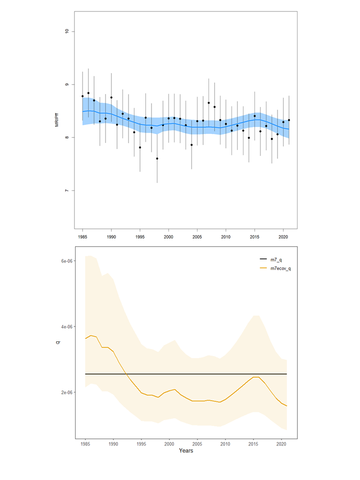

```{r setup, include=FALSE}

# https://cdnsciencepub.com/journal/cjfas/authors#guidelines
# Manuscript text must: 
# 
# be in English or French
# be double-spaced
# be single-column
# include page numbers
# include continuous line numbers (before acceptance only)
# be 8.5 x 11 inches in page size (or ISO A4)
# follow this order: title page, abstract, keywords, body text (Introduction, Materials and methods, Results, Discussion), acknowledgements, references, tables, figure captions, figures, appendices
# do the above formatting *after* coauthors edit a word-->gdoc version

knitr::opts_chunk$set(echo = FALSE, # no code blocks in word doc
                      message = FALSE,
                      warning = FALSE)

library(tidyverse)
theme_set(theme_bw())
library(here)
library(dendextend)
library(flextable) #hopefully makes actual tables in word
set_flextable_defaults(font.size = 11, padding = 3,
                       fonts_ignore=TRUE) #for latex
#library(DT)
#library(pdftools)
#library(patchwork)
library(ggiraph)
library(ggpubr)
library(data.table)
library(forcats)

#library(ecodata)
#library(VAST)

# try to put affiliations in the yaml header later
# author:
# - affiliation: group1
#   name: 'Sarah Gaichas, Brian Smith, Anthony Wood, Abigail Tyrell'
# - affiliation: group2
#   name: James Gartland
# - affiliation: group3
#   name: Elizabeth Ng
# - affiliation: group4
#   name: Michael Celestino
# - affiliation: group5
#   name: Katie Drew
# - affiliation: group6
#   name: Abigail Tyrell
# address:
# - address: NOAA NMFS Northeast Fisheries Science Center, Woods Hole, MA, USA
#   code: group1
# - address: Virginia Institute of Marine Science, Gloucester Point, VA, USA
#   code: group2
# - address: University of Washington, Seattle, WA, USA
#   code: group3
# - address: New Jersey Department of Environmental Protection, Port Republic, NJ, USA
#   code: group4
# - address: Atlantic States Marine Fisheries Commission, Arlington, VA, USA
#   code: group5
# - address: Ocean Associates Inc, Arlington, VA, USA
#   code: group6

```

S.K. Gaichas (corresponding author): NOAA Fisheries, Northeast Fisheries Science Center. 166 Water St. Woods Hole MA. 02543.  https://orcid.org/0000-0002-5788-3073 Sarah.Gaichas@noaa.gov tel: (508) 495-2016 
<!---Oh god this is such a hack! -->

James Gartland: Virginia Institute of Marine Science, William & Mary, Gloucester Point, VA, USA. https://orcid.org/000-0003-1436-2291

Brian E. Smith: NOAA Fisheries, Northeast Fisheries Science Center. 166 Water St. Woods Hole MA. 02543. https://orcid.org/0000-0002-7792-520X

Elizabeth L. Ng: Four Peaks Environmental Science & Data Solutions, Wenatchee, WA USA. https://orcid.org/0000-0002-5833-4914

Michael Celestino: New Jersey Department of Environmental Protection, Port Republic, NJ
  
Anthony D. Wood: NOAA Fisheries, Northeast Fisheries Science Center. 166 Water St. Woods Hole MA. 02543

Katie Drew: Atlantic States Marine Fisheries Commission, Arlington, VA

Abigail S. Tyrell: Ocean Associates Inc, Arlington, VA, USA https://orcid.org/0000-0002-6656-8470 

James T. Thorson: Resource Ecology and Fisheries Management, Alaska Fisheries Science Center, National Marine Fisheries Service, NOAA, https://orcid.org/0000-0001-7415-1010

  
# Abstract {-}

Changing distribution and abundance of small pelagic fishes may drive changes in predator distributions, affecting predator availability to fisheries and surveys. However, small pelagics are difficult to survey directly, so we developed a novel method of assessing the aggregate abundance of these taxa via predator stomach contents. We used piscivore stomach contents collected from multiple bottom trawl surveys within a Vector Autoregressive Spatio-Temporal (VAST) model to assess trends of small pelagics on the Northeast US shelf. The goal was to develop a spatial “forage index” to inform survey and/or fishery availability in the western North Atlantic bluefish (*Pomatomus saltatrix*) stock assessment. Using spring and fall surveys from 1973-2021, 20 small pelagic groups were identified as major bluefish prey using diet data. Then, predators were grouped by diet similarity to identify 21 piscivore species with the most similar diets to bluefish in the region. Stomach contents from all 22 piscivores were combined for the 20 prey groups at each surveyed location, and the total weight of small pelagic prey per predator stomach at each location was input into a Poisson-link delta model to estimate expected prey mass per predator stomach. Best fit models included spatial and spatio-temporal random effects, with predator mean length, number of predator species, and sea surface temperature as catchability covariates. Spring and fall prey indices were split into inshore and offshore areas to reflect changing prey availability over time in areas available to the recreational fishery and the bottom trawl survey, and also to contribute to regional ecosystem reporting. Diet-based forage indices were compared with survey design-based biomass estimates for the same small pelagic groups. This spatially resolved index compared favorably with more traditional design-based survey biomass indices when forage species are well sampled by surveys. However, our stomach contents-based index better represented smaller unmanaged forage species that surveys are not designed to capture. The stomach-based forage index helped explain bluefish availability to the recreational fishery for stock assessment, as well as providing insight into pelagic forage trends throughout the regional ecosystem. 


# Introduction

Small pelagics are widely recognized for their critical function as forage, supporting human populations as well as harvested fish and protected species in ecosystems worldwide [@alder_forage_2008; @pikitch_ellen_k_global_2012]. In some ecosystems, one or two small pelagic species may dominate as forage [@chavez_northern_2008], while in others a wide variety of small pelagic species fill this role together [@garrison_dietary_2000; @engelhard_forage_2014]. In both instances, understanding fluctuations in small pelagics is an important component of an ecosystem approach to management: low abundance of small pelagics can have implications for both directed small pelagic fisheries and management of their predators [@cury_small_2000]. Conversely, high aggregate abundance of small pelagics can provide a robust forage supply for generalist predators even if individual small pelagic species are depleted. Fish predators generally select the most abundant prey in the environment, so as individual prey populations vary, fish predators respond by switching prey [@smith_multispecies_2020]. 

In addition to abundance, spatial distribution of small pelagics has clear implications for both predators and fisheries.  Central place foragers such as seabirds require small pelagics close to breeding colonies during the breeding season [@koehn_structured_2021], while free ranging highly mobile fish predators can follow small pelagics if their distributions shift further offshore.  Similarly, fisheries prosecuted on large vessels are better equipped to follow mobile predators offshore [@bertrand_interactions_2004], while shore based artisanal and recreational fisheries may lose access to mobile predators following prey. Changing spatial distribution can also impact stock assessments if changing availability of assessed fish cannot be incorporated into assessment models [@oleary_adapting_2020].   

Many fished small pelagic populations have a long history of scientific assessment, providing insight into long term and short term fluctuations relevant to both the fishery and the wider ecosystem [@boerema_stock_1973; @sydeman_sixty-five_2020; @kuriyama_assessment_2022]. However, spatial shifts within a pelagic stock’s range affecting different predator populations and distributions are difficult to track using conventional spatially aggregated stock assessment approaches. In addition, for ecosystems where small pelagics represent a mix of managed and unmanaged species, information on unmanaged species is often lacking, hindering assessment of the status of the full forage base supporting predators and other fisheries.

The objective of this work was to create a “forage index” to evaluate changes in small pelagics  over time and in space in the Northeast US continental shelf ecosystem, where a diverse mix of managed and unmanaged small pelagic species support a wide range of predators [@link_does_2002; @link_response_2009].  This ecosystem has a long history of fishery-independent sampling for demersal species, but sparse directed sampling for small pelagics. Developing an index of small pelagics in this ecosystem was a high priority for two applications: addressing uncertainty in the stock assessment for a key predator species, bluefish (*Pomatomus saltatrix*), and describing aggregate forage species trends for integrated ecosystem assessment. 

Bluefish are medium-sized, rapidly growing pelagic piscivores known to prey on a wide variety of small pelagics and to target areas of dense prey [@buckel_foraging_1999; @collette_bigelow_2002; @sanchez-jerez_interactions_2008]. Writing in the 1950s, Bigelow and Schroeder described bluefish as "perhaps the most ferocious and bloodthirsty fish in the sea, leaving in its wake a trail of dead and mangled mackerel, menhaden, herring, alewives, and other species on which it preys." Participants in the US bluefish fishery have raised concerns that changes in prey distribution may change bluefish availability to surveys and recreational fisheries, creating uncertainty in stock assessments and subsequent fishery management ([MAFMC Fishery performance report, 2021](https://www.mafmc.org/s/8_BF-FPR-2021.pdf)). Therefore, spatial and temporal trends in the small pelagic prey of bluefish needed to be characterized to address this concern. 

Our approach was patterned on @ng_predator_2021, which used predator stomach data to create a biomass index for a single prey, Atlantic herring, using Vector Autoregressive Spatio-Temporal modeling (VAST; @thorson_comparing_2017; @thorson_guidance_2019). We adapted the approach of @ng_predator_2021 to generate an index for small pelagics or “bluefish prey” in aggregate rather than a single prey species. Further, we include inshore and offshore regions by combining results across regional bottom trawl surveys as was done for summer flounder biomass in @perretti_spatio-temporal_2019. Finally, since our goal was to characterize the small pelagic prey field potentially driving bluefish availability, and bluefish themselves are somewhat sparsely sampled by the surveys, we characterize this prey field in space and time by expanding our range of piscivore samplers. We aggregate all predators that have a similar diet composition to bluefish to better represent small pelagic prey biomass and distribution in the ecosystem. Although this forage fish index was designed to reflect a range of bluefish prey, due to the inclusion of additional pelagic predator stomach data, the forage fish index is broadly representative of trends that may affect multiple pelagic predators. This approach is generalizable to any spatial subset of the full VAST spatial domain, such that small pelagic forage indices for each ecoregion on the Northeast US continental shelf can also be generated for use in integrated ecosystem assessment. 

# Methods

We characterize mean weight per stomach of bluefish prey from all piscivores caught at each survey location and model that over time and space. Covariates potentially affecting perceived patterns in the bluefish prey index include number of predators, size composition of predators, and sea surface temperature (SST) at each survey location.

Therefore, the steps involved to estimate the forage index included defining the input dataset, running multiple configurations of the VAST model, and generating bias corrected indices using the selected model. Steps involved in defining the dataset included defining “bluefish prey”, defining a set of piscivore predators with similar diets to bluefish, integrating diet data from two regional surveys, and integrating supplementary SST data to fill gaps in in-situ temperature data measurements. Steps involved in running the VAST model included decisions on spatial footprint, model structure, model selection to determine if spatial and spatio-temporal random effects were supported by the data, and further model selection to determine which catchability covariates were best supported by the data. Finally, subsets of the spatial domain were defined to be consistent with broad ecosystem reporting regions as well as bluefish assessment inputs for NEFSC survey indices and recreational fishery CPUE. A bias-corrected [@thorson_implementing_2016] forage index for each spatial subset was then generated. We compared the resulting diet based prey index to survey design based biomass estimates for the same group of species at broad ecosystem and seasonal scales to gain insight into the differences between the approaches. We then explored the indices generated at stock assessment scales as catchability covariates within the framework of a state-space stock assessment model. Each step is detailed below.

## Input dataset
Fish food habits data are collected aboard several regional fishery independent surveys in the Northeast US. The longest time series of diet has been collected by the Northeast Fisheries Science Center (NEFSC) bottom trawl survey [@smith_trophic_2010] from south of Cape Hatteras, NC to the Scotian Shelf at the US/Canada border since the early 1970s, which represents the bulk of the data for this analysis. Using similar survey protocols to the NEFSC survey, the Northeast Area Monitoring and Assessment Program (NEAMAP) survey has collected fish diet data in inshore waters from Cape Hatteras, NC to Cape Cod, MA since 2007 [@northeast_area_monitoring__assessment_program_neamap_monitoring_2021]. All analyses were completed in R [@r_core_team_r_2022].

### Defining bluefish prey  
Neither bluefish themselves nor the small pelagics they eat are well sampled by bottom trawl surveys. Nevertheless, the diet samples collected for bluefish indicate that anchovies, herrings, squids, butterfish, scup, and small hakes are important prey.

Using all sampled bluefish stomachs included in both food habits databases, NEFSC (1973-2021), and NEAMAP (2007-2021), we created a list of all pelagic nekton bluefish prey. Prey types encountered in at least 25 bluefish stomachs across both datasets were included in the development of the index (Table \@ref(tab:preylist)). Atlantic mackerel, while only encountered in 14 stomachs, are known to be an important prey of bluefish historically [@collette_bigelow_2002], and thus were also included in the development of this index. 

```{r preylist}
# object is called `allfh`
#load(url("https://github.com/Laurels1/Condition/raw/master/data/allfh.RData"))

# Oct 21 2022: save it for posterity, use in case Laurel's repo updates
#save(allfh, file = "fhdat/allfh.Rdata")
load(here("fhdat/allfh.Rdata"))

# October 8 2022: add NEFSC 2021 data
load(here("fhdat/allfh21.Rdata"))

allfh <- allfh %>%
  dplyr::bind_rows(allfh21)

preycount <- allfh %>%
   group_by(pdcomnam, pynam) %>%
   summarise(count = n()) %>%
   filter(pdcomnam != "") %>%
   #arrange(desc(count))
   pivot_wider(names_from = pdcomnam, values_from = count) 

gencomlist <- allfh %>%  
  select(pynam, pycomnam2, gencom2) %>%
  distinct()

NEFSCblueprey <- preycount %>%
  #filter(BLUEFISH > 9) %>%
  filter(!pynam %in% c("EMPTY", "BLOWN",
                       "FISH", "OSTEICHTHYES",
                       "ANIMAL REMAINS",
                       "FISH SCALES")) %>%
  #filter(!str_detect(pynam, "SHRIMP|CRAB")) %>%
  left_join(gencomlist) %>%
  filter(!gencom2 %in% c("ARTHROPODA", "ANNELIDA",
                         "CNIDARIA", "UROCHORDATA",
                         "ECHINODERMATA", "WORMS",
                         "BRACHIOPODA", "COMB JELLIES",
                         "BRYOZOA", "SPONGES",
                         "MISCELLANEOUS", "OTHER")) %>%
  arrange(desc(BLUEFISH))

NEAMAPblueprey <- read.csv(here("fhdat/Full Prey List_Common Names.csv")) %>%
  #filter(BLUEFISH > 9) %>%
  filter(!SCIENTIFIC.NAME %in% c("Actinopterygii", "fish scales",
                                 "Decapoda (megalope)", 
                                 "unidentified material",
                                 "Plantae",
                                 "unidentified animal"))#,
         #!COMMON.NAME %in% c("wrymouth"))

NEAMAPprey <- NEAMAPblueprey %>%
  dplyr::select(COMMON.NAME, SCIENTIFIC.NAME, BLUEFISH) %>%
  dplyr::filter(!is.na(BLUEFISH)) %>%
  dplyr::mutate(pynam2 = tolower(SCIENTIFIC.NAME),
                pynam2 = stringr::str_replace(pynam2, "spp.", "sp")) %>%
  dplyr::rename(NEAMAP = BLUEFISH)


NEFSCprey <- NEFSCblueprey %>%
  dplyr::select(pycomnam2, pynam, BLUEFISH) %>%
  dplyr::filter(!is.na(BLUEFISH)) %>%
  dplyr::mutate(pynam2 = tolower(pynam)) %>%
  dplyr::rename(NEFSC = BLUEFISH)

blueprey <- NEFSCprey %>% 
  dplyr::full_join(NEAMAPprey) %>%
  dplyr::mutate(NEAMAP = ifelse(is.na(NEAMAP), 0, NEAMAP),
                NEFSC = ifelse(is.na(NEFSC), 0, NEFSC),
                total = NEFSC + NEAMAP,
                PREY = ifelse(is.na(SCIENTIFIC.NAME), pynam, SCIENTIFIC.NAME),
                COMMON = ifelse(is.na(COMMON.NAME), pycomnam2, COMMON.NAME),
                pynam = ifelse(is.na(pynam), toupper(pynam2), pynam)) %>%
  dplyr::arrange(desc(total)) %>%
  dplyr::filter(total>20 | pynam=="SCOMBER SCOMBRUS") %>% # >20 leaves out mackerel
  dplyr::mutate(COMMON = case_when(pynam=="ILLEX SP" ~ "Shortfin squids",
                                   pynam2=="teuthida" ~ "Unidentified squids",
                                   TRUE ~ COMMON)) %>%
  dplyr::mutate(PREY = stringr::str_to_sentence(PREY),
                COMMON = stringr::str_to_sentence(COMMON))


flextable::flextable(blueprey[,c('PREY', 'COMMON', 'NEFSC', 'NEAMAP', 'total')]) %>%
  flextable::set_header_labels(PREY = "Prey",
                               COMMON = "Prey common name",
                               total = "Bluefish stomachs (n)") %>%
  flextable::set_caption("Prey identified in bluefish stomachs, NEFSC (1973-2021) and NEAMAP (2007-2021) diet databases.") %>%
  flextable::width(width=c(2,2,1,1,1))


# unionblueprey <- union(NEAMAPprey, NEFSCprey)

# kableExtra::kable(blueprey[,c('pynam','BLUEFISH')],
#                   col.names = c('Prey name', 'Bluefish stomachs (n)'),
#                   caption = "Table 1. Prey identified in bluefish stomachs, NEFSC diet database, 1973-2020.")

# flextable::flextable(blueprey[,c('pynam', 'pycomnam2','BLUEFISH')]) %>%
#   flextable::set_header_labels(pynam = "Prey name", pycomnam2 = "Prey common name", BLUEFISH = "Bluefish stomachs (n)") %>%
#   flextable::set_caption("Prey identified in bluefish stomachs, NEFSC diet database, 1973-2021.") %>%
#   #flextable::autofit()
#   flextable::width(width = c(2.5,3.5,0.5))
```


### Defining piscivore predators  
Predators were selected to balance the tradeoff between increasing sample size and decreasing similarity to bluefish foraging. One extreme assumption would be to include only bluefish as predators, but there are relatively few bluefish diet samples due to incomplete availability to bottom trawl surveys, in particular during spring (see supplemental information). This would miss prey available to bluefish because we have not sampled bluefish adequately. The opposite extreme assumption would be to include all stomachs that contain any of the top bluefish prey, regardless of which species ate the prey. This would include predators that do not forage similarly to bluefish and might therefore “count” prey that are not actually available to bluefish due to habitat differences. The intermediate approach, which selects a group of piscivores that forage similarly to bluefish, both increases sample size and screens out the most dissimilar predators to bluefish. We further refined the input data by only using the prey items identified above as “bluefish prey” across all predators identified as piscivores.

For bluefish forage index modeling, we selected a set of predators that have high diet similarity to bluefish. @garrison_dietary_2000 evaluated similarity of predator stomach contents on the Northeast US shelf from NEFSC bottom trawl surveys to develop foraging guilds, and this analysis was updated using all stomach contents data collected aboard the NEFSC surveys through 2020 (B. Smith, pers. comm.; [web dataset](https://fwdp.shinyapps.io/tm2020/#4_DIET_OVERLAP_AND_TROPHIC_GUILDS)). The Schoener index [@schoener_nonsynchronous_1970] was used to characterize the overlap in diet, $D_{ij}$, between paired predators:

$$ D_{i,j} = 1 – 0.5 (\sum |p_{i,k} – p_{j,k}|) $$

with $p_{i,k}$ = the mean proportion (by volume) of prey group $k$ in the diet of predator $i$ and $p_{i,k}$ = the mean proportion (by volume) of prey group $k$ in the diet of predator $j$ [@garrison_dietary_2000]. 

The resulting diet overlap matrix was used to identify similar groups of predators using cluster analysis. We used R package `dendextend` (cite) to transform the similarity matrix into a distance matrix (`stats::dist`) and then to categorize similarly feeding piscivores using hierarchical clustering based on the “complete” algorithm with k=6 clusters (`dendextend::hclust`). All sizes of bluefish clustered together using these criteria, indicating piscivorous feeding habits as juveniles and adults (Fig. \@ref(fig:circulardend)). The resulting piscivore list included the size classes of species that clustered with all 3 sizes of bluefish (Table \@ref(tab:pisclist)). 

```{r pisclist}
dietoverlap <- read_csv(here("datfromshiny/tgmat.2022-02-15.csv"))

d_dietoverlap <- dist(dietoverlap)

# again directly from https://cran.r-project.org/web/packages/dendextend/vignettes/Cluster_Analysis.html
hclust_methods <- c("ward.D", "single", "complete", "average", "mcquitty", 
        "median", "centroid", "ward.D2")
diet_dendlist <- dendlist()
for(i in seq_along(hclust_methods)) {
   hc_diet <- hclust(d_dietoverlap, method = hclust_methods[i])   
   diet_dendlist <- dendlist(diet_dendlist, as.dendrogram(hc_diet))
}
names(diet_dendlist) <- hclust_methods

# preds <- list()
# 
# for(i in 1:8) {
#   dendi <- diet_dendlist[[i]]
#   namei <- names(diet_dendlist)[i]
#   labels(dendi) <- paste(as.character(names(dietoverlap[-1]))[order.dendrogram(dendi)],
#                            "(",labels(dendi),")", 
#                            sep = "")
#   #preds[[namei]] <- partition_leaves(dendi)[[which_node(dendi, c("35", "36", "37"))]]
#   preds[[namei]] <- partition_leaves(dendi)[[which_node(dendi, c("Bluefish..S(37)", "Bluefish..M(36)", "Bluefish..L(35)"))]]
# 
# }

dendi <- diet_dendlist$complete

labels(dendi) <- paste(as.character(names(dietoverlap[-1]))[order.dendrogram(dendi)],
                           "(",labels(dendi),")", 
                           sep = "")
  
pisccomplete <- partition_leaves(dendi)[[which_node(dendi, c("Bluefish..S(37)", "Bluefish..M(36)", "Bluefish..L(35)"))]]
  

sizedefs <- allfh %>% 
  select(pdcomnam, sizecat, pdlen) %>% 
  group_by(pdcomnam, sizecat) %>% 
  summarize(minlen = min(pdlen), maxlen = max(pdlen))

# add these in as a NEAMAP column
# +  Summer Flounder 21-70 cm
# +  Silver Hake 21-76 cm
# +  Weakfish 26-50 cm
# +  Atlantic Cod 81-150 cm 
# +  Bluefish 3 – 118 cm
# +  Striped Bass 31 – 120 cm
# +  Spanish Mackerel 10 – 33.5 cm 
# +  Spotted Sea Trout 15.5 – 34 cm 
# +  Spiny Dogfish 36 – 117 cm
# +  Goosefish 5 – 124 cm  

NEAMAPpisc <- data.frame("comname" = c("Summer Flounder",
                                       "Silver Hake", 
                                       "Weakfish", 
                                       "Atlantic Cod", 
                                       "Bluefish", 
                                       "Striped Bass", 
                                       "Spanish Mackerel", 
                                       "Spotted Sea Trout", 
                                       "Spiny Dogfish", 
                                       "Goosefish"),
                         "mincm" = c(21, 21, 26, 81, 3, 31, 10, 15.5, 36, 5),
                         "maxcm" = c(70, 76, 50, 150, 118, 120, 33.5, 34, 117, 124)
                         ) %>%
  dplyr::mutate(comname = stringr::str_to_sentence(comname),
                NEAMAP = TRUE)


pisccompletedf <- data.frame("COMNAME" = toupper(str_remove(pisccomplete, "\\..*")),
                              "SizeCat" = str_remove(str_extract(pisccomplete, "\\..*[:upper:]+"), "\\.."),
                              "feedguild" = "pisccomplete") %>%
  left_join(sizedefs, by=c("COMNAME" = "pdcomnam", 
                          "SizeCat" = "sizecat")) %>%
  arrange(COMNAME, minlen)

piscall <- pisccompletedf %>%
  dplyr::mutate(comname = stringr::str_to_sentence(COMNAME)) %>%
  dplyr::group_by(comname) %>%
  dplyr::summarise(mincm = min(minlen),
                   maxcm = max(maxlen),
                   NEFSC = TRUE) %>%
  dplyr::full_join(NEAMAPpisc) %>%
  dplyr::mutate(survey = dplyr::case_when(NEFSC & NEAMAP ~ "Both",
                                          NEFSC ~ "NEFSC",
                                          NEAMAP ~ "NEAMAP")) %>%
  dplyr::arrange(comname)

  
# kableExtra::kable(pisccompletedf[,-3],
#                   col.names = c('Predator name', "Size category", "Minimum length (cm)", "Maximum length (cm)"),
#                   caption = "Table 2. Predators with highest diet similarity to Bluefish, NEFSC diet database, 1973-2020.",
#                   align = "rccc")  


flextable::flextable(piscall %>% dplyr::select(-c(NEFSC, NEAMAP))) %>%
  flextable::set_header_labels(comname = 'Predator name', 
                               #SizeCat = "Size category", 
                               mincm = "Minimum length (cm)",
                               maxcm = "Maximum length (cm)",
                               survey = "Survey") %>%
  flextable::set_caption("Predators with highest diet similarity to Bluefish, NEFSC and NEAMAP diet databases") %>%
  #flextable::autofit()
  flextable::width(width = c(3, 1, 1, 1))

  
```

```{r circulardend, fig.cap="Circular dendogram grouping similar fish feeding guilds based on Northeast Fisheries Science Center bottom trawl survey collected food habits data, 1973-2020. Labels include fish common name and size category (XS = extra small, S = small, M = medium, L = large, XL = extra large), followed by a unique numeric identifier for each of the 136 fish/size category combinations. Colors indicate six major feeding categories, including the piscivore group containing all three bluefish size categories in gold (second group in clockwise order from top).", fig.width=8, fig.asp=1}

guilds <- stats::hclust(d_dietoverlap)

#guilds <- dendi

dend <- stats::as.dendrogram(guilds)

dend <- dendextend::rotate(dend, 1:136)

dend <- dendextend::color_branches(dend, k=6)

dend <- dendextend::color_labels(dend, k=6)

labels(dend) <- paste(as.character(names(dietoverlap[-1]))[order.dendrogram(dend)],
                           "(",labels(dend),")", 
                           sep = "")

dend <- dendextend::hang.dendrogram(dend,hang_height=0.1)

# reduce the size of the labels:
# dend <- assign_values_to_leaves_nodePar(dend, 0.5, "lab.cex")
dend <- dendextend::set(dend, "labels_cex", 0.75)
# And plot:
# par(mar = c(3,3,3,7))
# plot(dend, 
#      main = "Clustered NEFSC diet data, (complete)
#      (the labels give the predator species/size)", 
#      horiz =  TRUE,  nodePar = list(cex = .007))

circlize::circos.par(start.degree = 90)
par(mar = rep(0,4))
dendextend::circlize_dendrogram(dend,
                    labels_track_height=0.3,
                    dend_track_height = 0.6)

```


This piscivore dataset better captured predators that feed similarly to bluefish (e.g. striped bass), and has a higher proportion of stations with bluefish prey than a dataset based on the @garrison_dietary_2000 piscivore definition. We also evaluated a piscivore definition using only the predators that always cluster with bluefish no matter what hierarchical clustering algorithm is applied (“ward.D", "single", "complete", "average", "mcquitty",  "median", "centroid", "ward.D2"). However, a dataset based on that limited piscivore list excluded predators highlighted by bluefish experts (e.g., striped bass) and resulted in lower geographic data coverage than either of the above piscivore definitions, with a lower proportion of included stations with small pelagic bluefish prey.

The NEAMAP survey overlaps most of the historical NEFSC survey footprint, but operates with a higher sampling density and closer to shore than the current NEFSC survey. While both surveys capture many of the same predators, some are not available close to shore and others are more available close to shore. Due to logistical difficulties of combining the raw NEFSC and NEAMAP datasets, we assumed the set of piscivores identified by clustering the full NEFSC food habits dataset also applied to the NEAMAP survey, which covers a subset of the same geographic region and years as NEFSC. We included all predators from NEAMAP within the size ranges identified as piscivores in the larger NEFSC dataset (Table \@ref(tab:pisclist)).  We also added two nearshore predator species captured by NEAMAP based on expert judgment of prey similarity to bluefish (Spanish mackerel and spotted sea trout). These two predators are not captured by the NEFSC survey offshore. 


### Integrating regional surveys  
For each survey dataset, the full food habits database was filtered to include only predators on the list of piscivores with the most diet similarity to bluefish (Table \@ref(tab:pisclist)). Then, the list of bluefish prey (Table \@ref(tab:preylist)) was used to categorize prey items for each predator as “bluefish prey” or “other prey”. Each station was given a unique station identifier (cruise and station number), and the total weight (g) of bluefish prey at each station was summed. Total bluefish prey weight was divided by the total number of stomachs across all piscivore predators at the station to get mean bluefish prey weight per stomach (g) at each station. In addition, the number of piscivore species and the mean size (total length, cm) across all piscivores was calculated at each station. Seasons were identified as “Spring” (collection months January - June) and “Fall” (collection months July-December) to align with the seasonal stratification of data used in the bluefish stock assessment. Vessel identifiers were assigned based on years and survey, with two vessels used for the NEFSC survey (R/V Albatross prior to 2009 and R/V Bigelow 2009 to present) and a single vessel used for the NEAMAP survey 2007-present. These identifiers were used to evaluate vessel effects. Variable names were reconciled between NEFSC and NEAMAP, and the datasets were appended into a single dataset with one row per sampling event including station ID, year, season, date, latitude, longitude, vessel, mean bluefish prey weight, mean piscivore length, number of piscivore species, and sea surface temperature (degrees C).  

### Filling gaps in sea surface temperature (SST) data  
Approximately 10% of survey stations were missing in-situ sea water temperature measurements. Gaps in temperature information were more prevalent early in the time series (1980s and early 1990s), although stations without temperature data were found in nearly all years (see Supplement 1 Table 1). Rather than truncate the dataset to only those stations with in-situ temperature measurements, we investigated other sources of SST data to fill gaps.

Two SST data sources were investigated, both based on satellite data: the National Oceanic and Atmospheric Administration Optimum Interpolation Sea Surface Temperature (NOAA OI SST) V2 High Resolution Dataset [@reynolds_daily_2007] data provided by the NOAA PSL, Boulder, Colorado, USA, from their website at https://psl.noaa.gov, and the higher resolution source data for the OI SST, the [AVHRR Pathfinder SST data linked here](https://www.ncei.noaa.gov/products/avhrr-pathfinder-sst) [@saha_avhrr_2018]. Both sources provide global daily SST at different spatial resolutions (OI SST uses a 25 km grid, and AVHRR uses a 4 km grid) from 1981-present. Although the higher resolution of the AVHRR dataset was desirable, there was too much missing data within the Northeast US continental shelf survey domain due to cloud cover, so it was not pursued further for this analysis.

The OI SST data are provided as global files for each year. Files for years 1985-2021 were downloaded from https://downloads.psl.noaa.gov/Datasets/noaa.oisst.v2.highres/sst.day.mean.[year].v2.nc as rasters using code developed by Kim Bastille for Northeast US ecosystem reporting, cropped to the Northeast US spatial extent, and converted to R dataframe objects where the temperature of a grid cell is associated with the coordinates at the center of the grid cell. Then, OI SST temperature was matched to the survey data using year, month, day and spatial nearest neighbor matches to survey station locations.

For survey stations with in-situ temperature measurements, the in-situ measurement was retained. For survey stations with missing temperature data (~10% of all stations), OI SST was substituted for input into VAST models.

## VAST modeling  
We used VAST [@thorson_comparing_2017; @thorson_guidance_2019] to evaluate changes in bluefish prey biomass and distribution over time. VAST is structured to estimate fixed and random effects across two linear predictors, which are then multiplied to estimate an index of the quantity of interest. Using notation from @thorson_guidance_2019, a full model for the first linear predictor $\rho_1$ for each observation ($i$) can include fixed intercepts ($\beta$) for each category ($c$) and time ($t$), spatial random effects ($\omega$) for each location ($s$) and category, spatio-temporal random effects ($\varepsilon$) for each location, category, and time, fixed vessel effects ($\eta$) by vessel ($v$) and category, and fixed catchability impacts ($\lambda$) of covariates ($Q$) for each observation and variable ($k$): 

$$ \rho_1(i) = \beta_1(c_i, t_i) + \omega_1^*(s_i, c_i) + \varepsilon_1^*(s_i, c_i, t_i) + \eta_1(v_i, c_i) + \sum_{k=1}^{n_k} \lambda_1(k) Q(i,k)$$

The full model for the second linear predictor $\rho_2$ has the same structure, estimating $\beta_2$, $\omega_2$, $\varepsilon_2$, $\eta_2$, and $\lambda_2$ using the observations, categories, locations, times, and covariates.  VAST models can also include habitat (density) covariates, which we did not implement here, and have left out of the equation for simplicity.  VAST then predicts density based on intercepts, spatial random effects, and spatio-temporal random effects, such that vessel and catchability effects are “filtered out” prior to constructing an abundance index. 

### Structural decisions  
@thorson_guidance_2019 lists 15 major decisions for constructing a VAST model. These include decisions on spatial domain, categories modeled (e.g., species, ages), data type (presence absence, number, weight), including spatial and or spatio-temporal variation, spatial resolution, univariate vs multivariate response and factors, specifying temporal correlation, including density and or catchability covariates, treatment of area swept calculation, including vessel effects, selecting a link function, specifying derived quantities, bias correcting derived quantities, and model selection. Here we outline the decisions made in developing the forage index.

#### Spatial domain
Models were run using the full Northwest Atlantic grid built into VAST (Supplement 1 Figure S1). Specific strata sets were used from this full model to develop indices matching the spatial extent of different assessment inputs and for broad ecoregions used in ecosystem reporting.

#### Categories, data type, and link function
We model all bluefish prey biomass in aggregate as a single category. Each biomass observation in the model was represented by the mean weight of bluefish prey in a stomach at each location. Therefore, VAST applies a delta model where the first linear predictor models encounter rate and the second linear predictor models amount of prey (equivalent to positive catch rates on a survey). Following @ng_predator_2021 and @thorson_guidance_2019, we apply a Poisson-link delta model to estimate expected prey mass per predator stomach.

#### Spatial variation, resolution, response type, and temporal correlation
We include spatial and spatio-temporal variation in both linear predictors, but test whether the data support these effects using model selection (see below). Similar to @ng_predator_2021 we used the default spatial smoother in VAST, the stochastic partial differential equation (SPDE) approximation to the Mat\'ern correlation function (method = "mesh"; @thorson_guidance_2019). Although directional correlation (anisotopy) can be common in fishery collections with depth gradients along a continental shelf [@thorson_guidance_2019], we tested whether the inclusion of anisotopy as a fixed effect was supported using model selection (see below). We used a spatial resolution of 500 “knots” or standardized locations optimally allocated among all observed survey stations in the full dataset as estimated by k-means clustering of the data, to define the spatial dimensions of each seasonal model and the annual model.

We modeled all bluefish prey in aggregate with a univariate model, producing a single forage index which is most easily integrated into the bluefish assessment model. We did not include temporal correlation in fixed intercepts to maintain independence of forage abundance in each modeled year [@thorson_guidance_2019]. We did not include temporal correlation in spatio-temporal random effects because most survey areas were sampled each year, so projecting forage “hotspots” between years using temporal correlation was not necessary for this application.

#### Including covariates, vessel effects, area swept, and other decisions
We explored multiple combinations of catchability covariates and vessel effects. Surveys were conducted aboard multiple vessels over time and between NEFSC and NEAMAP, so we investigated vessel effects for the NEAMAP vessel and NEFSC vessels Albatross and Bigelow (vessel effects are commonly included in regional stock assessments when survey indices are not modeled separately). Catchability covariates explored included mean predator length at each station, number of predator species at each station, and sea surface temperature (SST) at each station.

The predator length covariate may better capture  variability in stomach contents than a vessel covariate, since  @ng_predator_2021 found that larger predators were more likely to have more prey in stomachs. Number of predator species was included as a catchability covariate because more species “sampling” the prey field at a particular station may result in a higher encounter rate (more stations with positive bluefish prey in stomachs). Water temperature was also evaluated as a catchability covariate, because temperature affects predator feeding rate.

VAST can include habitat or density covariates that are expected to drive modeled species distribution and abundance (as opposed to catchability covariates, which affect our survey observations). For example, a certain habitat or depth may limit the range or productivity of a species. Because we are interested in an aggregate index of forage fish that includes a diversity of species that use many different habitats, including density covariates appropriate across all species (that affect density in the same way) may not be feasible, and was not explored for this project.

The effective foraging area and attack rate for each predator is not known.  This area and rate combine to generate the “thinning rate” in a thinned and marked point process for predator foraging [@thorson_diet_2022]. Without this information, it is not possible to predict the absolute scale of prey abundance from predator consumption data.  However, we here assume that this “thinning rate” is approximately constant across space and time, such that spatial and temporal variation in predicted stomach contents is treated as proportional to prey density.  If this assumption is met, the resulting prey index will still be proportional to prey abundance, but with an unknown “catchability coefficient”.  

The derived quantity of interest here is a biomass index for each of the spring, fall, and annual datasets for bluefish prey species. We have also included supplementary plots of the center of gravity for each seasonal model and the annual model.

Bias correction of the forage fish biomass index for each model (and spatial subdivisions, see below) is based on @thorson_implementing_2016, as implemented in the VAST latest release 3.10.0 (https://github.com/James-Thorson-NOAA/VAST/tree/dev).

### Model selection  
We first compared the Akaike Information Criterion (AIC) to see if including the spatial and spatio-temporal random effects in the first and second linear predictors improved the model fit. Model structures tested include those with and without anisotropy (2 fixed parameters), and with and without spatial and spatio-temporal random effects in the second linear predictor or both linear predictors. This follows the model selection process outlined in @ng_predator_2021 using restricted maximum likelihood (REML; @zuur_mixed_2009). 

Next we examined catchability covariates within the model structure selected by the REML model selection. We evaluated vessel effects (overdispersion) and a range of potential catchability covariates using maximum likelihood to calculate AIC instead of REML, because all models have similarly structured random effects. The AIC was used to determine which vessel effects or catchability covariates were best supported by the data. 

Our two-step model selection (1: spatial and spatio-temporal random effects, 2: catchability covariates) was completed using the script [`bluefishdiet/VASTunivariate_bfp_modselection.R`](https://github.com/sgaichas/bluefishdiet/blob/main/VASTunivariate_bfp_modselection.R). 

## Spatial definitions  
Our main goals were to evaluate changes in forage for large ecoregions, as well as  to determine whether bluefish prey availability has changed in bluefish assessment survey strata or inshore waters where the recreational fishery primarily operates. Our food habits datasets do not extend into inland waters such as bays and sounds, with the exception of Cape Cod Bay. However, there are data from both historical NEFSC surveys and NEAMAP in state coastal waters (0-3 miles from shore), and offshore across the continental shelf.

The model outputs have been partitioned into several regional production units for ecosystem reporting, as well as areas matching survey and fishery areas for bluefish stock assessment inputs. The Gulf of Maine (GOM), Georges Bank (GB), and Mid Atlantic Bight (MAB) areas for ecosystem reporting (Fig. \@ref(fig:maps)a) cover more of the model domain than the bluefish assessment areas (Fig. \@ref(fig:maps)b-c).  The combined MAB and GB ecosystem reporting areas are relevant to the bluefish assessment. Within the combined MABGB area, bluefish assessment partitions include, NEFSC bottom trawl survey (R/V Bigelow) inshore bluefish index stations to evaluate availability to the survey, and shoreline to 3 miles out (State waters) to evaluate availability to the recreational fishery (MRIP CPUE) index.

NEFSC survey strata definitions are built into the VAST `northwest-atlantic` extrapolation grid. We defined additional new strata to address the recreational fishery inshore-offshore 3 mile boundary. The area within and outside 3 miles of shore was defined using the sf R package as a 3 nautical mile (approximated as 5.556 km) buffer from a high resolution coastline from the `rnaturalearth` R package. This buffer was then intersected with the current `FishStatsUtils::northwest_atlantic_grid` built into VAST and saved,  and the new full set of strata were used along with a modified function from `FishStatsUtils::Prepare_NWA_Extrapolation_Data_Fn` to build a custom extrapolation grid for VAST.
All strata were applied in both seasonal and annual models.

```{r}

# 3nm buffer
coast3nmbuff <- readRDS(here("spatialdat/neus_coast3nmbuff.rds"))

fedwaters <- setdiff(FishStatsUtils::northwest_atlantic_grid, coast3nmbuff)


#current bluefish assessment strata are all Bigelow inshore strata MAB-GB
bfinshore <- c(3020, 3050, 3080, 3110, 3140, 3170, 3200, 3230, 
              3260, 3290, 3320, 3350, 3380, 3410, 3440, 3450, 3460)

bfinshoregrid <-  FishStatsUtils::northwest_atlantic_grid %>%
  filter(stratum_number %in% bfinshore)
  
  
# from Tony's 8 March presentation, minus the inshore in CCBay
bfoffshore <- c(1010, 1730, 1690, 1650, 1050, 1060, 1090, 1100, 1250, 1200, 1190, 1610)

bfoffshoregrid <-  FishStatsUtils::northwest_atlantic_grid %>%
  filter(stratum_number %in% bfoffshore)

#from mskeyrun vignette, EPU based on survey strata, replace built in VAST EPU
#https://noaa-edab.github.io/ms-keyrun/articles/GBSurveySet.html

MAB <- c(1010:1080, 1100:1120, 1600:1750, 3010:3450, 3470, 3500, 3510)
GB  <- c(1090, 1130:1210, 1230, 1250, 3460, 3480, 3490, 3520:3550)
GOM <- c(1220, 1240, 1260:1290, 1360:1400, 3560:3830)

MABgrid <-  FishStatsUtils::northwest_atlantic_grid %>%
  filter(stratum_number %in% c(MAB))

GBgrid <-  FishStatsUtils::northwest_atlantic_grid %>%
  filter(stratum_number %in% c(GB))

GOMgrid <-  FishStatsUtils::northwest_atlantic_grid %>%
  filter(stratum_number %in% c(GOM))


MABGBgrid <-  FishStatsUtils::northwest_atlantic_grid %>%
  filter(stratum_number %in% c(MAB, GB))

albinshoregrid <- MABGBgrid %>%
  filter(stratum_number>2999 & stratum_number<3999) %>% #inshore
  anti_join(bfinshoregrid)

othoffshoregrid <- MABGBgrid %>%
  anti_join(bind_rows(albinshoregrid, bfinshoregrid, bfoffshoregrid))

statewatersgrid <- coast3nmbuff %>%
  inner_join(MABGBgrid)

fedwatersgrid <- fedwaters %>%
  inner_join(MABGBgrid)

```

```{r maps, crop=TRUE, fig.cap="Maps of key areas for Bluefish assessment indices. The full VAST model grid is shown in brown.", fig.show='hold', out.width="33%"}

theme_set(theme_bw())

ggplot(data = ecodata::coast) +
  geom_sf() + 
  geom_point(data = FishStatsUtils::northwest_atlantic_grid, aes(x = Lon, y = Lat),  colour = "coral4", size=0.05, alpha=0.1) +
  geom_point(data = MABgrid, aes(x = Lon, y = Lat), colour = "yellow", size=0.05, alpha=0.1) +
  geom_point(data = GBgrid, aes(x = Lon, y = Lat), colour = "orange", size=0.05, alpha=0.1) +
  geom_point(data = GOMgrid, aes(x = Lon, y = Lat), colour = "red", size=0.05, alpha=0.1) +
  #coord_sf(xlim = c(-79, -65.5), ylim = c(33, 45)) + #full extent of VAST model
  coord_sf(xlim =c(-78, -65.5), ylim = c(35, 45)) + #zoomed to Hatteras and N
  ggtitle("a. MAB (yellow), GB (orange), GOM (red)")


ggplot(data = ecodata::coast) +
  geom_sf() + 
  geom_point(data = FishStatsUtils::northwest_atlantic_grid, aes(x = Lon, y = Lat),  colour = "coral4", size=0.05, alpha=0.1) +
  geom_point(data = MABGBgrid, aes(x = Lon, y = Lat), size=0.05, colour = "green",  alpha=0.1) +
  #geom_point(data = albinshoregrid, aes(x = Lon, y = Lat), size=0.03, colour = "blue") +
  geom_point(data = bfinshoregrid, aes(x = Lon, y = Lat), size=0.05, colour = "blue") +
  #geom_point(data = bfoffshoregrid, aes(x = Lon, y = Lat), size=0.05, colour = "orange",  alpha=0.3) +
  #coord_sf(xlim = c(-79, -65.5), ylim = c(33, 45)) +
  coord_sf(xlim =c(-78, -65.5), ylim = c(35, 45)) +
  ggtitle("b. Bluefish survey (blue) in MABGB (green)")

ggplot(data = ecodata::coast) +
  geom_sf() + 
  geom_point(data = FishStatsUtils::northwest_atlantic_grid, aes(x = Lon, y = Lat),  colour = "coral4", size=0.05, alpha=0.1) +
  geom_point(data = MABGBgrid, aes(x = Lon, y = Lat), size=0.05, colour = "green",  alpha=0.1) +
  geom_point(data = statewatersgrid, aes(x = Lon, y = Lat), size=0.03, colour = "purple",  alpha=0.5) +
  #coord_sf(xlim = c(-79, -65.5), ylim = c(33, 45)) +
  coord_sf(xlim =c(-78, -65.5), ylim = c(35, 45)) +
  ggtitle("c. State waters (purple), in MABGB (green)")

```


Seasonal models were run using the script [`VASTunivariate_bfp_allsurvs_lencovSST_ALLinoffsplits.R`](https://github.com/sgaichas/bluefishdiet/blob/main/VASTunivariate_bfp_allsurvs_lencovSST_ALLinoffsplits.R), which contains all stratum definitions. The annual model was run using the script [`VASTunivariate_bfp_allsurvsANNUAL_lencovSST_ALLinoffsplits.R`](https://github.com/sgaichas/bluefishdiet/blob/main/VASTunivariate_bfp_allsurvsANNUAL_lencovSST_ALLinoffsplits.R). 

The final model runs included all selected covariates, stratum definitions, and bias correction for the biomass index.  

## Comparisons with survey-design based forage biomass 

The forage species list based on diet data was matched to survey species lists to aggregate NEFSC bottom trawl survey CPUE for the same set of species. VAST-derived diet based spring and fall forage indices for large spatial units matching ecosystem reporting production units (Gulf of Maine, Georges Bank, and Mid-Atlantic Bight) were standardized by centering on the time series mean and dividing by the time series standard deviation. Aggregate design-based survey biomass was estimated using using the [`survdat`](https://noaa-edab.github.io/survdat/) R package [@lucey_survdat_2022] and code developed by Sean Lucey for ecosystem reporting. Design-based survey aggregate forage biomass was similarly standardized, and the correlation between the diet based and biomass based indices was calculated for each region and season. Raw species composition of the diet based and biomass based forage datasets were compared to evaluate whether the proportion of managed to unmanaged species and individual dominant species were similar.

## Incorporation into stock assessment model

Forage fish indices were explored as environmental covariates on the catchability ($q$) of NEFSC survey indices and the Marine Recreational Information Program ([MRIP](https://www.fisheries.noaa.gov/recreational-fishing-data/about-marine-recreational-information-program)) recreational catch per unit effort (CPUE) index within the Woods Hole Assessment Model [@stock_woods_2021], a state-space assessment model framework (https://timjmiller.github.io/wham/).  The forage fish indices matching the spatial footprint of the NEFSC survey indices and the state waters recreational fishery were explored as covariates assuming both random walk and auto-regressive processes.  For each index, standard error around the covariate was explored using both VAST-estimated standard errors as input standard error, or allowing WHAM to estimate the standard error of the covariate.  For full stock assessment methods, please see the bluefish research track assessment report from December 2022 at [this link](https://apps-nefsc.fisheries.noaa.gov/saw/sasi_files.php?year=2022&species_id=32&stock_id=6&review_type_id=5&info_type_id=-1&map_type_id=&filename=Bluefish_SAW_SARC_2022_FINAL.pdf). 

# Results  

## Input dataset overview 

The list of bluefish prey derived from the most common identifiable prey items in NEFSC and NEAMAP diet databases (Table \@ref(tab:preylist)) includes the majority of bluefish diet composition by decade and season estimated by NEFSC stomach contents data (Fig. \@ref(fig:seasondecade)). Colors in the plots show included prey, while gray sections represent "fish unidentified" and other categories not included in this analysis.  

```{r seasondecade, fig.cap="Bluefish diet by season and decade, NEFSC bottom trawl surveys. Prey species are listed for those making up >3% of diet by weight in a decade/season. Light blue bars are prey included in the forage index, gray bars are not. Bar width indicates number of years with samples in the decade/season block. Full width bars had samples in all years."}
source(here("get_diet.R"))

bluefish <- get_diet(135)

# try for facet decade/season with included prey highlighted in blue
bluefishdecseastot <- bluefish %>%
  # make decade column
  # make 2 seasons winter--> spring and summer--> fall
  dplyr::mutate(decade = floor(year/10)*10,
                season2 = case_when(season %in% c("WINTER", "SPRING") ~ "SPRING",
                                    season %in% c("SUMMER", "FALL") ~ "FALL")) %>%
                #season2 = case_when(season %in% c( "SPRING") ~ "SPRING",
                #                    season %in% c( "FALL") ~ "FALL")) %>%
  dplyr::select(decade, season2, totwt) %>%
  dplyr::distinct() %>%
  dplyr::group_by(decade, season2) %>%
  dplyr::mutate(totwt2 = sum(totwt, na.rm = TRUE),
                nyrs = n_distinct(year)) %>%
  dplyr::select(decade, season2, totwt2, nyrs) %>%
  dplyr::distinct()

briansdat <- read.csv(here("fhdat/allwt_135_seas_dec.csv"))

# add blueprey list
briansdecadeseason <- briansdat %>%
  dplyr::mutate(blueprey = ifelse(collsci %in% blueprey$pynam, TRUE, FALSE),
                plotcol = ifelse(blueprey, "blue", "lightgrey"),
                decade = as.integer(gsub("s","",decade))) %>%
  dplyr::left_join(bluefishdecseastot, by=c("seacat" = "season2", 
                                            "decade" = "decade")) %>%
  dplyr::group_by(decade, seacat) %>%
  dplyr::filter(meansw>0) %>%
  dplyr::arrange(desc(blueprey), .by_group = TRUE)


bars <- map(unique(briansdecadeseason$decade)
            , ~geom_bar(aes(width=nyrs), stat = "identity", colour = "white"#, position = "stack", 
                       , data = briansdecadeseason %>% filter(decade == .x)))


p2 <-   ggplot(briansdecadeseason, aes(decade, relmsw, fill=blueprey)) +
                                    #fill=factor(prey, 
                                    #            levels = c(as.factor(names(preycolaggsel)),
                                    #                       setdiff(prey, preycolaggsel)),
                                    #           ordered = TRUE
                                    #           ))) +
   #geom_bar(aes(width=nyrs), stat = "identity") + #
   bars +
   ylab("Percent in Diet") +
   xlab("Decade") +
   geom_text(aes(y=relmsw, 
             label = ifelse(relmsw > 3, collsci, "")),
             position = position_stack(vjust = 0.5),
             size=1.5)+
   facet_wrap(~fct_relevel(seacat, "SPRING", "FALL")) +
   theme_bw() +
   #viridis::scale_fill_viridis(discrete = TRUE) +
   scale_fill_manual(values=c( "grey90", "lightblue")) + 
   theme(legend.position = "none"
         #legend.position="bottom",
         #legend.text=element_text(size=5)
         ) #+
    #geom_bar_interactive(stat = "identity", aes(tooltip = prey, data_id = prey))

#ggiraph(code = print(p1)) 
#p1

p2

```


```{r datasetsumm}

# total diet observations (n hauls) 1985-2021
ndietNEFSC <- allfh %>%
  filter(year>1984) %>%
  group_by(year, season, station) %>%
  summarise() %>%
  nrow()

# total piscivore diet observations (n hauls) 1985-2021
fh.nefsc.pisc.pisccomplete <- allfh %>%
  #filter(pynam != "EMPTY") %>%
  left_join(pisccompletedf, by = c("pdcomnam" = "COMNAME",
                               "sizecat" = "SizeCat")) %>%
  filter(!is.na(feedguild)) %>%
  mutate(blueprey = case_when(pynam %in% blueprey$pynam ~ "blueprey",
                              TRUE ~ "othprey"))


ndietpiscNEFSC <- fh.nefsc.pisc.pisccomplete %>%
  filter(year>1984) %>%
  group_by(year, season, station) %>%
  summarise() %>%
  nrow()  

# total piscivore observations with bluefish prey
nbfpreyNEFSC <- fh.nefsc.pisc.pisccomplete %>%
  filter(year>1984,
         blueprey == "blueprey") %>%
  group_by(year, season, station) %>%
  summarise() %>%
  nrow()  

# total bluefish diet observations (n hauls) 1985-2021
ndietbfNEFSC <- fh.nefsc.pisc.pisccomplete %>%
  filter(year>1984,
         pdcomnam == "BLUEFISH") %>%
  group_by(year, season, station) %>%
  summarise() %>%
  nrow()  

# bluefish diet observations with bluefish prey (n hauls) 1985-2021
ndietbfbfpreyNEFSC <- fh.nefsc.pisc.pisccomplete %>%
  filter(year>1984,
         pdcomnam == "BLUEFISH",
         blueprey == "blueprey") %>%
  group_by(year, season, station) %>%
  summarise() %>%
  nrow()  

# NEAMAP totals?


# NEAMAP piscivores and bluefish
neamap_bluepreyagg_stn <- read_csv(here("fhdat/NEAMAP_Mean stomach weights_Bluefish PreyWQ2.csv")) %>%
  mutate(vessel = "NEAMAP") %>%
  rename(id = station,
         sumbluepywt = sumbluepreywt,
         nbluepysp = nbfpreyspp,
         #npreysp = ,
         npiscsp = npiscspp,
         nstomtot = nstomtot, 
         meanbluepywt = meanbluepreywt,
         meanpisclen = meanpisclen.simple, 
         #varpisclen = ,
         season_ng = season,
         declat  = lat,
         declon = lon,
         bottemp = bWT,
         #surftemp = , 
         setdepth = depthm) 

# check for incorrect NEAMAP station
#bluepyagg_stn %>% filter(id == "NM20070901011") # has this station
# if sumbluepywt is 106564.2, this is incorrect
# corrected by Jim Gartland in September 2022

# correct single NEAMAP station 
#neamap_bluepreyagg_stn$sumbluepywt[neamap_bluepreyagg_stn$id == "NM20070901011"] <- 4.8404
#neamap_bluepreyagg_stn$meanbluepywt[neamap_bluepreyagg_stn$id == "NM20070901011"] <- 0.186169231


neamap_npisctows <- neamap_bluepreyagg_stn %>%
  nrow()

neamap_nbfpreytows <- neamap_bluepreyagg_stn %>%
  filter(meanbluepywt>0) %>%
  nrow()

```

The full NEFSC food habits database 1985-2021 contains `r ndietNEFSC` survey stations with stomach contents collections. When including only piscivores feeding similarly to bluefish, the survey stations with diet collections in this time period is `r ndietpiscNEFSC`. Of these piscivore diet stations, `r nbfpreyNEFSC` included our defined bluefish prey, or `r round(nbfpreyNEFSC/ndietpiscNEFSC*100, 1)`%. For comparison, `r ndietbfNEFSC` stations have diet samples for bluefish alone, with `r ndietbfbfpreyNEFSC` or `r round(ndietbfbfpreyNEFSC/ndietbfNEFSC*100, 1)`% including our defined bluefish prey.

NEAMAP survey stations with diet collections for piscivores (n = `r neamap_npisctows`) had a higher proportion with our defined bluefish prey (n = `r neamap_nbfpreytows`, `r round((neamap_nbfpreytows/neamap_npisctows)*100, 1)`%). 

The number of survey stations missing surface temperature data varied considerably by decade. A large percentage of survey stations lacked in-situ temperature measurements between 1985 and 1990, while the percentage of stations missing temperature was generally below 10% (with a few exceptions) from 1991-2021 (Supplement Table S1). Therefore, OISST temperature estimates were more commonly substituted early in the time series.


## VAST model selection  

In the first round of model selection using REML, models including spatial and spatio-temporal random effects as well as anisotropy were best supported by the data. This was true for the spring dataset, the fall dataset, and the annual (seasons combined) dataset.  This result was robust across several modifications to the datasets, inlcuding changes to the selected set of predators. In the second round of model selection using maximum likelihood, catchability covariates were better supported by the data than vessel effects. These comparisons led us to the best model fit using mean predator length, number of predator species, and SST at a survey station as catchability covariates. Full results of model selection are available in Supplement 2. 

## Bias-corrected spatial forage indices  

Forage density estimated within Fall (Fig. \@ref(fig:falldens)), Spring, and Annual models was used to derive forage indices at multiple spatial scales. Here we focus on results for Fall models, which most closely match the timing of bluefish assessment inputs. Spring and Annual model outputs and all diagnostics for Fall, Spring, and Annual models are available in Supplement 3. We also focus on results at the ecoregion and assessment scales as shown in Fig. \@ref(fig:fallall).  

```{r}
# strata.limits <- as.list(c("AllEPU" = allEPU2, 
#                            "MABGB" = MABGB2,
#                            "MABGBstate" = MABGBstate,
#                            "MABGBfed" = MABGBfed,
#                            "MAB" = MAB2,
#                            "GB" = GB2,
#                            "GOM" = GOM2,
#                            "bfall" = bfall2,
#                            "bfin" = bfinshore2,
#                            "bfoff" = bfoffshore2,
#                            "MABGBalbinshore" = albinshore2,
#                            "MABGBothoffshore" = MABGBothoffshore2,
#                            "albbfin" = albbfinshore,
#                            "albbfall" = albbfall,
#                            "allother" = allother2))

stratlook <- data.frame(Stratum = c("Stratum_1",
                                    "Stratum_2",
                                    "Stratum_3",
                                    "Stratum_4",
                                    "Stratum_5",
                                    "Stratum_6",
                                    "Stratum_7",
                                    "Stratum_8",
                                    "Stratum_9",
                                    "Stratum_10",
                                    "Stratum_11",
                                    "Stratum_12",
                                    "Stratum_13",
                                    "Stratum_14",
                                    "Stratum_15"),
                        Region  = c("AllEPU", 
                                    "MABGB", 
                                    "MABGBstate", 
                                    "MABGBfed", 
                                    "MAB",
                                    "GB",
                                    "GOM",
                                    "bfall",
                                    "bfin",
                                    "bfoff",
                                    "MABGBalbinshore",
                                    "MABGBothoffshore",
                                    "albbfin",
                                    "albbfall",
                                    "allother"))

```

### Fall Predicted ln-density 

The VAST model predicts density of forage fish across the entire model domain for each year (Fig. \@ref(fig:falldens)). Forage density as estimated by piscivore stomach contents has varied greatly over space between 1985 and 2021. 

```{r falldens, fig.cap="Yearly maps of VAST model estimated forage fish density for Fall (months 7-12)."}
knitr::include_graphics("pyindex/allagg_fall_500_lennosst_ALLsplit_biascorrect/ln_density-predicted.png")
```

### Fall Diagnostics
Quantile residual plots and residuals plotted in space showed no concerning patterns. Supplement 3 includes all basic VAST diagnostics: maps of the spatial grid knot placement (“Data_and_knots”), maps of included station locations for each year (“Data_by_year”), residual plots (“quantile residuals”), maps of residuals for each station (“quantile_residuals_on_map”), an anisotropy plot indicating directional correlation (“Aniso”), and a plot of the estimated change in forage fish center of gravity over time (“center_of_gravity”).

### Fall Index
The fall forage index shows more forage fish biomass distributed in the Mid Atlantic ecoregion relative to Georges Bank and Gulf of Maine, and more forage in state waters relative to bluefish survey index areas (Fig. \@ref(fig:fallall)).  Forage was highest in the mid-1980s in the Mid Atlantic ecoregion and  in the bluefish assessment areas, dropping to lower levels in the mid-1990s. Indices at the smaller scale of the bluefish assessment areas show more interannual variability than those at the larger ecoregion scales. 

```{r fallall, fig.cap="Fall forage indices scaled to the maximum value (Mid Atlantic 1985) for ecoregions Georges Bank (GB), Gulf of Maine (GOM), Mid Atlantic Bight (MAB), and bluefish assessment index areas in state waters within 3 miles of shore (StateWaters) and bottom trawl survey index strata (SurveyBluefish)."}
splitout <- read.csv("pyindex/allagg_fall_500_lennosst_ALLsplit_biascorrect/Index.csv")

splitoutput <- splitout %>%
  dplyr::left_join(stratlook) %>%
  dplyr::filter(Region %in% c("GOM", "GB", "MAB","MABGBstate", "bfin")) %>%
  dplyr::mutate(Type = ifelse(Region %in% c("GOM", "GB", "MAB"), "Ecoregion", "Bluefish"),
                Region = case_when(Region == "MABGBstate" ~ "StateWaters",
                                   Region == "bfin" ~ "SurveyBluefish",
                                   TRUE ~ Region))

foragemax <- max(splitoutput$Estimate)

ggplot(splitoutput, aes(x=Time, y=Estimate, colour=Region)) +
  geom_errorbar(aes(ymin=Estimate+Std..Error.for.Estimate, ymax=Estimate-Std..Error.for.Estimate))+
  geom_point()+
  geom_line()+
  facet_wrap(~fct_relevel(Type, "Ecoregion", "Bluefish"), scales = "free_y") +
  scale_y_continuous(labels=function(x)round(x/foragemax, digits = 2))+
  ylab("Relative forage biomass scaled to maximum")  
  
  #guides(colour = guide_legend(ncol=2)) +
  #theme(legend.position = c(1, 0),
  #      legend.justification = c(1, 0))
  #theme(legend.position="none")

```


## Comparisons with design-based survey biomass

The standardized diet based forage index and survey biomass based index trends compared well in some seasons and regions, but differed in others (Fig. \@ref(fig:tscomp)). The indices were well correlated in the Gulf of Maine during spring, weakly correlated on Georges Bank during spring, and uncorrelated during fall in all regions and in both seasons in the Mid-Atlantic (Fig. \@ref(fig:corr)). 

```{r tscomp, fig.cap="Time series of diet based forage index (stdForage) compared with survey based index (stdsurvForage) by season and region (GOM = Gulf of Maine, GB = Georges Bank, MAB = Mid Atlantic Bight)."}

## Survey index I calculated in CompareVASTforageSOE.Rmd 

load(here('survdat/Aggregate_ForageIndex_Survey.RData'))

survforage <- survey.data %>%
  dplyr::filter(Var %in% c("ForageIndex Fall Biomass Index",
                           "ForageIndex Spring Biomass Index",
                           "ForageIndex Fall Biomass Standard Error",
                           "ForageIndex Spring Biomass Standard Error"),
                Region %in% c("MAB", "GB", "GOM")) %>%
  tidyr::separate(Var, c("feeding.guild", "season", "Biomass", "Var1", NA), sep = " ") %>%
  tidyr::unite("Var", feeding.guild:season, sep = " ") %>%
  dplyr::mutate(stat = recode(Var1, Index = "Mean",
                      Standard = "SD")) %>%
  dplyr::select(-Biomass, -Var1,  -Units) %>%
  # dplyr::filter(!Area == "-") %>%
  dplyr::group_by(Var, Time, Region) %>%
  tidyr::pivot_wider(id_cols = c(Var, Time, Region),names_from =  stat, values_from =  Value) %>%
  dplyr::filter(!Mean == "NULL") %>%
  dplyr::ungroup() %>%
  dplyr::mutate(Mean = as.numeric(Mean))

survforage <- survforage %>%
  dplyr::filter(Time > 1984,
                Time < 2022) %>%
  dplyr::group_by(Var, Region) %>%
  dplyr::mutate(hline = mean(Mean, na.rm = T), 
                tssd = sd(SD, na.rm = T),
                 upper = Mean + (2*SD),
                lower = Mean - (2*SD)) %>%
  dplyr::ungroup() %>%
  dplyr::mutate(stdsurvForage = (Mean-hline)/tssd,
                #cv = SD/Mean,
                stdsurvForageupper = (upper-hline)/tssd,
                stdsurvForagelower = (lower-hline)/tssd,
                censurvForage = (log(Mean)-log(hline)),
                censurvForageupper = (log(upper)-log(hline)),
                censurvForagelower = (log(lower)-log(hline)))

survforage$Var <- factor(survforage$Var,levels = c("ForageIndex Spring",
                                                    "ForageIndex Fall"))
survforage$Region <- factor(survforage$Region, levels = c("GOM", "GB", "MAB"))

series.col <- rep("black",length(unique(survforage$Var)))
facet_names <- list("Forage" = expression("Forage")
                    )

survforage <- survforage %>%
  mutate(CompVar = recode(Var, "ForageIndex Spring" = "Spring",
                         "ForageIndex Fall" = "Fall"))  %>%
  rename(EPU = Region)
  

survforage$CompVar <- factor(survforage$CompVar,levels = c("Spring",
                                                    "Fall"))
#### Forage Index from ecodata
forage <- ecodata::forage_index %>%
  dplyr::filter(Var %in% c(#"Annual Forage Fish Biomass Estimate",
                           #"Annual Forage Fish Biomass Estimate SE",
                           "Fall Forage Fish Biomass Estimate",
                           "Fall Forage Fish Biomass Estimate SE",
                           "Spring Forage Fish Biomass Estimate",
                           "Spring Forage Fish Biomass Estimate SE"),
                EPU %in% c("GOM", "GB", "MAB"))%>%
  tidyr::separate(Var, c("season", "feeding.guild", NA,"Biomass", NA, "Var1"), sep = " ", extra = "drop", fill = "right") %>% 
  tidyr::unite("Var", feeding.guild:season, sep = " ") %>%
  dplyr::mutate(stat = recode(Var1, .missing = "Mean",
                      SE = "SD")) %>%
  dplyr::select(-Biomass, -Var1, -Units) %>%
  # dplyr::filter(!Area == "-") %>%
  dplyr::group_by(Var, Time, EPU) %>%
  tidyr::pivot_wider(id_cols = c(Var, Time, EPU),names_from =  stat, values_from =  Value) %>%
  dplyr::filter(!Mean == "NULL") %>%
  dplyr::ungroup() %>%
  dplyr::mutate(Mean = as.numeric(Mean))

forage_std <- forage %>%
  dplyr::group_by(Var, EPU) %>%
  dplyr::mutate(hline = mean(Mean, na.rm = T), 
                tssd = sd(SD, na.rm = T),
                 upper = Mean + (2*SD),
                lower = Mean - (2*SD)) %>%
  dplyr::ungroup() %>%
  dplyr::mutate(stdForage = (Mean-hline)/tssd,
                #cv = SD/Mean,
                stdForageupper = (upper-hline)/tssd,
                stdForagelower = (lower-hline)/tssd,
                cenForage = (log(Mean)-log(hline)),
                cenForageupper = (log(upper)-log(hline)),
                cenForagelower = (log(lower)-log(hline)))

forage_std$Var <- factor(forage_std$Var,levels = c("Forage Spring",
                                                    "Forage Fall"))
forage_std$EPU <- factor(forage_std$EPU, levels = c("GOM", "GB", "MAB"))
series.col <- rep("black",length(unique(forage_std$Var)))
facet_names <- list("Forage" = expression("Forage")
                    )
forage_std <- forage_std %>%
  mutate(CompVar = recode(Var, "Forage Spring" = "Spring",
                         "Forage Fall" = "Fall")) 
 
forage_std$CompVar <- factor(forage_std$CompVar,levels = c("Spring",
                                                    "Fall"))
# plot time series together

# ecodata plot constants
#Time series constants
shade.alpha <- 0.3
shade.fill <- "lightgrey"
lwd <- 1
pcex <- 2
trend.alpha <- 0.5
trend.size <- 2
hline.size <- 1
hline.alpha <- 0.35
hline.lty <- "dashed"
label.size <- 5
hjust.label <- 1.5
letter_size <- 4
feeding.guilds <- c("Apex Predator","Piscivore","Planktivore","Benthivore","Benthos")
x.shade.min <- 2011
x.shade.max <- 2021
series.col <- c("indianred","black")
#Function for custom ggplot facet labels
label <- function(variable,value){
  return(facet_names[value])
}

# legend function
addSmallLegend <- function(myPlot, pointSize = 2, textSize = 6, spaceLegend = 0.5) {
    myPlot +
        guides(shape = guide_legend(override.aes = list(size = pointSize)),
               color = guide_legend(override.aes = list(size = pointSize)),
               fill = guide_legend(ncol = 1)) +
        theme(legend.title = element_text(size = textSize), 
              legend.text  = element_text(size = textSize),
              legend.key.size = unit(spaceLegend, "lines"))
}

# actual plot

p8<-survforage %>%
  #dplyr::filter(str_detect(Var,"Planktivore")) %>%
  ggplot2::ggplot() +

  #Highlight last ten years
  #ggplot2::annotate("rect", fill = shade.fill, alpha = shade.alpha,
  #    xmin = x.shade.min , xmax = x.shade.max ,
  #    ymin = -Inf, ymax = Inf) +
  #Test for trend and add lines
  # ecodata::geom_gls(aes(x = Time, y = stdsurvForage,
  #              color = CompVar),
  #            alpha = trend.alpha, size = trend.size) +
  # ecodata::geom_lm(aes(x = Time, y = stdsurvForage,
  #              color = CompVar),
  #            alpha = trend.alpha, size = trend.size) +
  # #ecodata::geom_lm(aes(x = Time, y = Mean))+

  #Add time series
  ggplot2::geom_ribbon(aes(x = Time, ymin = pmax(stdsurvForagelower), ymax = stdsurvForageupper),
              alpha = 0.5,
              fill = "grey") +
  ggplot2::geom_line(aes(x = Time, y = stdsurvForage),size = lwd-0.5) +
  ggplot2::geom_point(aes(x = Time, y = stdsurvForage),size = pcex-0.5) +
  ggplot2::scale_color_manual(values = series.col, aesthetics = "color")+
  ggplot2::guides(color = FALSE) +
  ggplot2::geom_hline(aes(yintercept = 0,
                 group = CompVar),
             size = hline.size,
             alpha = hline.alpha,
             linetype = hline.lty)+
       #Add Forage Index
  ggplot2::geom_ribbon(data = forage_std, aes(ymin = stdForagelower, ymax = stdForageupper, x = Time),
                fill = "pink", alpha = 0.5) +
  ggplot2::geom_line(data = forage_std, aes(x = Time, y = stdForage),
            color = "#ca0020")+
  ggplot2::geom_point(data = forage_std, aes(x = Time, y = stdForage),
             size = pcex-0.5,
             color = "#ca0020")+
  # # trend test forage indices
  # ecodata::geom_gls(data = forage_std, aes(x = Time, y = stdForage,
  #              color = CompVar),
  #            alpha = trend.alpha, size = trend.size) +
  # ecodata::geom_lm(data = forage_std, aes(x = Time, y = stdForage,
  #              color = CompVar),
  #            alpha = trend.alpha, size = trend.size) +
  
  ggplot2::facet_wrap(EPU ~ CompVar~.,ncol = 2, scales = "free_y") +

  #Axis and theme
  ggplot2::scale_x_continuous(breaks = seq(1980, 2020, by = 10), expand = c(0.01, 0.01)) +
  #ylim(0, 600)+
  ggplot2::ylab(expression("Standardized Biomass Index")) +
  ecodata::theme_facet()+
  ggplot2::theme(strip.text=element_text(hjust=0),
        axis.title.x=element_blank())

p8

p9<-survforage %>%
  #dplyr::filter(str_detect(Var,"Planktivore")) %>%
  ggplot2::ggplot() +

  #Highlight last ten years
  #ggplot2::annotate("rect", fill = shade.fill, alpha = shade.alpha,
  #    xmin = x.shade.min , xmax = x.shade.max ,
  #    ymin = -Inf, ymax = Inf) +
  #Test for trend and add lines
  # ecodata::geom_gls(aes(x = Time, y = censurvForage,
  #              color = CompVar),
  #            alpha = trend.alpha, size = trend.size) +
  # ecodata::geom_lm(aes(x = Time, y = censurvForage,
  #              color = CompVar),
  #            alpha = trend.alpha, size = trend.size) +
  # #ecodata::geom_lm(aes(x = Time, y = Mean))+

  #Add time series
  ggplot2::geom_ribbon(aes(x = Time, ymin = pmax(censurvForagelower), ymax = censurvForageupper),
              alpha = 0.5,
              fill = "grey") +
  ggplot2::geom_line(aes(x = Time, y = censurvForage),size = lwd-0.5) +
  ggplot2::geom_point(aes(x = Time, y = censurvForage),size = pcex-0.5) +
  ggplot2::scale_color_manual(values = series.col, aesthetics = "color")+
  ggplot2::guides(color = FALSE) +
  ggplot2::geom_hline(aes(yintercept = 0,
                 group = CompVar),
             size = hline.size,
             alpha = hline.alpha,
             linetype = hline.lty)+
       #Add Forage Index
  ggplot2::geom_ribbon(data = forage_std, aes(ymin = cenForagelower, ymax = cenForageupper, x = Time),
                fill = "pink", alpha = 0.5) +
  ggplot2::geom_line(data = forage_std, aes(x = Time, y = cenForage),
            color = "#ca0020")+
  ggplot2::geom_point(data = forage_std, aes(x = Time, y = cenForage),
             size = pcex-0.5,
             color = "#ca0020")+
  # # trend test forage indices
  # ecodata::geom_gls(data = forage_std, aes(x = Time, y = cenForage,
  #              color = CompVar),
  #            alpha = trend.alpha, size = trend.size) +
  # ecodata::geom_lm(data = forage_std, aes(x = Time, y = cenForage,
  #              color = CompVar),
  #            alpha = trend.alpha, size = trend.size) +
  
  ggplot2::facet_wrap(EPU ~ CompVar~.,ncol = 2, scales = "free_y") +

  #Axis and theme
  ggplot2::scale_x_continuous(breaks = seq(1980, 2020, by = 10), expand = c(0.01, 0.01)) +
  #ylim(0, 600)+
  ggplot2::ylab(expression("Standardized Biomass Index")) +
  ecodata::theme_facet()+
  ggplot2::theme(strip.text=element_text(hjust=0),
        axis.title.x=element_blank())

#p9 check formula
```


```{r corr, fig.cap="Diet based forage index (stdForage) compared with survey based index (stdsurvForage) by season and region (GOM = Gulf of Maine, GB = Georges Bank, MAB = Mid Atlantic Bight). Pearson correlation coefficients (*R*) and correlation significance (*p*) are shown for each season/region."}


# compare them

survforage_comp <- survforage %>%
  tidyr::separate(Var, c(NA, "Season"), sep = " ") %>%
  dplyr::select(Time, Season, EPU, stdsurvForage, stdsurvForageupper, stdsurvForagelower,
                censurvForage) %>%
  dplyr::mutate(Time = as.integer(Time))

compareforageagg <- forage_std %>%
  tidyr::separate(Var, c(NA, "Season"), sep = " ") %>%
  dplyr::select(Time, Season, EPU, stdForage, stdForageupper, stdForagelower,
                cenForage) %>%
  left_join(survforage_comp) 

ggplot2::ggplot(compareforageagg, aes(x=stdForage, y=stdsurvForage)) +
  geom_point(color="blue", alpha=0.1)+
  geom_abline(intercept = 0, slope = 1, lty=3) +
  geom_smooth(method=lm) +
  stat_cor(method="pearson") +
  ecodata::theme_facet() +
  facet_grid(fct_relevel(EPU,  "GOM", "GB", "MAB")~
               fct_relevel(Season, "Spring", "Fall")) 

# gets same answer but check formula
# ggplot2::ggplot(compareforageagg, aes(x=cenForage, y=censurvForage)) +
#   geom_point(color="blue", alpha=0.1)+
#   geom_abline(intercept = 0, slope = 1, lty=3) +
#   geom_smooth(method=lm) +
#   stat_cor(method="pearson") +
#   ecodata::theme_facet() +
#   facet_grid(fct_relevel(EPU,  "GOM", "GB", "MAB")~
#                fct_relevel(Season, "Spring", "Fall")) 

  
```

To determine what may drive some seasons and regions to have similar forage indices based on diet versus survey biomass, we examined patterns in the raw species composition over time in each dataset: the stomach contents data that were input to the VAST model and the trawl catch weight used to calculate the design based aggregate survey index, by region and season. Based on the correlations between the indices (Fig.\@ref(fig:corr)), we expected to find similar species compositions or a shared dominant species in Gulf of Maine during spring, and possibly on Georges Bank during spring between the stomach contents and the survey sampling. 

We grouped prey into taxonomic groupings as well as management groupings (managed/unmanaged) to characterize similarities and differences between small pelagic forage composition in the forage index and the composition directly sampled by the survey (Table \@ref(tab:groups)). 

```{r}

#  unique(forageindex$SCINAME)
#  [1] ENGRAULIDAE           LOLIGO PLEI           CLUPEA HARENGUS       SCOMBER SCOMBRUS     
#  [5] ANCHOA MITCHILLI      POMATOMUS SALTATRIX   PEPRILUS TRIACANTHUS  PLEURONECTIFORMES    
#  [9] MERLUCCIUS            PEPRILUS              CLUPEIDAE             AMMODYTES            
# [13] LOLIGO PEALEII        BREVOORTIA            ETRUMEUS TERES        STENOTOMUS CHRYSOPS  
# [17] ENGRAULIS EURYSTOLE   MERLUCCIUS BILINEARIS CEPHALOPODA           ANCHOA HEPSETUS      
# [21] CYNOSCION REGALIS     AMMODYTES AMERICANUS  AMMODYTES DUBIUS      ILLEX ILLECEBROSUS

#  unique(blueprey$pynam)
#  [1] "LOLIGO SP"             "ENGRAULIDAE"           "ANCHOA MITCHILLI"      "PEPRILUS TRIACANTHUS" 
#  [5] "CEPHALOPODA"           "ANCHOA HEPSETUS"       "ETRUMEUS TERES"        "AMMODYTES SP"         
#  [9] "STENOTOMUS CHRYSOPS"   "MERLUCCIUS BILINEARIS" "ILLEX SP"              "CLUPEA HARENGUS"      
# [13] "CLUPEIDAE"             "POMATOMUS SALTATRIX"   "ENGRAULIS EURYSTOLE"   "LOLIGO PEALEII"       
# [17] "SCOMBER SCOMBRUS"      "PLEURONECTIFORMES"     "CYNOSCION REGALIS"     "BREVOORTIA TYRANNUS"  

# colors from http://medialab.github.io/iwanthue/ 12 hard(Force vector) colorblind friendly full range H C L
# sorted by diff

# unmanaged "#890058",
# managed "#afe5ff"

sandlances <- data.frame(prey=c("AMMODYTES",
                                "AMMODYTES SP",
                                "AMMODYTES AMERICANUS",  
                                "AMMODYTES DUBIUS"),
                         preycol=c("#3b0062",
                                   "#3b0062",
                                   "#3b0062",
                                   "#3b0062"),
                         mgtcol=c("#890058",
                                  "#890058",
                                  "#890058",
                                  "#890058"))
                                  
sandlances$group <- "sandlances"
  
anchovies <- data.frame(prey=c("ENGRAULIDAE", 
                               "ANCHOA MITCHILLI",
                               "ANCHOA HEPSETUS",
                               "ENGRAULIS EURYSTOLE"),
                         preycol=c("#004d15",
                                   "#004d15",
                                   "#004d15",
                                   "#004d15"),
                         mgtcol=c("#890058",
                                  "#890058",
                                  "#890058",
                                  "#890058"))  
                                  
anchovies$group <- "anchovies"
  
herrings <- data.frame(prey=c("CLUPEA HARENGUS",
                              "CLUPEIDAE",
                              "ETRUMEUS TERES"),
                         preycol=c("#ff3c98",
                                   "#ff3c98",
                                   "#ff3c98"),
                         mgtcol=c("#afe5ff",
                                  "#afe5ff",
                                  "#890058")) 
                                  
herrings$group <- "herrings"
  
squids <- data.frame(prey=c("LOLIGO SP",
                            "LOLIGO PLEI",
                            "LOLIGO PEALEII",
                            "ILLEX SP",
                            "ILLEX ILLECEBROSUS",
                            "CEPHALOPODA"),
                         preycol=c("#a9f2ff",
                                   "#a9f2ff",
                                   "#a9f2ff",
                                   "#a9f2ff",
                                   "#a9f2ff",
                                   "#a9f2ff"),
                         mgtcol=c("#afe5ff",
                                  "#890058",
                                  "#afe5ff",
                                  "#afe5ff",
                                  "#afe5ff",
                                  "#890058")) 
                                  
squids$group <- "squids"
  
silverhake <- data.frame(prey=c("MERLUCCIUS",
                                "MERLUCCIUS BILINEARIS"),
                         preycol=c("#be5000",
                                   "#be5000"),
                         mgtcol=c("#afe5ff",
                                  "#afe5ff"))
                                  
silverhake$group <- "silverhake"

butterfish <- data.frame(prey=c("PEPRILUS",
                                "PEPRILUS TRIACANTHUS"),
                         preycol=c("#d6b8ff",
                                   "#d6b8ff"),
                         mgtcol=c("#afe5ff",
                                  "#afe5ff"))
                                  
butterfish$group <- "butterfish"

bluefish <- data.frame(prey=c("POMATOMUS SALTATRIX"),
                         preycol=c("#2eff7d"),
                         mgtcol=c("#afe5ff"))

bluefish$group <- "bluefish"

mackerel <- data.frame(prey=c("SCOMBER SCOMBRUS"),
                         preycol=c("#ffb4b5"),
                         mgtcol=c("#afe5ff"))

mackerel$group <- "mackerel"

scup <- data.frame(prey=c("STENOTOMUS CHRYSOPS"),
                         preycol=c("#1810b8"),
                         mgtcol=c("#afe5ff"))

scup$group <- "scup"

weakfish <- data.frame(prey=c("CYNOSCION REGALIS"),
                         preycol=c("#759700"),
                         mgtcol=c("#afe5ff"))

weakfish$group <- "weakfish"

menhaden <- data.frame(prey=c("BREVOORTIA",
                              "BREVOORTIA TYRANNUS"),
                         preycol=c("#547aff",
                                   "#547aff"),
                         mgtcol=c("#afe5ff",
                                  "#afe5ff"))
                              
menhaden$group <- "menhaden"

# otherflats <- data.frame(prey = c("PLEURONECTIFORMES"),
#                          preycol=c("#48beff"),
#                          mgtcol=c("#890058"))

#otherflats$group <- "otherflats"

preycolcode <- rbind(sandlances,
                     anchovies,
                     herrings,
                     squids,
                     silverhake,
                     butterfish,
                     bluefish,
                     mackerel,
                     scup,
                     weakfish,
                     menhaden#,
                     #otherflats
                     )

preycolcode <- preycolcode %>% 
  dplyr::mutate(managed = ifelse(mgtcol=="#afe5ff", TRUE, FALSE)) %>%
  dplyr::rename(bluepynam = prey)

preycols <- preycolcode$preycol
names(preycols) <- as.factor(preycolcode$prey)

mgtcols <- preycolcode$mgtcol
names(mgtcols) <- as.factor(preycolcode$prey)

flextable::flextable(preycolcode %>% 
                       dplyr::select(bluepynam, group, managed) %>%
                       dplyr::mutate(bluepynam = stringr::str_to_sentence(bluepynam))) %>%
  flextable::set_header_labels(bluepynam = 'Prey name', 
                               group = "Prey group", 
                               managed = "Managed species?") %>%
  flextable::set_caption("Prey species in stomach contents and survey data mapped to groups and management categories.") %>%
  #flextable::autofit()
  flextable::width(width = c(3, 2, 1))

```

```{r dietspp}

#Dominant species in diet based index. species comp (raw)

bluepyall_stn <- readRDS(here("fhdat/bluepyall_stn.rds"))

 MAB <- data.frame(stratum = c(1010:1080, 1100:1120, 1600:1750, 3010:3450, 3470, 3500, 3510),
                      EPU = "MAB")
 
 GB <- data.frame(stratum = c(1090, 1130:1210, 1230, 1250, 3460, 3480, 3490, 3520:3550),
                  EPU = "GB")
 
 GOM <- data.frame(stratum = c(1220, 1240, 1260:1290, 1360:1400, 3560:3830),
                   EPU = "GOM")
  
EPUlook <- dplyr::bind_rows(MAB, GB, GOM)

foragesppwt <- bluepyall_stn %>%
  dplyr::left_join(EPUlook) %>%
  dplyr::filter(blueprey=="blueprey",
                !is.na(EPU)) %>%
  dplyr::group_by(year, season_ng, EPU, bluepynam) %>%
  dplyr::summarise(pysum = sum(bluepywt)) %>%
  dplyr::mutate(pyprop = pysum / sum(pysum)) %>%
  dplyr::ungroup() %>%
  dplyr::left_join(preycolcode)

foragegroupprop <- foragesppwt %>%
  dplyr::group_by(year, season_ng, EPU, group) %>%
  dplyr::summarise(groupsum = sum(pysum)) %>%
  dplyr::mutate(groupprop = groupsum / sum(groupsum)) 

foragemanagedprop <- foragesppwt %>%
  dplyr::group_by(year, season_ng, EPU, managed) %>%
  dplyr::summarise(mgtsum = sum(pysum)) %>%
  dplyr::mutate(mgtprop = mgtsum / sum(mgtsum)) 
  

```


```{r surveyspp}

#Dominant species in survey forage index
load(here("survdat/Survdat.Rdata")) # from repo above, can't pull directly

pulldate <- survey$pullDate
functioncall <- survey$functionCall
survdat <- survey$survdat

#Aggregate species----
#Grab species list
#load(here('data_raw/SOE_species_list.RData'))

# see https://stackoverflow.com/questions/32914357/dplyr-inner-join-with-a-partial-string-match
# https://stackoverflow.com/questions/60993676/join-data-frames-based-fuzzy-matching-of-strings

library(fuzzyjoin)

bluepreyonly <- blueprey %>%
  dplyr::select(pynam)

my_match_fun <- Vectorize(function(x,y) agrepl(x, y, ignore.case=TRUE))#, max.distance = 0.12, useBytes = TRUE))

foragelist <- ecodata::species_groupings %>%
  mutate(charsciname = as.character(SCINAME)) %>%
  #regex_inner_join(blueprey, by = c(charsciname = "pynam"))
  #fuzzy_inner_join(blueprey, by = c(charsciname = "pynam"), match_fun = str_detect)
  fuzzy_inner_join(bluepreyonly, by = c(charsciname = "pynam"), match_fun = my_match_fun)

# missing specific sandlances, I want all three of these
sandlances <- ecodata::species_groupings %>% filter(str_detect(SCINAME, "AMMO"))

# missing Illex
illex <- ecodata::species_groupings %>% filter(str_detect(SCINAME, "ILLEX"),
                                               !str_detect(SCINAME, "EGG"))

forageindex <- foragelist %>%
  dplyr::select(-charsciname, -pynam) %>%
  bind_rows(sandlances, illex) %>%
  distinct() %>%
  mutate(ForageIndex = "ForageIndex")

species_groupings_forage <- ecodata::species_groupings %>%
  left_join(forageindex)

species <- as.data.table(species_groupings_forage)

#Merge to get species group and fed managed status
survdat <- merge(survdat, unique(species[, list(SVSPP, SCINAME, ForageIndex)]), 
                 by = 'SVSPP', all.x = T)

foragesurv <- survdat %>%
  tibble::as.tibble() %>%
  dplyr::rename_with(tolower, .cols = everything()) %>%
  dplyr::mutate(stratum = as.integer(stratum)) %>%
  dplyr::left_join(EPUlook) %>%
  dplyr::filter(!is.na(forageindex),
                !is.na(EPU)) %>%
  dplyr::group_by(year, season, EPU, sciname) %>%
  dplyr::summarise(pysum = sum(biomass)) %>%
  dplyr::rename(season_ng = season, bluepynam = sciname) %>%
  dplyr::mutate(pyprop = pysum / sum(pysum)) %>%
  dplyr::ungroup() %>%
  dplyr::left_join(preycolcode)


survforagegroupprop <- foragesurv %>%
  dplyr::group_by(year, season_ng, EPU, group) %>%
  dplyr::summarise(groupsum = sum(pysum)) %>%
  dplyr::mutate(groupprop = groupsum / sum(groupsum)) 

survforagemanagedprop <- foragesurv %>%
  dplyr::group_by(year, season_ng, EPU, managed) %>%
  dplyr::summarise(mgtsum = sum(pysum)) %>%
  dplyr::mutate(mgtprop = mgtsum / sum(mgtsum)) 


```
  
When aggregated across years, seasons, and regions, it is clear that some small pelagic forage species groups are roughly equally sampled by piscivores and the trawl survey, while others are sampled differently. Anchovies, herrings, menhaden, and sandlances had higher proportions in stomach contents than in trawl surveys, while butterfish, mackerel, scup, and weakfish had higher proportions in trawl surveys than in stomach contents (Fig. \@ref(fig:sppprop)). Silver hake and squids were rougly equally "seen" by both methods.

```{r sppprop, fig.cap="Overall proportion of prey groups in stomach contents data compared with survey biomass sampling, 1985-2021, all regions and seasons."}

compgroup <- foragegroupprop %>%
  dplyr::filter(year > 1984) %>%
  dplyr::select(-groupsum) %>%
  dplyr::rename(dietgroupprop = groupprop) %>%
  dplyr::left_join(survforagegroupprop) %>%
  dplyr::select(Time=year, Season=season_ng, EPU, group, diet=dietgroupprop, survey=groupprop) %>%
  tidyr::pivot_longer(c(diet, survey), names_to = "source", values_to = "proportion")

aggprop <- compgroup %>%
  dplyr::filter(!is.na(group)) %>%
  dplyr::group_by(group, source) %>%
  dplyr::summarise(sumprop = sum(proportion, na.rm=TRUE)) %>%
  dplyr::group_by(source) %>%
  dplyr::mutate(newprop = sumprop / sum(sumprop))

agggroups <- ggplot2::ggplot(aggprop, 
                aes(group, newprop, fill=source)) +
  ggplot2::geom_bar(stat = "identity", position = 'dodge') +
  ggplot2::scale_fill_manual(values = c("indianred", "black"), aesthetics = "fill")+
  ggplot2::ylab(expression("Proportion forage group")) 

agggroups

psilverhake <- ggplot2::ggplot(compgroup %>% dplyr::filter(group=="silverhake"), 
                aes(x=Time, y=proportion, colour=source)) +
  #ggplot2::geom_col() +
  ggplot2::geom_path() +
  ggplot2::scale_color_manual(values = c("indianred", "black"), aesthetics = "color")+
  #ggplot2::scale_fill_manual(values = c("indianred", "black"), aesthetics = "fill")+
  ggplot2::ylab(expression("Proportion silver hake")) +
  ecodata::theme_facet() +
  facet_grid(fct_relevel(EPU,  "GOM", "GB", "MAB")~
               fct_relevel(Season, "SPRING", "FALL")) 

psquids <- ggplot2::ggplot(compgroup %>% dplyr::filter(group=="squids"), 
                aes(x=Time, y=proportion, colour=source)) +
  #ggplot2::geom_col() +
  ggplot2::geom_path() +
  ggplot2::scale_color_manual(values = c("indianred", "black"), aesthetics = "color")+
  #ggplot2::scale_fill_manual(values = c("indianred", "black"), aesthetics = "fill")+
  ggplot2::ylab(expression("Proportion squids")) +
  ecodata::theme_facet() +
  facet_grid(fct_relevel(EPU,  "GOM", "GB", "MAB")~
               fct_relevel(Season, "SPRING", "FALL")) 

psandlances <- ggplot2::ggplot(compgroup %>% dplyr::filter(group=="sandlances"), 
                aes(x=Time, y=proportion, colour=source)) +
  #ggplot2::geom_col() +
  ggplot2::geom_path() +
  ggplot2::scale_color_manual(values = c("indianred", "black"), aesthetics = "color")+
  #ggplot2::scale_fill_manual(values = c("indianred", "black"), aesthetics = "fill")+
  ggplot2::ylab(expression("Proportion sandlances")) +
  ecodata::theme_facet() +
  facet_grid(fct_relevel(EPU,  "GOM", "GB", "MAB")~
               fct_relevel(Season, "SPRING", "FALL")) 


pherrings <- ggplot2::ggplot(compgroup %>% dplyr::filter(group=="herrings"), 
                aes(x=Time, y=proportion, colour=source)) +
  #ggplot2::geom_col() +
  ggplot2::geom_path() +
  ggplot2::scale_color_manual(values = c("indianred", "black"), aesthetics = "color")+
  #ggplot2::scale_fill_manual(values = c("indianred", "black"), aesthetics = "fill")+
  ggplot2::ylab(expression("Proportion herrings")) +
  ecodata::theme_facet() +
  facet_grid(fct_relevel(EPU,  "GOM", "GB", "MAB")~
               fct_relevel(Season, "SPRING", "FALL")) 


```

Silver hake, which are roughly equally present in stomach contents and in survey trawls (Fig. \@ref(fig:sppprop)), dominate the proportion input to the forage indices GOM spring in both datasets (Fig. \@ref(fig:silver)). Silver hake also represent a large proportion in both datasets for GB in spring. The diet and survey based indices are highly correlated when the species composition is similar for the Gulf of Maine in spring, suggesting that the diet based index is at least as reliable as a survey biomass based index, given similar inputs. 

```{r silver, fig.cap="Proportion of silver hake in stomach contents data compared with survey biomass sampling over time by region and season."}

psilverhake

```

In contrast, sandlance species are found in much higher proportions in stomach contents than in survey trawls (Fig. \@ref(fig:sppprop)), and are found in higher proportions on Georges Bank and in the Mid-Atlantic Bight during Fall (Fig. \@ref(fig:sandlance)), when the forage indices are not correlated. Similar sandlance proportions in both input datasets for GOM spring may contribute to higher correlation between the indices in that region and season.

```{r sandlance, fig.cap="Proportion of sandlance species in stomach contents data compared with survey biomass sampling over time by region and season."}

psandlances

```

We see a higher proportion of unmanaged forage species in the diet based raw data than we do the survey based raw data in all regions aside from the GOM (Fig. \@ref(fig:unmanagedprop)), suggesting that the diet-based forage index better represents small pelagic forage species that the survey is not designed to sample directly. 

```{r unmanagedprop, fig.cap="Proportion of unmanaged forage species in stomach contents data compared with survey biomass sampling over time by region and season."}

compmanaged <- foragemanagedprop %>%
  dplyr::filter(year > 1984) %>%
  dplyr::select(-mgtsum) %>%
  dplyr::rename(dietmgtprop = mgtprop) %>%
  dplyr::left_join(survforagemanagedprop) %>%
  dplyr::select(Time=year, Season=season_ng, EPU, managed, diet=dietmgtprop, survey=mgtprop) %>%
  tidyr::pivot_longer(c(diet, survey), names_to = "source", values_to = "proportion")

ggplot2::ggplot(compmanaged %>% dplyr::filter(managed==FALSE), 
                aes(x=Time, y=proportion, colour=source)) +
  #ggplot2::geom_col() +
  ggplot2::geom_path() +
  ggplot2::scale_color_manual(values = c("indianred", "black"), aesthetics = "color")+
  #ggplot2::scale_fill_manual(values = c("indianred", "black"), aesthetics = "fill")+
  ggplot2::ylab(expression("Proportion unmanaged forage species")) +
  ecodata::theme_facet() +
  facet_grid(fct_relevel(EPU,  "GOM", "GB", "MAB")~
               fct_relevel(Season, "SPRING", "FALL")) 

```

## Incorporation into stock assessment model

Application of the forage fish index to the Bigelow survey had suitable convergence properties and model diagnostics when the forage fish index was fit assuming a random walk over the time-series, with a single estimated standard error for the covariate.  However, while all models converged with the covariate applied, these models did not have an improved fit  according to AIC when compared to the base model with no catchability covariate.

The application of the forage fish index to the MRIP CPUE index was successful when implemented as an autoregressive process over the time-series with WHAM estimating the covariate standard error.  The inclusion of the forage fish index improved the fit of all models investigated.  The application of the forage fish index to MRIP CPUE resulted in a decreasing trend in catchability over time (Fig. \@ref(fig:WHAM)).  For the bluefish assessment, the MRIP CPUE index is important in scaling the biomass results, and the lower availability at the end of the time-series led to higher biomass estimates from the model including the forage fish index.

```{r WHAM, fig.cap="Fall state waters forage index fit as a catchabilty covariate within the bluefish assessment model"}



```
For full assessment results, please see the bluefish research track assessment report from December 2022 at [this link](https://apps-nefsc.fisheries.noaa.gov/saw/sasi_files.php?year=2022&species_id=32&stock_id=6&review_type_id=5&info_type_id=-1&map_type_id=&filename=Bluefish_SAW_SARC_2022_FINAL.pdf).

# Discussion

Spatial and temporal changes in prey fields can drive mobile predator distributions [@astarloa_role_2021]. Here, we developed a novel index of small pelagic forage abundance in space and time using piscivore stomach data as input observations to a vector autoregressive spatio-temporal (VAST) model. Our spatially resolved forage index was constructed to address a key uncertainty in stock assessment for a predator species, bluefish, as well as for integrated ecosystem assessment. Our VAST model-derived forage indices suggest that aggregate forage fish biomass has fluctuated in both space and time in the Northeast US, especially in areas relevant to the bluefish assessment. We draw three main conclusions from this work, discussing each in detail below. First, while we outline potential improvements to our index, it is likely the most reliable index of aggregate small pelagic forage currently available in this system that lacks direct pelagic surveys. Second, because the VAST model can estimate indices at multiple spatial scales for different applications, the index provides improved information for both predator stock assessment and integrated ecosystem assessment. Third, application of this spatial forage index as a catchability covariate for a key predator stock index improved research stock assessment model fits. To our knowledge, this is the first successful application of information on changes in a predator's prey field within a predator stock assessment. We discuss the robustness of the index for each of these applications below, along with potential next steps. 

While this index is novel, we have demonstrated that our piscivore stomach VAST model-based index compared favorably to a more standard design based survey biomass estimate of aggregate forage species in regions and seasons where stomach contents and survey sampling had similar species compositions (i.e., the Gulf of Maine in spring). However, stomach contents also provided information on species the trawl survey does not effectively sample. Differences between the novel stomach contents based index and the survey based index were mainly driven by smaller and unmanaged forage species such as anchovies and sandlances, important forage species with considerable knowledge gaps in the Northeast US [@staudinger_role_2020]. Stomach contents also had higher proportions of some managed species such as herrings and menhaden than NEFSC bottom trawl surveys, but lower proportions of others, such butterfish. 

A similar approach to integrating fish stomach content information within a VAST model to index prey biomass was shown to be successful with selected predators of Atlantic herring in the Northeast US [@ng_predator_2021], using a subset of the data we used here. In particular, reasonable agreement was found between the Atlantic cod diet-derived Atlantic herring biomass index and Atlantic herring assessment biomass trends. However, herring indices based on stomach contents from other individual predators (e.g., silver hake) had poor agreement with herring assessment trends [@ng_predator_2021]. @ng_predator_2021 noted that decadal trends generally agreed across predators between diet-based and stock assessment Atlantic herring biomass indices, but that shorter term trends varied considerably by seasons and predators. Further, changes in spatial overlap between individual predators and prey over time was noted by @ng_predator_2021 as a potential issue with using diet-based indices of Atlantic herring abundance.   

In ecosystems with diverse small pelagic prey, changes in the aggregate prey field are important to generalist predators. Bluefish are generalist predators on many small pelagic prey species [@buckel_foraging_1999; @collette_bigelow_2002]. Understanding how bluefish availability may be affected by changes in their prey field means looking across many potential prey species, including species not well sampled by bottom trawl surveys. Aggregation of predators and seasons was one recommendation for future work from @ng_predator_2021 to address some of the issues with using predator stomach data to evaluate prey biomass. Our approach combining stomach data across multiple piscivore predators was intended to improve sample size for the aggregate prey index so that our results integrate across individual predator sampling variability and changes in predator-prey overlap, and perhaps clarify the longer term, decadal trends in the small pelagic prey field. Further, evaluating forage species in aggregate should also reduce issues of changing overlap of predators with individual prey species. 

Due to large sample sizes and good VAST model diagnostics, our forage fish index is a comprehensive and robust representation of forage fish abundance in predator stomachs. Inferring forage densities from their density in stomachs then requires additional assumptions, i.e., that thinning rates (representing predator foraging areas and attack rates) are approximately constant [@thorson_diet_2022], and these latter assumptions cannot be evaluated using data available here. Nevertheless, the more complete accounting of prey from stomach contents leads us to conclude that this is currently the best representation we have of aggregate forage fish trends in this region. Fish stomach data has been used to index prey abundance, especially for data-poor prey taxa poorly sampled by bottom trawls, in multiple ecosystems worldwide [@fahrig_predator_1993; @link_using_2004; @mills_diets_2007; @cook_use_2012; @lasley-rasher_it_2015; @rohan_spatial_2017; @sydeman_integrating_2022]. Using survey biomass catch of forage fish directly can be problematic, including issues with poor sample size or missing data for key small pelagic fish (anchovies, sandlance) and cephalopods [@mills_diets_2007; @rohan_spatial_2017]. In comparing compositions of diet based and survey based forage species indices, there was a clear dominance of larger managed species in the survey based index. Further, bottom trawl survey biomass time series for assessed forage species can be at odds with other assessment inputs and assessment-estimated biomass trends in the Northeast US. For example, Atlantic mackerel bottom trawl survey indices have generally increased while assessment estimated biomass, largely driven by an egg survey and information on catch, is decreasing [@nefsc_64th_2018]. Therefore, our forage index represents an alternative, possibly more complete assessment of aggregate forage fish in this region than can be obtained directly from bottom trawl surveys. 

Estimation of our piscivore stomach contents based forage index within the spatio-temporal VAST framework provided flexibility in defining indices useful for both broad scale ecosystem comparisons as noted above, and specific inputs to a predator stock assessment. Changes in forage fish are of interest across large regions and both seasons for ecosystem assessment, but changes in the fall index nearshore are most closely aligned with abundance indices used in the bluefish assessment. Bluefish migrate into northern coastal waters in spring and return south in late fall to overwinter [@collette_bigelow_2002]. Although bluefish catch patterns vary by state, recreational fishing dominates coastwide bluefish landings, and most recreational fishing activity (nearly 70% of landings) takes place in July-October ([Bluefish Research Track Summary Report, 2022](https://apps-nefsc.fisheries.noaa.gov/saw/sasi_files.php?year=2022&species_id=32&stock_id=6&review_type_id=5&info_type_id=-1&map_type_id=&filename=Bluefish_SAW_SARC_2022_FINAL.pdf)), months included in the fall forage index (months 7-12). Further, northern states, included in the spatial extent of the forage index, see peak recreational fishing during these months. Therefore, our fall forage indices may provide a reasonable match to the recreational catch per unit effort index used in the assessment. Similarly, fall forage indices for fishery independent survey strata also temporally and spatially align with both the fall NEFSC bottom trawl survey and fall NEAMAP bottom trawl survey stratified mean catch-per-tow used in the bluefish assessment ([Bluefish Research Track Summary Report, 2022](https://apps-nefsc.fisheries.noaa.gov/saw/sasi_files.php?year=2022&species_id=32&stock_id=6&review_type_id=5&info_type_id=-1&map_type_id=&filename=Bluefish_SAW_SARC_2022_FINAL.pdf)).

Our VAST-derived small pelagic index provided information that has not been previously used in predator stock assessment, perhaps because information on aggregate prey fields is rarely available at appropriate scales. Even if surveys did capture all of the relevant small pelagic species, the survey design produces estimates at a larger scale than the bluefish recreational fishery footprint within 3 miles of shore. The application of the forage fish index to explain availability to the recreational catch per angler index was successful when implemented within a research bluefish assessment model. To our knowledge, this is the first application of its type in predator stock asssessment. The inclusion of the forage fish index as a covariate on catchability improved the fit of the model, and led to an overall decreasing trend in catchability over time. The recreational index is important in scaling the biomass results in the bluefish assessment, and the lower availability at the end of the time-series led to higher biomass estimates and slightly improved stock status compared with the research model that did not consider the fluctuating forage fish prey field. The bluefish research stock assessment model including the forage fish index was received positively by independent reviewers, who encouraged further work to integrate the forage index into the operational stock assessment for management (CIE review, in prep?).

While the fall forage fish indices are temporally aligned with bluefish assessment inputs and spatially aligned with two trawl survey indices used in the assessment, improvements in spatial overlap with recreational fisheries and other survey indices could be considered in the future. A large proportion (51\%) of bluefish recreational landings come from inland waters: bays and estuaries including Albemarle Sound, Chesapeake Bay, Delaware Bay, and Long Island Sound, with the next largest proportion (42\%) coming from state waters extending 3 nautical miles from the coastline ([Bluefish Research Track Summary Report, 2022](https://apps-nefsc.fisheries.noaa.gov/saw/sasi_files.php?year=2022&species_id=32&stock_id=6&review_type_id=5&info_type_id=-1&map_type_id=&filename=Bluefish_SAW_SARC_2022_FINAL.pdf)). The current forage index does not cover inland waters, aside from Narragansett Bay and Buzzards Bay. Diet data are available for Chesapeake Bay from the ChesMMAP survey, which could be added to the VAST model in the future. Less diet information is available for the portion of the bluefish range south of Cape Hatteras, although some collections have taken place. Investigation of sources of diet information, or possibly direct forage fish surveys for inland and southern areas would be worthwhile to see whether data are adequate to cover the full range of bluefish. In addition, it is worth exploring whether including indices as area-expanded estimates or as unexpanded forage density in each area of interest provides more information to the bluefish assessment model.

The general method of using stomach information to estimate prey indices can be extended to address other predators with different prey fields (e.g., benthic feeders; @link_using_2004; @lasley-rasher_it_2015; @rohan_spatial_2017) or different spatial distributions. Including more information on the process of fish predation (which we somewhat controlled for as catchability covariates for number of predators, predator size, and temperature) may help to refine aggregate forage indices. For example, in this initial model we have not accounted for functional responses of predators, but new research may allow us to do so in future iterations [@smith_multispecies_2020; @robertson_accounting_2022; @thorson_diet_2022]. Predator behavior / thinning rates information could potentially supply information on "area swept" for the forage index, allowing more direct comparisons with survey sampling gear. Finally, integration of other survey types (e.g., small mesh nearshore surveys) is possible within VAST [@gruss_developing_2019], and could be explored to extend the spatial domain to include bays and other inshore areas. 

Further adjustments to the VAST model could explore the sensitivity of aggregate forage trends to the inclusion or exclusion of predators from diet sampling over time and the level of species identification in diets. For example, we aggregated predators most similar to bluefish based on analysis of the full diet database to minimize impacts from uneven sampling of individual predators, but some differences in predator sampling over time (e.g. squid stomachs sampled up to 2000s, not thereafter) may still affect the forage index. We left out the "fish unidentified" prey category which comprised 25-30% of bluefish diet because while these prey may be forage fish for bluefish, there is no guarantee they would be for other sampled predators we included in the model. Increased use of a broad "fish unidentified" category would degrade the use of this index in the future, so continued investment in high quality stomach data collection is recommended. 

Overall, this index provides insight into temporal and spatial variation at the forage fish community level, which is important both for individual predators and for ecosystem assessment. Forage fish link lower trophic level productivity with larger fish important for human consumption and recreation as well as for protected species, so understanding aggregate forage dynamics within an ecosystem may support analysis related to management for multiple living resources [@smith_impacts_2011; @essington_fishing_2015; @punt_exploring_2016; @levin_thirty-two_2016; @tommasi_improved_2017; @soudijn_harvesting_2021]. Identifying predator responses to changes in individual prey can be challenging with multiple forage species; an aggregate forage index may have more power to explain predator trends [@koehn_developing_2016; @deroba_dream_2018]. As a first step towards examining common patterns across aggregate prey and predators in the Northeast US, these forage indices for spring and fall in the GOM, GB, and MAB were included in 2023 ecosystem reporting in the region ([ecodata R package](https://noaa-edab.github.io/ecodata/landing_page); [Technical Documentation, 2023](https://noaa-edab.github.io/tech-doc/forage-fish-biomass-indices.html)).   

Finally, while aggregate indices of forage fish should in theory be inherently more stable than individual forage species population trajectories [@fogarty_art_2014], we still find substantial fluctuations in this forage index. Investigation into drivers of forage fish (and predator) spatial and temporal shifts demonstrate substantial variability. Many factors influence forage distribution and abundance, including environmental drivers changing habitat and impacting species differently, resulting in often unclear or mixed signals across taxa, although general trends in the Northeast US are towards the northeast and into deeper water [@fredston_range_2021; @suca_environmental_2021]. This initial aggregate forage index provides the opportunity to investigate whether temporal and spatial trends are coherent with aggregate zooplankton indices and or spatial and temporal patterns in environmental drivers. Ongoing analyses of ecosystem linkages with the forage index may provide insight both for improving the index for future predator stock assessments and for ecosystem reporting in the Northeast US [@nefsc_2022_2022].


# References
