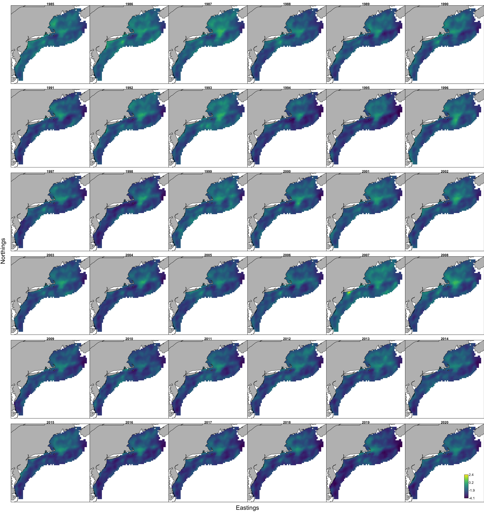
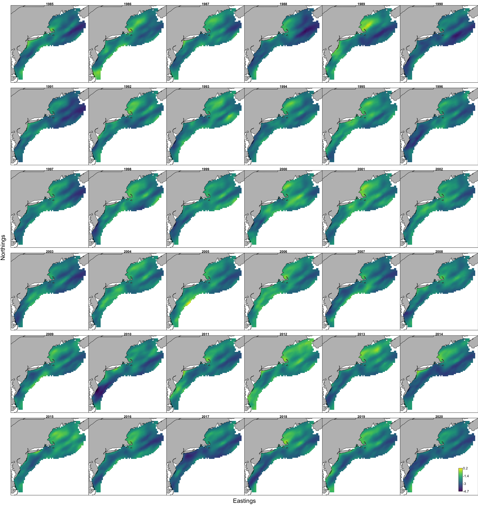

```{r setup, include=FALSE}
knitr::opts_chunk$set(echo = TRUE,
                      message = FALSE,
                      warning = FALSE)

library(here)
library(sf)
library(rnaturalearth)
library(raster)
library(smoothr)
library(gridExtra)
library(tidyverse)

library(DT)
#library(pdftools)
library(patchwork)
library(ggiraph)

library(ecodata)
#library(VAST)

```

# Does prey drive availability of bluefish?

Objective: create a "prey index" to evaluate changes in bluefish prey over time and in space using VAST [@thorson_comparing_2017; @thorson_guidance_2019].

Pattern on [@ng_predator_2021], which used predator stomach data to create a biomass index for a single prey, herring. Expected biomass of herring per stomach was estimated with 2 linear predictors, n herring per stomach and avg wt of herring in a stomach. 

We adapt this to get an index for "bluefish prey" rather than a single prey species. Further, we include inshore and offshore regions by combining surveys as was done for summer flounder biomass in [@perretti_spatio-temporal_2019]. Finally, since bluefish themselves are somewhat sparsely sampled by the surveys, we aggregate all predators that have a similar diet composition to bluefish to better represent bluefish prey biomass. 

We characterize weight of bluefish prey from all piscivores caught at each location and model that over time/space. Covariates explaining patterns in bluefish prey index include number of predators and size composition of predators at each location. 

## What do bluefish eat?

Bluefish eat small pelagics that are not well sampled by bottom trawl surveys. Bluefish themselves are not well sampled by bottom trawl surveys. Nevertheless, the diet samples collected for bluefish indicate that anchovies, herrings, squids, butterfish, scup, and small hakes are important prey. 

See [here](https://sgaichas.github.io/bluefishdiet/DietSummary.html) for NEFSC survey and [here](https://docs.google.com/presentation/d/1VlP0OsSLnoaoFHHt7kJbrqNTgBJqI6Ru/edit#slide=id.p1) for NEAMAP survey bluefish diet composition summaries.

We first characterize annual food habits data from NEFSC.

```{r}
# object is called `allfh`
load(url("https://github.com/Laurels1/Condition/raw/master/data/allfh.RData"))
```

### Bluefish diet summaries
```{r}
bluefishaggdiet <- read_csv(here("datfromshiny","DC.Bluefish (Pomatomus saltatrix).All.2021-10-07.csv"))

# decadal diet
diet70 <- read_csv(here("datfromshiny","DC.Bluefish (Pomatomus saltatrix).1970s.2021-10-07.csv")) %>%
  mutate(Decade = 1970)
diet80 <- read_csv(here("datfromshiny","DC.Bluefish (Pomatomus saltatrix).1980s.2021-10-07.csv"))%>%
  mutate(Decade = 1980)
diet90 <- read_csv(here("datfromshiny","DC.Bluefish (Pomatomus saltatrix).1990s.2021-10-07.csv"))%>%
  mutate(Decade = 1990)
diet00 <- read_csv(here("datfromshiny","DC.Bluefish (Pomatomus saltatrix).2000s.2021-10-07.csv"))%>%
  mutate(Decade = 2000)
diet10 <- read_csv(here("datfromshiny","DC.Bluefish (Pomatomus saltatrix).2010s.2021-10-07.csv"))%>%
  mutate(Decade = 2010)

bluefishdecadediet <- bind_rows(diet70, diet80, diet90, diet00, diet10)

# seasonal diet
dietspring <- read_csv(here("datfromshiny","DC.Bluefish (Pomatomus saltatrix).SPRING.2021-10-07.csv"))%>%
  mutate(Season = "Spring")
dietfall <- read_csv(here("datfromshiny","DC.Bluefish (Pomatomus saltatrix).FALL.2021-10-07.csv"))%>%
  mutate(Season = "Fall")

bluefishseasondiet <- bind_rows(dietspring, dietfall)

# regional diet
dietMAB <- read_csv(here("datfromshiny","DC.Bluefish (Pomatomus saltatrix).MID-ATLANTIC BIGHT.2021-10-07.csv")) %>%
  mutate(Region = "MAB")
dietSNE <- read_csv(here("datfromshiny","DC.Bluefish (Pomatomus saltatrix).SOUTHERN NEW ENGLAND.2021-10-07.csv"))%>%
  mutate(Region = "SNE")
dietGB <- read_csv(here("datfromshiny","DC.Bluefish (Pomatomus saltatrix).GEORGES BANK.2021-10-07.csv"))%>%
  mutate(Region = "GB")

bluefishregiondiet <- bind_rows(dietMAB, dietSNE, dietGB)

# bluefish size diet
dietSM <- read_csv(here("datfromshiny","DC.Bluefish (Pomatomus saltatrix).S.2021-10-07.csv")) %>%
  mutate(Size = "Small")
dietMED <- read_csv(here("datfromshiny","DC.Bluefish (Pomatomus saltatrix).M.2021-10-07.csv"))%>%
  mutate(Size = "Medium")
dietLG <- read_csv(here("datfromshiny","DC.Bluefish (Pomatomus saltatrix).L.2021-10-07.csv"))%>%
  mutate(Size = "Large")

bluefishsizediet <- bind_rows(dietSM, dietMED, dietLG)

preylist <- unique(c(bluefishaggdiet$Prey, bluefishdecadediet$Prey, bluefishregiondiet$Prey, bluefishseasondiet$Prey, bluefishsizediet$Prey))

```

```{r}
#from http://medialab.github.io/iwanthue/ using 35 categories, colorblind friendly
# again from http://medialab.github.io/iwanthue/ All colors colorspace, colorblind friendly, hard
preycol <- c("#00495d",
"#3ac100",
"#a646f7",
"#72ff75",
"#8d00a6",
"#c6ff90",
"#0268f1",
"#ff8d23",
"#0144a6",
"#01a249",
"#e1009e",
"#abffe1",
"#7e0082",
"#fffdd4",
"#24001c",
"#bbf6ff",
"#a60029",
"#0176c8",
"#8a4700",
"#a083ff",
"#454400",
"#ff7fff",
"#005d35",
"#c9005e",
"#00483e",
"#ff96e4",
"#291d00",
"#d5a5ff",
"#2e0400",
"#ffc5d6",
"#00285f",
"#ffbb88",
"#4a002e",
"#ff8092",
"#68001a")
names(preycol) <- as.factor(preylist)

```

#### Bluefish diet by season (all years, regions, and bluefish sizes) {.tabset}

##### Plot
```{r}
p <- ggplot(bluefishseasondiet, aes(x=as.factor(Season), y=Pct.m, fill=Prey)) +
  geom_bar_interactive(width = 0.95, stat = "identity", show.legend = FALSE,
                       aes(tooltip = Prey, data_id = Prey))+
  scale_fill_manual(values=preycol) +         #custom colors
  ggthemes::theme_tufte()
ggiraph(code=print(p))
```

##### Table
```{r}
datatable(bluefishseasondiet[,-c(1:2, 10)], rownames = FALSE,
          caption = 'Table 4: Bluefish prey by season, 1973-2020.')
```

#### {-}

#### Bluefish diet by decade (all regions and bluefish sizes) {.tabset} 

##### Plot
```{r}
p <- ggplot(bluefishdecadediet, aes(x=as.factor(Decade), y=Pct.m, fill=Prey)) +
  geom_bar_interactive(width = 0.95, stat = "identity", show.legend = FALSE,
                       aes(tooltip = Prey, data_id = Prey))+
  scale_fill_manual(values=preycol) +         #custom colors
  ggthemes::theme_tufte()
ggiraph(code=print(p))
```

##### Table
```{r}
datatable(bluefishdecadediet[,-c(1:2, 10)], rownames = FALSE,
          caption = 'Table 5: Bluefish prey by decade, 1973-2020.')
```

#### {-}

## Which predators to include?

Fish feeding guilds based on dietary overlap have been defined for the Northeast US shelf based on NEFSC trawl survey diet data from 1973-1997 [@garrison_dietary_2000]. In this analysis, all size classes of bluefish were classified as piscivores. A reasonable first cut would be to use all predator/size combinations identifed as piscivores in @garrison_dietary_2000. This would include:

```{r}
# code for piscivore table
piscivores <- ecodata::species_groupings %>%
  select(COMNAME, SizeCat, Garrison.Link) %>%
  filter(!is.na(Garrison.Link),
         Garrison.Link == "Piscivores") %>%
  mutate(PiscGuild = case_when(COMNAME == "WINTER SKATE" ~ "c",
                               COMNAME == "WEAKFISH" ~ "b", 
                               COMNAME == "BLUEFISH" & SizeCat == "S" ~ "b",
                               TRUE ~ "a")) %>%
  distinct()

datatable(piscivores, rownames = FALSE,
          caption = "Piscivores feeding guild from Garrison and Link 2000",
          options = list(pageLength = 25))

```


## Building an input prey dataset

### NEFSC data

Following data prep in @ng_predator_2021, we first select data for all piscivores, then collapsed to first and second half of year, combining winter and summer surveys with spring and fall to expand datasets. 

```{r}
# code for piscivore table
piscivores <- ecodata::species_groupings %>%
  select(COMNAME, SizeCat, Garrison.Link) %>%
  filter(!is.na(Garrison.Link),
         Garrison.Link == "Piscivores") %>%
  mutate(PiscGuild = case_when(COMNAME == "WINTER SKATE" ~ "c",
                               COMNAME == "WEAKFISH" ~ "b", 
                               COMNAME == "BLUEFISH" & SizeCat == "S" ~ "b",
                               TRUE ~ "a")) %>%
  distinct()

# food habits 1973-2020 piscivores only; include empties

fh.nefsc.pisc <- allfh %>%
  #filter(pynam != "EMPTY") %>%
  left_join(piscivores, by = c("pdcomnam" = "COMNAME",
                               "sizecat" = "SizeCat")) %>%
  filter(!is.na(Garrison.Link))

 preycount <- fh.nefsc.pisc %>%
   #group_by(year, season, pdcomnam, pynam) %>%
   group_by(pdcomnam, pynam) %>%
   summarise(count = n()) %>%
   #arrange(desc(count))
   pivot_wider(names_from = pdcomnam, values_from = count)

```

How many times in the full dataset was each prey name observed per predator?

```{r}
datatable(preycount, rownames = FALSE,
          extensions = c("FixedColumns"),
          #caption = "Prey observed in piscivores guild (Garrison and Link 2000) 1973-2020",
          options = list(pageLength = 25,
                         scrollX = TRUE,
                         fixedColumns = list(leftColumns = 1)))
```

Start by aggregating all pelagic nekton prey that have at least 10 observations for bluefish (leaving out empty, fish, osteichthes, AR, blown):

```{r}

gencomlist <- fh.nefsc.pisc %>%
  select(pynam, gencom2) %>%
  distinct()

blueprey <- preycount %>%
  filter(BLUEFISH > 9) %>%
  filter(!pynam %in% c("EMPTY", "BLOWN",
                       "FISH", "OSTEICHTHYES",
                       "ANIMAL REMAINS",
                       "FISH SCALES")) %>%
  #filter(!str_detect(pynam, "SHRIMP|CRAB")) %>%
  left_join(gencomlist) %>%
  filter(!gencom2 %in% c("ARTHROPODA", "ANNELIDA",
                         "CNIDARIA", "UROCHORDATA",
                         "ECHINODERMATA", "WORMS",
                         "BRACHIOPODA", "COMB JELLIES",
                         "BRYOZOA", "SPONGES",
                         "MISCELLANEOUS", "OTHER"))
```

```{r}
datatable(blueprey, rownames = FALSE,
          extensions = c("FixedColumns"),
          #caption = "Bluefish prey in all piscivores 1973-2020",
          options = list(pageLength = 25,
                         scrollX = TRUE,
                         fixedColumns = list(leftColumns = 1)))
```

This gives us 20 individual prey names. 

Which are included in the decadal diet compositions? All but the gray.

```{r}
preycolsel <- preycol[toupper(names(preycol)) %in% blueprey$pynam] 

p <- ggplot(bluefishdecadediet, aes(x=as.factor(Decade), y=Pct.m, fill=Prey)) +
  geom_bar_interactive(width = 0.95, stat = "identity", show.legend = FALSE,
                       aes(tooltip = Prey, data_id = Prey))+
  scale_fill_manual(values=preycolsel) +         #custom colors
  ggthemes::theme_tufte()
ggiraph(code=print(p))
```

Which are included seasonally?  
```{r}
preycolsel <- preycol[toupper(names(preycol)) %in% blueprey$pynam] 

p <- ggplot(bluefishseasondiet, aes(x=as.factor(Season), y=Pct.m, fill=Prey)) +
  geom_bar_interactive(width = 0.95, stat = "identity", show.legend = FALSE,
                       aes(tooltip = Prey, data_id = Prey))+
  scale_fill_manual(values=preycolsel) +         #custom colors
  ggthemes::theme_tufte()
ggiraph(code=print(p))
```


How many tows with piscivore diets had these preynames? 

```{r}
fh.nefsc.pisc.blueprey <- fh.nefsc.pisc %>%
  mutate(blueprey = case_when(pynam %in% blueprey$pynam ~ "blueprey",
                              TRUE ~ "othprey"))

preystn <- fh.nefsc.pisc.blueprey %>%
  group_by(year, season, station) %>%
  count(blueprey) %>%
  pivot_wider(names_from = blueprey, values_from = n) 

#dim(preystn)[1]

bluepreystn <- preystn %>% 
  arrange(desc(blueprey)) %>%
  filter(!is.na(blueprey))

#dim(bluepreystn)[1]

```

Between 1973 and 2020 we have `r dim(preystn)[1]` individual tows where piscivores were collected and `r dim(bluepreystn)[1]` of those tows had bluefish prey. Therefore, `r dim(bluepreystn)[1]/dim(preystn)[1]*100` percent of piscivore tows will be used to get the aggregate prey index. 

Which years and seasons have bluefish prey observed? How many tows each?

```{r}
# coverage <- bluepreystn %>%
#   ungroup() %>%
#   select(year, season) %>%
#   distinct() %>%
#   arrange(year, desc(season))

coverage <- bluepreystn %>%
  group_by(year, season) %>%
  count(station) %>%
  summarize(nstation = sum(n))

datatable(coverage, rownames = FALSE,
          #extensions = c("FixedColumns"),
          caption = "Piscivore stations with bluefish prey 1973-2020",
          options = list(pageLength = 10,
                         autoWidth = TRUE,
                         columnDefs = list(list(width = '200px'))
                         )
          )
```

(Note that the fall 2020 surveys were cancelled, and spring 2020 was partial due to pandemic restrictions.)

No year/season combinations have 0 stations with aggregated bluefish prey. Summarizing the number of stations per year/season with bluefish prey, 1973-2020:

```{r}
summary(coverage$nstation)
```

So we can aggregate over all these prey in all predator stomachs at a particular station to get mean bluefish prey weight per predator stomach. The catchability covariates at each station could be number of predators, number of predator species, diversity/evenness of predator species, mean predator length, variance predator length. The habitat covariates at each station could be temperature, bottom depth, or other physical parameters.

```{r}

bluepyall_stn <- fh.nefsc.pisc.blueprey %>%
  #create id linking cruise6_station
  #create season_ng spring and fall Spring=Jan-May, Fall=June-Dec
  mutate(id = paste0(cruise6, "_", station),
         year = as.numeric(year),
         month = as.numeric(month),
         season_ng = case_when(month <= 5 ~ "SPRING",
                               month >= 6 ~ "FALL",
                               TRUE ~ as.character(NA))
         ) %>%
  select(year, season_ng, id, 
         pynam, pyamtw, pywgti, pyvoli, blueprey, 
         pdcomnam, pdid, PiscGuild, pdlen, pdsvol, pdswgt, 
         beglat, beglon, declat, declon, 
         bottemp, surftemp, setdepth) %>%
  group_by(id) %>%
  #mean blueprey g per stomach per tow: sum all blueprey g/n stomachs in tow
  mutate(bluepywt = case_when(blueprey == "blueprey" ~ pyamtw,
                               TRUE ~ 0.0),
         bluepynam = case_when(blueprey == "blueprey" ~ pynam,
                               TRUE ~ NA_character_)) 

stndat <- bluepyall_stn %>%
  select(year, season_ng, id, 
         beglat, beglon, declat, declon, 
         bottemp, surftemp, setdepth) %>%
  distinct()

#pisc stomachs in tow count pdid for each pred and sum
piscstom <- bluepyall_stn %>%
  group_by(id, pdcomnam) %>%
  summarise(nstompd = n_distinct(pdid)) %>%
  group_by(id) %>%
  summarise(nstomtot = sum(nstompd))

#mean and var pred length per tow
pisclen <- bluepyall_stn %>%
  summarise(meanpisclen = mean(pdlen),
            varpisclen = var(pdlen))

bluepyagg_stn <- bluepyall_stn %>%
  summarise(sumbluepywt = sum(bluepywt),
            nbluepysp = n_distinct(bluepynam, na.rm = T),
            npreysp = n_distinct(pynam),
            npiscsp = n_distinct(pdcomnam)) %>%
  left_join(piscstom) %>%
  mutate(meanbluepywt = sumbluepywt/nstomtot) %>%
  left_join(pisclen) %>%
  left_join(stndat)
  
```

### Add NEAMAP

Ensure NEAMAP data colums align with current dataset. Also, add vessel column and fix declon to be negative in nefsc.

```{r}
# current dataset, fix declon, add vessel
nefsc_bluepyagg_stn <- readRDS(here("fhdat/bluepyagg_stn.rds")) %>%
  mutate(declon = -declon,
         vessel = case_when(year<2009 ~ "AL",
                            year>=2009 ~ "HB", 
                            TRUE ~ as.character(NA)))


# NEAMAP add vessel and rename
neamap_bluepreyagg_stn <- read_csv(here("fhdat/NEAMAP_Mean stomach weights_Bluefish Prey.csv")) %>%
  mutate(vessel = "NEAMAP") %>%
  rename(id = station,
         sumbluepywt = sumbluepreywt,
         nbluepysp = nbfpreyspp,
         #npreysp = ,
         npiscsp = npiscspp,
         nstomtot = nstomtot, 
         meanbluepywt = meanbluepreywt,
         meanpisclen = meanpisclen.simple, 
         #varpisclen = ,
         season_ng = season,
         declat  = lat,
         declon = lon,
         bottemp = bWT,
         #surftemp = , 
         setdepth = depthm) 
  
  
# combine  
bluepyagg_stn <-  nefsc_bluepyagg_stn %>%
  bind_rows(neamap_bluepreyagg_stn) 

saveRDS(bluepyagg_stn, here("fhdat/bluepyagg_stn_all.rds"))

```

## Questions for the WG on input data

1.  We truncate the input data to start in 1985 similar to the assessment model. Still Ok?
1.  Should we keep 2020 or leave it out? Incomplete survey for NEFSC, one survey for NEAMAP.
1.  Should we add 2021 data when it becomes available?
1.  Should we use the full spatial domain or reduce the footprint to match bluefish occurrence? How much of the Gulf of Maine and Scotian Shelf should we include?
1.  Should we consider leaving out more dissimilar predators, especially really different life history types and habitat/foraging mode. First to go may be the winter skate which was in a different subgroup from bluefish. Second could be split out small bluefish and weakfish group from @garrison_dietary_2000.
1.  Any other prey to add?
1.  If we consider a multivarite model, what prey categories make the most sense? 

## VAST models

After discussion with both the working group and Elizabeth Ng, we will limit the years to assessment years (1985 to present) and limit the areas to those north of Cape Hatteras due to problems with patchy southern sampling.

Having built an initial dataset of haul-specific mean bluefish prey weight per stomach for piscivores, now we ran a few configurations to see if spatial and spatio-temporal random effects make sense to estimate the prey index in VAST.

Again following what @ng_predator_2021 did for herring, but with 500 knots, estimated by k-means clustering of the data, to define the spatial dimensions of each seasonal model. We similarly apply a Poisson-link delta model to estimate expected prey mass per predator stomach.Model selection follows @ng_predator_2021 using REML. 

I updated the script each time for index standardization model, using 500 knots to speed things up (run from script `VASTunivariate_bluefishprey.R`, *not* in rmd). This is the most recent version:

```{r, code = readLines(here("VASTunivariate_bluefishprey.R")), eval=F}
```

We compared the AIC for the 500 knot models to see if including the spatial and spatio-temporal random effects in the first and second linear predictors improved the model fit. Model structures tested include with and without anistropy (2 fixed parameters), and with and without spatial and spatio-temporal random effects in the second linear predictor or both linear predictors. This follows the model selection process outlined in @ng_predator_2021. 

Results [here](https://sgaichas.github.io/bluefishdiet/VASTmodsel.html) showed full models estimating spatial and spatio-temporal random effects with anistropy were best supported by the NEFSC data.

**This analysis will be re-run with the full NEFSC+NEAMAP dataset**

For the full dataset with both surveys, we evaluated whether vessel effects or catchability coeffients were supported by the data.

We first explored the full dataset and compared different vessel effect parameterizations. Turning on the "Eta" parameters treats vessel differences as overdispersion in the first and or second linear predictor.

Altenatively, adding predator length as a catchability covariate may more directly model vessel differences in predator catch that affect stomach contents than modeling a vessel catchability covariate direclty. This was the appropach taken by @ng_predator_2021. They found that predator length covariates were strongly supported as catchability covariates (larger predators being more likely to have more prey in stomachs).

This script uses predator mean length as a catchability covariate, with the option to add number of distinct predator types.

```{r, code = readLines(here("VASTunivariate_bfp_allsurvs_lencov.R")), eval=F}
```

The rationale for including number of predator species is that more species "sampling" the prey field may result in more prey in stomachs. Temperature could also be added.

*It turns out including bottom temperature leaves out a lot of data, so for these initial runs I did not use temperature as a catchability covariate.* If the WG wants to explore this, we'll need to do runs with only the subset of data with temperature to compare with vessel effects, or use a different bottom temperature dataset like Charles Perretti did for summer flounder.  If we use it, the rationale for including bottom temperature is that predator metabolism and consumption changes with temperature, although this may not be linear depending on the temperature range. 

Initial run with length and number of predators has a lower AIC than runs with overdispersion for vessel effects.

We'll compare all runs with NEAMAP added and overdispersion vs catchability covariates here (using maximum likelihood to calculate AIC instead of REML because we are not changing the random effects):

```{r}
# from each output folder in pyindex, 
outdir <- here("pyindex")
moddirs <- list.dirs(outdir) 
moddirs <- moddirs[-1]
# keep folder name
modnames <- list.dirs(outdir, full.names = FALSE)

# function to apply extracting info
getmodinfo <- function(d.name){
  # read settings
  modpath <- stringr::str_split(d.name, "/", simplify = TRUE)
  modname <- modpath[length(modpath)]
  
  settings <- read.table(file.path(d.name, "settings.txt"), comment.char = "",
    fill = TRUE, header = FALSE)
  
  n_x <- as.numeric(as.character(settings[(which(settings[,1]=="$n_x")+1),2]))
  grid_size_km <- as.numeric(as.character(settings[(which(settings[,1]=="$grid_size_km")+1),2]))
  max_cells <- as.numeric(as.character(settings[(which(settings[,1]=="$max_cells")+1),2]))
  use_anisotropy <- as.character(settings[(which(settings[,1]=="$use_anisotropy")+1),2])
  fine_scale <- as.character(settings[(which(settings[,1]=="$fine_scale")+1),2])
  bias.correct <- as.character(settings[(which(settings[,1]=="$bias.correct")+1),2])
  
  #FieldConfig
  if(settings[(which(settings[,1]=="$FieldConfig")+1),1]=="Component_1"){
    omega1 <- as.character(settings[(which(settings[,1]=="$FieldConfig")+2),2])
    omega2 <- as.character(settings[(which(settings[,1]=="$FieldConfig")+3),1])
    epsilon1 <- as.character(settings[(which(settings[,1]=="$FieldConfig")+4),2])
    epsilon2 <- as.character(settings[(which(settings[,1]=="$FieldConfig")+5),1])
    beta1 <- as.character(settings[(which(settings[,1]=="$FieldConfig")+6),2])
    beta2 <- as.character(settings[(which(settings[,1]=="$FieldConfig")+7),1])
  }
  
  if(settings[(which(settings[,1]=="$FieldConfig")+1),1]=="Omega1"){
    omega1 <- as.character(settings[(which(settings[,1]=="$FieldConfig")+3),1])
    omega2 <- as.character(settings[(which(settings[,1]=="$FieldConfig")+4),1])
    epsilon1 <- as.character(settings[(which(settings[,1]=="$FieldConfig")+3),2])
    epsilon2 <- as.character(settings[(which(settings[,1]=="$FieldConfig")+4),2])
    beta1 <- "IID"
    beta2 <- "IID"
  }
  
  
  #RhoConfig
  rho_beta1 <- as.numeric(as.character(settings[(which(settings[,1]=="$RhoConfig")+3),1]))
  rho_beta2 <- as.numeric(as.character(settings[(which(settings[,1]=="$RhoConfig")+3),2]))
  rho_epsilon1 <- as.numeric(as.character(settings[(which(settings[,1]=="$RhoConfig")+4),1]))
  rho_epsilon2 <- as.numeric(as.character(settings[(which(settings[,1]=="$RhoConfig")+4),2]))
  
  # read parameter estimates, object is called parameter_Estimates
  load(file.path(d.name, "parameter_estimates.RData"))
  
  AIC <- parameter_estimates$AIC[1]  
  converged <- parameter_estimates$Convergence_check[1]
  fixedcoeff <- unname(parameter_estimates$number_of_coefficients[2])
  randomcoeff <- unname(parameter_estimates$number_of_coefficients[3])
  
  
  # return model atributes as a dataframe
  out <- data.frame(modname = modname,
                    n_x = n_x,
                    grid_size_km = grid_size_km,
                    max_cells = max_cells,
                    use_anisotropy = use_anisotropy,
                    fine_scale =  fine_scale,
                    bias.correct = bias.correct,
                    omega1 = omega1,
                    omega2 = omega2,
                    epsilon1 = epsilon1,
                    epsilon2 = epsilon2,
                    beta1 = beta1,
                    beta2 = beta2,
                    rho_epsilon1 = rho_epsilon1,
                    rho_epsilon2 = rho_epsilon2,
                    rho_beta1 = rho_beta1,
                    rho_beta2 = rho_beta2,
                    AIC = AIC,
                    converged = converged,
                    fixedcoeff = fixedcoeff,
                    randomcoeff = randomcoeff
  )
  	
	return(out)

}

# combine into one table for comparison

modselect <- purrr::map_dfr(moddirs, getmodinfo)


```

Compare different vessel effects and catchability coeffients with combined NEFSC and NEAMAP data:

```{r}

# only compare AIC for the 500 knot models with neamap included
modselect.500.allsurvs <- modselect %>%
  filter(n_x == 500) %>%
  filter(str_detect(modname, c("wneamap|allsurvs"))) %>%
  mutate(season = case_when(str_detect(modname, "fall") ~ "Fall",
                            str_detect(modname, "spring") ~ "Spring",
                            TRUE ~ as.character(NA))) %>%
  mutate(converged2 = case_when(str_detect(converged, "no evidence") ~ "likely",
                                str_detect(converged, "is likely not") ~ "unlikely",
                                TRUE ~ as.character(NA))) %>%
  group_by(season) %>%
  mutate(deltaAIC = AIC-min(AIC)) %>%
  arrange(AIC) %>%
  dplyr::select(modname, season, deltaAIC, fixedcoeff,
         randomcoeff, use_anisotropy,
         omega1, omega2, epsilon1, epsilon2,
         beta1, beta2, AIC, converged2)

DT::datatable(modselect.500.allsurvs, rownames = FALSE, 
              options= list(pageLength = 25, scrollX = TRUE))
```

(The allsurvs model is a check that should be identical to wneamap, and it is. The _tilt model has extra axes from code below but is otherwise identical to the best fit model.)

All results are on [google drive](https://drive.google.com/drive/folders/1ns2VdOWWZmVKpvCJC3PZu2D-CHXXUIfJ). Including predator mean length and number of predator species fits better than including either alone, vessel overdispersion parameters, or no covariates.

## Realign center of gravity along/across NEUS coastline

Following the excellent instructions of Alexa Fredston at Rutgers, we can use the NE coast as an axis [@fredston_range_2021] for calculating center of gravity to realign the calculations as alongshore and inshore/offshore.

From https://github.com/James-Thorson-NOAA/VAST/wiki/Define-new-axes-for-range-edge-and-centroid and using the coastline from https://github.com/afredston/range-edge-niches/blob/master/scripts/get_axes_of_measurement.R 

Get coastline, make supplemental figure from [Fredson et al. 2021](https://onlinelibrary.wiley.com/doi/10.1111/gcb.15614):

```{r}

# First get the coastline, verbatim lines 15-43 here
# https://github.com/afredston/range-edge-niches/blob/master/scripts/get_axes_of_measurement.R 

usamap <- rnaturalearth::ne_countries(scale = "small", country = "united states of america", returnclass = "sf")[1] %>% 
  st_cast("MULTILINESTRING") # get basic map of the country 

## Northeast:

# set bounding boxes
neus.xmin=-78
neus.xmax=-66
neus.ymin=35
neus.ymax=45

neus.bbox1 <- st_set_crs(st_as_sf(as(raster::extent(neus.xmin, neus.xmax, neus.ymin, neus.ymax), "SpatialPolygons")), st_crs(usamap))
neus.bbox2 <- st_set_crs(st_as_sf(as(raster::extent(-78, -74, 42, 45), "SpatialPolygons")), st_crs(usamap)) # smaller bounding box to get rid of extra lines on the map 

neusmap <- usamap %>% 
  st_intersection(neus.bbox1) %>%  
  st_difference(neus.bbox2) # gets rid of extra non coastal line 

# if WG wants a different smooth, change below based on fig
neus.smoothgeom <- neusmap %>% 
  smoothr::smooth(method="ksmooth", smoothness=8) %>% # smoother was applied incrementally more until the Chesapeake went away 
  as("Spatial") %>% 
  geom()

neus.geomdists <- pointDistance(neus.smoothgeom[-nrow(neus.smoothgeom), c("x", "y")], neus.smoothgeom[-1, c("x", "y")], lonlat=TRUE)
neus.coastdistdat <- data.frame(neus.smoothgeom[, c('x','y')], seglength=c(0, neus.geomdists))
neus.coastdistdat$lengthfromhere <- rev(cumsum(rev(neus.coastdistdat[,"seglength"])))
# first row should match st_length(smoothmap)

write_rds(neus.coastdistdat, here("spatialdat","neus_coastdistdat.rds"))

# plot it, lines 114-129 https://github.com/afredston/range-edge-niches/blob/master/scripts/get_axes_of_measurement.R

usoutline <- rnaturalearth::ne_states("united states of america", returnclass = "sf") %>% 
  st_sf()

# iterate over NEUS smoothness values that we used 
neus_smoothplot <- function(smoothval){
  out <- ggplot() +
    geom_sf(data=usoutline, color="#999999") +
    geom_sf(data=neusmap %>% 
              smoothr::smooth(method="ksmooth", smoothness=smoothval), color="darkblue", lwd=1.5) + 
    scale_x_continuous(limits=c(neus.xmin, neus.xmax)) +
    scale_y_continuous(limits=c(neus.ymin, neus.ymax)) +
    theme_bw() +
    labs(title=paste0("Smoothness=", smoothval)) +
    theme(axis.text.x=element_text(angle=45)) 
}

neus.smoothmap.list <- lapply(seq(1, 8, 1), neus_smoothplot)

neus.smoothmap <- do.call("grid.arrange", c(neus.smoothmap.list, ncol=3))


```

Apply to model. Now following steps in https://github.com/James-Thorson-NOAA/VAST/wiki/Define-new-axes-for-range-edge-and-centroid we first set up the model to get default coordinates but don't run it, create the custom axis using the coastline object above, then pass the custom axis to the model and run it.

Following the example for the [Bering Sea linear axis](https://github.com/James-Thorson-NOAA/VAST/wiki/Define-new-axes-for-range-edge-and-centroid), we add two lines. The along shelf axis directly follows [Kevin Friedland's axis for measuring species distribution change](https://noaa-edab.github.io/tech-doc/species-distribution-indicators.html#methods-51):

>The along-shelf axis begins at 76.53°W 34.60°N and terminates at 65.71°W 43.49°N.

And the offshore axis is perpendicular to the alongshore axis, originating from its center. Code to rotate a geographic feature from xhttps://geocompr.robinlovelace.net/geometric-operations.html#affine-transformations, a portion of a great book featuring `sf` functions and usage: [Geocomputation with R](https://geocompr.robinlovelace.net/index.html)

```{r}
# set line endpoints 
neus.alongshore.lon <- c(-76.53,-65.71)
neus.alongshore.lat <- c(34.60,43.49)

# draw line
neus.alongshore.line <- data.frame(neus.alongshore.lon, neus.alongshore.lat) %>%
  rename('x'=neus.alongshore.lon,'y'=neus.alongshore.lat) %>%
  st_as_sf(coords=c('x','y')) %>%
  summarise() %>%
  st_cast("LINESTRING") %>% 
  smoothr::densify(n=99) %>% # choose number of line segments: here it's 99 for 100 points
  st_cast("MULTIPOINT") 

neus.alongshore.points <- data.frame(st_coordinates(neus.alongshore.line)) %>%
  rename("x"=X, "y"=Y)

neus.alongshore.dists <- pointDistance(neus.alongshore.points[-nrow(neus.alongshore.points), c("x", "y")], neus.alongshore.points[-1, c("x", "y")], lonlat=TRUE)

neus.alongshore.axisdistdat <- data.frame(neus.alongshore.points[, c('x','y')], seglength=c(0, neus.alongshore.dists))
neus.alongshore.axisdistdat$lengthfromhere <- rev(cumsum(rev(neus.alongshore.axisdistdat[,"seglength"])))

#plot to ensure it's right!
# ggplot() +
#     geom_sf(data=neusmap, color="#999999") +
#     geom_sf(data=neus.alongshore.line %>% st_set_crs(st_crs(neusmap)), color="darkblue", lwd=1.5) + 
#     #scale_x_continuous(limits=c(neus.xmin, neus.xmax)) +
#     #scale_y_continuous(limits=c(neus.ymin, neus.ymax)) +
#     theme_bw() +
#     #labs(title=paste0("Smoothness=", smoothval)) +
#     theme(axis.text.x=element_text(angle=45))

#find perpendicular axis at midpoint of alongshore line
# since we made this line 100 units, center is at ~50
halfway <- neus.alongshore.axisdistdat[50,]

# or we could calculate it properly
mid.lat <- sum(neus.alongshore.lat)/2
mid.lon <- sum(neus.alongshore.lon)/2

# or use a built in function
midpoint.alongshore <- st_centroid(neus.alongshore.line)

# rotate alongshore line 90 degress at midpoint
# functions see https://geocompr.robinlovelace.net/geometric-operations.html
rotation = function(a){
  r = a * pi / 180 #degrees to radians
  matrix(c(cos(r), sin(r), -sin(r), cos(r)), nrow = 2, ncol = 2)
} 

#nz_rotate = (nz_sfc - nz_centroid_sfc) * rotation(30) + nz_centroid_sfc

neus.alongshore.line_sfc <- st_geometry(neus.alongshore.line)
midpoint.alongshore_sfc <- st_centroid(neus.alongshore.line_sfc)

neus.offshore.line <- (neus.alongshore.line_sfc - midpoint.alongshore_sfc) * rotation(90) + midpoint.alongshore_sfc

ggplot() +
    geom_sf(data=neusmap, color="#999999") +
    geom_sf(data=neus.alongshore.line_sfc %>% st_set_crs(st_crs(neusmap)), 
            color="darkblue", 
            #col=viridisLite::viridis(25)[cut(as.numeric(neus.alongshore.line_sfc),25)],
            lwd=1.5) +
    geom_sf(data=neus.offshore.line %>% st_set_crs(st_crs(neusmap)), 
            color="darkblue", 
            #ol=viridisLite::viridis(25)[cut(as.numeric(neus.alongshore.line_sfc),25)],
            lwd=1.5) +
    #scale_x_continuous(limits=c(neus.xmin, neus.xmax)) +
    #scale_y_continuous(limits=c(neus.ymin, neus.ymax)) +
    theme_bw() +
    #labs(title=paste0("Smoothness=", smoothval)) +
    theme(axis.text.x=element_text(angle=45))

neus.offshore.points <- data.frame(st_coordinates(neus.offshore.line)) %>%
  rename("x"=X, "y"=Y)

neus.offshore.dists <- pointDistance(neus.offshore.points[-nrow(neus.offshore.points), c("x", "y")], neus.offshore.points[-1, c("x", "y")], lonlat=TRUE)

neus.offshore.axisdistdat <- data.frame(neus.offshore.points[, c('x','y')], seglength=c(0, neus.offshore.dists))
neus.offshore.axisdistdat$lengthfromhere <- rev(cumsum(rev(neus.offshore.axisdistdat[,"seglength"])))

write_rds(neus.alongshore.axisdistdat, here("spatialdat","neus.alongshore.axisdistdat.rds"))
write_rds(neus.offshore.axisdistdat, here("spatialdat","neus.offshore.axisdistdat.rds"))

```

Affline transformations may not preserve angles so this rotation looks a little off when 90 is specified.

We could also project a linear axis offshore from the non-linear coastline axis? But those axes will intersect. 

This should project coast, alongshore, and offshore axes:

```{r, code = readLines(here("VASTunivariate_bfp_allsurvs_lencov_tiltaxis.R")), eval=F}
```

Here is the best model with both surveys, predator mean length and number of predator species as covariates, with the rotated axes.

### Fall Index

  

### Fall Center of Gravity (far right is inshore-offshore)

 

### Fall Density




### Spring Index

   

### Spring Center of Gravity (far right is inshore-offshore) 

 

### Spring Density



## Define inshore and offshore regions

```{r, eval=FALSE}
#diagnose opposite directions for coastline and alongshore
fallfit <- readRDS(here("pyindex/allagg_fall_500_allsurvs_lenno_tilt/fit.rds"))
fallfit$input_args$extra_args$Z_gm

springfit <- readRDS(here("pyindex/allagg_spring_500_allsurvs_lenno_tilt/fit.rds"))
springfit$input_args$extra_args$Z_gm

```


Three options for different strata for derived quantities: 

*   3 miles from shore, 
*   NEAMAP outer boundary, 
*   Albatross inshore strata boundary.

In progress...

## Questions for the WG on VAST models:

1.  Look at other catchability or density covariates?
1.  Other model selection work?
1.  Recommended diagnostics/outputs to review?
1.  Useful to have a multivariate model, or better to keep all prey aggregated?
1.  Evaluate a model with only bluefish as predators? (Data are sparse)


## References