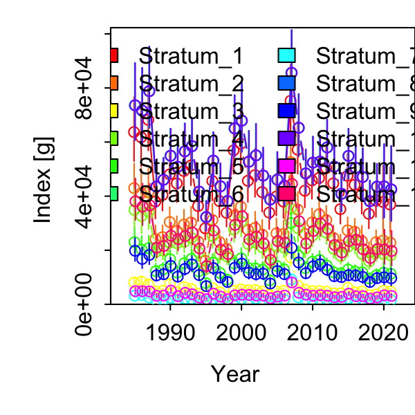

```{r setup, include=FALSE}
knitr::opts_chunk$set(echo = TRUE)

library(dplyr)
library(purrr)
library(ggplot2)
theme_set(theme_bw())

library(sf)
library(ecodata)
library(FishStatsUtils)
```

## Spatial partitioning of VAST output

Our main goal is to determine whether bluefish prey availability has changed in inshore waters where the recreational fishery primarily operates.

Our food habits datasets do not extend into inland waters such as bays and sounds, with the exception of Cape Cod Bay. (In the future we might be able to investigate food habits from ChesMMAP or surveys south of Cape Hatteras.) However, there is data from both historical NEFSC surveys and NEAMAP in state coastal waters (0-3 miles from shore), and offshore across the continental shelf. 

As previously discussed, there are several definitions of "inshore" that could be appiled:

1. An inshore band representing old Albatross strata (current NEAMAP) strata,  
2. An inshore band representing the inshore strata sampled by the Bigelow, 
3. a 3 mile boundary (representng availability to recreational fishery-MRIP).  

We visualize the options for partitioning VAST model output here, including the NEFSC survey strata used and proposed for the bluefish assessment. 

Some strata sets:

```{r}

#current bluefish assessment strata are all Bigelow inshore strata MAB-GB
bfstrata <- c(3020, 3050, 3080, 3110, 3140, 3170, 3200, 3230, 
              3260, 3290, 3320, 3350, 3380, 3410, 3440, 3450, 3460)

northwest_atlantic_grid <- FishStatsUtils::northwest_atlantic_grid

bfgrid <- northwest_atlantic_grid %>%
  filter(stratum_number %in% bfstrata)

inshorest <- northwest_atlantic_grid %>%
  filter(stratum_number>2999 & stratum_number<3999) %>%
  select(stratum_number) %>%
  distinct() %>%
  as_vector() %>%
  unname() 

inshoregrid <- northwest_atlantic_grid %>%
  filter(stratum_number>2999 & stratum_number<3999)

offshoregrid <- northwest_atlantic_grid %>%
  filter(stratum_number<3000)

MABGBvastgrid <- northwest_atlantic_grid %>%
  filter(EPU %in% c("Mid_Atlantic_Bight", "Georges_Bank"))

#preset EPUs dont go all the way inshore, need to redefine

# from Tony's 8 March presentation, minus the inshore in CCBay
bfoffshore <- c(1010, 1730, 1690, 1650, 1050, 1060, 1090, 1100, 1250, 1200, 1190, 1610)

bfoffshoregrid <- northwest_atlantic_grid %>%
  filter(stratum_number %in% bfoffshore)

#from mskeyrun vignette, EPU based on survey strata, replace built in VAST EPU
#https://noaa-edab.github.io/ms-keyrun/articles/GBSurveySet.html

MAB <- c(1010:1080, 1100:1120, 1600:1750, 3010:3450, 3470, 3500, 3510)
GB  <- c(1090, 1130:1210, 1230, 1250, 3460, 3480, 3490, 3520:3550)
GOM <- c(1220, 1240, 1260:1290, 1360:1400, 3560:3830)
SS  <- c(1300:1352, 3840:3990)

MABGBgrid <- northwest_atlantic_grid %>%
  filter(stratum_number %in% c(MAB, GB))

```

## Visualizations

This is the full extrapolation grid built into VAST: "nortwest-atlantic-grid"

```{r}
ggplot(data = ecodata::coast) +
  geom_sf() + 
  geom_point(data = northwest_atlantic_grid, aes(x = Lon, y = Lat), size=0.05, alpha=0.1) +
  coord_sf(xlim = c(-78, -65.5), ylim = c(35, 45))
```


This shows the built in VAST Mid Atlantic Bight and Georges Bank EPU definitions (green) overlaid on the extrapolation grid. 

```{r}
ggplot(data = ecodata::coast) +
  geom_sf() + 
  geom_point(data = northwest_atlantic_grid, aes(x = Lon, y = Lat), size=0.05, alpha=0.1) +
  geom_point(data = MABGBvastgrid, aes(x = Lon, y = Lat), size=0.05, colour = "green",  alpha=0.1) +
  coord_sf(xlim = c(-78, -65.5), ylim = c(35, 45))
```

The built in VAST EPU definitions follow a 10 minute square shapefile, which doesn't exactly include all of the survey strata or possible stations (thus potentially dropping data). A bigger problem for this project is potentially leaving out some inshore areas. So while we used this in prior model testing, I'll be using EPUs defined based on survey strata (as currently done in the [NEFSC State of the Ecosystem Report](https://noaa-edab.github.io/tech-doc/survdat.html#fig:epustrata)) rather than the built in VAST EPU definitions.

These are the EPUs defined by survey strata (MAB and GB, green).

```{r}
ggplot(data = ecodata::coast) +
  geom_sf() + 
  geom_point(data = northwest_atlantic_grid, aes(x = Lon, y = Lat), size=0.05, alpha=0.1) +
  geom_point(data = MABGBgrid, aes(x = Lon, y = Lat), size=0.05, colour = "green",  alpha=0.1) +
  coord_sf(xlim = c(-78, -65.5), ylim = c(35, 45))
```

My proposal is to call the MAB and GB survey strata the "bluefish relevant" portion of the Northeast US shelf.

The current (blue) and proposed (lighter blue) survey strata used in the bluefish assessment lie within the MAB and GB.

```{r}
ggplot(data = ecodata::coast) +
  geom_sf() + 
  geom_point(data = northwest_atlantic_grid, aes(x = Lon, y = Lat), size=0.05, alpha=0.1) +
  geom_point(data = MABGBgrid, aes(x = Lon, y = Lat), size=0.05, colour = "green",  alpha=0.1) +
  geom_point(data = bfgrid, aes(x = Lon, y = Lat), size=0.05, colour = "blue") +
  geom_point(data = bfoffshoregrid, aes(x = Lon, y = Lat), size=0.05, colour = "blue", alpha=0.1) +
  coord_sf(xlim = c(-78, -65.5), ylim = c(35, 45))
```

Then we can define "inshore" and "offshore" components a couple of ways.

The NEFSC trawl survey defines inshore (yellow) and offshore (orange) strata (we are leaving out all strata south of Cape Hatteras). Inshore strata include both Albatross/NEAMAP strata and Bigelow strata.

```{r}
ggplot(data = ecodata::coast) +
  geom_sf() + 
  geom_point(data = northwest_atlantic_grid, aes(x = Lon, y = Lat), size=0.05, alpha=0.1) +
  geom_point(data = offshoregrid, aes(x = Lon, y = Lat), size=0.05, colour = "orange", alpha=0.2) +
  geom_point(data = inshoregrid, aes(x = Lon, y = Lat), size=0.05, colour = "yellow", alpha=0.2) +
  coord_sf(xlim = c(-78, -65.5), ylim = c(35, 45))
```

For all three of our options, we will divide the combined MAB GB into inshore and offshore.

```{r, message=FALSE}
MABinshore <- c(3010:3450, 3470, 3500, 3510)
GBinshore  <- c(3460, 3480, 3490, 3520:3550)
  
MABoffshore <- c(1010:1080, 1100:1120, 1600:1750)
GBoffshore  <- c(1090, 1130:1210, 1230, 1250)

MABGBinshoregrid <- northwest_atlantic_grid %>%
  filter(stratum_number %in% c(MABinshore, GBinshore))

MABGBoffshoregrid <- northwest_atlantic_grid %>%
  filter(stratum_number %in% c(MABoffshore, GBoffshore))

MABGBalbinshoregrid <- MABGBinshoregrid %>%
  anti_join(bfgrid)

MABGBalboffshoregrid <- MABGBgrid %>%
  anti_join(MABGBalbinshoregrid)
```


Option 1 above would define inshore as the area now covered by NEAMAP and covered in the past by the Albatross.

```{r}
ggplot(data = ecodata::coast) +
  geom_sf() + 
  geom_point(data = northwest_atlantic_grid, aes(x = Lon, y = Lat), size=0.05, alpha=0.1) +
  geom_point(data = MABGBalboffshoregrid, aes(x = Lon, y = Lat), size=0.05, colour = "orange", alpha=0.2) +
  geom_point(data = MABGBalbinshoregrid, aes(x = Lon, y = Lat), size=0.05, colour = "yellow", alpha=0.2) +
  coord_sf(xlim = c(-78, -65.5), ylim = c(35, 45))
```

Option 2 above would add the Bigelow inshore strata to Option 1, if I understand correctly.

```{r}

ggplot(data = ecodata::coast) +
  geom_sf() + 
  geom_point(data = northwest_atlantic_grid, aes(x = Lon, y = Lat), size=0.05, alpha=0.1) +
  geom_point(data = MABGBoffshoregrid, aes(x = Lon, y = Lat), size=0.05, colour = "orange", alpha=0.2) +
  geom_point(data = MABGBinshoregrid, aes(x = Lon, y = Lat), size=0.05, colour = "yellow", alpha=0.2) +
  coord_sf(xlim = c(-78, -65.5), ylim = c(35, 45))
```

Option 3 would define inshore as the area within 3 miles of the coast. I can't do this by subsetting the current northwest-atlantic-grid using survey strata. This requires actual spatial mapping. We can start with the coast as defined by Alexa Fredston, then get a bad 3 miles wide from it. 

```{r}

```

The following code defines the strata for VAST output. For the `nortwest_atlantic` extrapolation grid we can define different strata as lists of strata:

```
bfstrata <- c(3020, 3050, 3080, 3110, 3140, 3170, 3200, 3230, 
              3260, 3290, 3320, 3350, 3380, 3410, 3440, 3450, 3460)

bfoffshore <- c(1010, 1730, 1690, 1650, 1050, 1060, 1090, 1100, 1250, 1200, 1190, 1610)

MAB <- c(1010:1080, 1100:1120, 1600:1750, 3010:3450, 3470, 3500, 3510)
GB  <- c(1090, 1130:1210, 1230, 1250, 3460, 3480, 3490, 3520:3550)
GOM <- c(1220, 1240, 1260:1290, 1360:1400, 3560:3830)
SS  <- c(1300:1352, 3840:3990)

MABinshore <- c(3010:3450, 3470, 3500, 3510)
GBinshore  <- c(3460, 3480, 3490, 3520:3550)

MABoffshore <- c(1010:1080, 1100:1120, 1600:1750)
GBoffshore  <- c(1090, 1130:1210, 1230, 1250)

AllEPU <- northwest_atlantic_grid %>% 
  filter(stratum_number %in% c(MAB, GB, GOM, SS)) %>% 
  select(stratum_number) %>% 
  distinct()

MABGB <- northwest_atlantic_grid %>% 
  filter(stratum_number %in% c(MAB, GB)) %>% 
  select(stratum_number) %>% 
  distinct()

MABGBinshore <- northwest_atlantic_grid %>% 
  filter(stratum_number %in% c(MABinshore, GBinshore)) %>% 
  select(stratum_number) %>% 
  distinct()

MABGBoffshore <- northwest_atlantic_grid %>% 
  filter(stratum_number %in% c(MABoffshore, GBoffshore)) %>% 
  select(stratum_number) %>% 
  distinct()

bfall <- northwest_atlantic_grid %>% 
  filter(stratum_number %in% c(bfstrata, bfoffshore)) %>% 
  select(stratum_number) %>% 
  distinct()

```
Then input to VAST looks like this

```
strata.limits <- as.list(c("AllEPU" = AllEPU, 
                         "MABGB" = MABGB, 
                         "MABGBinshore" = MABGBinshore, 
                         "MABGBoffshore" = MABGBoffshore, 
                         "bfall" = bfall))

```

Strata come out labeled in order as they are input 1:5 in this case.

Here is example index output for the Fall (Option 2):



More readable as individual time series or as proportions.

```{r}
splitoutput <- read.csv("pyindex/allagg_fall_500_lenno_split/Index.csv")

splitoutput <- splitoutput %>%
  mutate(Region = case_when(Stratum == "Stratum_1" ~ "AllEPU",
                            Stratum == "Stratum_2" ~ "MABGB",
                            Stratum == "Stratum_3" ~ "MABGBinshore",
                            Stratum == "Stratum_4" ~ "MABGBoffshore",
                            Stratum == "Stratum_5" ~ "Bluefish",
                            
  ))

ggplot(splitoutput, aes(x=Time, y=Estimate, colour=Region)) +
  geom_errorbar(aes(ymin=Estimate+Std..Error.for.Estimate, ymax=Estimate-Std..Error.for.Estimate))+
  geom_point()+
  geom_line()+
  facet_wrap(~Region, scales = "free_y") +
  theme(legend.position = c(1, 0),
        legend.justification = c(1, 0))

```


```{r}
MABGBprop <- splitoutput %>%
  filter(Region != "AllEPU") %>%
  mutate()
  
```

