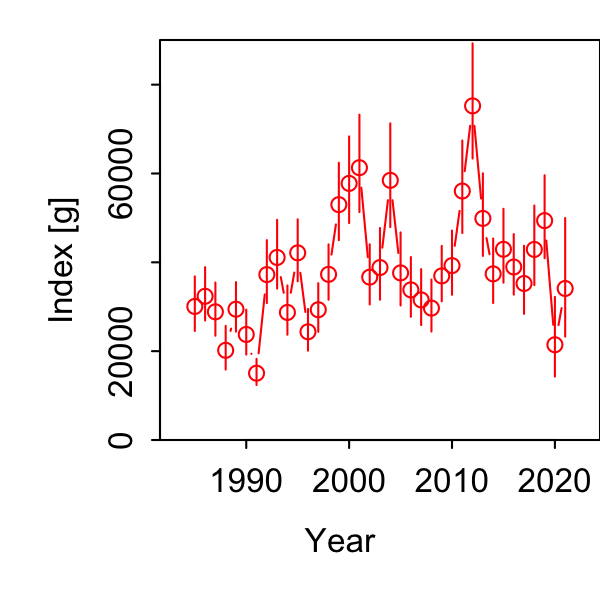
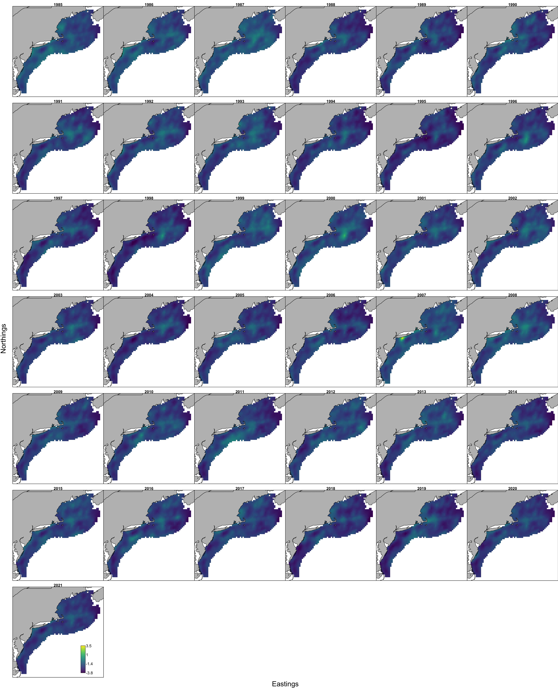
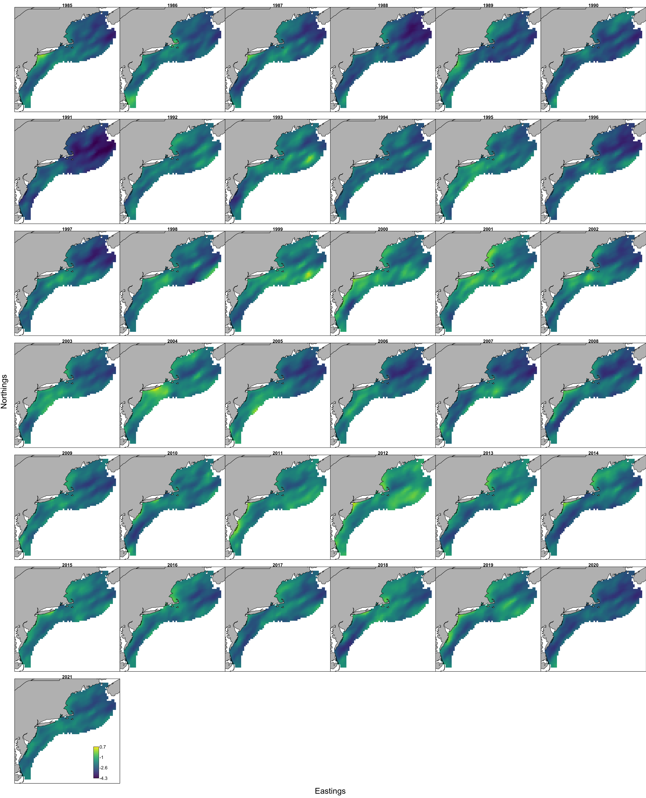

```{r setup, include=FALSE}
knitr::opts_chunk$set(echo = TRUE,
                      message = FALSE,
                      warning = FALSE)

library(tidyverse)
library(here)
#library(DT)
#library(pdftools)
#library(patchwork)
#library(ggiraph)

#library(ecodata)
#library(VAST)
```

Having built an initial dataset of haul-specific mean bluefish prey weight per stomach for the [updated piscivore list](https://sgaichas.github.io/bluefishdiet/UpdateVAST_Inputs.html) from both NEFSC and NEAMAP, and having completed [initial model selection](https://sgaichas.github.io/bluefishdiet/VASTmodsel_updatedPreds.html) to see if spatial and spatio-temporal random effects make sense to estimate the prey index in VAST, now we'll evaluate which catchability covariates are best supported by the data.

Following what @ng_predator_2021 did for herring, we apply a Poisson-link delta model to estimate expected prey mass per predator stomach. However, we use 500 knots, estimated by k-means clustering of the data, to define the spatial dimensions of each seasonal model.   

We'll compare all runs with NEAMAP added and overdispersion vs catchability covariates here (using maximum likelihood to calculate AIC instead of REML because we are not changing the random effects).

Altenatively, adding the predator length covariate may more directly model vessel differences in predator catch that affect stomach contents than modeling a vessel catchability covariate direclty. This was the appropach taken by @ng_predator_2021. They found that predator length covariates were strongly supported as catchability covariates (larger predators being more likely to have more prey in stomachs).

The rationale for including number of predator species is that more species "sampling" the prey field may result in more prey in stomachs. 

This script uses the full dataset and compares different vessel effect parameterizations and length covariates. One approach treats vessel differences as overdispersion in the first and or second linear predictor. We also use predator mean length as a catchability covariate, the number of distinct predator types as a catchability covariate, and both mean length and number of predator species combined as covariates.

```{r, code = readLines(here("VASTunivariate_bfp_allsurvs_lencov.R")), eval=F}
```

We'll scrape the settings and parameter estimates from each folder to compare AICs:

```{r}
# from each output folder in pyindex, 
outdir <- here("pyindex")
moddirs <- list.dirs(outdir) 
moddirs <- moddirs[-1]
# keep folder name
modnames <- list.dirs(outdir, full.names = FALSE)

# function to apply extracting info
getmodinfo <- function(d.name){
  # read settings
  modpath <- stringr::str_split(d.name, "/", simplify = TRUE)
  modname <- modpath[length(modpath)]
  
  settings <- read.table(file.path(d.name, "settings.txt"), comment.char = "",
    fill = TRUE, header = FALSE)
  
  n_x <- as.numeric(as.character(settings[(which(settings[,1]=="$n_x")+1),2]))
  grid_size_km <- as.numeric(as.character(settings[(which(settings[,1]=="$grid_size_km")+1),2]))
  max_cells <- as.numeric(as.character(settings[(which(settings[,1]=="$max_cells")+1),2]))
  use_anisotropy <- as.character(settings[(which(settings[,1]=="$use_anisotropy")+1),2])
  fine_scale <- as.character(settings[(which(settings[,1]=="$fine_scale")+1),2])
  bias.correct <- as.character(settings[(which(settings[,1]=="$bias.correct")+1),2])
  
  #FieldConfig
  if(settings[(which(settings[,1]=="$FieldConfig")+1),1]=="Component_1"){
    omega1 <- as.character(settings[(which(settings[,1]=="$FieldConfig")+2),2])
    omega2 <- as.character(settings[(which(settings[,1]=="$FieldConfig")+3),1])
    epsilon1 <- as.character(settings[(which(settings[,1]=="$FieldConfig")+4),2])
    epsilon2 <- as.character(settings[(which(settings[,1]=="$FieldConfig")+5),1])
    beta1 <- as.character(settings[(which(settings[,1]=="$FieldConfig")+6),2])
    beta2 <- as.character(settings[(which(settings[,1]=="$FieldConfig")+7),1])
  }
  
  if(settings[(which(settings[,1]=="$FieldConfig")+1),1]=="Omega1"){
    omega1 <- as.character(settings[(which(settings[,1]=="$FieldConfig")+3),1])
    omega2 <- as.character(settings[(which(settings[,1]=="$FieldConfig")+4),1])
    epsilon1 <- as.character(settings[(which(settings[,1]=="$FieldConfig")+3),2])
    epsilon2 <- as.character(settings[(which(settings[,1]=="$FieldConfig")+4),2])
    beta1 <- "IID"
    beta2 <- "IID"
  }
  
  
  #RhoConfig
  rho_beta1 <- as.numeric(as.character(settings[(which(settings[,1]=="$RhoConfig")+3),1]))
  rho_beta2 <- as.numeric(as.character(settings[(which(settings[,1]=="$RhoConfig")+3),2]))
  rho_epsilon1 <- as.numeric(as.character(settings[(which(settings[,1]=="$RhoConfig")+4),1]))
  rho_epsilon2 <- as.numeric(as.character(settings[(which(settings[,1]=="$RhoConfig")+4),2]))
  
  # read parameter estimates, object is called parameter_Estimates
  load(file.path(d.name, "parameter_estimates.RData"))
  
  AIC <- parameter_estimates$AIC[1]  
  converged <- parameter_estimates$Convergence_check[1]
  fixedcoeff <- unname(parameter_estimates$number_of_coefficients[2])
  randomcoeff <- unname(parameter_estimates$number_of_coefficients[3])
  
  
  # return model atributes as a dataframe
  out <- data.frame(modname = modname,
                    n_x = n_x,
                    grid_size_km = grid_size_km,
                    max_cells = max_cells,
                    use_anisotropy = use_anisotropy,
                    fine_scale =  fine_scale,
                    bias.correct = bias.correct,
                    omega1 = omega1,
                    omega2 = omega2,
                    epsilon1 = epsilon1,
                    epsilon2 = epsilon2,
                    beta1 = beta1,
                    beta2 = beta2,
                    rho_epsilon1 = rho_epsilon1,
                    rho_epsilon2 = rho_epsilon2,
                    rho_beta1 = rho_beta1,
                    rho_beta2 = rho_beta2,
                    AIC = AIC,
                    converged = converged,
                    fixedcoeff = fixedcoeff,
                    randomcoeff = randomcoeff
  )
  	
	return(out)

}

# combine into one table for comparison

modselect <- purrr::map_dfr(moddirs, getmodinfo)


```

Now compare the AIC for the 500 knot models to see if including covariates or vessel effects improved the fit. This follows the model selection process outlined in @ng_predator_2021. 

We have only NEAMAP data for 2020-2021 in Fall and for 2021 in Spring.

```{r}

# only compare AIC for the 500 knot models
modselect.cov <- modselect %>%
  filter(n_x == 500) %>%
  filter(str_detect(modname, "base|eta|len|_no$")) %>%
  mutate(season = case_when(str_detect(modname, "fall") ~ "Fall",
                            str_detect(modname, "spring") ~ "Spring",
                            TRUE ~ as.character(NA))) %>%
  mutate(converged2 = case_when(str_detect(converged, "no evidence") ~ "likely",
                                str_detect(converged, "is likely not") ~ "unlikely",
                                TRUE ~ as.character(NA))) %>%
  group_by(season) %>%
  mutate(deltaAIC = AIC-min(AIC)) %>%
  select(modname, season, deltaAIC, fixedcoeff,
         randomcoeff, use_anisotropy, 
         omega1, omega2, epsilon1, epsilon2, 
         beta1, beta2, AIC, converged2) %>%
  arrange(AIC)

DT::datatable(modselect.cov, rownames = FALSE, 
              options= list(pageLength = 25, scrollX = TRUE))
```

All models converged. The models with predator attributes (mean length and number of predator species at a station) as catchability coefficients were better supported by the data than models with no catchability coefficients or with vessel effects as overdispersion parameters, similar to the findings of @ng_predator_2021, where predator mean length was selected.

## Selected Model Results

These include catchability coefficients that were best supported by the data: mean predator length and number of predator species at each station. 

### Fall Index


### Spring Index



### Fall predicted ln-density



### Spring predicted ln-density


All results in the respective pyindex/allagg_fall_500_lenno and allagg_spring_500_lenno folders.

The full results are on [google drive](https://drive.google.com/drive/folders/1PsEk5hhQ7fR0Gq4NnYPvU4V59d4nIR8E) rather than github to save space.

## References
