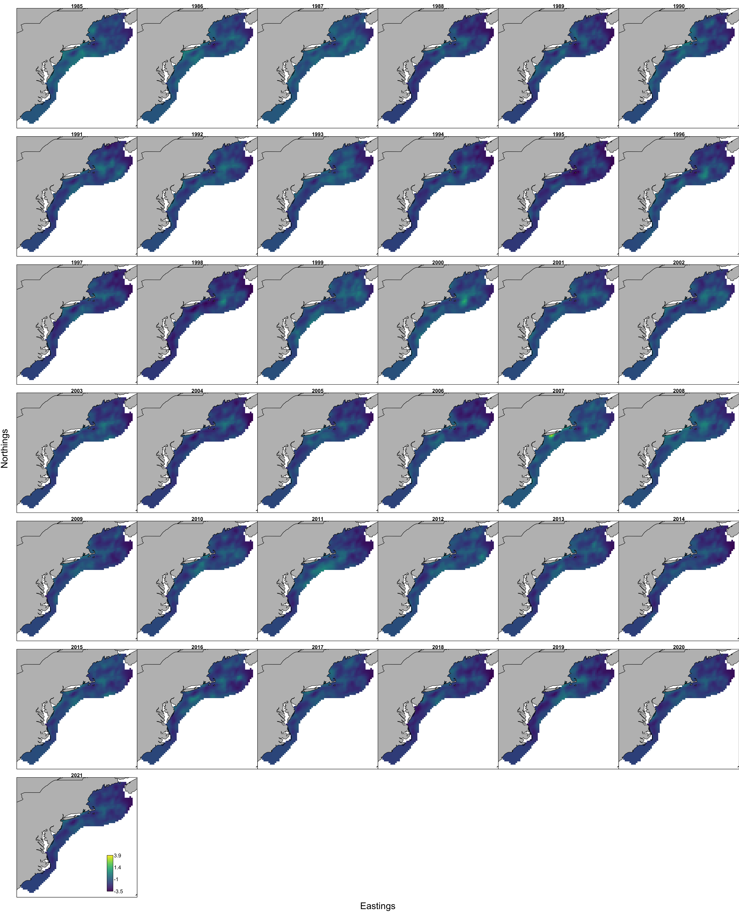
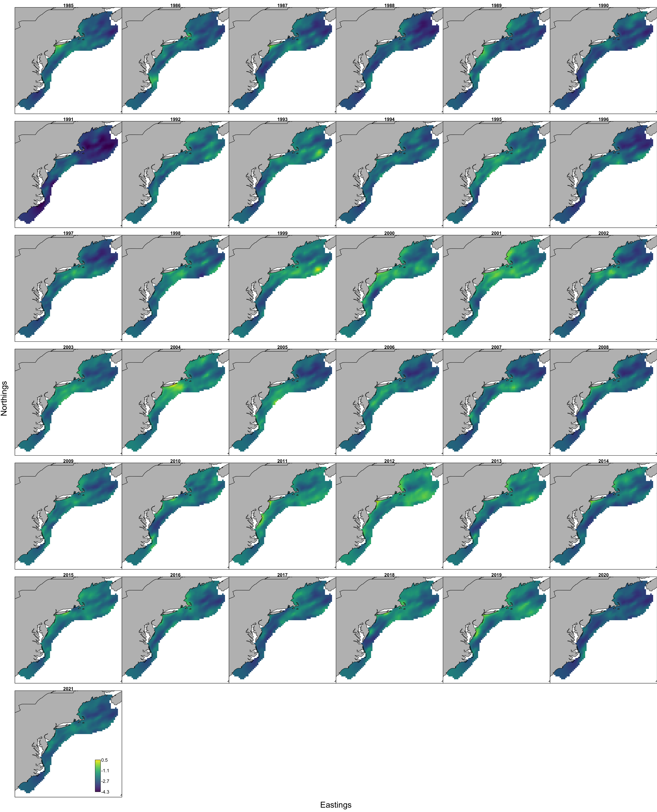

```{r setup, include=FALSE}
knitr::opts_chunk$set(echo = TRUE,
                      message = FALSE,
                      warning = FALSE)

library(tidyverse)
library(here)
#library(DT)
#library(pdftools)
#library(patchwork)
#library(ggiraph)

#library(ecodata)
#library(VAST)
```

Model comparisons led us to the best model fit using mean predator length, number of predator species, and SST at a survey station as catchability covariates. 

The last step is to define spatial partitions that reflect several definitions of "inshore" and "offshore" for the stock assessment inputs.

First we define a partition that is the MAB and GB areas only as the GOM is not relevant to the bluefish assessment (yet). This is called MABGB. Within this partition,

1.  Survey inshore vs offshore to evaluate availability to the survey index. Strata partitions include:
    + Albatross inshore stations
    + Bigelow inshore bluefish index stations
    + offshore bluefish index stations (added this year)
    + offshore non-bluefish stations
    
1.  Recreational fishery inshore vs offshore to evaluate availability to the MRIP CPUE index. Strata partitions include
    + shoreline to 3 miles out
    + offshore of 3 miles
    
Survey strata definitions are built into VAST already.

The area within and outside 3 miles of shore within MABGB needs to be defined. AT the moment, 3 nm is approximated as 5.556 km

```{r}
## Northeast:

# set bounding boxes
neus.xmin=-77
neus.xmax=-65
neus.ymin=35
neus.ymax=45

# high resolution coastline
usamap <- rnaturalearth::ne_countries(scale = "large", country = "united states of america", returnclass = "sf")[1] %>% 
  sf::st_cast("MULTILINESTRING") # get basic map of the country 

neus.bbox1 <- sf::st_set_crs(sf::st_as_sf(as(raster::extent(neus.xmin, neus.xmax, neus.ymin, neus.ymax), "SpatialPolygons")), sf::st_crs(usamap))
neus.bbox2 <- sf::st_set_crs(sf::st_as_sf(as(raster::extent(-78, -74, 42, 45), "SpatialPolygons")), sf::st_crs(usamap)) # smaller bounding box to get rid of extra lines on the map 

# just the NEUS coastline high res

neuscoast <- usamap %>% 
  sf::st_intersection(neus.bbox1) %>%  
  sf::st_difference(neus.bbox2) # gets rid of extra non coastal line 

#plot(neuscoast)

# add a 5.556 km (3 mi) buffer around coastline

neuscoast_buff_3nm  <-  sf::st_buffer(neuscoast, dist = 5556)

#plot(neuscoast_buff_3nm)

# intersect buffer with the current FishStatsUtils::northwest_atlantic_grid
nwagrid_sf  <-  sf::st_as_sf(FishStatsUtils::northwest_atlantic_grid, coords = c("Lon","Lat")) %>%
  sf::st_set_crs(sf::st_crs(neuscoast))

# save that intersection
coast3nmbuff <- sf::st_intersection(nwagrid_sf, neuscoast_buff_5km)

# add as strata limit definition


# if WG wants a different smooth, change below based on fig
neus.smoothgeom <- neusmap %>% 
  smoothr::smooth(method="ksmooth", smoothness=1) %>% # smoother was applied incrementally more until the Chesapeake went away 
  as("Spatial") %>% 
  raster::geom()

neus.geomdists <- raster::pointDistance(neus.smoothgeom[-nrow(neus.smoothgeom), c("x", "y")], neus.smoothgeom[-1, c("x", "y")], lonlat=TRUE)
neus.coastdistdat <- data.frame(neus.smoothgeom[, c('x','y')], seglength=c(0, neus.geomdists))
neus.coastdistdat$lengthfromhere <- rev(cumsum(rev(neus.coastdistdat[,"seglength"])))
# first row should match st_length(smoothmap)


write_rds(neus.coastdistdat, here("spatialdat","neus_coastdistdat.rds"))

```

Various online maps are available for state waters, if I can't draw my own.

```{r}


```


```{r, code = readLines(here("VASTunivariate_bfp_allsurvs_lencovSST_inoffsplit.R")), eval=F}
```

We'll scrape the settings and parameter estimates from each folder to compare AICs:

```{r}
# from each output folder in pyindex, 
outdir <- here("pyindex")
moddirs <- list.dirs(outdir) 
moddirs <- moddirs[-1]
# keep folder name
modnames <- list.dirs(outdir, full.names = FALSE)[-1]

# function to apply extracting info
getmodinfo <- function(d.name){
  # read settings
  modpath <- stringr::str_split(d.name, "/", simplify = TRUE)
  modname <- modpath[length(modpath)]
  
  settings <- read.table(file.path(d.name, "settings.txt"), comment.char = "",
    fill = TRUE, header = FALSE)
  
  n_x <- as.numeric(as.character(settings[(which(settings[,1]=="$n_x")+1),2]))
  grid_size_km <- as.numeric(as.character(settings[(which(settings[,1]=="$grid_size_km")+1),2]))
  max_cells <- as.numeric(as.character(settings[(which(settings[,1]=="$max_cells")+1),2]))
  use_anisotropy <- as.character(settings[(which(settings[,1]=="$use_anisotropy")+1),2])
  fine_scale <- as.character(settings[(which(settings[,1]=="$fine_scale")+1),2])
  bias.correct <- as.character(settings[(which(settings[,1]=="$bias.correct")+1),2])
  
  #FieldConfig
  if(settings[(which(settings[,1]=="$FieldConfig")+1),1]=="Component_1"){
    omega1 <- as.character(settings[(which(settings[,1]=="$FieldConfig")+2),2])
    omega2 <- as.character(settings[(which(settings[,1]=="$FieldConfig")+3),1])
    epsilon1 <- as.character(settings[(which(settings[,1]=="$FieldConfig")+4),2])
    epsilon2 <- as.character(settings[(which(settings[,1]=="$FieldConfig")+5),1])
    beta1 <- as.character(settings[(which(settings[,1]=="$FieldConfig")+6),2])
    beta2 <- as.character(settings[(which(settings[,1]=="$FieldConfig")+7),1])
  }
  
  if(settings[(which(settings[,1]=="$FieldConfig")+1),1]=="Omega1"){
    omega1 <- as.character(settings[(which(settings[,1]=="$FieldConfig")+3),1])
    omega2 <- as.character(settings[(which(settings[,1]=="$FieldConfig")+4),1])
    epsilon1 <- as.character(settings[(which(settings[,1]=="$FieldConfig")+3),2])
    epsilon2 <- as.character(settings[(which(settings[,1]=="$FieldConfig")+4),2])
    beta1 <- "IID"
    beta2 <- "IID"
  }
  
  
  #RhoConfig
  rho_beta1 <- as.numeric(as.character(settings[(which(settings[,1]=="$RhoConfig")+3),1]))
  rho_beta2 <- as.numeric(as.character(settings[(which(settings[,1]=="$RhoConfig")+3),2]))
  rho_epsilon1 <- as.numeric(as.character(settings[(which(settings[,1]=="$RhoConfig")+4),1]))
  rho_epsilon2 <- as.numeric(as.character(settings[(which(settings[,1]=="$RhoConfig")+4),2]))
  
  # read parameter estimates, object is called parameter_Estimates
  load(file.path(d.name, "parameter_estimates.RData"))
  
  AIC <- parameter_estimates$AIC[1]  
  converged <- parameter_estimates$Convergence_check[1]
  fixedcoeff <- unname(parameter_estimates$number_of_coefficients[2])
  randomcoeff <- unname(parameter_estimates$number_of_coefficients[3])
  
  
  # return model atributes as a dataframe
  out <- data.frame(modname = modname,
                    n_x = n_x,
                    grid_size_km = grid_size_km,
                    max_cells = max_cells,
                    use_anisotropy = use_anisotropy,
                    fine_scale =  fine_scale,
                    bias.correct = bias.correct,
                    omega1 = omega1,
                    omega2 = omega2,
                    epsilon1 = epsilon1,
                    epsilon2 = epsilon2,
                    beta1 = beta1,
                    beta2 = beta2,
                    rho_epsilon1 = rho_epsilon1,
                    rho_epsilon2 = rho_epsilon2,
                    rho_beta1 = rho_beta1,
                    rho_beta2 = rho_beta2,
                    AIC = AIC,
                    converged = converged,
                    fixedcoeff = fixedcoeff,
                    randomcoeff = randomcoeff
  )
  	
	return(out)

}

# combine into one table for comparison

modselect <- purrr::map_dfr(moddirs, getmodinfo)


```

Now compare the AIC for the 500 knot models to see if including covariates or vessel effects improved the fit. This follows the model selection process outlined in @ng_predator_2021. 

We have only NEAMAP data for 2020-2021 in Fall and for 2021 in Spring.

```{r}

# only compare AIC for the 500 knot models
modselect.cov <- modselect %>%
  filter(n_x == 500) %>%
  #filter(str_detect(modname, "base|eta|len|_no$")) %>%
  mutate(season = case_when(str_detect(modname, "fall") ~ "Fall",
                            str_detect(modname, "spring") ~ "Spring",
                            TRUE ~ as.character(NA))) %>%
  mutate(converged2 = case_when(str_detect(converged, "no evidence") ~ "likely",
                                str_detect(converged, "is likely not") ~ "unlikely",
                                TRUE ~ as.character(NA))) %>%
  group_by(season) %>%
  mutate(deltaAIC = AIC-min(AIC)) %>%
  select(modname, season, deltaAIC, fixedcoeff,
         randomcoeff, use_anisotropy, 
         omega1, omega2, epsilon1, epsilon2, 
         beta1, beta2, AIC, converged2) %>%
  arrange(AIC)

DT::datatable(modselect.cov, rownames = FALSE, 
              options= list(pageLength = 25, scrollX = TRUE))
```

All models converged. Models including SST, predator mean length, and number of predator species as covariates were best supported by the data according to AIC.SST made a bigger difference in spring than in the fall model.

Below we have the results from the best fit models for each season. 

## Selected Model Results

Now splitting the index into many parts.

Make a lookup table:

```{r}
# strata.limits <- as.list(c("AllEPU" = AllEPU, 
#                          "MABGB" = MABGB, 
#                          "MABGBinshore" = MABGBinshore, 
#                          "MABGBoffshore" = MABGBoffshore, 
#                          "bfall" = bfall,
#                          "bfallnot" = bfallnot,
#                          "bfin" = bfin,
#                          "bfinnot" = bfinnot,
#                          "bfoff" = bfoff,
#                          "bfoffnot" = bfoffnot,
#                          "MABGBalbinshore" = MABGBalbinshore,
#                          "MABGBoffshorebigin" = MABGBoffshorebigin))

stratlook <- data.frame(Stratum = c("Stratum_1",
                                      "Stratum_2",
                                      "Stratum_3",
                                      "Stratum_4",
                                      "Stratum_5",
                                      "Stratum_6",
                                      "Stratum_7",
                                      "Stratum_8",
                                      "Stratum_9",
                                      "Stratum_10",
                                      "Stratum_11",
                                      "Stratum_12"),
                           Region  = c("AllEPU", 
                                       "MABGB", 
                                       "MABGBinshore", 
                                       "MABGBoffshore", 
                                       "bfall",
                                       "bfallnot",
                                       "bfin",
                                       "bfinnot",
                                       "bfoff",
                                       "bfoffnot",
                                       "MABGBalbinshore",
                                       "MABGBoffshorebigin"))


```

### Fall Index  

Plot individual time series

```{r}
splitoutput <- read.csv("pyindex/allagg_fall_500_lennosst_split/Index.csv")

splitoutput <- splitoutput %>%
  left_join(stratlook)

ggplot(splitoutput, aes(x=Time, y=Estimate, colour=Region)) +
  geom_errorbar(aes(ymin=Estimate+Std..Error.for.Estimate, ymax=Estimate-Std..Error.for.Estimate))+
  geom_point()+
  geom_line()+
  facet_wrap(~Region, scales = "free_y") +
  guides(colour = guide_legend(ncol=2)) +
  #theme(legend.position = c(1, 0),
   #     legend.justification = c(1, 0))
  theme(legend.position="none")

```

 or just the indices from inshore (alb), inshore bluefish, offshore bluefish, and further out
 
```{r}
in2off <- splitoutput %>%
  dplyr::select(Time, Region, Estimate) %>%
  tidyr::pivot_wider(names_from = Region, values_from = Estimate) %>%
  dplyr::mutate(AlbInshore = MABGBalbinshore,
                BlueInshore = bfin,
                BlueOffshore = bfoff,
                OthOffshore = MABGB - (bfoff + bfin + MABGBalbinshore),
                SumMABGB = AlbInshore + BlueInshore + BlueOffshore + OthOffshore) %>%
  dplyr::select(Time, AlbInshore, BlueInshore, BlueOffshore, OthOffshore, SumMABGB, MABGB) %>%
  tidyr::pivot_longer(!Time, names_to = "Region", values_to = "Estimate")

ggplot(in2off, aes(x=Time, y=Estimate, colour = Region)) +
  geom_point()+
  geom_line()+
  #facet_wrap(~Region) + #+ , scales = "free_y"
  #theme(legend.position = c(1, 0),
  #      legend.justification = c(1, 0))
  ggtitle("Fall Prey Index, Mid-Atlantic and Georges Bank")


```

 or as proportions (here proportion of MABGB index).

```{r}
MABGBprop <- in2off %>%
  #dplyr::filter(Region != "AllEPU") %>%
  dplyr::select(Time, Region, Estimate) %>%
  tidyr::pivot_wider(names_from = Region, values_from = Estimate) %>%
  dplyr::mutate(AlbInshoreprop = AlbInshore/MABGB,
                BlueInshoreprop = BlueInshore/MABGB,
                BlueOffshoreprop = BlueOffshore/MABGB,
                OthOffshoreprop = OthOffshore/MABGB) %>%
  tidyr::pivot_longer(!Time, names_to = "Region", values_to = "Estimate") %>%
  dplyr::filter(Region %in% c("AlbInshoreprop", "BlueInshoreprop", "BlueOffshoreprop",
                              "OthOffshoreprop"))
  

ggplot(MABGBprop, aes(x=Time, y=Estimate, colour = Region)) +
  geom_point()+
  geom_line()+
  #facet_wrap(~Region) + #+ , scales = "free_y"
  #theme(legend.position = c(1, 0),
  #      legend.justification = c(1, 0))
  ggtitle("Fall Prey Index as proportion of Mid-Atlantic and Georges Bank")
  
  
```

### Fall predicted ln-density


 
### Spring Index  

Plot individual time series

```{r}
splitoutput <- read.csv("pyindex/allagg_spring_500_lennosst_split/Index.csv")

splitoutput <- splitoutput %>%
  left_join(stratlook)

ggplot(splitoutput, aes(x=Time, y=Estimate, colour=Region)) +
  geom_errorbar(aes(ymin=Estimate+Std..Error.for.Estimate, ymax=Estimate-Std..Error.for.Estimate))+
  geom_point()+
  geom_line()+
  facet_wrap(~Region, scales = "free_y") +
  guides(colour = guide_legend(ncol=2)) +
  #theme(legend.position = c(1, 0),
   #     legend.justification = c(1, 0))
  theme(legend.position="none")

```

 or just the indices from inshore (alb), inshore bluefish, offshore bluefish, and further out
 
```{r}
in2off <- splitoutput %>%
  dplyr::select(Time, Region, Estimate) %>%
  tidyr::pivot_wider(names_from = Region, values_from = Estimate) %>%
  dplyr::mutate(AlbInshore = MABGBalbinshore,
                BlueInshore = bfin,
                BlueOffshore = bfoff,
                OthOffshore = MABGB - (bfoff + bfin + MABGBalbinshore),
                SumMABGB = AlbInshore + BlueInshore + BlueOffshore + OthOffshore) %>%
  dplyr::select(Time, AlbInshore, BlueInshore, BlueOffshore, OthOffshore, SumMABGB, MABGB) %>%
  tidyr::pivot_longer(!Time, names_to = "Region", values_to = "Estimate")

ggplot(in2off, aes(x=Time, y=Estimate, colour = Region)) +
  geom_point()+
  geom_line()+
  #facet_wrap(~Region) + #+ , scales = "free_y"
  #theme(legend.position = c(1, 0),
  #      legend.justification = c(1, 0))
  ggtitle("Spring Prey Index, Mid-Atlantic and Georges Bank")


```

 or as proportions (here proportion of MABGB index).

```{r}
MABGBprop <- in2off %>%
  #dplyr::filter(Region != "AllEPU") %>%
  dplyr::select(Time, Region, Estimate) %>%
  tidyr::pivot_wider(names_from = Region, values_from = Estimate) %>%
  dplyr::mutate(AlbInshoreprop = AlbInshore/MABGB,
                BlueInshoreprop = BlueInshore/MABGB,
                BlueOffshoreprop = BlueOffshore/MABGB,
                OthOffshoreprop = OthOffshore/MABGB) %>%
  tidyr::pivot_longer(!Time, names_to = "Region", values_to = "Estimate") %>%
  dplyr::filter(Region %in% c("AlbInshoreprop", "BlueInshoreprop", "BlueOffshoreprop",
                              "OthOffshoreprop"))
  

ggplot(MABGBprop, aes(x=Time, y=Estimate, colour = Region)) +
  geom_point()+
  geom_line()+
  #facet_wrap(~Region) + #+ , scales = "free_y"
  #theme(legend.position = c(1, 0),
  #      legend.justification = c(1, 0))
  ggtitle("Spring Prey Index as proportion of Mid-Atlantic and Georges Bank")
  
  
```


### Spring predicted ln-density



All results in the respective pyindex/allagg_fall_500_lennosst_split and allagg_spring_500_lennsst_split folders.

The full results are on [google drive](https://drive.google.com/drive/folders/1PsEk5hhQ7fR0Gq4NnYPvU4V59d4nIR8E) rather than github to save space.

Still to do:

*  index within 3 miles of shore and outside that (highest priority)

*  investigate other SST filling sources if time  
    +  CTD casts from survey not meeting criteria for proximity to station
    +  underway measurements on Bigelow and possibly Albatross
    +  AVHRR satellite data
    


## References
