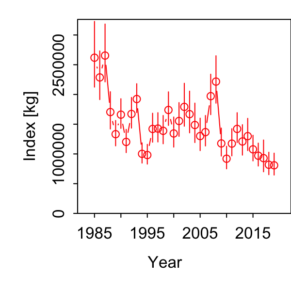
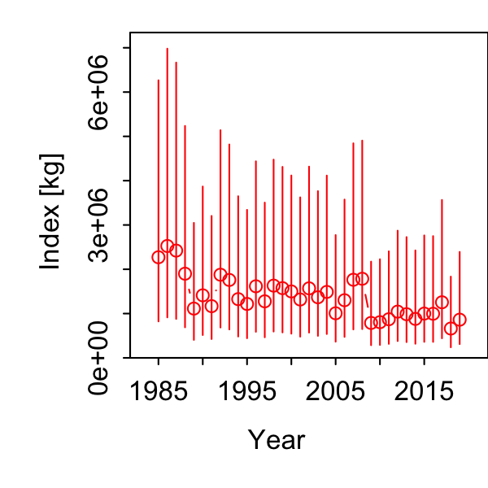
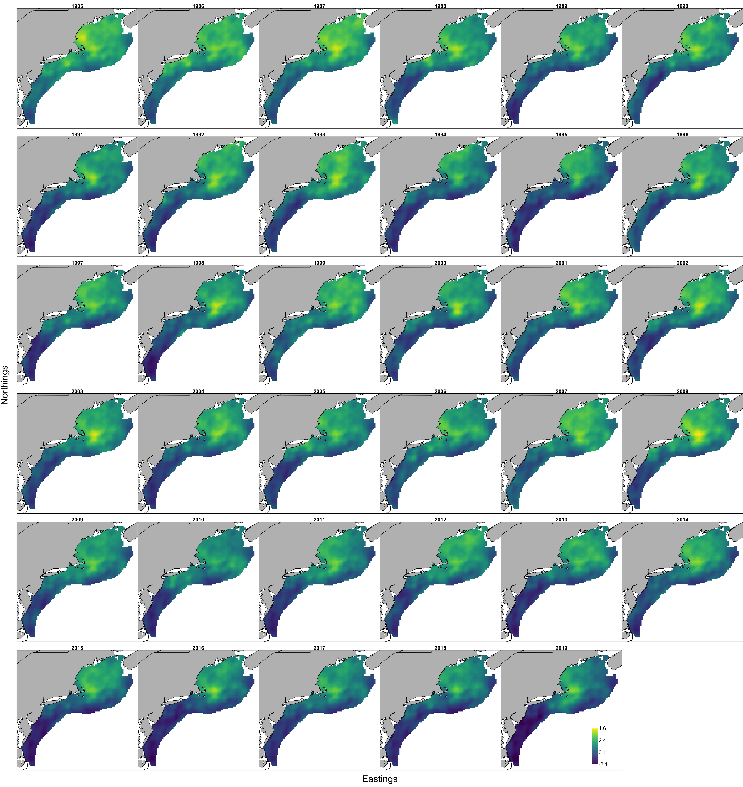

```{r setup, include=FALSE}
knitr::opts_chunk$set(echo = TRUE,
                      message = FALSE,
                      warning = FALSE)

library(tidyverse)
library(here)
#library(DT)
#library(pdftools)
#library(patchwork)
#library(ggiraph)

#library(ecodata)
#library(VAST)
```

After discussion with both the working group and Elizabeth Ng, we will limit the years to assessment years (1985 to present) and limit the areas to those north of Cape Hatteras due to problems with patchy southern sampling.

A key point is ensuring that the - is included with the longitude in the input data!

Having built an initial dataset of haul-specific mean bluefish prey weight per stomach for piscivores, now we'll run a few configurations to see if spatial and spatio-temporal random effects make sense to estimate the prey index in VAST.

Again following what @ng_predator_2021 did for herring, but with 500 knots, estimated by k-means clustering of the data, to define the spatial dimensions of each seasonal model. We similarly apply a Poisson-link delta model to estimate expected prey mass per predator stomach.  

I updated the script each time for index standardization model, using 500 knots to speed things up (run from script `VASTunivariate_bluefishprey.R`, *not* in rmd). This is the most recent version:

```{r, code = readLines(here("VASTunivariate_bluefishprey.R")), eval=F}
```

We'll scrape the settings and parameter estimates from each folder to compare AICs:

```{r}
# from each output folder in pyindex, 
outdir <- here("pyindex")
moddirs <- list.dirs(outdir) 
# keep folder name
modnames <- list.dirs(outdir, full.names = FALSE)

# function to apply extracting info
getmodinfo <- function(dir){
  # read settings
  modpath <- stringr::str_split(dir, "/", simplify = TRUE)
  modname <- modpath[length(modpath)]
  
  settings <- read.table(file.path(dir, "settings.txt"), comment.char = "",
    fill = TRUE, header = FALSE)
  
  n_x <- as.numeric(as.character(settings[(which(settings[,1]=="$n_x")+1),2]))
  grid_size_km <- as.numeric(as.character(settings[(which(settings[,1]=="$grid_size_km")+1),2]))
  max_cells <- as.numeric(as.character(settings[(which(settings[,1]=="$max_cells")+1),2]))
  use_anisotropy <- as.character(settings[(which(settings[,1]=="$use_anisotropy")+1),2])
  fine_scale <- as.character(settings[(which(settings[,1]=="$fine_scale")+1),2])
  bias.correct <- as.character(settings[(which(settings[,1]=="$bias.correct")+1),2])
  
  #FieldConfig
  if(settings[(which(settings[,1]=="$FieldConfig")+1),1]=="Component_1"){
    omega1 <- as.character(settings[(which(settings[,1]=="$FieldConfig")+2),2])
    omega2 <- as.character(settings[(which(settings[,1]=="$FieldConfig")+3),1])
    epsilon1 <- as.character(settings[(which(settings[,1]=="$FieldConfig")+4),2])
    epsilon2 <- as.character(settings[(which(settings[,1]=="$FieldConfig")+5),1])
    beta1 <- as.character(settings[(which(settings[,1]=="$FieldConfig")+6),2])
    beta2 <- as.character(settings[(which(settings[,1]=="$FieldConfig")+7),1])
  }
  
  if(settings[(which(settings[,1]=="$FieldConfig")+1),1]=="Omega1"){
    omega1 <- as.character(settings[(which(settings[,1]=="$FieldConfig")+3),1])
    omega2 <- as.character(settings[(which(settings[,1]=="$FieldConfig")+4),1])
    epsilon1 <- as.character(settings[(which(settings[,1]=="$FieldConfig")+3),2])
    epsilon2 <- as.character(settings[(which(settings[,1]=="$FieldConfig")+4),2])
  }
  
  
  #RhoConfig
  rho_beta1 <- as.numeric(as.character(settings[(which(settings[,1]=="$RhoConfig")+3),1]))
  rho_beta2 <- as.numeric(as.character(settings[(which(settings[,1]=="$RhoConfig")+3),2]))
  rho_epsilon1 <- as.numeric(as.character(settings[(which(settings[,1]=="$RhoConfig")+4),1]))
  rho_epsilon2 <- as.numeric(as.character(settings[(which(settings[,1]=="$RhoConfig")+4),2]))
  
  # read parameter estimates
  
  
}


# combine into one table for comparison


```


## Results

### Fall Index



### Spring Index



### Fall predicted ln-density



### Spring predicted ln-density


All results in the respective pyindex/allagg_fall and allagg_spring folders.

## Appendix

R console output of full script:

```{}

### Writing output from `fit_model` in directory: /Users/sarah.gaichas/Documents/0_Data/bluefishdiet/pyindex/allagg_fall//

### Making extrapolation-grid
Using strata c(3400, 3410, 1610, 1620, 1630, 1640, 3390, 1650, 1660, 1670, 1680, 3370, 3380, 3360, 3340, 3350, 3330, 3310, 3320, 1700, 1710, 1720, 1690, 3300, 3280, 3290, 3270, 1750, 1740, 1760, 3240, 3250, 3260, 1730, 3230, 3220, 1040, 1030, 3190, 3200, 1020, 3180, 1010, 3170, 3150, 3160, 1080, 1070, 1060, 1120, 1110, 1100, 1150, 1140, 3140, 3110, 1130, 3080, 1050, 3100, 1090, 3090, 3070, 3060, 1190, 3050, 3460, 3520, 3550, 3040, 1180, 1170, 3020, 1160, 3010, 1250, 1230, 3450, 1200, 3540, 3480, 1240, 3470, 3530, 
1220, 1210, 1280, 1290, 3590, 3570, 3580, 3600, 3610, 3560, 1260, 1270, 3630, 3640, 3650, 3660, 1300, 3620, 1370, 1310, 1320, 1400, 1360, 3690, 3680, 1340, 3670, 3700, 3710, 3720, 1380, 1330, 3908, 3740, 3750, 3780, 3730, 3770, 1390, 3810, 3800, 3850, 1351, 3870, 3860, 1352, 3900, 3890)
For the UTM conversion, automatically detected zone 19.
# Reducing extrapolation-grid from 31311 to 10000 cells for Region(s): northwest_atlantic
Using 100 iterations to find optimal extrapolation grid placement because no saved file found...
Iter=1: Current=137998
Iter=10: Current=137447 Proposed=137689
Iter=20: Current=137428 Proposed=137923
Iter=30: Current=136969 Proposed=137448
Iter=40: Current=136953 Proposed=137378
Iter=50: Current=136873 Proposed=138246
Iter=60: Current=136873 Proposed=137665
Iter=70: Current=136845 Proposed=137878
Iter=80: Current=136845 Proposed=138105
Iter=90: Current=136845 Proposed=137781
Iter=100: Final=136845 after 64 iterations
Results saved to /Users/sarah.gaichas/Documents/0_Data/bluefishdiet/pyindex/allagg_fall//Kmeans_extrapolation-10000.RData
 for subsequent runs by default (delete it to override)

### Making spatial information
Using 100 iterations to find optimal spatial knot placement because no saved file found...
Iter=1: Current=350970
Iter=10: Current=350970 Proposed=352041
Iter=20: Current=348913 Proposed=351103
Iter=30: Current=348913 Proposed=352233
Iter=40: Current=348913 Proposed=349759
Iter=50: Current=348913 Proposed=349982
Iter=60: Current=348913 Proposed=352433
Iter=70: Current=348913 Proposed=352184
Iter=80: Current=348913 Proposed=350797
Iter=90: Current=348354 Proposed=352482
Iter=100: Final=348354 after 83 iterations
Results saved to /Users/sarah.gaichas/Documents/0_Data/bluefishdiet/pyindex/allagg_fall//Kmeans_knots-1000.RData
 for subsequent runs by default (delete it to override)

### Making data object
Coercing `b_i` to have units `kg`; I recommend using explicit units, e.g., `as_units(b_i,'kg')`, `as_units(b_i,'count') or `as_units(b_i,unitless)`
Coercing `a_i` to have units `km^2`; I recommend using explicit units, e.g., `as_units(a_i,'km^2')` or `as_units(a_i,unitless)`
FieldConfig_input is:
             Component_1 Component_2
Omega                 -2          -2
Epsilon               -2          -2
Beta                  -2          -2
Epsilon_time          -3          -3
OverdispersionConfig_input is:
Eta1 Eta2 
  -1   -1 
Calculating range shift for stratum #1:

### Making TMB object
Note: Using Makevars in /Users/sarah.gaichas/.R/Makevars 
make: Nothing to be done for `all'.
Warning: 4 external pointers will be removed
Constructing atomic logspace_sub
Constructing atomic D_lgamma
Constructing atomic D_incpl_gamma_shape
Constructing atomic logspace_sub
Constructing atomic D_lgamma
Constructing atomic D_incpl_gamma_shape
List of estimated fixed and random effects:
    Coefficient_name Number_of_coefficients   Type
1           beta1_ft                     35  Fixed
2           beta2_ft                     35  Fixed
3       L_epsilon1_z                      1  Fixed
4       L_epsilon2_z                      1  Fixed
5         L_omega1_z                      1  Fixed
6         L_omega2_z                      1  Fixed
7         ln_H_input                      2  Fixed
8          logkappa1                      1  Fixed
9          logkappa2                      1  Fixed
10         logSigmaM                      1  Fixed
11 Epsiloninput1_sff                  36890 Random
12 Epsiloninput2_sff                  36890 Random
13    Omegainput1_sf                   1054 Random
14    Omegainput2_sf                   1054 Random

### Testing model at initial values
No problem detected: All fixed effects have a nonzero gradient

### Estimating parameters
Note that `getReportCovariance=FALSE` causes an error in `TMB::sdreport` when no ADREPORTed variables are present
  0:     27615.789:  0.00000  0.00000  0.00000  0.00000  0.00000  0.00000  0.00000  0.00000  0.00000  0.00000  0.00000  0.00000  0.00000  0.00000  0.00000  0.00000  0.00000  0.00000  0.00000  0.00000  0.00000  0.00000  0.00000  0.00000  0.00000  0.00000  0.00000  0.00000  0.00000  0.00000  0.00000  0.00000  0.00000  0.00000  0.00000  0.00000  0.00000  1.00000  1.00000 -1.11110  0.00000  0.00000  0.00000  0.00000  0.00000  0.00000  0.00000  0.00000  0.00000  0.00000  0.00000  0.00000  0.00000  0.00000  0.00000  0.00000  0.00000  0.00000  0.00000  0.00000  0.00000  0.00000  0.00000  0.00000  0.00000  0.00000  0.00000  0.00000  0.00000  0.00000  0.00000  0.00000  0.00000  0.00000  0.00000  1.00000  1.00000 -1.11110  1.60944
  1:     23221.632: 0.000160258 0.000257478 -0.00229528 -0.000872204 3.02925e-05 -0.000364423 0.00532291 0.00364395 -0.00676054 -0.000272987 -0.000456602 -0.00724736 -0.00854131 -0.00351944 -0.00149280 -0.00511162 -0.00167521 -0.00531521 -0.00446016 -0.00580334 -0.00635318 -0.0102069 -0.00738600 -0.00460643 -0.00384332 -0.00470811 -0.00985657 -0.0117358 -0.00830649 -0.00447531 -0.0152279 -0.00908116 -0.0133921 -0.0150170 -0.00381190 -0.00974301 -0.0165284  1.08189  1.01164 -1.20586 0.00419221 0.00449427 0.00547857 0.00399838 0.00272756 0.00398891 0.00401244 0.00692400 0.00762882 0.00410384 0.00346670 0.00404604 0.00331016 0.00375734 0.00570605 0.00365307 0.00355011 0.00399922 0.00338601 0.00359168 0.00280043 0.00389134 0.00493346 0.00512050 0.00262561 0.00278568 0.00262191 0.00374969 0.00345930 0.00288345 0.00334690 0.00291649 0.00143472 0.00152617 0.00226406  1.05995  1.00047 -1.17149 0.622344
  2:     21088.858: 0.000534307 0.00149847 -0.00259739 0.00133761 0.00447752 0.00245729 0.0149966 0.0123416 -0.0165509 0.00238266 0.00353091 -0.0169358 -0.0220121 -0.00739338 -0.00263472 -0.0129641 -0.00123341 -0.0120788 -0.0100207 -0.0132390 -0.0149997 -0.0252445 -0.0174667 -0.0104403 -0.00682406 -0.00884387 -0.0240356 -0.0288630 -0.0203490 -0.00894296 -0.0380002 -0.0218796 -0.0335789 -0.0385860 -0.00957089 -0.0250785 -0.0424655  1.17972  1.06972 -1.36669 0.0207021 0.0217985 0.0265479 0.0198619 0.0107694 0.0175832 0.0172121 0.0301725 0.0355695 0.0186335 0.0131738 0.0180376 0.0139572 0.0136672 0.0256817 0.0168920 0.0158623 0.0177351 0.0154238 0.0156261 0.0142693 0.0170776 0.0240145 0.0237032 0.0134307 0.0144258 0.0124715 0.0182440 0.0160101 0.0145630 0.0150840 0.0119888 0.00655350 0.00621306 0.00889929  1.53387  1.07887 -1.73017 -0.0153768
  3:     20852.645: 0.000530529 0.00170894 -0.00242694 0.00395462 0.00795148 0.00571010 0.0229288 0.0196683 -0.0252405 0.00338732 0.00591708 -0.0263351 -0.0348165 -0.0100721 -0.00390055 -0.0208334 -0.00122089 -0.0175917 -0.0145855 -0.0200459 -0.0226335 -0.0391897 -0.0246500 -0.0161448 -0.00899848 -0.0125654 -0.0353932 -0.0435168 -0.0305706 -0.0121488 -0.0579063 -0.0324663 -0.0514937 -0.0592316 -0.0142909 -0.0384634 -0.0653758  1.25010  1.08575 -1.48406 0.0314859 0.0322613 0.0388344 0.0291124 0.00609642 0.0194643 0.0171590 0.0347856 0.0457133 0.0203981 0.00889152 0.0238565 0.0142501 0.00982926 0.0310033 0.0217575 0.0207551 0.0235068 0.0207072 0.0201212 0.0223290 0.0196752 0.0359237 0.0334224 0.0184333 0.0195030 0.0151118 0.0226921 0.0211170 0.0190802 0.0178212 0.0118335 0.00759553 0.00488841 0.00807664  1.66140  1.17473 -2.01656 0.212141
  4:     20732.000: 0.00233081 0.00314953 -0.00336253 0.00761696 0.0128850 0.0103569 0.0411635 0.0345449 -0.0384121 0.00687298 0.0105645 -0.0421288 -0.0547443 -0.0139905 -0.00440314 -0.0324380 0.000458554 -0.0266915 -0.0219804 -0.0320714 -0.0357877 -0.0643287 -0.0378201 -0.0252032 -0.0135491 -0.0203782 -0.0545299 -0.0694394 -0.0475964 -0.0162525 -0.0935121 -0.0501725 -0.0826012 -0.0940145 -0.0220945 -0.0609437 -0.105278  1.33732  1.06384 -1.64558 0.0434600 0.0431642 0.0511725 0.0380881 -0.00418770 0.0177111 0.0127016 0.0341718 0.0520894 0.0182560 -0.00105781 0.0282840 0.0112173 0.000780576 0.0327865 0.0250181 0.0244404 0.0283658 0.0254486 0.0234765 0.0309887 0.0197630 0.0483716 0.0423808 0.0227395 0.0238558 0.0160948 0.0247779 0.0250971 0.0222815 0.0182417 0.00877910 0.00748346 0.00131840 0.00499109  1.64109  1.12629 -2.16685 -0.122139
  5:     20551.998: 0.00460762 0.00252916 -0.00208714 0.0176982 0.0250379 0.0210849 0.0792293 0.0659393 -0.0572535 0.0179240 0.0235284 -0.0672990 -0.0867192 -0.0176718 -0.00173099 -0.0494571 0.00827646 -0.0396897 -0.0318197 -0.0508280 -0.0562692 -0.107156 -0.0588580 -0.0385953 -0.0183469 -0.0320482 -0.0847825 -0.113620 -0.0746245 -0.0184353 -0.154585 -0.0787789 -0.135190 -0.152522 -0.0347332 -0.0989714 -0.174082  1.37457  1.00820 -1.86270 0.0650211 0.0628775 0.0742046 0.0529918 -0.0274493 0.0108146 0.00153273 0.0277109 0.0598379 0.0100974 -0.0246430 0.0350215 0.00374442 -0.0191077 0.0315117 0.0300146 0.0319489 0.0382928 0.0353896 0.0311556 0.0483566 0.0185584 0.0731333 0.0569820 0.0298228 0.0301730 0.0167381 0.0252832 0.0312446 0.0251550 0.0178435 0.00103433 0.00627279 -0.00743712 -0.00319649  1.48955  1.18025 -2.34651 0.0728144
  6:     20439.057: 0.0116296 0.00717677 0.00211700 0.0313351 0.0401800 0.0333436 0.123199 0.101800 -0.0689703 0.0347979 0.0415572 -0.0866634 -0.110802 -0.0177086 0.00506894 -0.0603357 0.0218089 -0.0490427 -0.0387080 -0.0659639 -0.0730062 -0.146221 -0.0779583 -0.0475819 -0.0200419 -0.0406929 -0.109490 -0.153253 -0.0965908 -0.0146361 -0.210049 -0.102134 -0.181932 -0.203001 -0.0459173 -0.132969 -0.236564  1.23095 0.905209 -1.99598 0.0886406 0.0838618 0.0988188 0.0674148 -0.0501447 0.00416558 -0.00729969 0.0235275 0.0700493 0.00391620 -0.0461942 0.0424550 -0.00235437 -0.0362884 0.0321850 0.0364505 0.0409479 0.0505131 0.0476013 0.0417934 0.0663014 0.0195780 0.0996025 0.0724507 0.0380876 0.0381013 0.0188207 0.0267336 0.0393118 0.0298800 0.0193930 -0.00469581 0.00543669 -0.0153628 -0.00976762  1.38613  1.03800 -2.59346 -0.0347776
  7:     20243.051: 0.0265717 0.0257659 0.00891100 0.0553271 0.0637122 0.0497095 0.200872 0.161954 -0.0804607 0.0644902 0.0687257 -0.114222 -0.138716 -0.0177222 0.0184327 -0.0683631 0.0451991 -0.0646206 -0.0509796 -0.0906307 -0.0995933 -0.209584 -0.114754 -0.0582067 -0.0254989 -0.0573580 -0.147477 -0.215630 -0.130510 -0.00750329 -0.297163 -0.139120 -0.255701 -0.277065 -0.0662424 -0.187268 -0.334412 0.800920 0.654238 -2.31656 0.132229 0.117570 0.136990 0.0834520 -0.0921564 -0.0144764 -0.0238300 0.0135642 0.0818795 -0.00974412 -0.0806995 0.0493863 -0.0140542 -0.0593310 0.0321587 0.0438109 0.0559144 0.0714860 0.0705585 0.0652226 0.0923158 0.0245401 0.140250 0.0949380 0.0514116 0.0523025 0.0212591 0.0253633 0.0540503 0.0366127 0.0218592 -0.0128581 0.00157559 -0.0281434 -0.0187737  1.19327 0.721626 -2.96366 0.135746
  8:     20073.039: 0.0441786 0.0672335 0.00922879 0.0710128 0.0719075 0.0513466 0.243362 0.194810 -0.0858428 0.0746798 0.0691781 -0.135475 -0.148646 -0.0227667 0.0201106 -0.0645645 0.0490813 -0.0830291 -0.0682316 -0.112426 -0.122398 -0.257899 -0.153270 -0.0631374 -0.0382501 -0.0746824 -0.176434 -0.255164 -0.157091 -0.0151500 -0.351663 -0.168333 -0.309507 -0.321505 -0.0887135 -0.228023 -0.399771 0.767656 0.465153 -3.03294 0.181245 0.143451 0.161324 0.0861621 -0.149241 -0.0450178 -0.0517174 -0.00527646 0.0733666 -0.0313564 -0.115836 0.0477543 -0.0346716 -0.0755872 0.0309341 0.0364339 0.0633295 0.0865373 0.0889603 0.0869981 0.103037 0.0293830 0.162590 0.108453 0.0613173 0.0673818 0.0162786 0.0152597 0.0681543 0.0397332 0.0168363 -0.0255445 -0.00850838 -0.0400515 -0.0217438 0.995046 0.687184 -3.25394 0.0249726
  9:     20043.924: 0.0306219 0.117909 0.0180939 0.106026 0.0920012 0.0620793 0.307150 0.253139 -0.0722017 0.113264 0.0861165 -0.149007 -0.144169 -0.0118575 0.0311780 -0.0460216 0.0698837 -0.0929242 -0.0825359 -0.126847 -0.141973 -0.314189 -0.191963 -0.0582715 -0.0357780 -0.0824613 -0.197270 -0.290373 -0.174773 -0.0129272 -0.408683 -0.188447 -0.367586 -0.363247 -0.112789 -0.267831 -0.476385 0.526795 0.543497 -3.75094 0.249381 0.178366 0.191992 0.0889269 -0.232927 -0.0857867 -0.0923625 -0.0335216 0.0586722 -0.0626639 -0.168261 0.0446852 -0.0667446 -0.0990973 0.0305813 0.0198821 0.0697475 0.105630 0.109662 0.114540 0.114158 0.0331329 0.190894 0.122234 0.0739276 0.0858594 0.00726174 0.00211836 0.0879694 0.0475683 0.00468864 -0.0493120 -0.0252543 -0.0550526 -0.0267938 0.881884 0.837006 -3.31024 0.237377
 10:     19974.900: -0.0293677 0.165122 0.0276779 0.134198 0.106064 0.0704037 0.331033 0.277856 -0.0464109 0.141572 0.0951940 -0.139595 -0.119897 0.00823341 0.0431435 -0.0231765 0.0888695 -0.0852815 -0.0853480 -0.117843 -0.143367 -0.329514 -0.201788 -0.0482971 -0.0193335 -0.0789246 -0.190783 -0.288955 -0.170528 -0.00775852 -0.416955 -0.184446 -0.378693 -0.359219 -0.118990 -0.273227 -0.498950 0.430337 0.419251 -3.87448 0.289503 0.198761 0.208303 0.0873866 -0.289375 -0.115383 -0.120112 -0.0596047 0.0432341 -0.0877131 -0.207561 0.0369887 -0.0898688 -0.117638 0.0246415 0.00584075 0.0726653 0.117284 0.120555 0.134335 0.121171 0.0315757 0.210213 0.124285 0.0804986 0.0933912 -0.000176936 -0.00886803 0.0991526 0.0511369 -0.00699864 -0.0688187 -0.0383578 -0.0652733 -0.0344521 0.929587 0.946372 -3.31694 0.0287174
 11:     19935.545: -0.0760483 0.205721 0.0322908 0.150654 0.114297 0.0752173 0.342962 0.289092 -0.0311512 0.156615 0.0981935 -0.132297 -0.103899 0.0217639 0.0517863 -0.0101833 0.100014 -0.0789340 -0.0873143 -0.110476 -0.144041 -0.337763 -0.206755 -0.0428680 -0.00915979 -0.0769441 -0.187728 -0.288661 -0.169243 -0.00692287 -0.422632 -0.183809 -0.384245 -0.355997 -0.122450 -0.276529 -0.514082 0.667752 0.292848 -3.87835 0.312667 0.213381 0.219701 0.0878158 -0.318293 -0.131236 -0.132990 -0.0732646 0.0381167 -0.101435 -0.229681 0.0322908 -0.101097 -0.127487 0.0211743 0.000120128 0.0767286 0.125564 0.128959 0.149466 0.128720 0.0312138 0.225194 0.126307 0.0856134 0.0977358 -0.00264084 -0.0137850 0.107172 0.0544588 -0.0120605 -0.0785534 -0.0456155 -0.0704209 -0.0398679  1.00480 0.779657 -3.33280 0.119436
 12:     19926.178: -0.0809197 0.210359 0.0336537 0.153849 0.116926 0.0774772 0.348069 0.293978 -0.0316320 0.160283 0.100348 -0.133516 -0.105817 0.0230733 0.0530100 -0.0110874 0.101591 -0.0783504 -0.0874224 -0.111402 -0.145041 -0.342211 -0.207905 -0.0432592 -0.00851865 -0.0761828 -0.190291 -0.292628 -0.170903 -0.00680861 -0.428583 -0.186516 -0.389192 -0.361521 -0.124181 -0.280193 -0.522249 0.668876 0.356345 -3.90588 0.318874 0.218464 0.225126 0.0912846 -0.322408 -0.131974 -0.134128 -0.0726479 0.0413058 -0.102253 -0.232984 0.0339437 -0.101742 -0.129475 0.0228497 0.00140348 0.0791787 0.128508 0.131835 0.152962 0.132311 0.0324593 0.230527 0.130152 0.0879293 0.100060 -0.00187775 -0.0128602 0.109945 0.0562203 -0.0114960 -0.0795656 -0.0462657 -0.0714298 -0.0406026  1.04476 0.770175 -3.44209 0.0522483
 13:     19909.007: -0.107621 0.228719 0.0374838 0.163271 0.121165 0.0809949 0.352069 0.298930 -0.0228677 0.169010 0.100837 -0.127412 -0.0964253 0.0314549 0.0573894 -0.00467466 0.105784 -0.0714963 -0.0857956 -0.106344 -0.142411 -0.343562 -0.206436 -0.0392605 -0.00316771 -0.0715314 -0.186989 -0.289417 -0.167112 -0.00611480 -0.427073 -0.184921 -0.387929 -0.356720 -0.125761 -0.279017 -0.526786 0.681836 0.446975 -3.91981 0.333051 0.226388 0.231404 0.0926759 -0.340312 -0.141818 -0.143079 -0.0805385 0.0376400 -0.111475 -0.246378 0.0312418 -0.108791 -0.135895 0.0207405 -0.00268780 0.0812926 0.132381 0.135933 0.161546 0.136171 0.0321749 0.237242 0.132198 0.0905914 0.102568 -0.00430862 -0.0164515 0.114715 0.0573306 -0.0153244 -0.0866656 -0.0518443 -0.0751000 -0.0443662  1.02703 0.755115 -3.49439 0.142970
 14:     19897.530: -0.144114 0.249421 0.0419327 0.173140 0.123943 0.0843336 0.346607 0.296217 -0.0103517 0.174093 0.0970369 -0.115837 -0.0801555 0.0423951 0.0614823 0.00467535 0.109447 -0.0620522 -0.0839674 -0.0964304 -0.138137 -0.338050 -0.203012 -0.0336631 0.00436717 -0.0658960 -0.179206 -0.278005 -0.160280 -0.00649749 -0.415316 -0.179243 -0.378632 -0.341128 -0.125423 -0.271834 -0.521486 0.640835 0.391239 -3.93623 0.351061 0.234522 0.237945 0.0946546 -0.362606 -0.153774 -0.153371 -0.0878793 0.0334812 -0.122292 -0.261285 0.0277692 -0.117659 -0.140755 0.0202835 -0.00923700 0.0830287 0.136878 0.139823 0.172864 0.138331 0.0329025 0.242796 0.134538 0.0936090 0.105788 -0.00824965 -0.0202350 0.121588 0.0591536 -0.0206010 -0.0957487 -0.0597786 -0.0786218 -0.0480147 0.984657 0.798265 -3.57975 0.105826
 15:     19887.301: -0.217675 0.291866 0.0536032 0.197618 0.135484 0.0963245 0.348758 0.303179 0.0161090 0.191225 0.0960297 -0.0923774 -0.0482507 0.0685907 0.0756366 0.0249910 0.122281 -0.0405541 -0.0782387 -0.0764266 -0.129659 -0.331717 -0.196639 -0.0196117 0.0226456 -0.0518558 -0.166570 -0.259464 -0.148185 -0.00498733 -0.400093 -0.171205 -0.365995 -0.317433 -0.126412 -0.260501 -0.522649 0.615775 0.413006 -4.07323 0.391507 0.255308 0.252944 0.0988468 -0.412061 -0.181129 -0.174825 -0.104514 0.0241404 -0.148148 -0.297494 0.0184784 -0.139059 -0.150464 0.0149728 -0.0272915 0.0867979 0.147190 0.147693 0.201961 0.143749 0.0348712 0.255808 0.138604 0.100009 0.108633 -0.0181206 -0.0293152 0.137617 0.0640244 -0.0350205 -0.118089 -0.0799555 -0.0861031 -0.0593075 0.972881 0.625933 -3.69554 0.160719
 16:     19878.668: -0.132901 0.239931 0.108236 0.288829 0.213154 0.179132 0.488583 0.434861 0.0539343 0.287580 0.170263 -0.0675729 -0.0305049 0.145361 0.154116 0.0450254 0.208518 0.0150999 -0.0501721 -0.0511195 -0.123092 -0.380151 -0.192053 0.00710244 0.0732321 -0.0121859 -0.181696 -0.296969 -0.155296 0.0364351 -0.480833 -0.195870 -0.417400 -0.372501 -0.136865 -0.289261 -0.648427 0.670180 0.408093 -4.00365 0.529924 0.334388 0.330674 0.154650 -0.574121 -0.245858 -0.246072 -0.151882 0.0185625 -0.235499 -0.434552 0.0114549 -0.214788 -0.222208 -0.00234240 -0.0631140 0.105113 0.193701 0.168794 0.286491 0.176399 0.0400088 0.331173 0.177522 0.122719 0.120147 -0.0525587 -0.0563135 0.183043 0.0833766 -0.0872941 -0.199502 -0.145896 -0.132998 -0.110682 0.907573 0.793964 -3.87206 0.164067
 17:     19872.964: -0.134193 0.240904 0.108228 0.288859 0.213284 0.179183 0.488815 0.434916 0.0537228 0.287517 0.170383 -0.0677494 -0.0307724 0.145206 0.154105 0.0449286 0.208507 0.0148812 -0.0502503 -0.0512431 -0.123252 -0.380462 -0.192235 0.00697701 0.0731828 -0.0123717 -0.181933 -0.297368 -0.155528 0.0364487 -0.481359 -0.196040 -0.417857 -0.372965 -0.136935 -0.289606 -0.648974 0.671788 0.400653 -4.00617 0.530257 0.334812 0.331158 0.154921 -0.574153 -0.245788 -0.245906 -0.151670 0.0190102 -0.235358 -0.434663 0.0116360 -0.214750 -0.222241 -0.00224488 -0.0629188 0.105362 0.193961 0.169026 0.286840 0.176781 0.0401370 0.331681 0.177816 0.122905 0.120250 -0.0524478 -0.0560775 0.183307 0.0835989 -0.0871304 -0.199429 -0.145920 -0.133008 -0.110775 0.913828 0.773891 -3.88148 0.107736
 18:     19869.188: -0.131346 0.235023 0.108989 0.288369 0.214264 0.180410 0.491074 0.435810 0.0512711 0.286557 0.172668 -0.0691365 -0.0339402 0.142863 0.153982 0.0440888 0.207387 0.0133819 -0.0488262 -0.0524394 -0.122603 -0.381244 -0.191449 0.00673347 0.0720820 -0.0125528 -0.182731 -0.299576 -0.155718 0.0384058 -0.483773 -0.195746 -0.419906 -0.376047 -0.136633 -0.290917 -0.650418 0.655727 0.368688 -4.02527 0.533476 0.336790 0.334141 0.157559 -0.577522 -0.246137 -0.247120 -0.151591 0.0202439 -0.236392 -0.437861 0.0127814 -0.217366 -0.224937 -0.00284369 -0.0631940 0.105987 0.195040 0.168653 0.288498 0.178181 0.0402204 0.333965 0.179674 0.123241 0.120279 -0.0540629 -0.0555419 0.184789 0.0848523 -0.0882072 -0.201258 -0.148506 -0.134931 -0.112844 0.944604 0.767601 -3.86902 0.135130
 19:     19866.800: -0.119153 0.217135 0.117110 0.294137 0.225843 0.192023 0.515069 0.451830 0.0463715 0.292292 0.190300 -0.0720032 -0.0441113 0.139443 0.161775 0.0442879 0.211225 0.0118513 -0.0394858 -0.0550376 -0.117620 -0.388671 -0.186850 0.00922713 0.0720514 -0.00981634 -0.186344 -0.313424 -0.156054 0.0520886 -0.501705 -0.195444 -0.432535 -0.393686 -0.135790 -0.299098 -0.667853 0.673495 0.372174 -4.03859 0.562341 0.354598 0.357830 0.175412 -0.608828 -0.253772 -0.258904 -0.155862 0.0276722 -0.249531 -0.466273 0.0181102 -0.235911 -0.244900 -0.00639317 -0.0661109 0.112270 0.206277 0.170956 0.305629 0.190094 0.0416667 0.355611 0.192353 0.127637 0.122292 -0.0638546 -0.0548230 0.196726 0.0929539 -0.0965517 -0.217124 -0.166557 -0.148712 -0.128307 0.981706 0.733273 -3.86919 0.116657
 20:     19865.160: -0.128529 0.218895 0.119173 0.293953 0.228840 0.194473 0.521947 0.454663 0.0450979 0.292903 0.195571 -0.0724169 -0.0465900 0.136357 0.164020 0.0455730 0.211307 0.0102120 -0.0356322 -0.0560727 -0.114551 -0.390047 -0.184375 0.0101609 0.0708736 -0.00976368 -0.186442 -0.318453 -0.154889 0.0577168 -0.506875 -0.193438 -0.435819 -0.398356 -0.134013 -0.301390 -0.671478 0.707805 0.403350 -4.02393 0.576777 0.363828 0.371970 0.185343 -0.622269 -0.255645 -0.262749 -0.155717 0.0345697 -0.254509 -0.479217 0.0228346 -0.245203 -0.254890 -0.00735916 -0.0659812 0.116604 0.212649 0.172099 0.315001 0.197895 0.0431407 0.368466 0.199458 0.129849 0.123203 -0.0692647 -0.0522459 0.204131 0.0984665 -0.0992024 -0.224462 -0.178591 -0.156748 -0.138240 0.961710 0.717967 -3.89159 0.143142
 21:     19863.051: -0.158717 0.231881 0.111962 0.282542 0.218712 0.183993 0.503589 0.437178 0.0428612 0.281965 0.184002 -0.0732049 -0.0448982 0.128658 0.155222 0.0447730 0.201864 0.00473327 -0.0394383 -0.0579054 -0.115340 -0.383772 -0.185210 0.00685152 0.0652273 -0.0150315 -0.183766 -0.313099 -0.153136 0.0520216 -0.496103 -0.189705 -0.428747 -0.388968 -0.131133 -0.297156 -0.655657 0.691947 0.367621 -4.04293 0.568238 0.359334 0.370956 0.184283 -0.607481 -0.247362 -0.254091 -0.147616 0.0405233 -0.245516 -0.467632 0.0275379 -0.241013 -0.249916 -0.00483064 -0.0612873 0.117202 0.210755 0.169569 0.311111 0.198469 0.0445295 0.366186 0.198867 0.128391 0.121980 -0.0687413 -0.0462193 0.204242 0.100602 -0.0937876 -0.218395 -0.181337 -0.156068 -0.139262 0.957855 0.706928 -3.90643 0.132306
 22:     19862.427: -0.165781 0.228664 0.107083 0.279456 0.213468 0.178920 0.496681 0.433007 0.0429598 0.280217 0.175092 -0.0751161 -0.0433290 0.129453 0.151924 0.0422986 0.200530 0.00384380 -0.0456512 -0.0598971 -0.120906 -0.386525 -0.190630 0.00327701 0.0639798 -0.0186843 -0.186417 -0.313107 -0.156338 0.0446427 -0.496659 -0.193929 -0.430163 -0.388235 -0.131348 -0.298465 -0.657063 0.662311 0.358935 -4.09037 0.568887 0.361546 0.375136 0.186737 -0.602209 -0.243517 -0.248753 -0.143384 0.0452741 -0.241362 -0.463621 0.0320765 -0.239283 -0.248063 -0.00329953 -0.0574420 0.120069 0.213607 0.170133 0.313972 0.202358 0.0473658 0.370216 0.201279 0.129932 0.122298 -0.0684048 -0.0423359 0.207439 0.104656 -0.0908443 -0.216144 -0.187474 -0.156749 -0.143148 0.991107 0.703853 -3.91761 0.155486
 23:     19860.145: -0.158298 0.224748 0.105778 0.283235 0.213529 0.178948 0.499852 0.439332 0.0444747 0.285668 0.170820 -0.0771165 -0.0424421 0.135872 0.153982 0.0395282 0.204997 0.00655333 -0.0515579 -0.0614975 -0.127622 -0.395583 -0.197808 0.000430578 0.0655638 -0.0197984 -0.192654 -0.318150 -0.162504 0.0381155 -0.506115 -0.203267 -0.437982 -0.394698 -0.133600 -0.304109 -0.672194 0.665059 0.390142 -4.11662 0.582027 0.372315 0.388210 0.195363 -0.608264 -0.243264 -0.247226 -0.141150 0.0521295 -0.242208 -0.469009 0.0381838 -0.241863 -0.250692 -0.00177381 -0.0542266 0.126629 0.222384 0.174095 0.325427 0.211440 0.0523927 0.383106 0.208644 0.134763 0.124663 -0.0697190 -0.0386962 0.215861 0.112223 -0.0900846 -0.218886 -0.200007 -0.160333 -0.151887  1.00161 0.690680 -3.94393 0.136593
 24:     19858.639: -0.146382 0.240752 0.106721 0.284781 0.214109 0.179299 0.499725 0.440824 0.0410823 0.285878 0.171389 -0.0791789 -0.0465691 0.135839 0.153681 0.0364959 0.203364 0.00652856 -0.0530007 -0.0629766 -0.129159 -0.399819 -0.200380 -0.00135395 0.0639263 -0.0189707 -0.196976 -0.321656 -0.166334 0.0353308 -0.510565 -0.208747 -0.442539 -0.399858 -0.136304 -0.307594 -0.680643 0.699323 0.378695 -4.09301 0.588850 0.378041 0.394611 0.200227 -0.607305 -0.240305 -0.244597 -0.136291 0.0575764 -0.239356 -0.466990 0.0424205 -0.239902 -0.246980 0.00223633 -0.0518394 0.131401 0.227367 0.177363 0.331508 0.215785 0.0574104 0.387973 0.213423 0.138334 0.127316 -0.0686977 -0.0344653 0.221051 0.117607 -0.0874036 -0.217648 -0.205127 -0.158541 -0.153561 0.970149 0.665175 -3.97218 0.153956
 25:     19857.949: -0.186534 0.275173 0.107552 0.282507 0.216534 0.182252 0.511191 0.436728 0.0178588 0.270167 0.187395 -0.0937051 -0.0771209 0.110152 0.145531 0.0236787 0.186237 -0.0136182 -0.0523733 -0.0766178 -0.133109 -0.420270 -0.205554 -0.0111403 0.0475416 -0.0303877 -0.214427 -0.351023 -0.179763 0.0434902 -0.541744 -0.218637 -0.470879 -0.433886 -0.150317 -0.330063 -0.713795 0.694594 0.338755 -4.10119 0.611071 0.397252 0.415800 0.218851 -0.606088 -0.228699 -0.238789 -0.123735 0.0736628 -0.230561 -0.460445 0.0550023 -0.232084 -0.233957 0.0179594 -0.0423041 0.149458 0.245953 0.192664 0.352768 0.230512 0.0757764 0.407594 0.229642 0.152488 0.140409 -0.0606447 -0.0196372 0.237886 0.135084 -0.0753423 -0.210233 -0.206713 -0.147009 -0.147602 0.978509 0.671098 -3.95821 0.135027
 26:     19855.937: -0.204487 0.250450 0.0915920 0.263251 0.199418 0.166860 0.492727 0.412141 0.00320205 0.246978 0.168202 -0.109943 -0.0912771 0.0857579 0.127603 0.0101660 0.166217 -0.0346106 -0.0644687 -0.0944662 -0.145521 -0.434299 -0.216166 -0.0262369 0.0285298 -0.0500499 -0.227105 -0.369927 -0.191500 0.0337379 -0.559848 -0.226629 -0.487161 -0.451398 -0.163955 -0.347871 -0.726760 0.672093 0.343812 -4.13769 0.634258 0.418323 0.440171 0.241932 -0.604307 -0.216214 -0.228587 -0.110591 0.0924913 -0.220022 -0.453275 0.0724857 -0.223474 -0.225775 0.0336334 -0.0256624 0.168990 0.267224 0.210439 0.376225 0.251702 0.0933972 0.434241 0.250499 0.169849 0.157367 -0.0494185 -0.00454391 0.257665 0.153751 -0.0606376 -0.199779 -0.206390 -0.136710 -0.140269  1.00712 0.674856 -3.97300 0.148164
 27:     19854.526: -0.166993 0.226679 0.0671425 0.238834 0.172123 0.139027 0.455218 0.389104 -0.00406013 0.234474 0.127515 -0.123322 -0.0917171 0.0811837 0.108714 -0.00458620 0.153680 -0.0431580 -0.0893466 -0.108796 -0.166079 -0.441317 -0.236061 -0.0436191 0.0159352 -0.0649209 -0.237817 -0.371138 -0.205173 0.000781963 -0.558561 -0.243000 -0.489060 -0.448541 -0.175587 -0.354937 -0.724246 0.677565 0.362491 -4.13511 0.648130 0.432331 0.455631 0.257665 -0.590751 -0.201707 -0.212687 -0.0945830 0.108587 -0.205069 -0.438666 0.0898153 -0.210245 -0.215096 0.0478199 -0.00819909 0.182869 0.282113 0.223809 0.390458 0.267836 0.106935 0.451020 0.267143 0.184394 0.172620 -0.0364309 0.00882373 0.272787 0.168423 -0.0459970 -0.185150 -0.200632 -0.125016 -0.129559 0.993500 0.653302 -4.01291 0.139905
 28:     19853.635: -0.178238 0.276127 0.0456044 0.226223 0.155366 0.117070 0.446505 0.392360 -0.0170414 0.237785 0.110797 -0.138152 -0.104014 0.0872060 0.0975372 -0.0233297 0.151893 -0.0487279 -0.119996 -0.121215 -0.195310 -0.463923 -0.269029 -0.0639870 0.00825920 -0.0791682 -0.261203 -0.382693 -0.231182 -0.0331345 -0.572918 -0.276464 -0.506525 -0.459408 -0.191077 -0.368705 -0.746229 0.682865 0.374561 -4.11592 0.661116 0.445965 0.469975 0.268307 -0.566640 -0.182735 -0.193188 -0.0754799 0.124904 -0.187092 -0.421995 0.106727 -0.193884 -0.199863 0.0625814 0.00701662 0.194823 0.294469 0.235269 0.400136 0.279806 0.120053 0.462972 0.279457 0.197219 0.186406 -0.0217876 0.0256410 0.286414 0.182852 -0.0309463 -0.168474 -0.184361 -0.111103 -0.114024 0.993645 0.649445 -4.02204 0.155584
 29:     19851.026: -0.121983 0.173102 -0.0389348 0.175156 0.0895165 0.0662592 0.408893 0.283132 -0.132267 0.0841949 0.0975562 -0.246272 -0.245385 -0.0618667 0.00802290 -0.130880 0.0226323 -0.177236 -0.202948 -0.226254 -0.297540 -0.622015 -0.366451 -0.152988 -0.0979824 -0.183888 -0.393671 -0.533731 -0.354184 -0.0777369 -0.757895 -0.400498 -0.669404 -0.647957 -0.314756 -0.511081 -0.952224 0.636414 0.356691 -4.10560 0.761781 0.555447 0.569164 0.372515 -0.418484 -0.0713495 -0.0654100 0.0342348 0.240983 -0.0723292 -0.303196 0.202873 -0.0704450 -0.0773319 0.165566 0.113562 0.298637 0.395291 0.341846 0.497386 0.382971 0.225709 0.555337 0.377199 0.301515 0.286149 0.0971637 0.140136 0.385560 0.283709 0.0716511 -0.0582990 -0.0342641 -0.000954578 0.00813716  1.03469 0.647193 -3.99703 0.159309
 30:     19846.993: -0.251843 0.236953 -0.139446 0.0603684 -0.0121606 -0.0374186 0.300641 0.173845 -0.268397 -0.0217505 -0.0187782 -0.372246 -0.382561 -0.202442 -0.112869 -0.244780 -0.0928632 -0.313331 -0.299348 -0.350018 -0.396722 -0.741620 -0.467671 -0.271906 -0.225123 -0.308686 -0.506278 -0.678715 -0.464725 -0.170746 -0.899849 -0.495913 -0.807290 -0.789039 -0.433379 -0.646513 -1.08673 0.603011 0.360760 -4.06324 0.863888 0.661548 0.681493 0.478042 -0.302224 0.0444134 0.0485251 0.149643 0.356386 0.0429971 -0.192796 0.310999 0.0401332 0.0330576 0.277321 0.223627 0.408017 0.501387 0.450413 0.599069 0.492489 0.332433 0.666947 0.482285 0.407678 0.390809 0.210643 0.258415 0.491899 0.392469 0.185818 0.0551040 0.107784 0.106002 0.126024  1.05812 0.654248 -3.98075 0.142986
 31:     19840.766: -0.151189 0.0966519 -0.481194 -0.378870 -0.405506 -0.434479 -0.184192 -0.228376 -0.604623 -0.364485 -0.492225 -0.712323 -0.671020 -0.540099 -0.491167 -0.567139 -0.444253 -0.647655 -0.620267 -0.699925 -0.689574 -0.960475 -0.752180 -0.614442 -0.578654 -0.639927 -0.768248 -0.958273 -0.737659 -0.557233 -1.12225 -0.736142 -1.05427 -1.01817 -0.752556 -0.949363 -1.25229 0.487081 0.302099 -3.98214  1.16033 0.954246 0.995216 0.790946 -0.0893846 0.328607 0.319950 0.443346 0.659245 0.337448 0.0926739 0.621006 0.319877 0.309798 0.588616 0.536138 0.719745 0.821078 0.761725 0.919604 0.809863 0.639587  1.00910 0.808391 0.718210 0.698287 0.509508 0.548514 0.802645 0.699690 0.501613 0.358407 0.450605 0.404458 0.421794  1.00339 0.637055 -3.98031 0.138187
 32:     19831.351: -0.134383 0.0267514 -0.872376 -0.704174 -0.763438 -0.781427 -0.373844 -0.580469 -0.855792 -0.773501 -0.645018 -0.993153 -0.952188 -0.871189 -0.788490 -0.872478 -0.817906 -0.947895 -0.997189 -0.994626 -1.05992 -1.31195 -1.12315 -0.901446 -0.898077 -0.951530 -1.13060 -1.22943 -1.07817 -0.875857 -1.41540 -1.14082 -1.34483 -1.32628 -1.09493 -1.23319 -1.53252 0.492350 0.342447 -3.86854  1.52698  1.31425  1.35479  1.14293 0.124601 0.606719 0.584529 0.726205 0.984222 0.615598 0.352754 0.940936 0.590406 0.590243 0.903947 0.844618  1.05593  1.17104  1.09281  1.29528  1.15136 0.975774  1.37990  1.16367  1.04751  1.02588 0.794662 0.848199  1.15325  1.02285 0.812000 0.638089 0.712008 0.699954 0.682438 0.899572 0.614445 -3.96074 0.154956
 33:     19828.017: -0.0110991 0.0541713 -0.976154 -0.794299 -0.853633 -0.884502 -0.575974 -0.626066 -1.05221 -0.766467 -0.939289 -1.16044 -1.13264 -0.966647 -0.915209 -1.03066 -0.858976 -1.09333 -1.11304 -1.15173 -1.19532 -1.50333 -1.26761 -1.07200 -1.01418 -1.09468 -1.27612 -1.42560 -1.24176 -1.01454 -1.63383 -1.28178 -1.55250 -1.52215 -1.26287 -1.41353 -1.79027 0.537663 0.412191 -3.83819  1.73044  1.51200  1.53804  1.31986 0.302059 0.778064 0.755994 0.900858  1.13566 0.777561 0.509176  1.10889 0.761486 0.759208  1.07114  1.00878  1.23077  1.33843  1.26810  1.47768  1.32769  1.14618  1.54351  1.33669  1.22512  1.19562 0.962989  1.01613  1.32966  1.19662 0.968852 0.796722 0.831925 0.858655 0.830985 0.849150 0.608476 -3.93266 0.129388
 34:     19826.250: -0.0131773 0.0559303 -0.976070 -0.794224 -0.853589 -0.884534 -0.575550 -0.625975 -1.05204 -0.766599 -0.938665 -1.16036 -1.13254 -0.966513 -0.915168 -1.03058 -0.859032 -1.09324 -1.11315 -1.15162 -1.19537 -1.50331 -1.26772 -1.07200 -1.01416 -1.09471 -1.27613 -1.42562 -1.24179 -1.01463 -1.63378 -1.28181 -1.55251 -1.52204 -1.26279 -1.41353 -1.79027 0.539103 0.410189 -3.83705  1.73038  1.51195  1.53800  1.31974 0.302583 0.778276 0.756235 0.901006  1.13577 0.777781 0.509399  1.10895 0.761670 0.759395  1.07122  1.00883  1.23075  1.33833  1.26809  1.47752  1.32764  1.14618  1.54338  1.33659  1.22512  1.19567 0.963121  1.01632  1.32966  1.19664 0.968979 0.796908 0.831976 0.858742 0.831220 0.849061 0.615092 -3.93185 0.162262
 35:     19825.321: -0.0168240 0.0603545 -0.974343 -0.794366 -0.854231 -0.885957 -0.576083 -0.627697 -1.04998 -0.771786 -0.934999 -1.16126 -1.13043 -0.964600 -0.916428 -1.03092 -0.861169 -1.09234 -1.11477 -1.15216 -1.19628 -1.50239 -1.26852 -1.07286 -1.01401 -1.09545 -1.27533 -1.42649 -1.24200 -1.01856 -1.63377 -1.28057 -1.55305 -1.52069 -1.26215 -1.41526 -1.79177 0.540331 0.408914 -3.83750  1.72996  1.51277  1.53755  1.31941 0.317617 0.784336 0.765009 0.905741  1.13925 0.784976 0.517559  1.11178 0.769137 0.765283  1.07368  1.01318  1.23181  1.33776  1.27004  1.47554  1.32892  1.14740  1.54128  1.33691  1.22748  1.19865 0.969183  1.02097  1.33059  1.19829 0.973008 0.803519 0.834848 0.862717 0.838444 0.846363 0.616038 -3.93301 0.150129
 36:     19825.057: -0.0482114 0.0886086 -0.973210 -0.793278 -0.853502 -0.886445 -0.569537 -0.626143 -1.04775 -0.773181 -0.925754 -1.15999 -1.12919 -0.962881 -0.915762 -1.02979 -0.861822 -1.09104 -1.11629 -1.15045 -1.19693 -1.50211 -1.27019 -1.07262 -1.01371 -1.09580 -1.27569 -1.42666 -1.24236 -1.01952 -1.63291 -1.28116 -1.55310 -1.51907 -1.26085 -1.41511 -1.79162 0.559675 0.381424 -3.82248  1.72930  1.51231  1.53720  1.31781 0.324909 0.787540 0.768424 0.908027  1.14087 0.788218 0.520784  1.11265 0.771773 0.768025  1.07505  1.01402  1.23161  1.33659  1.27003  1.47338  1.32816  1.14748  1.53955  1.33573  1.22754  1.19953 0.971155  1.02378  1.33069  1.19868 0.974924 0.806232 0.835695 0.864031 0.842022 0.838818 0.646955 -3.93434 0.158573
 37:     19823.707: -0.0549826 0.106506 -0.965099 -0.795276 -0.855721 -0.890634 -0.575232 -0.634832 -1.04684 -0.792600 -0.911463 -1.16540 -1.12944 -0.962473 -0.923433 -1.03456 -0.873520 -1.09093 -1.11892 -1.15383 -1.19758 -1.49652 -1.27023 -1.07675 -1.01641 -1.09818 -1.27364 -1.43151 -1.24299 -1.03031 -1.63256 -1.27549 -1.55516 -1.51648 -1.25797 -1.42174 -1.79663 0.556856 0.386864 -3.82829  1.73169  1.51935  1.54042  1.32136 0.383042 0.814190 0.804715 0.931168  1.15967 0.819777 0.554807  1.12628 0.804403 0.793557  1.08904  1.03456  1.24004  1.33897  1.28194  1.46948  1.33709  1.15614  1.53689  1.34184  1.24045  1.21404 0.998961  1.04600  1.33784  1.20901 0.994146 0.835139 0.851260 0.883426 0.874194 0.828279 0.645908 -3.93644 0.144663
 38:     19821.654: -0.0971968 0.166396 -0.969728 -0.808638 -0.873939 -0.907318 -0.588076 -0.660186 -1.05848 -0.813403 -0.906540 -1.18017 -1.14760 -0.981565 -0.946708 -1.05529 -0.896217 -1.10220 -1.14080 -1.16199 -1.21724 -1.49621 -1.28744 -1.08805 -1.03216 -1.10910 -1.29450 -1.44355 -1.26235 -1.05295 -1.63564 -1.29709 -1.56444 -1.52796 -1.25324 -1.43977 -1.80963 0.538309 0.395615 -3.84451  1.78673  1.59339  1.60505  1.38413 0.594409 0.944004 0.961399  1.05794  1.27193 0.969650 0.703254  1.21338 0.956676 0.916941  1.18763  1.14880  1.31472  1.39828  1.37041  1.50142  1.41319  1.23034  1.58900  1.41549  1.32899  1.30745  1.14074  1.16634  1.40771  1.28462  1.10397 0.974041 0.949569 0.993626  1.03544 0.799651 0.652880 -3.91750 0.150341
 39:     19819.637: -0.171179 0.172023 -0.996470 -0.807485 -0.874371 -0.912367 -0.589631 -0.640492 -1.04918 -0.800999 -0.935407 -1.17600 -1.12454 -0.958131 -0.936178 -1.04038 -0.872140 -1.09956 -1.15141 -1.15978 -1.22852 -1.51974 -1.30292 -1.09035 -1.02114 -1.11725 -1.29437 -1.43970 -1.26810 -1.06019 -1.64549 -1.30873 -1.57043 -1.52865 -1.25956 -1.43681 -1.81108 0.546523 0.398328 -3.84187  1.89673  1.70900  1.72105  1.49344 0.672463  1.04928  1.06139  1.16027  1.37839  1.07854 0.804734  1.32335  1.06257  1.02153  1.30019  1.25880  1.42611  1.51229  1.48450  1.60971  1.52530  1.33828  1.71506  1.52970  1.44142  1.41790  1.25808  1.27434  1.51915  1.38901  1.21690  1.08517  1.06058  1.10438  1.16478 0.810147 0.654185 -3.85882 0.144579
 40:     19818.448: -0.178549 0.255421 -0.951970 -0.805094 -0.852298 -0.896999 -0.563938 -0.638241 -1.07491 -0.782214 -0.874896 -1.17629 -1.16949 -0.984413 -0.939973 -1.05012 -0.891989 -1.10202 -1.10893 -1.15965 -1.18524 -1.48147 -1.26313 -1.08501 -1.03275 -1.10015 -1.26723 -1.43977 -1.23883 -1.02407 -1.62299 -1.25853 -1.55379 -1.50709 -1.25457 -1.42147 -1.78722 0.581652 0.397118 -3.84057  2.02529  1.82426  1.84143  1.61168 0.735053  1.14271  1.13825  1.25304  1.47985  1.16374 0.890404  1.43054  1.14378  1.12080  1.40554  1.35666  1.54824  1.63435  1.59782  1.74963  1.64482  1.45830  1.83575  1.64604  1.55458  1.52529  1.34807  1.37436  1.64310  1.50954  1.32477  1.17895  1.17360  1.20888  1.25222 0.774943 0.644731 -3.81702 0.150449
 41:     19818.344: -0.0926133 0.401813 -0.895322 -0.756549 -0.836439 -0.853053 -0.438804 -0.556785 -0.973920 -0.729703 -0.862989 -1.11487 -1.09634 -0.941214 -0.873481 -1.01881 -0.810520 -1.02532 -1.12244 -1.10779 -1.19800 -1.44004 -1.26387 -1.02644 -1.00504 -1.04084 -1.31146 -1.39884 -1.23242 -1.00338 -1.57515 -1.32207 -1.51162 -1.50777 -1.21554 -1.37628 -1.75455 0.536236 0.381903 -3.87526  2.29538  2.06762  2.06061  1.86933 0.945883  1.35208  1.31734  1.45224  1.65140  1.32347  1.10163  1.65844  1.31528  1.34045  1.62802  1.55408  1.78453  1.86633  1.80259  2.06181  1.87055  1.71544  2.02972  1.88256  1.77143  1.75163  1.47753  1.55672  1.90865  1.74022  1.52860  1.34310  1.39283  1.40408  1.34006 0.710308 0.650905 -3.78136 0.142767
 42:     19816.961: -0.123391 0.355546 -0.902719 -0.704599 -0.788486 -0.825721 -0.474853 -0.549781 -0.956285 -0.725897 -0.772620 -1.07696 -1.04773 -0.867334 -0.836672 -0.961313 -0.807914 -0.999593 -1.08173 -1.06789 -1.15511 -1.45339 -1.23500 -1.00579 -0.937073 -1.02598 -1.23777 -1.36103 -1.19171 -0.979285 -1.57018 -1.26592 -1.49355 -1.45658 -1.18023 -1.35058 -1.74303 0.532006 0.396599 -3.84265  2.40251  2.18531  2.16345  1.97902  1.04688  1.45311  1.42037  1.54675  1.75512  1.42737  1.20532  1.76109  1.42585  1.44076  1.72595  1.66160  1.89198  1.96028  1.91313  2.17113  1.97874  1.81185  2.13384  1.98925  1.88093  1.86181  1.58003  1.65683  2.01844  1.83357  1.63134  1.44572  1.49894  1.50026  1.42192 0.691816 0.661163 -3.78344 0.148208
 43:     19815.790: -0.157105 0.260324 -0.866114 -0.691864 -0.762629 -0.797972 -0.344638 -0.519634 -0.914951 -0.664854 -0.757730 -1.04434 -1.04634 -0.895457 -0.818753 -0.947443 -0.769078 -0.971204 -1.03501 -1.03237 -1.10620 -1.38069 -1.17921 -0.947286 -0.933746 -0.970777 -1.19373 -1.30229 -1.13972 -0.915828 -1.49149 -1.20191 -1.42306 -1.39015 -1.13688 -1.29370 -1.66000 0.537347 0.416572 -3.76449  2.48439  2.27208  2.25426  2.04968  1.14148  1.54103  1.52839  1.64057  1.86150  1.54827  1.28410  1.83037  1.54109  1.51735  1.81285  1.76401  1.97527  2.04077  2.01764  2.22428  2.07123  1.88021  2.23795  2.07867  1.97451  1.95391  1.72183  1.76775  2.09604  1.90708  1.73260  1.56254  1.59762  1.60132  1.57280 0.724080 0.670318 -3.79041 0.136328
 44:     19815.576: -0.157059 0.260017 -0.866088 -0.691806 -0.762507 -0.797878 -0.345239 -0.519584 -0.915017 -0.664956 -0.757760 -1.04434 -1.04613 -0.895151 -0.818671 -0.947241 -0.769001 -0.971222 -1.03490 -1.03236 -1.10613 -1.38073 -1.17915 -0.947355 -0.933542 -0.970868 -1.19359 -1.30236 -1.13969 -0.915844 -1.49162 -1.20177 -1.42315 -1.39022 -1.13686 -1.29374 -1.66008 0.537285 0.415311 -3.76437  2.48427  2.27202  2.25423  2.04962  1.14147  1.54106  1.52845  1.64060  1.86155  1.54833  1.28416  1.83039  1.54114  1.51740  1.81284  1.76401  1.97523  2.04074  2.01761  2.22415  2.07119  1.88016  2.23795  2.07861  1.97449  1.95386  1.72190  1.76778  2.09595  1.90707  1.73260  1.56259  1.59763  1.60134  1.57295 0.725108 0.670489 -3.79013 0.143242
 45:     19815.489: -0.156953 0.259077 -0.865992 -0.691599 -0.762063 -0.797541 -0.347432 -0.519404 -0.915262 -0.665329 -0.757870 -1.04435 -1.04534 -0.894040 -0.818376 -0.946508 -0.768722 -0.971284 -1.03453 -1.03235 -1.10586 -1.38087 -1.17894 -0.947603 -0.932803 -0.971196 -1.19306 -1.30261 -1.13958 -0.915898 -1.49211 -1.20127 -1.42349 -1.39045 -1.13681 -1.29391 -1.66036 0.537064 0.411021 -3.76405  2.48385  2.27179  2.25415  2.04939  1.14145  1.54118  1.52867  1.64071  1.86170  1.54856  1.28437  1.83045  1.54131  1.51755  1.81281  1.76403  1.97507  2.04065  2.01752  2.22365  2.07103  1.88001  2.23796  2.07839  1.97442  1.95365  1.72219  1.76787  2.09562  1.90704  1.73259  1.56278  1.59768  1.60142  1.57351 0.728301 0.667802 -3.79000 0.141491
 46:     19815.410: -0.155427 0.259716 -0.862415 -0.692308 -0.761015 -0.795167 -0.351581 -0.516806 -0.914440 -0.668098 -0.755598 -1.04400 -1.04181 -0.891476 -0.816428 -0.943615 -0.767135 -0.970586 -1.03309 -1.03226 -1.10503 -1.37722 -1.17734 -0.946954 -0.931553 -0.970936 -1.19392 -1.30346 -1.13919 -0.914508 -1.49128 -1.20114 -1.42298 -1.39304 -1.13643 -1.29305 -1.65832 0.537024 0.409976 -3.76321  2.48289  2.27050  2.25503  2.04880  1.13999  1.54202  1.52923  1.64178  1.86341  1.54962  1.28504  1.83158  1.54143  1.51850  1.81370  1.76415  1.97489  2.04194  2.01732  2.22185  2.07080  1.88063  2.23936  2.07810  1.97436  1.95290  1.72393  1.76916  2.09459  1.90833  1.73328  1.56382  1.59862  1.60284  1.57806 0.730673 0.667160 -3.78990 0.144754
 47:     19815.301: -0.153609 0.260571 -0.854762 -0.693283 -0.758514 -0.789551 -0.357561 -0.511606 -0.911951 -0.672976 -0.751723 -1.04259 -1.03440 -0.886747 -0.811930 -0.937379 -0.763635 -0.968868 -1.02945 -1.03164 -1.10271 -1.36951 -1.17331 -0.944816 -0.929005 -0.969786 -1.19521 -1.30479 -1.13779 -0.910661 -1.48946 -1.20036 -1.42166 -1.39826 -1.13544 -1.29092 -1.65370 0.537347 0.409653 -3.76275  2.48010  2.26707  2.25671  2.04744  1.13628  1.54361  1.52975  1.64400  1.86663  1.55127  1.28631  1.83402  1.54081  1.52049  1.81560  1.76394  1.97427  2.04494  2.01635  2.21779  2.06990  1.88220  2.24225  2.07723  1.97382  1.95086  1.72695  1.77149  2.09200  1.91125  1.73450  1.56561  1.60055  1.60574  1.58790 0.732403 0.666048 -3.79037 0.141827
 48:     19815.122: -0.149865 0.259460 -0.848497 -0.682963 -0.749659 -0.780350 -0.358009 -0.510974 -0.907763 -0.661481 -0.746672 -1.03557 -1.02671 -0.871741 -0.803774 -0.929219 -0.761164 -0.962247 -1.02213 -1.02503 -1.09545 -1.36710 -1.16765 -0.941854 -0.916608 -0.966232 -1.18430 -1.30106 -1.13247 -0.909079 -1.49044 -1.19352 -1.42097 -1.39480 -1.13291 -1.28814 -1.65360 0.537927 0.408004 -3.76757  2.46588  2.25542  2.25647  2.04099  1.12957  1.54405  1.52713  1.64855  1.86877  1.55039  1.28768  1.83826  1.53432  1.52312  1.81682  1.75976  1.96909  2.04923  2.00898  2.20374  2.06284  1.88415  2.24373  2.07157  1.96966  1.94230  1.72803  1.77175  2.08150  1.91672  1.73357  1.56687  1.60304  1.60980  1.60921 0.731553 0.664260 -3.79168 0.144674
 49:     19814.994: -0.151069 0.254890 -0.844767 -0.655015 -0.733537 -0.778588 -0.378345 -0.466852 -0.905432 -0.679438 -0.736938 -1.03261 -1.02020 -0.865617 -0.798212 -0.922808 -0.726966 -0.953282 -1.00941 -1.01685 -1.08199 -1.37364 -1.15804 -0.934384 -0.910764 -0.952491 -1.16791 -1.28368 -1.11971 -0.894535 -1.47753 -1.17284 -1.40986 -1.36418 -1.11781 -1.28146 -1.66558 0.538488 0.405909 -3.76960  2.46081  2.25444  2.24148  2.03286  1.14411  1.54071  1.52730  1.63060  1.85269  1.54495  1.28349  1.82192  1.53828  1.51331  1.80411  1.75621  1.96165  2.02693  2.00476  2.19771  2.05597  1.86890  2.22123  2.06465  1.96360  1.94007  1.72004  1.76229  2.07609  1.90040  1.72453  1.56047  1.59869  1.59942  1.59743 0.734722 0.660173 -3.79396 0.144736
 50:     19814.959: -0.154433 0.248705 -0.833064 -0.645984 -0.717611 -0.763203 -0.382618 -0.475716 -0.898140 -0.648746 -0.729722 -1.02257 -1.00085 -0.839311 -0.785046 -0.901237 -0.729917 -0.944941 -0.994312 -1.00552 -1.06931 -1.36450 -1.14447 -0.925512 -0.888592 -0.948320 -1.15401 -1.27957 -1.10787 -0.884793 -1.47353 -1.15616 -1.40334 -1.36270 -1.09928 -1.27260 -1.65905 0.537800 0.403344 -3.76870  2.46027  2.25350  2.22249  2.02511  1.15890  1.52780  1.52780  1.61546  1.83651  1.53989  1.27747  1.80288  1.54463  1.50155  1.78516  1.75156  1.95247  1.99959  2.00097  2.19455  2.04921  1.84785  2.19859  2.05467  1.95567  1.93813  1.71078  1.75016  2.07151  1.87550  1.71213  1.54981  1.58837  1.58263  1.56891 0.743718 0.656208 -3.79523 0.138911
 51:     19814.830: -0.166979 0.236687 -0.811771 -0.656298 -0.703430 -0.737074 -0.379238 -0.459697 -0.884210 -0.655198 -0.719950 -1.00702 -0.980201 -0.823330 -0.769269 -0.880191 -0.710020 -0.937065 -0.974759 -0.992733 -1.05372 -1.33371 -1.12389 -0.910605 -0.871849 -0.940295 -1.14296 -1.28133 -1.09462 -0.867625 -1.47039 -1.14117 -1.39575 -1.37596 -1.08127 -1.25844 -1.62317 0.537802 0.405740 -3.76383  2.45736  2.24831  2.21035  2.01659  1.15328  1.52245  1.52716  1.61047  1.83700  1.54039  1.27247  1.79153  1.54642  1.49506  1.77848  1.74643  1.94321  1.98638  1.99711  2.18701  2.04341  1.83241  2.19269  2.04388  1.94722  1.93395  1.71032  1.74545  2.06563  1.85645  1.70378  1.54460  1.57426  1.56897  1.54209 0.746473 0.657282 -3.79799 0.146076
 52:     19814.686: -0.161354 0.237316 -0.810223 -0.632299 -0.693555 -0.737027 -0.363490 -0.445256 -0.878117 -0.632867 -0.696830 -0.999867 -0.982477 -0.813675 -0.762873 -0.883003 -0.705218 -0.919878 -0.971942 -0.981922 -1.04537 -1.33490 -1.12282 -0.905623 -0.864540 -0.924630 -1.12397 -1.26034 -1.08645 -0.869039 -1.45903 -1.13255 -1.38615 -1.34028 -1.07870 -1.25100 -1.62020 0.531962 0.404833 -3.76591  2.43044  2.23042  2.21431  1.99935  1.11823  1.52264  1.51546  1.62449  1.85031  1.53790  1.26696  1.80093  1.52487  1.49612  1.78461  1.73555  1.93075  2.00338  1.98154  2.15717  2.02933  1.83642  2.20685  2.03204  1.93731  1.91659  1.71467  1.74682  2.04665  1.86714  1.70163  1.54919  1.56262  1.57109  1.55988 0.750991 0.658239 -3.79822 0.146024
 53:     19814.684: -0.165479 0.230997 -0.810076 -0.623175 -0.692858 -0.734656 -0.356382 -0.452623 -0.874498 -0.639990 -0.712011 -0.996968 -0.977503 -0.817838 -0.760208 -0.876559 -0.702469 -0.924129 -0.966490 -0.982301 -1.04135 -1.33877 -1.11773 -0.902305 -0.864366 -0.926089 -1.12182 -1.25689 -1.08336 -0.861027 -1.45638 -1.12804 -1.38398 -1.34064 -1.08123 -1.25114 -1.62908 0.532863 0.404677 -3.76467  2.42207  2.22463  2.21996  1.99954  1.11787  1.52535  1.51525  1.62729  1.84992  1.53890  1.27046  1.80766  1.52130  1.50049  1.78892  1.73583  1.93217  2.01158  1.97969  2.15016  2.02874  1.84389  2.21119  2.03320  1.93810  1.91281  1.71801  1.75086  2.04221  1.87856  1.70574  1.55262  1.56493  1.57921  1.58370 0.747191 0.656920 -3.79993 0.140566
 54:     19814.616: -0.165344 0.229110 -0.809955 -0.620378 -0.694247 -0.736107 -0.358632 -0.455289 -0.874821 -0.637290 -0.714584 -0.998714 -0.975757 -0.819069 -0.760236 -0.875297 -0.705130 -0.925243 -0.966793 -0.984342 -1.04207 -1.34058 -1.11755 -0.902607 -0.865941 -0.927056 -1.12464 -1.25617 -1.08368 -0.859869 -1.45391 -1.12873 -1.38293 -1.34133 -1.08317 -1.25195 -1.63528 0.533417 0.404727 -3.76387  2.42179  2.22412  2.22320  2.00188  1.12260  1.52667  1.51695  1.62682  1.84798  1.53973  1.27249  1.81007  1.52278  1.50203  1.78957  1.73820  1.93488  2.01372  1.98121  2.15050  2.03049  1.84757  2.21149  2.03640  1.94049  1.91341  1.71979  1.75283  2.04246  1.88409  1.70871  1.55434  1.56886  1.58461  1.59864 0.746788 0.657287 -3.79949 0.145144
 55:     19814.593: -0.163881 0.227554 -0.809706 -0.626234 -0.695490 -0.736338 -0.363555 -0.451060 -0.876760 -0.633211 -0.708726 -0.999560 -0.978411 -0.816375 -0.761614 -0.878903 -0.704893 -0.923455 -0.969344 -0.984324 -1.04403 -1.33748 -1.11946 -0.904841 -0.865149 -0.927209 -1.12551 -1.25892 -1.08521 -0.865049 -1.45580 -1.13126 -1.38443 -1.34408 -1.08387 -1.25228 -1.63154 0.533906 0.404667 -3.76383  2.42513  2.22527  2.22464  2.00485  1.12813  1.52836  1.51993  1.62644  1.84826  1.54159  1.27395  1.81051  1.52708  1.50264  1.78989  1.74146  1.93750  2.01322  1.98436  2.15396  2.03299  1.84863  2.21123  2.03968  1.94354  1.91608  1.72179  1.75395  2.04455  1.88545  1.71085  1.55579  1.57360  1.58826  1.60827 0.747763 0.657294 -3.79832 0.144096
 56:     19814.573: -0.149980 0.236680 -0.810226 -0.628079 -0.690169 -0.736073 -0.369513 -0.462531 -0.879306 -0.642193 -0.717388 -1.00017 -0.974071 -0.806659 -0.760082 -0.872219 -0.710181 -0.925731 -0.968542 -0.983160 -1.04351 -1.33882 -1.12284 -0.907242 -0.858648 -0.929940 -1.12031 -1.26208 -1.08756 -0.866168 -1.46439 -1.13059 -1.39105 -1.34104 -1.08369 -1.25475 -1.62655 0.534824 0.403311 -3.76318  2.42910  2.22955  2.22553  2.00524  1.13136  1.53201  1.52733  1.63501  1.85937  1.55002  1.28016  1.81279  1.53613  1.50883  1.79453  1.74517  1.93895  2.01394  1.98878  2.15408  2.03507  1.84826  2.21584  2.04039  1.94740  1.92106  1.73013  1.76011  2.04675  1.88435  1.71416  1.56316  1.58487  1.59280  1.61928 0.757259 0.659275 -3.79299 0.144843
 57:     19814.544: -0.156377 0.223776 -0.810374 -0.623843 -0.692074 -0.732627 -0.378741 -0.463515 -0.877285 -0.631364 -0.718175 -0.999862 -0.967238 -0.807750 -0.758522 -0.868270 -0.710988 -0.927327 -0.965011 -0.985189 -1.04207 -1.34075 -1.11716 -0.905502 -0.859505 -0.933016 -1.12222 -1.26122 -1.08526 -0.863094 -1.46179 -1.12649 -1.38847 -1.34867 -1.08323 -1.25431 -1.63187 0.536540 0.401825 -3.76474  2.42541  2.22961  2.22497  2.00477  1.13104  1.53784  1.53077  1.64403  1.86652  1.55524  1.28695  1.81643  1.53878  1.51493  1.79998  1.74680  1.93864  2.01694  1.98916  2.14994  2.03505  1.84992  2.21951  2.03930  1.94735  1.92197  1.73590  1.76444  2.04637  1.88486  1.71720  1.56817  1.59182  1.59549  1.62413 0.755502 0.658881 -3.79189 0.142852
 58:     19814.535: -0.167315 0.208388 -0.806785 -0.626371 -0.688539 -0.726458 -0.372929 -0.458868 -0.877022 -0.629884 -0.716412 -0.994302 -0.970115 -0.797481 -0.755591 -0.868651 -0.704281 -0.922026 -0.961068 -0.980439 -1.03746 -1.33403 -1.11288 -0.905585 -0.849999 -0.929779 -1.11412 -1.26185 -1.08109 -0.866545 -1.46139 -1.12234 -1.38671 -1.35120 -1.08135 -1.25098 -1.62857 0.537169 0.401117 -3.76685  2.41939  2.22417  2.22536  2.00365  1.13188  1.53787  1.52894  1.64034  1.86132  1.55455  1.28618  1.81819  1.53619  1.51366  1.79884  1.74662  1.93744  2.01845  1.98712  2.14516  2.03311  1.85043  2.21953  2.03876  1.94624  1.91850  1.73631  1.76293  2.04261  1.88656  1.71706  1.56773  1.59147  1.59570  1.62683 0.752448 0.658490 -3.79263 0.144591
 59:     19814.527: -0.168707 0.208475 -0.802261 -0.624486 -0.682889 -0.723766 -0.369660 -0.454841 -0.871842 -0.625734 -0.709248 -0.991839 -0.962162 -0.794018 -0.750263 -0.861203 -0.703203 -0.918323 -0.958016 -0.976385 -1.03389 -1.32862 -1.11116 -0.900564 -0.846555 -0.924983 -1.11004 -1.25811 -1.07783 -0.859961 -1.45911 -1.12022 -1.38447 -1.34342 -1.07852 -1.24716 -1.62211 0.536032 0.402184 -3.76648  2.41634  2.21954  2.22684  2.00205  1.13182  1.53209  1.52592  1.63010  1.85177  1.55040  1.28046  1.81540  1.53312  1.50754  1.79194  1.74541  1.93670  2.01671  1.98535  2.14184  2.03158  1.84955  2.21600  2.03925  1.94531  1.91468  1.73399  1.75983  2.03845  1.88866  1.71518  1.56436  1.58731  1.59539  1.63227 0.752123 0.658015 -3.79391 0.143032
 60:     19814.522: -0.167153 0.211247 -0.801614 -0.621147 -0.683779 -0.721956 -0.372552 -0.453825 -0.868155 -0.621060 -0.703028 -0.989240 -0.957680 -0.794468 -0.748871 -0.858944 -0.701696 -0.917408 -0.956560 -0.975264 -1.03306 -1.32798 -1.10825 -0.897728 -0.846612 -0.925428 -1.11104 -1.25500 -1.07594 -0.857692 -1.45582 -1.11852 -1.38134 -1.34379 -1.07665 -1.24531 -1.61962 0.535246 0.403042 -3.76530  2.41667  2.21932  2.22602  2.00167  1.13079  1.52996  1.52539  1.62869  1.85139  1.54903  1.27855  1.81322  1.53290  1.50556  1.79018  1.74464  1.93634  2.01451  1.98511  2.14173  2.03153  1.84821  2.21431  2.03877  1.94483  1.91419  1.73293  1.75869  2.03777  1.88811  1.71435  1.56265  1.58546  1.59517  1.63474 0.752929 0.658142 -3.79407 0.144251
 61:     19814.520: -0.165197 0.214143 -0.801231 -0.618588 -0.685494 -0.720757 -0.372170 -0.454082 -0.869711 -0.622911 -0.702650 -0.987651 -0.960481 -0.790557 -0.749422 -0.860895 -0.701804 -0.915455 -0.956185 -0.974855 -1.03296 -1.32805 -1.10612 -0.899039 -0.844565 -0.925272 -1.11209 -1.25407 -1.07507 -0.860855 -1.45190 -1.11746 -1.37805 -1.34747 -1.07489 -1.24443 -1.62123 0.534349 0.404150 -3.76287  2.41966  2.22188  2.22373  2.00236  1.13049  1.53148  1.52627  1.63407  1.85742  1.54957  1.27994  1.81273  1.53469  1.50750  1.79285  1.74441  1.93619  2.01229  1.98595  2.14459  2.03226  1.84658  2.21444  2.03784  1.94484  1.91605  1.73244  1.75886  2.03985  1.88544  1.71430  1.56245  1.58494  1.59514  1.63537 0.753013 0.657626 -3.79395 0.143623
 62:     19814.518: -0.164141 0.213950 -0.801287 -0.622144 -0.683216 -0.722037 -0.372763 -0.452890 -0.870720 -0.621893 -0.704144 -0.990529 -0.960504 -0.792186 -0.749845 -0.860882 -0.703127 -0.916610 -0.957377 -0.975144 -1.03354 -1.32755 -1.10905 -0.899429 -0.845639 -0.924327 -1.11067 -1.25673 -1.07660 -0.860673 -1.45557 -1.11876 -1.38115 -1.34544 -1.07444 -1.24558 -1.62145 0.534244 0.404762 -3.76151  2.42158  2.22364  2.22291  2.00318  1.13259  1.53539  1.52877  1.63981  1.86201  1.55188  1.28415  1.81401  1.53718  1.51150  1.79633  1.74533  1.93645  2.01262  1.98694  2.14692  2.03273  1.84695  2.21538  2.03766  1.94554  1.91823  1.73337  1.76083  2.04197  1.88368  1.71505  1.56475  1.58599  1.59546  1.63408 0.751640 0.657111 -3.79399 0.143953
 63:     19814.518: -0.161552 0.216410 -0.801653 -0.622224 -0.683690 -0.722659 -0.374012 -0.456662 -0.870099 -0.620933 -0.704929 -0.988965 -0.962010 -0.792376 -0.750293 -0.862722 -0.700006 -0.916776 -0.956912 -0.975804 -1.03373 -1.32911 -1.10901 -0.899366 -0.846018 -0.926824 -1.11170 -1.25629 -1.07705 -0.861144 -1.45865 -1.11868 -1.38391 -1.34381 -1.07524 -1.24715 -1.62014 0.534495 0.405028 -3.76185  2.42016  2.22422  2.22467  2.00313  1.13745  1.53724  1.53211  1.63828  1.85891  1.55633  1.28721  1.81716  1.53898  1.51316  1.79654  1.74800  1.93742  2.01639  1.98753  2.14490  2.03316  1.84973  2.21664  2.03875  1.94659  1.91936  1.73689  1.76354  2.04240  1.88595  1.71708  1.56865  1.58803  1.59627  1.63142 0.751216 0.657060 -3.79363 0.143745
 64:     19814.518: -0.160792 0.217491 -0.801113 -0.620904 -0.683538 -0.722353 -0.373568 -0.455359 -0.871056 -0.620975 -0.706524 -0.989974 -0.961011 -0.791544 -0.750111 -0.861219 -0.703253 -0.916820 -0.957104 -0.975622 -1.03354 -1.32886 -1.10901 -0.899960 -0.845323 -0.925395 -1.11090 -1.25596 -1.07707 -0.861440 -1.45728 -1.11859 -1.38288 -1.34407 -1.07548 -1.24686 -1.62065 0.534577 0.404860 -3.76275  2.41896  2.22395  2.22579  2.00306  1.13982  1.53763  1.53299  1.63681  1.85715  1.55749  1.28781  1.81815  1.53962  1.51332  1.79562  1.74902  1.93787  2.01761  1.98771  2.14335  2.03325  1.85085  2.21664  2.03970  1.94722  1.91932  1.73846  1.76429  2.04210  1.88768  1.71818  1.56991  1.58919  1.59703  1.63115 0.751369 0.657507 -3.79336 0.144268
 65:     19814.517: -0.160913 0.217689 -0.800567 -0.620634 -0.682833 -0.722021 -0.373606 -0.455329 -0.870335 -0.620476 -0.706104 -0.990199 -0.959780 -0.791689 -0.749709 -0.860166 -0.702736 -0.916952 -0.956999 -0.975076 -1.03316 -1.32795 -1.10909 -0.899432 -0.845025 -0.924866 -1.10986 -1.25595 -1.07685 -0.860763 -1.45656 -1.11842 -1.38222 -1.34358 -1.07517 -1.24626 -1.62063 0.534605 0.404679 -3.76355  2.41852  2.22329  2.22584  2.00294  1.13986  1.53705  1.53265  1.63675  1.85743  1.55679  1.28729  1.81756  1.53953  1.51293  1.79538  1.74870  1.93783  2.01691  1.98758  2.14292  2.03308  1.85065  2.21594  2.03972  1.94724  1.91885  1.73828  1.76389  2.04154  1.88806  1.71813  1.56950  1.58942  1.59733  1.63218 0.751434 0.657657 -3.79332 0.143558
 66:     19814.516: -0.161393 0.217446 -0.799998 -0.620729 -0.682258 -0.721884 -0.373479 -0.455719 -0.869689 -0.620493 -0.705647 -0.989710 -0.959452 -0.791270 -0.749221 -0.859950 -0.701601 -0.916389 -0.956532 -0.974841 -1.03282 -1.32731 -1.10884 -0.898848 -0.844883 -0.924863 -1.10988 -1.25577 -1.07651 -0.859933 -1.45645 -1.11819 -1.38216 -1.34274 -1.07476 -1.24595 -1.62029 0.534561 0.404548 -3.76399  2.41856  2.22278  2.22546  2.00281  1.13913  1.53646  1.53205  1.63706  1.85803  1.55587  1.28665  1.81683  1.53924  1.51254  1.79541  1.74813  1.93761  2.01593  1.98737  2.14301  2.03289  1.85007  2.21541  2.03937  1.94696  1.91845  1.73759  1.76335  2.04112  1.88777  1.71768  1.56875  1.58929  1.59736  1.63343 0.751440 0.657822 -3.79335 0.143837
 67:     19814.516: -0.161658 0.217340 -0.799955 -0.620781 -0.682384 -0.721417 -0.373170 -0.454409 -0.869204 -0.620528 -0.705469 -0.988476 -0.958998 -0.791213 -0.748996 -0.859764 -0.702059 -0.916141 -0.955857 -0.974472 -1.03246 -1.32735 -1.10792 -0.898364 -0.844659 -0.924930 -1.11004 -1.25509 -1.07593 -0.859681 -1.45706 -1.11751 -1.38251 -1.34247 -1.07429 -1.24601 -1.61880 0.534402 0.404379 -3.76408  2.41863  2.22253  2.22481  2.00248  1.13834  1.53642  1.53173  1.63702  1.85781  1.55554  1.28642  1.81638  1.53882  1.51234  1.79520  1.74762  1.93717  2.01550  1.98702  2.14307  2.03261  1.84947  2.21534  2.03874  1.94648  1.91819  1.73697  1.76304  2.04081  1.88702  1.71706  1.56819  1.58896  1.59705  1.63437 0.751454 0.657839 -3.79348 0.143730
 68:     19814.516: -0.162018 0.217119 -0.799564 -0.620639 -0.681886 -0.720834 -0.372978 -0.454604 -0.868840 -0.620334 -0.704464 -0.988917 -0.958327 -0.791030 -0.748633 -0.859008 -0.700728 -0.916009 -0.955791 -0.974028 -1.03208 -1.32659 -1.10777 -0.898076 -0.844312 -0.924042 -1.10910 -1.25505 -1.07562 -0.859406 -1.45627 -1.11724 -1.38169 -1.34272 -1.07373 -1.24554 -1.61817 0.534239 0.404271 -3.76398  2.41854  2.22227  2.22429  2.00198  1.13763  1.53614  1.53146  1.63658  1.85725  1.55529  1.28621  1.81607  1.53836  1.51207  1.79491  1.74721  1.93654  2.01532  1.98656  2.14289  2.03213  1.84891  2.21534  2.03816  1.94599  1.91783  1.73648  1.76280  2.04051  1.88616  1.71650  1.56777  1.58852  1.59660  1.63497 0.751583 0.657866 -3.79356 0.143785
 69:     19814.516: -0.162030 0.217113 -0.799559 -0.620642 -0.681887 -0.720832 -0.372988 -0.454600 -0.868845 -0.620339 -0.704465 -0.988917 -0.958325 -0.791016 -0.748632 -0.859005 -0.700743 -0.916004 -0.955790 -0.974029 -1.03208 -1.32658 -1.10776 -0.898080 -0.844306 -0.924043 -1.10910 -1.25505 -1.07562 -0.859410 -1.45626 -1.11724 -1.38168 -1.34273 -1.07373 -1.24554 -1.61817 0.534230 0.404274 -3.76399  2.41854  2.22227  2.22429  2.00198  1.13763  1.53614  1.53146  1.63658  1.85726  1.55529  1.28621  1.81607  1.53836  1.51207  1.79491  1.74721  1.93654  2.01531  1.98656  2.14289  2.03213  1.84890  2.21534  2.03816  1.94599  1.91783  1.73648  1.76280  2.04051  1.88616  1.71650  1.56777  1.58852  1.59660  1.63498 0.751595 0.657859 -3.79355 0.143831
 70:     19814.516: -0.162043 0.217107 -0.799554 -0.620645 -0.681889 -0.720830 -0.372998 -0.454595 -0.868850 -0.620343 -0.704467 -0.988917 -0.958324 -0.791003 -0.748631 -0.859003 -0.700757 -0.915999 -0.955789 -0.974030 -1.03208 -1.32657 -1.10776 -0.898084 -0.844300 -0.924044 -1.10910 -1.25506 -1.07562 -0.859415 -1.45625 -1.11724 -1.38167 -1.34274 -1.07372 -1.24553 -1.61818 0.534222 0.404276 -3.76399  2.41854  2.22226  2.22429  2.00198  1.13763  1.53614  1.53146  1.63658  1.85726  1.55528  1.28620  1.81607  1.53836  1.51207  1.79491  1.74721  1.93654  2.01530  1.98656  2.14289  2.03213  1.84890  2.21533  2.03816  1.94599  1.91783  1.73648  1.76280  2.04051  1.88616  1.71650  1.56777  1.58852  1.59660  1.63499 0.751605 0.657843 -3.79355 0.143788
 71:     19814.516: -0.162068 0.217087 -0.799528 -0.620652 -0.681872 -0.720828 -0.373010 -0.454590 -0.868841 -0.620344 -0.704461 -0.988908 -0.958318 -0.790965 -0.748614 -0.859000 -0.700769 -0.915971 -0.955780 -0.974030 -1.03208 -1.32653 -1.10776 -0.898074 -0.844288 -0.924050 -1.10910 -1.25506 -1.07561 -0.859399 -1.45622 -1.11724 -1.38165 -1.34273 -1.07372 -1.24551 -1.61820 0.534214 0.404276 -3.76399  2.41854  2.22225  2.22429  2.00197  1.13763  1.53612  1.53145  1.63658  1.85728  1.55527  1.28619  1.81606  1.53836  1.51205  1.79490  1.74720  1.93654  2.01528  1.98656  2.14289  2.03213  1.84889  2.21532  2.03816  1.94599  1.91782  1.73648  1.76278  2.04050  1.88616  1.71650  1.56776  1.58851  1.59660  1.63501 0.751618 0.657839 -3.79354 0.143832
 72:     19814.516: -0.162109 0.217050 -0.799470 -0.620661 -0.681829 -0.720825 -0.373025 -0.454586 -0.868812 -0.620338 -0.704443 -0.988884 -0.958305 -0.790894 -0.748574 -0.858993 -0.700775 -0.915909 -0.955758 -0.974026 -1.03206 -1.32645 -1.10776 -0.898045 -0.844266 -0.924062 -1.10911 -1.25508 -1.07560 -0.859354 -1.45615 -1.11724 -1.38160 -1.34269 -1.07370 -1.24546 -1.61824 0.534206 0.404272 -3.76398  2.41852  2.22222  2.22428  2.00196  1.13763  1.53609  1.53143  1.63658  1.85731  1.55524  1.28615  1.81603  1.53836  1.51202  1.79488  1.74719  1.93653  2.01523  1.98655  2.14286  2.03211  1.84887  2.21527  2.03815  1.94597  1.91779  1.73647  1.76276  2.04048  1.88616  1.71649  1.56774  1.58849  1.59660  1.63503 0.751633 0.657827 -3.79354 0.143788
 73:     19814.515: -0.162176 0.216982 -0.799361 -0.620671 -0.681745 -0.720817 -0.373027 -0.454575 -0.868753 -0.620310 -0.704402 -0.988831 -0.958264 -0.790767 -0.748498 -0.858964 -0.700759 -0.915804 -0.955715 -0.974004 -1.03203 -1.32629 -1.10776 -0.897987 -0.844213 -0.924067 -1.10912 -1.25509 -1.07558 -0.859272 -1.45603 -1.11725 -1.38152 -1.34260 -1.07366 -1.24535 -1.61832 0.534202 0.404263 -3.76398  2.41846  2.22214  2.22427  2.00194  1.13763  1.53600  1.53138  1.63657  1.85737  1.55516  1.28606  1.81596  1.53836  1.51195  1.79484  1.74716  1.93652  2.01512  1.98653  2.14281  2.03208  1.84883  2.21517  2.03814  1.94596  1.91774  1.73645  1.76270  2.04042  1.88617  1.71648  1.56770  1.58845  1.59660  1.63506 0.751650 0.657830 -3.79353 0.143837
 74:     19814.515: -0.162310 0.216808 -0.799106 -0.620572 -0.681649 -0.720706 -0.372832 -0.454433 -0.868662 -0.620079 -0.704313 -0.988655 -0.957944 -0.790482 -0.748394 -0.858625 -0.700603 -0.915727 -0.955610 -0.973726 -1.03189 -1.32594 -1.10760 -0.897931 -0.843839 -0.923800 -1.10892 -1.25490 -1.07541 -0.859292 -1.45575 -1.11713 -1.38131 -1.34241 -1.07359 -1.24506 -1.61835 0.534236 0.404204 -3.76404  2.41804  2.22169  2.22428  2.00194  1.13792  1.53553  1.53110  1.63667  1.85787  1.55465  1.28559  1.81548  1.53846  1.51159  1.79469  1.74701  1.93659  2.01439  1.98654  2.14242  2.03206  1.84867  2.21446  2.03829  1.94602  1.91748  1.73645  1.76230  2.04005  1.88654  1.71653  1.56746  1.58833  1.59675  1.63527 0.751655 0.657825 -3.79350 0.143787
 75:     19814.515: -0.162569 0.216648 -0.798899 -0.620355 -0.681175 -0.720478 -0.373143 -0.454221 -0.868375 -0.620027 -0.704469 -0.988841 -0.958216 -0.789862 -0.747999 -0.858934 -0.701191 -0.914885 -0.955549 -0.973758 -1.03175 -1.32562 -1.10774 -0.897574 -0.843895 -0.923908 -1.10866 -1.25513 -1.07538 -0.858674 -1.45518 -1.11713 -1.38078 -1.34255 -1.07340 -1.24495 -1.61829 0.534233 0.404171 -3.76410  2.41793  2.22148  2.22407  2.00181  1.13778  1.53551  1.53107  1.63642  1.85735  1.55450  1.28553  1.81533  1.53840  1.51148  1.79445  1.74692  1.93641  2.01414  1.98641  2.14230  2.03188  1.84842  2.21433  2.03806  1.94588  1.91731  1.73627  1.76223  2.03985  1.88629  1.71644  1.56723  1.58825  1.59679  1.63572 0.751681 0.657848 -3.79349 0.143765
 76:     19814.515: -0.162741 0.216507 -0.798394 -0.620528 -0.681189 -0.720562 -0.373074 -0.453824 -0.869014 -0.619969 -0.704370 -0.988507 -0.957953 -0.789506 -0.748065 -0.858542 -0.701569 -0.915141 -0.955237 -0.973912 -1.03166 -1.32503 -1.10744 -0.897944 -0.843588 -0.923846 -1.10912 -1.25526 -1.07525 -0.859072 -1.45475 -1.11697 -1.38057 -1.34235 -1.07325 -1.24466 -1.61891 0.534202 0.404193 -3.76420  2.41803  2.22139  2.22378  2.00158  1.13762  1.53563  1.53102  1.63602  1.85672  1.55462  1.28565  1.81536  1.53822  1.51149  1.79421  1.74681  1.93617  2.01421  1.98623  2.14235  2.03172  1.84817  2.21450  2.03777  1.94561  1.91722  1.73608  1.76221  2.03979  1.88583  1.71623  1.56714  1.58826  1.59673  1.63612 0.751759 0.657884 -3.79342 0.143838
 77:     19814.515: -0.162805 0.216684 -0.798531 -0.620547 -0.681666 -0.720153 -0.373306 -0.453501 -0.868539 -0.620211 -0.704597 -0.988832 -0.958177 -0.789577 -0.748168 -0.858650 -0.701833 -0.914973 -0.955401 -0.973483 -1.03154 -1.32517 -1.10699 -0.897930 -0.843351 -0.923313 -1.10841 -1.25488 -1.07504 -0.859427 -1.45497 -1.11660 -1.38067 -1.34326 -1.07328 -1.24459 -1.61863 0.534207 0.404229 -3.76432  2.41781  2.22129  2.22371  2.00144  1.13771  1.53530  1.53083  1.63598  1.85731  1.55444  1.28527  1.81518  1.53814  1.51114  1.79403  1.74677  1.93604  2.01408  1.98610  2.14211  2.03160  1.84816  2.21413  2.03779  1.94555  1.91711  1.73605  1.76200  2.03968  1.88581  1.71605  1.56706  1.58830  1.59650  1.63612 0.751786 0.657864 -3.79331 0.143862
 78:     19814.515: -0.162807 0.216683 -0.798532 -0.620547 -0.681665 -0.720154 -0.373306 -0.453503 -0.868540 -0.620211 -0.704594 -0.988830 -0.958174 -0.789577 -0.748168 -0.858649 -0.701830 -0.914975 -0.955401 -0.973484 -1.03154 -1.32517 -1.10699 -0.897930 -0.843351 -0.923316 -1.10841 -1.25488 -1.07504 -0.859427 -1.45497 -1.11660 -1.38067 -1.34326 -1.07328 -1.24459 -1.61862 0.534207 0.404225 -3.76432  2.41781  2.22129  2.22371  2.00144  1.13771  1.53530  1.53083  1.63598  1.85731  1.55444  1.28527  1.81518  1.53814  1.51114  1.79403  1.74677  1.93604  2.01407  1.98610  2.14212  2.03160  1.84816  2.21413  2.03779  1.94556  1.91711  1.73605  1.76200  2.03968  1.88581  1.71605  1.56706  1.58830  1.59650  1.63612 0.751785 0.657853 -3.79331 0.143797
 79:     19814.515: -0.162852 0.216647 -0.798546 -0.620547 -0.681659 -0.720166 -0.373320 -0.453554 -0.868590 -0.620219 -0.704528 -0.988780 -0.958108 -0.789558 -0.748165 -0.858608 -0.701745 -0.915013 -0.955387 -0.973511 -1.03156 -1.32516 -1.10701 -0.897940 -0.843350 -0.923381 -1.10847 -1.25490 -1.07505 -0.859419 -1.45494 -1.11662 -1.38064 -1.34325 -1.07327 -1.24459 -1.61860 0.534211 0.404148 -3.76427  2.41782  2.22129  2.22371  2.00146  1.13769  1.53529  1.53082  1.63602  1.85737  1.55441  1.28525  1.81515  1.53816  1.51114  1.79405  1.74675  1.93606  2.01402  1.98611  2.14213  2.03161  1.84813  2.21411  2.03779  1.94556  1.91710  1.73604  1.76199  2.03967  1.88581  1.71605  1.56704  1.58830  1.59651  1.63616 0.751783 0.657808 -3.79331 0.143836
 80:     19814.515: -0.162852 0.216640 -0.798623 -0.620446 -0.681598 -0.720096 -0.373259 -0.453514 -0.868745 -0.620225 -0.704506 -0.988729 -0.958074 -0.789493 -0.748150 -0.858589 -0.701663 -0.915015 -0.955357 -0.973536 -1.03153 -1.32523 -1.10703 -0.897945 -0.843350 -0.923443 -1.10843 -1.25492 -1.07504 -0.859370 -1.45487 -1.11662 -1.38052 -1.34331 -1.07326 -1.24466 -1.61833 0.534215 0.404166 -3.76431  2.41774  2.22125  2.22368  2.00145  1.13766  1.53523  1.53075  1.63608  1.85743  1.55433  1.28520  1.81507  1.53816  1.51111  1.79406  1.74670  1.93605  2.01389  1.98610  2.14207  2.03158  1.84808  2.21401  2.03777  1.94554  1.91706  1.73601  1.76192  2.03963  1.88582  1.71604  1.56699  1.58828  1.59647  1.63615 0.751772 0.657801 -3.79331 0.143798
 81:     19814.515: -0.162882 0.216621 -0.798546 -0.620407 -0.681561 -0.720091 -0.373253 -0.453558 -0.868567 -0.620229 -0.704431 -0.988657 -0.958060 -0.789462 -0.748118 -0.858550 -0.701549 -0.914989 -0.955302 -0.973484 -1.03150 -1.32517 -1.10698 -0.897904 -0.843279 -0.923386 -1.10848 -1.25492 -1.07500 -0.859361 -1.45480 -1.11660 -1.38047 -1.34323 -1.07321 -1.24463 -1.61831 0.534229 0.404192 -3.76431  2.41772  2.22118  2.22359  2.00144  1.13751  1.53520  1.53071  1.63615  1.85738  1.55421  1.28516  1.81496  1.53813  1.51111  1.79408  1.74660  1.93602  2.01372  1.98608  2.14205  2.03157  1.84797  2.21398  2.03772  1.94551  1.91702  1.73594  1.76183  2.03957  1.88578  1.71601  1.56688  1.58822  1.59646  1.63617 0.751786 0.657809 -3.79331 0.143816
 82:     19814.515: -0.162889 0.216635 -0.798524 -0.620569 -0.681660 -0.720062 -0.373222 -0.453608 -0.868732 -0.620164 -0.704304 -0.988580 -0.957802 -0.789395 -0.748017 -0.858559 -0.701362 -0.914815 -0.955357 -0.973388 -1.03150 -1.32499 -1.10690 -0.897690 -0.843383 -0.923580 -1.10833 -1.25463 -1.07492 -0.859144 -1.45483 -1.11653 -1.38054 -1.34323 -1.07312 -1.24433 -1.61856 0.534210 0.404228 -3.76424  2.41778  2.22111  2.22347  2.00136  1.13738  1.53505  1.53058  1.63607  1.85754  1.55411  1.28502  1.81483  1.53805  1.51096  1.79400  1.74653  1.93591  2.01362  1.98602  2.14208  2.03151  1.84783  2.21390  2.03759  1.94543  1.91698  1.73582  1.76178  2.03949  1.88561  1.71588  1.56674  1.58806  1.59644  1.63630 0.751803 0.657818 -3.79333 0.143802
 83:     19814.515: -0.163010 0.216491 -0.798570 -0.620490 -0.681476 -0.720066 -0.373341 -0.453625 -0.868560 -0.620032 -0.704169 -0.988435 -0.957754 -0.789391 -0.748008 -0.858297 -0.701290 -0.915074 -0.955169 -0.973556 -1.03147 -1.32504 -1.10695 -0.897816 -0.843281 -0.923583 -1.10860 -1.25479 -1.07493 -0.859146 -1.45471 -1.11657 -1.38038 -1.34311 -1.07307 -1.24436 -1.61844 0.534147 0.404144 -3.76403  2.41783  2.22112  2.22347  2.00130  1.13738  1.53485  1.53048  1.63602  1.85787  1.55402  1.28480  1.81471  1.53802  1.51078  1.79390  1.74647  1.93587  2.01348  1.98600  2.14211  2.03146  1.84774  2.21376  2.03756  1.94535  1.91691  1.73573  1.76170  2.03947  1.88547  1.71577  1.56665  1.58788  1.59639  1.63652 0.751773 0.657854 -3.79334 0.143783
 84:     19814.515: -0.163041 0.216438 -0.798499 -0.620366 -0.681491 -0.720071 -0.373262 -0.453613 -0.868676 -0.620027 -0.704117 -0.988419 -0.957555 -0.789365 -0.747996 -0.858292 -0.701277 -0.914979 -0.955176 -0.973465 -1.03146 -1.32505 -1.10689 -0.897743 -0.843247 -0.923552 -1.10859 -1.25485 -1.07490 -0.859166 -1.45465 -1.11655 -1.38033 -1.34306 -1.07306 -1.24450 -1.61829 0.534157 0.404167 -3.76398  2.41777  2.22109  2.22343  2.00130  1.13733  1.53483  1.53043  1.63609  1.85774  1.55392  1.28479  1.81462  1.53802  1.51078  1.79392  1.74642  1.93587  2.01334  1.98598  2.14206  2.03146  1.84769  2.21368  2.03756  1.94535  1.91687  1.73570  1.76161  2.03943  1.88550  1.71577  1.56660  1.58785  1.59635  1.63650 0.751777 0.657850 -3.79334 0.143836
 85:     19814.515: -0.163047 0.216416 -0.798436 -0.620316 -0.681491 -0.720067 -0.373182 -0.453596 -0.868588 -0.620029 -0.704053 -0.988365 -0.957516 -0.789309 -0.747961 -0.858231 -0.701251 -0.914944 -0.955172 -0.973374 -1.03145 -1.32499 -1.10685 -0.897703 -0.843175 -0.923491 -1.10856 -1.25478 -1.07487 -0.859153 -1.45459 -1.11652 -1.38030 -1.34299 -1.07303 -1.24449 -1.61824 0.534171 0.404183 -3.76397  2.41770  2.22101  2.22335  2.00130  1.13722  1.53485  1.53042  1.63616  1.85751  1.55382  1.28480  1.81452  1.53802  1.51082  1.79394  1.74633  1.93586  2.01317  1.98597  2.14200  2.03145  1.84759  2.21365  2.03753  1.94533  1.91683  1.73566  1.76152  2.03936  1.88551  1.71577  1.56652  1.58781  1.59633  1.63645 0.751784 0.657831 -3.79334 0.143788
 86:     19814.515: -0.163014 0.216457 -0.798541 -0.620397 -0.681398 -0.719997 -0.373120 -0.453534 -0.868519 -0.620039 -0.704031 -0.988272 -0.957644 -0.789233 -0.747919 -0.858144 -0.701209 -0.915023 -0.955113 -0.973430 -1.03140 -1.32494 -1.10691 -0.897748 -0.843151 -0.923500 -1.10849 -1.25464 -1.07484 -0.859078 -1.45456 -1.11653 -1.38024 -1.34301 -1.07300 -1.24427 -1.61821 0.534174 0.404213 -3.76402  2.41762  2.22091  2.22329  2.00129  1.13715  1.53484  1.53040  1.63612  1.85746  1.55377  1.28479  1.81446  1.53800  1.51082  1.79391  1.74626  1.93583  2.01308  1.98595  2.14195  2.03142  1.84751  2.21362  2.03747  1.94531  1.91680  1.73562  1.76148  2.03930  1.88549  1.71576  1.56646  1.58779  1.59634  1.63640 0.751785 0.657825 -3.79335 0.143806
 87:     19814.515: -0.163054 0.216445 -0.798484 -0.620375 -0.681307 -0.719972 -0.373104 -0.453569 -0.868549 -0.620100 -0.704067 -0.988269 -0.957589 -0.789252 -0.747937 -0.858260 -0.701134 -0.914915 -0.955030 -0.973402 -1.03136 -1.32494 -1.10686 -0.897706 -0.843090 -0.923427 -1.10857 -1.25479 -1.07484 -0.859134 -1.45456 -1.11650 -1.38022 -1.34295 -1.07297 -1.24423 -1.61816 0.534181 0.404257 -3.76407  2.41762  2.22087  2.22324  2.00124  1.13711  1.53474  1.53032  1.63598  1.85766  1.55375  1.28470  1.81443  1.53792  1.51071  1.79383  1.74625  1.93578  2.01310  1.98591  2.14193  2.03137  1.84746  2.21360  2.03741  1.94525  1.91675  1.73557  1.76147  2.03925  1.88541  1.71572  1.56640  1.58775  1.59633  1.63637 0.751786 0.657824 -3.79333 0.143801
 88:     19814.515: -0.163097 0.216380 -0.798315 -0.620309 -0.681429 -0.720050 -0.373096 -0.453547 -0.868562 -0.620103 -0.704059 -0.988280 -0.957674 -0.789169 -0.747909 -0.858154 -0.701087 -0.914961 -0.955117 -0.973367 -1.03139 -1.32486 -1.10682 -0.897723 -0.843130 -0.923523 -1.10852 -1.25484 -1.07483 -0.859095 -1.45451 -1.11649 -1.38024 -1.34292 -1.07297 -1.24451 -1.61814 0.534190 0.404263 -3.76410  2.41764  2.22087  2.22322  2.00120  1.13707  1.53466  1.53025  1.63603  1.85768  1.55368  1.28460  1.81438  1.53789  1.51065  1.79382  1.74621  1.93574  2.01304  1.98588  2.14192  2.03135  1.84743  2.21352  2.03740  1.94523  1.91671  1.73554  1.76140  2.03922  1.88538  1.71567  1.56637  1.58770  1.59627  1.63637 0.751795 0.657830 -3.79331 0.143794
 89:     19814.515: -0.163127 0.216346 -0.798317 -0.620300 -0.681398 -0.720041 -0.373131 -0.453562 -0.868625 -0.620070 -0.704034 -0.988273 -0.957543 -0.789227 -0.747941 -0.858229 -0.701106 -0.914948 -0.955072 -0.973384 -1.03138 -1.32485 -1.10682 -0.897731 -0.843094 -0.923479 -1.10855 -1.25482 -1.07482 -0.859113 -1.45450 -1.11648 -1.38023 -1.34293 -1.07300 -1.24459 -1.61814 0.534196 0.404243 -3.76408  2.41758  2.22083  2.22322  2.00119  1.13699  1.53463  1.53020  1.63620  1.85746  1.55354  1.28456  1.81426  1.53790  1.51064  1.79387  1.74613  1.93575  2.01285  1.98586  2.14188  2.03133  1.84739  2.21342  2.03741  1.94521  1.91666  1.73550  1.76128  2.03919  1.88541  1.71563  1.56631  1.58764  1.59621  1.63638 0.751813 0.657839 -3.79329 0.143804
 90:     19814.515: -0.163118 0.216334 -0.798338 -0.620275 -0.681404 -0.720032 -0.373115 -0.453539 -0.868632 -0.620033 -0.704018 -0.988282 -0.957531 -0.789214 -0.747937 -0.858161 -0.701109 -0.914929 -0.955081 -0.973338 -1.03138 -1.32489 -1.10679 -0.897690 -0.843116 -0.923488 -1.10857 -1.25487 -1.07481 -0.859120 -1.45449 -1.11647 -1.38020 -1.34291 -1.07299 -1.24450 -1.61810 0.534200 0.404236 -3.76407  2.41754  2.22080  2.22318  2.00118  1.13697  1.53464  1.53019  1.63617  1.85744  1.55351  1.28456  1.81422  1.53789  1.51065  1.79386  1.74610  1.93574  2.01279  1.98585  2.14185  2.03133  1.84736  2.21339  2.03739  1.94520  1.91664  1.73547  1.76125  2.03916  1.88541  1.71562  1.56628  1.58762  1.59621  1.63638 0.751811 0.657834 -3.79330 0.143781
 91:     19814.515: -0.163109 0.216317 -0.798329 -0.620230 -0.681407 -0.720028 -0.373082 -0.453512 -0.868602 -0.619995 -0.703998 -0.988265 -0.957492 -0.789194 -0.747913 -0.858129 -0.701112 -0.914919 -0.955091 -0.973300 -1.03138 -1.32490 -1.10677 -0.897669 -0.843095 -0.923470 -1.10856 -1.25485 -1.07480 -0.859098 -1.45446 -1.11646 -1.38017 -1.34288 -1.07297 -1.24444 -1.61807 0.534208 0.404236 -3.76405  2.41751  2.22076  2.22312  2.00118  1.13696  1.53464  1.53018  1.63609  1.85745  1.55349  1.28458  1.81419  1.53789  1.51065  1.79381  1.74608  1.93572  2.01275  1.98584  2.14182  2.03131  1.84730  2.21338  2.03735  1.94518  1.91662  1.73545  1.76124  2.03913  1.88538  1.71562  1.56624  1.58762  1.59621  1.63639 0.751806 0.657831 -3.79330 0.143802
 92:     19814.515: -0.163108 0.216316 -0.798336 -0.620241 -0.681371 -0.720017 -0.373074 -0.453504 -0.868578 -0.619996 -0.703994 -0.988218 -0.957458 -0.789191 -0.747894 -0.858164 -0.701117 -0.914931 -0.955057 -0.973364 -1.03137 -1.32485 -1.10682 -0.897693 -0.843068 -0.923438 -1.10853 -1.25474 -1.07480 -0.859077 -1.45444 -1.11648 -1.38017 -1.34291 -1.07295 -1.24451 -1.61809 0.534205 0.404245 -3.76403  2.41751  2.22075  2.22312  2.00117  1.13697  1.53462  1.53018  1.63606  1.85750  1.55351  1.28456  1.81421  1.53787  1.51061  1.79379  1.74609  1.93571  2.01278  1.98583  2.14183  2.03130  1.84730  2.21339  2.03734  1.94518  1.91663  1.73545  1.76126  2.03912  1.88536  1.71562  1.56624  1.58762  1.59620  1.63640 0.751801 0.657827 -3.79330 0.143799
 93:     19814.515: -0.163107 0.216330 -0.798388 -0.620305 -0.681349 -0.719999 -0.373106 -0.453516 -0.868600 -0.620037 -0.704007 -0.988243 -0.957518 -0.789203 -0.747918 -0.858147 -0.701126 -0.914941 -0.955043 -0.973374 -1.03137 -1.32485 -1.10683 -0.897700 -0.843074 -0.923471 -1.10856 -1.25475 -1.07481 -0.859092 -1.45447 -1.11648 -1.38019 -1.34293 -1.07297 -1.24449 -1.61815 0.534181 0.404258 -3.76400  2.41753  2.22077  2.22318  2.00115  1.13699  1.53458  1.53017  1.63613  1.85747  1.55354  1.28451  1.81423  1.53787  1.51059  1.79381  1.74611  1.93571  2.01283  1.98583  2.14183  2.03129  1.84734  2.21338  2.03737  1.94517  1.91664  1.73548  1.76127  2.03913  1.88536  1.71561  1.56628  1.58762  1.59621  1.63640 0.751796 0.657827 -3.79331 0.143795
 94:     19814.515: -0.163109 0.216332 -0.798373 -0.620308 -0.681370 -0.720015 -0.373111 -0.453523 -0.868592 -0.620047 -0.704009 -0.988233 -0.957517 -0.789194 -0.747910 -0.858177 -0.701130 -0.914968 -0.955049 -0.973404 -1.03136 -1.32487 -1.10683 -0.897730 -0.843087 -0.923469 -1.10854 -1.25478 -1.07481 -0.859088 -1.45448 -1.11649 -1.38020 -1.34293 -1.07298 -1.24445 -1.61816 0.534176 0.404258 -3.76400  2.41753  2.22078  2.22318  2.00115  1.13698  1.53459  1.53017  1.63613  1.85747  1.55353  1.28452  1.81423  1.53787  1.51059  1.79381  1.74611  1.93571  2.01282  1.98583  2.14183  2.03130  1.84735  2.21338  2.03737  1.94518  1.91663  1.73548  1.76127  2.03914  1.88537  1.71561  1.56628  1.58761  1.59621  1.63639 0.751796 0.657830 -3.79330 0.143801
 95:     19814.515: -0.163114 0.216329 -0.798370 -0.620307 -0.681363 -0.720017 -0.373116 -0.453529 -0.868590 -0.620043 -0.704007 -0.988235 -0.957532 -0.789200 -0.747918 -0.858165 -0.701130 -0.914962 -0.955052 -0.973386 -1.03137 -1.32486 -1.10684 -0.897726 -0.843062 -0.923472 -1.10855 -1.25477 -1.07481 -0.859087 -1.45448 -1.11649 -1.38020 -1.34293 -1.07298 -1.24443 -1.61816 0.534177 0.404255 -3.76401  2.41752  2.22077  2.22316  2.00116  1.13697  1.53461  1.53018  1.63609  1.85748  1.55352  1.28454  1.81422  1.53787  1.51061  1.79380  1.74609  1.93571  2.01280  1.98583  2.14182  2.03130  1.84733  2.21339  2.03736  1.94518  1.91663  1.73546  1.76126  2.03913  1.88537  1.71561  1.56627  1.58760  1.59620  1.63637 0.751794 0.657832 -3.79330 0.143797
 96:     19814.515: -0.163110 0.216328 -0.798393 -0.620313 -0.681350 -0.720005 -0.373100 -0.453524 -0.868571 -0.620034 -0.703997 -0.988231 -0.957521 -0.789177 -0.747908 -0.858141 -0.701125 -0.914948 -0.955042 -0.973378 -1.03136 -1.32486 -1.10683 -0.897705 -0.843093 -0.923458 -1.10855 -1.25476 -1.07480 -0.859110 -1.45447 -1.11648 -1.38018 -1.34291 -1.07297 -1.24442 -1.61817 0.534185 0.404251 -3.76402  2.41750  2.22075  2.22314  2.00116  1.13697  1.53461  1.53017  1.63607  1.85748  1.55351  1.28454  1.81422  1.53786  1.51061  1.79379  1.74609  1.93571  2.01280  1.98583  2.14182  2.03129  1.84731  2.21338  2.03735  1.94517  1.91662  1.73545  1.76126  2.03912  1.88536  1.71561  1.56625  1.58759  1.59620  1.63636 0.751793 0.657833 -3.79330 0.143799
 97:     19814.515: -0.163110 0.216328 -0.798393 -0.620313 -0.681350 -0.720005 -0.373100 -0.453524 -0.868571 -0.620034 -0.703997 -0.988231 -0.957521 -0.789177 -0.747908 -0.858141 -0.701125 -0.914948 -0.955042 -0.973378 -1.03136 -1.32486 -1.10683 -0.897705 -0.843093 -0.923458 -1.10855 -1.25476 -1.07480 -0.859110 -1.45447 -1.11648 -1.38018 -1.34291 -1.07297 -1.24442 -1.61817 0.534185 0.404251 -3.76402  2.41750  2.22075  2.22314  2.00116  1.13697  1.53461  1.53017  1.63607  1.85748  1.55351  1.28454  1.81422  1.53786  1.51061  1.79379  1.74609  1.93571  2.01280  1.98583  2.14182  2.03129  1.84731  2.21338  2.03735  1.94517  1.91662  1.73545  1.76126  2.03912  1.88536  1.71561  1.56625  1.58759  1.59620  1.63636 0.751793 0.657833 -3.79330 0.143799
  0:     19814.515: -0.163110 0.216328 -0.798393 -0.620313 -0.681350 -0.720005 -0.373100 -0.453524 -0.868571 -0.620034 -0.703997 -0.988231 -0.957521 -0.789177 -0.747908 -0.858141 -0.701125 -0.914948 -0.955042 -0.973378 -1.03136 -1.32486 -1.10683 -0.897705 -0.843093 -0.923458 -1.10855 -1.25476 -1.07480 -0.859110 -1.45447 -1.11648 -1.38018 -1.34291 -1.07297 -1.24442 -1.61817 0.534185 0.404251 -3.76402  2.41750  2.22075  2.22314  2.00116  1.13697  1.53461  1.53017  1.63607  1.85748  1.55351  1.28454  1.81422  1.53786  1.51061  1.79379  1.74609  1.93571  2.01280  1.98583  2.14182  2.03129  1.84731  2.21338  2.03735  1.94517  1.91662  1.73545  1.76126  2.03912  1.88536  1.71561  1.56625  1.58759  1.59620  1.63636 0.751793 0.657833 -3.79330 0.143799
  1:     19814.515: -0.163110 0.216328 -0.798393 -0.620313 -0.681350 -0.720005 -0.373100 -0.453524 -0.868571 -0.620034 -0.703997 -0.988231 -0.957521 -0.789177 -0.747908 -0.858141 -0.701125 -0.914948 -0.955042 -0.973378 -1.03136 -1.32486 -1.10683 -0.897705 -0.843092 -0.923458 -1.10855 -1.25476 -1.07480 -0.859110 -1.45447 -1.11648 -1.38018 -1.34291 -1.07297 -1.24442 -1.61817 0.534185 0.404251 -3.76402  2.41750  2.22075  2.22314  2.00116  1.13697  1.53461  1.53017  1.63607  1.85748  1.55351  1.28454  1.81422  1.53786  1.51061  1.79379  1.74609  1.93571  2.01280  1.98583  2.14182  2.03129  1.84731  2.21338  2.03735  1.94517  1.91662  1.73545  1.76126  2.03912  1.88536  1.71561  1.56625  1.58759  1.59620  1.63637 0.751793 0.657833 -3.79330 0.143797
  2:     19814.515: -0.163110 0.216328 -0.798393 -0.620313 -0.681350 -0.720005 -0.373100 -0.453524 -0.868571 -0.620034 -0.703997 -0.988231 -0.957521 -0.789177 -0.747908 -0.858141 -0.701125 -0.914948 -0.955042 -0.973378 -1.03136 -1.32486 -1.10683 -0.897705 -0.843092 -0.923458 -1.10855 -1.25476 -1.07480 -0.859110 -1.45447 -1.11648 -1.38018 -1.34291 -1.07297 -1.24442 -1.61817 0.534185 0.404251 -3.76402  2.41750  2.22075  2.22314  2.00116  1.13697  1.53461  1.53017  1.63607  1.85748  1.55351  1.28454  1.81422  1.53786  1.51061  1.79379  1.74609  1.93571  2.01280  1.98583  2.14182  2.03129  1.84731  2.21338  2.03735  1.94517  1.91662  1.73545  1.76126  2.03912  1.88536  1.71561  1.56625  1.58759  1.59620  1.63637 0.751793 0.657833 -3.79330 0.143797
  3:     19814.515: -0.163110 0.216328 -0.798393 -0.620313 -0.681350 -0.720005 -0.373100 -0.453524 -0.868571 -0.620034 -0.703997 -0.988231 -0.957521 -0.789177 -0.747908 -0.858141 -0.701125 -0.914948 -0.955042 -0.973378 -1.03136 -1.32486 -1.10683 -0.897705 -0.843092 -0.923458 -1.10855 -1.25476 -1.07480 -0.859110 -1.45447 -1.11648 -1.38018 -1.34291 -1.07297 -1.24442 -1.61817 0.534185 0.404251 -3.76402  2.41750  2.22075  2.22314  2.00116  1.13697  1.53461  1.53017  1.63607  1.85748  1.55351  1.28454  1.81422  1.53786  1.51061  1.79379  1.74609  1.93571  2.01280  1.98583  2.14182  2.03129  1.84731  2.21338  2.03735  1.94517  1.91662  1.73545  1.76126  2.03912  1.88536  1.71561  1.56625  1.58759  1.59620  1.63637 0.751793 0.657833 -3.79330 0.143797
  4:     19814.515: -0.163110 0.216328 -0.798393 -0.620313 -0.681350 -0.720005 -0.373100 -0.453524 -0.868571 -0.620034 -0.703997 -0.988231 -0.957521 -0.789177 -0.747908 -0.858141 -0.701125 -0.914948 -0.955042 -0.973378 -1.03136 -1.32486 -1.10683 -0.897705 -0.843092 -0.923458 -1.10855 -1.25476 -1.07480 -0.859110 -1.45447 -1.11648 -1.38018 -1.34291 -1.07297 -1.24442 -1.61817 0.534185 0.404251 -3.76402  2.41750  2.22075  2.22314  2.00116  1.13697  1.53461  1.53017  1.63607  1.85748  1.55351  1.28454  1.81422  1.53786  1.51061  1.79379  1.74609  1.93571  2.01280  1.98583  2.14182  2.03129  1.84731  2.21338  2.03735  1.94517  1.91662  1.73545  1.76126  2.03912  1.88536  1.71561  1.56625  1.58759  1.59620  1.63637 0.751793 0.657833 -3.79330 0.143797
Note that `getReportCovariance=FALSE` causes an error in `TMB::sdreport` when no ADREPORTed variables are present
  0:     19814.515: -0.163110 0.216328 -0.798393 -0.620313 -0.681350 -0.720005 -0.373100 -0.453524 -0.868571 -0.620034 -0.703997 -0.988231 -0.957521 -0.789177 -0.747908 -0.858141 -0.701125 -0.914948 -0.955042 -0.973378 -1.03136 -1.32486 -1.10683 -0.897705 -0.843092 -0.923458 -1.10855 -1.25476 -1.07480 -0.859110 -1.45447 -1.11648 -1.38018 -1.34291 -1.07297 -1.24442 -1.61817 0.534185 0.404251 -3.76402  2.41750  2.22075  2.22314  2.00116  1.13697  1.53461  1.53017  1.63607  1.85748  1.55351  1.28454  1.81422  1.53786  1.51061  1.79379  1.74609  1.93571  2.01280  1.98583  2.14182  2.03129  1.84731  2.21338  2.03735  1.94517  1.91662  1.73545  1.76126  2.03912  1.88536  1.71561  1.56625  1.58759  1.59620  1.63637 0.751793 0.657833 -3.79330 0.143797
  1:     19814.515: -0.163109 0.216328 -0.798395 -0.620312 -0.681350 -0.720005 -0.373100 -0.453523 -0.868573 -0.620032 -0.703998 -0.988231 -0.957521 -0.789180 -0.747909 -0.858141 -0.701124 -0.914950 -0.955044 -0.973377 -1.03136 -1.32486 -1.10683 -0.897707 -0.843088 -0.923460 -1.10855 -1.25476 -1.07481 -0.859107 -1.45447 -1.11649 -1.38018 -1.34291 -1.07297 -1.24441 -1.61816 0.534187 0.404257 -3.76402  2.41750  2.22075  2.22314  2.00116  1.13697  1.53461  1.53017  1.63607  1.85748  1.55351  1.28454  1.81422  1.53786  1.51061  1.79379  1.74608  1.93571  2.01279  1.98583  2.14182  2.03129  1.84731  2.21338  2.03735  1.94517  1.91662  1.73545  1.76126  2.03912  1.88536  1.71561  1.56625  1.58759  1.59621  1.63637 0.751790 0.657832 -3.79330 0.143796
  2:     19814.515: -0.163109 0.216328 -0.798395 -0.620312 -0.681350 -0.720005 -0.373100 -0.453523 -0.868573 -0.620032 -0.703998 -0.988231 -0.957521 -0.789180 -0.747909 -0.858141 -0.701124 -0.914950 -0.955044 -0.973377 -1.03136 -1.32486 -1.10683 -0.897707 -0.843088 -0.923460 -1.10855 -1.25476 -1.07481 -0.859107 -1.45447 -1.11649 -1.38018 -1.34291 -1.07297 -1.24441 -1.61816 0.534187 0.404257 -3.76402  2.41750  2.22075  2.22314  2.00116  1.13697  1.53461  1.53017  1.63607  1.85748  1.55351  1.28454  1.81422  1.53786  1.51061  1.79379  1.74608  1.93571  2.01279  1.98583  2.14182  2.03129  1.84731  2.21338  2.03735  1.94517  1.91662  1.73545  1.76126  2.03912  1.88536  1.71561  1.56625  1.58759  1.59621  1.63637 0.751790 0.657832 -3.79330 0.143796
  3:     19814.515: -0.163109 0.216328 -0.798395 -0.620312 -0.681350 -0.720005 -0.373100 -0.453523 -0.868573 -0.620032 -0.703998 -0.988231 -0.957521 -0.789180 -0.747909 -0.858141 -0.701124 -0.914950 -0.955044 -0.973377 -1.03136 -1.32486 -1.10683 -0.897707 -0.843088 -0.923460 -1.10855 -1.25476 -1.07481 -0.859107 -1.45447 -1.11649 -1.38018 -1.34291 -1.07297 -1.24441 -1.61816 0.534187 0.404257 -3.76402  2.41750  2.22075  2.22314  2.00116  1.13697  1.53461  1.53017  1.63607  1.85748  1.55351  1.28454  1.81422  1.53786  1.51061  1.79379  1.74608  1.93571  2.01279  1.98583  2.14182  2.03129  1.84731  2.21338  2.03735  1.94517  1.91662  1.73545  1.76126  2.03912  1.88536  1.71561  1.56625  1.58759  1.59621  1.63637 0.751790 0.657832 -3.79330 0.143796

### Running `plot_results`

### Creating plots in directory /Users/sarah.gaichas/Documents/0_Data/bluefishdiet/pyindex/allagg_fall//

### Making plots of data availability and knots

### Obtaining default settings for plotting maps

### Making plot of anisotropy

### Making plot of abundance index

### Skipping plot of composition data; must re-run with standard errors and multiple categories to plot

### Making plot of spatial indices
Plotting center-of-gravity...
Not using bias-corrected estimates for center of gravity...
Plotting effective area occupied...
Not using bias-corrected estimates for effective area occupied (natural scale)...
Not using bias-corrected estimates for effective area occupied (log scale)...

### Making plot of range edges
# Obtaining samples from predictive distribution for variable D_gct
  Finished sample 10 of 100
  Finished sample 20 of 100
  Finished sample 30 of 100
  Finished sample 40 of 100
  Finished sample 50 of 100
  Finished sample 60 of 100
  Finished sample 70 of 100
  Finished sample 80 of 100
  Finished sample 90 of 100
  Finished sample 100 of 100

### Making plots of spatial predictions
 # plot_num 3: Plotting density maps (in log-space)

### Making plots for factors (if present)

### Making quantile residuals using conditional simulation and package DHARMa
Sampling from the distribution of data conditional on estimated fixed and random effects
  Finished sample 25 of 250
  Finished sample 50 of 250
  Finished sample 75 of 250
  Finished sample 100 of 250
  Finished sample 125 of 250
  Finished sample 150 of 250
  Finished sample 175 of 250
  Finished sample 200 of 250
  Finished sample 225 of 250
  Finished sample 250 of 250
Substituting probability-integral-transform (PIT) residuals for DHARMa-calculated residuals
Invisibly returning output from `DHARMa::createDHARMa`, e.g., to apply `plot.DHARMa` to this output

### Plotting quantile residuals 

### Writing output from `fit_model` in directory: /Users/sarah.gaichas/Documents/0_Data/bluefishdiet/pyindex/allagg_spring//

### Making extrapolation-grid
Using strata c(3400, 3410, 1610, 1620, 1630, 1640, 3390, 1650, 1660, 1670, 1680, 3370, 3380, 3360, 3340, 3350, 3330, 3310, 3320, 1700, 1710, 1720, 1690, 3300, 3280, 3290, 3270, 1750, 1740, 1760, 3240, 3250, 3260, 1730, 3230, 3220, 1040, 1030, 3190, 3200, 1020, 3180, 1010, 3170, 3150, 3160, 1080, 1070, 1060, 1120, 1110, 1100, 1150, 1140, 3140, 3110, 1130, 3080, 1050, 3100, 1090, 3090, 3070, 3060, 1190, 3050, 3460, 3520, 3550, 3040, 1180, 1170, 3020, 1160, 3010, 1250, 1230, 3450, 1200, 3540, 3480, 1240, 3470, 3530, 
1220, 1210, 1280, 1290, 3590, 3570, 3580, 3600, 3610, 3560, 1260, 1270, 3630, 3640, 3650, 3660, 1300, 3620, 1370, 1310, 1320, 1400, 1360, 3690, 3680, 1340, 3670, 3700, 3710, 3720, 1380, 1330, 3908, 3740, 3750, 3780, 3730, 3770, 1390, 3810, 3800, 3850, 1351, 3870, 3860, 1352, 3900, 3890)
For the UTM conversion, automatically detected zone 19.
# Reducing extrapolation-grid from 31311 to 10000 cells for Region(s): northwest_atlantic
Using 100 iterations to find optimal extrapolation grid placement because no saved file found...
Iter=1: Current=137998
Iter=10: Current=137447 Proposed=137689
Iter=20: Current=137428 Proposed=137923
Iter=30: Current=136969 Proposed=137448
Iter=40: Current=136953 Proposed=137378
Iter=50: Current=136873 Proposed=138246
Iter=60: Current=136873 Proposed=137665
Iter=70: Current=136845 Proposed=137878
Iter=80: Current=136845 Proposed=138105
Iter=90: Current=136845 Proposed=137781
Iter=100: Final=136845 after 64 iterations
Results saved to /Users/sarah.gaichas/Documents/0_Data/bluefishdiet/pyindex/allagg_spring//Kmeans_extrapolation-10000.RData
 for subsequent runs by default (delete it to override)

### Making spatial information
Using 100 iterations to find optimal spatial knot placement because no saved file found...
Iter=1: Current=350970
Iter=10: Current=350970 Proposed=352041
Iter=20: Current=348913 Proposed=351103
Iter=30: Current=348913 Proposed=352233
Iter=40: Current=348913 Proposed=349759
Iter=50: Current=348913 Proposed=349982
Iter=60: Current=348913 Proposed=352433
Iter=70: Current=348913 Proposed=352184
Iter=80: Current=348913 Proposed=350797
Iter=90: Current=348354 Proposed=352482
Iter=100: Final=348354 after 83 iterations
Results saved to /Users/sarah.gaichas/Documents/0_Data/bluefishdiet/pyindex/allagg_spring//Kmeans_knots-1000.RData
 for subsequent runs by default (delete it to override)

### Making data object
FieldConfig_input is:
             Component_1 Component_2
Omega                 -2          -2
Epsilon               -2          -2
Beta                  -2          -2
Epsilon_time          -3          -3
OverdispersionConfig_input is:
Eta1 Eta2 
  -1   -1 
Calculating range shift for stratum #1:

### Making TMB object
Note: Using Makevars in /Users/sarah.gaichas/.R/Makevars 
make: Nothing to be done for `all'.
Warning: 4 external pointers will be removed
Constructing atomic logspace_sub
Constructing atomic D_lgamma
Constructing atomic D_incpl_gamma_shape
Constructing atomic logspace_sub
Constructing atomic D_lgamma
Constructing atomic D_incpl_gamma_shape
List of estimated fixed and random effects:
    Coefficient_name Number_of_coefficients   Type
1           beta1_ft                     36  Fixed
2           beta2_ft                     36  Fixed
3       L_epsilon1_z                      1  Fixed
4       L_epsilon2_z                      1  Fixed
5         L_omega1_z                      1  Fixed
6         L_omega2_z                      1  Fixed
7         ln_H_input                      2  Fixed
8          logkappa1                      1  Fixed
9          logkappa2                      1  Fixed
10         logSigmaM                      1  Fixed
11 Epsiloninput1_sff                  37908 Random
12 Epsiloninput2_sff                  37908 Random
13    Omegainput1_sf                   1053 Random
14    Omegainput2_sf                   1053 Random

### Testing model at initial values
No problem detected: All fixed effects have a nonzero gradient

### Estimating parameters
Note that `getReportCovariance=FALSE` causes an error in `TMB::sdreport` when no ADREPORTed variables are present
  0:     26238.643:  0.00000  0.00000  0.00000  0.00000  0.00000  0.00000  0.00000  0.00000  0.00000  0.00000  0.00000  0.00000  0.00000  0.00000  0.00000  0.00000  0.00000  0.00000  0.00000  0.00000  0.00000  0.00000  0.00000  0.00000  0.00000  0.00000  0.00000  0.00000  0.00000  0.00000  0.00000  0.00000  0.00000  0.00000  0.00000  0.00000  0.00000  0.00000  1.00000  1.00000 -1.11110  0.00000  0.00000  0.00000  0.00000  0.00000  0.00000  0.00000  0.00000  0.00000  0.00000  0.00000  0.00000  0.00000  0.00000  0.00000  0.00000  0.00000  0.00000  0.00000  0.00000  0.00000  0.00000  0.00000  0.00000  0.00000  0.00000  0.00000  0.00000  0.00000  0.00000  0.00000  0.00000  0.00000  0.00000  0.00000  0.00000  1.00000  1.00000 -1.11110  1.60944
  1:     22748.855: -0.000399671 0.000481187 -0.00373968 -0.00276911 -0.00335182 -0.00474768 0.00369168 -0.00347271 -0.00422959 -0.00440352 -0.000637094 -0.0141917 -0.00416331 -0.0125642 -0.0131119 -0.00798497 -0.0103766 -0.00261251 -0.0124633 -0.00941999 -0.0138197 -0.0176328 -0.0147284 -0.0124072 -0.0128956 -0.0135954 -0.0108965 -0.0126480 -0.0133643 -0.00811873 -0.0183675 -0.0149766 -0.0143427 -0.00959452 -0.0197880 -0.0115723 -0.0150281 -0.00460646  1.19069  1.00925 -1.31352 0.00525953 0.00671440 0.00793231 0.00413265 0.00694798 0.00359282 0.00431590 0.00710909 0.00720510 0.00516400 0.00811333 0.00418212 0.00361056 0.00575689 0.00550326 0.00770009 0.00663813 0.00664804 0.00366543 0.00644523 0.00497190 0.00626703 0.00404688 0.00365676 0.00461485 0.00455122 0.00454968 0.00630369 0.00352961 0.00269493 0.00461060 0.00222247 0.00329982 0.00234797 0.00400161 0.000665194  1.06817  1.00377 -1.18177 0.656833
  2:     20362.512: -0.00194690 0.00168878 -0.00335999 0.000264729 -0.000712520 -0.00695688 0.0145794 -0.00395878 -0.00574846 -0.00437255 0.00452555 -0.0289938 -0.00391141 -0.0254948 -0.0271728 -0.0134533 -0.0196174 7.04066e-05 -0.0235183 -0.0159230 -0.0284700 -0.0355995 -0.0293799 -0.0231066 -0.0263567 -0.0285991 -0.0202642 -0.0248015 -0.0272333 -0.0142573 -0.0396561 -0.0325685 -0.0296677 -0.0196304 -0.0433293 -0.0247192 -0.0322464 -0.0103126  1.33876  1.07121 -1.55193 0.0244772 0.0298491 0.0346608 0.0181793 0.0282108 0.0155602 0.0170097 0.0291274 0.0280781 0.0211599 0.0308879 0.0158365 0.0140536 0.0209844 0.0212047 0.0298778 0.0272444 0.0279179 0.0159255 0.0261380 0.0225440 0.0262105 0.0161421 0.0152453 0.0205614 0.0211194 0.0196068 0.0255998 0.0141751 0.0111183 0.0198279 0.00947396 0.0139372 0.00999711 0.0162947 0.00272601  1.60481  1.10901 -1.82840 0.226197
  3:     19823.869: -0.00178263 0.0125932 0.00510743 0.0141232 0.00910480 -0.00799395 0.0599550 0.00642271 -0.00217699 0.00250971 0.0317045 -0.0709140 0.00321886 -0.0603660 -0.0618850 -0.0206020 -0.0406810 0.0159260 -0.0517522 -0.0268252 -0.0651386 -0.0892722 -0.0714913 -0.0502325 -0.0625627 -0.0732078 -0.0400333 -0.0583915 -0.0689836 -0.0291459 -0.106482 -0.0876359 -0.0776434 -0.0440992 -0.119348 -0.0660341 -0.0881675 -0.0286964  1.59858  1.02663 -2.12676 0.0445191 0.0538278 0.0654149 0.0260758 0.0381300 0.0151492 0.00338587 0.0351218 0.0274033 0.0244983 0.0145998 -0.00413796 -0.00499412 -0.00642785 -0.00319227 0.0205152 0.0360842 0.0278032 0.0177981 0.0498520 0.0564076 0.0445636 0.0136789 0.0246876 0.0290875 0.0283896 0.0327731 0.0377240 0.0130684 0.0125142 0.0295049 -0.00269477 0.0202289 0.0132716 0.0160635 -0.00154873  1.64698  1.09962 -2.48663 -0.109923
  4:     19727.367: -0.00279178 0.0180902 0.00857002 0.0185057 0.0127501 -0.00670233 0.0697711 0.00962817 0.000168288 0.00545670 0.0380584 -0.0760905 0.00662339 -0.0640219 -0.0653947 -0.0193582 -0.0417575 0.0206412 -0.0541246 -0.0265503 -0.0693250 -0.0962528 -0.0777512 -0.0529321 -0.0670730 -0.0793936 -0.0414965 -0.0620832 -0.0743503 -0.0298850 -0.115984 -0.0957464 -0.0842636 -0.0468478 -0.130732 -0.0720884 -0.0962782 -0.0318215  1.57588  1.02632 -2.19533 0.0483905 0.0581439 0.0722103 0.0280490 0.0405822 0.0149058 0.000557340 0.0376725 0.0282850 0.0263443 0.0129148 -0.00687536 -0.00833963 -0.0107405 -0.00616533 0.0204305 0.0394880 0.0290828 0.0184681 0.0557655 0.0628803 0.0491171 0.0138332 0.0273549 0.0307737 0.0296704 0.0363056 0.0410604 0.0133198 0.0131382 0.0313601 -0.00572128 0.0220201 0.0146654 0.0160780 -0.00287959  1.64963  1.17136 -2.58998 0.180503
  5:     19598.650: -0.00439510 0.0382739 0.0188810 0.0309389 0.0224633 -0.00270596 0.0981480 0.0192187 0.00829778 0.0143060 0.0564795 -0.0896818 0.0179817 -0.0720720 -0.0726096 -0.0134300 -0.0422716 0.0346540 -0.0597147 -0.0249382 -0.0799021 -0.115690 -0.0967773 -0.0603893 -0.0787530 -0.0966235 -0.0449541 -0.0712171 -0.0889035 -0.0314729 -0.141453 -0.117801 -0.102391 -0.0531983 -0.162118 -0.0890283 -0.118070 -0.0405219  1.46630 0.993824 -2.37249 0.0552438 0.0657817 0.0856381 0.0316827 0.0446825 0.0135336 -0.00636222 0.0422578 0.0298415 0.0301253 0.00902850 -0.0124869 -0.0151823 -0.0197690 -0.0119674 0.0199164 0.0462701 0.0312826 0.0192696 0.0687784 0.0756649 0.0586836 0.0138241 0.0332836 0.0335716 0.0313820 0.0439829 0.0484192 0.0138689 0.0143715 0.0349705 -0.0131075 0.0259560 0.0177786 0.0159735 -0.00594079  1.56342  1.14390 -2.72210 0.0148389
  6:     19223.594: -0.0273702 0.177310 0.0669938 0.0847637 0.0623237 0.0156494 0.216296 0.0589161 0.0445103 0.0504142 0.126656 -0.140787 0.0664244 -0.0959545 -0.0924709 0.0152567 -0.0376946 0.0894172 -0.0767819 -0.0151248 -0.118732 -0.192935 -0.178224 -0.0914016 -0.121792 -0.166128 -0.0552364 -0.100887 -0.144033 -0.0326361 -0.238021 -0.203827 -0.172804 -0.0730361 -0.285051 -0.156118 -0.200902 -0.0775197 0.872830 0.713464 -3.28900 0.0795353 0.0918624 0.139096 0.0465383 0.0551743 0.00510677 -0.0368539 0.0615574 0.0385340 0.0480062 -0.00160307 -0.0285073 -0.0369172 -0.0501751 -0.0248835 0.0226169 0.0765287 0.0451317 0.0210322 0.124269 0.123127 0.0999981 0.0144288 0.0604168 0.0445950 0.0383227 0.0788802 0.0826759 0.0184911 0.0210370 0.0499537 -0.0457775 0.0451414 0.0335584 0.0170675 -0.0202565  1.19458 0.810962 -3.20828 0.198749
  7:     19221.872: -0.0337111 0.190833 0.0704724 0.0881775 0.0644431 0.0164003 0.222755 0.0611792 0.0464904 0.0520376 0.129559 -0.143666 0.0685804 -0.0972520 -0.0936491 0.0161663 -0.0378274 0.0914509 -0.0776998 -0.0151404 -0.121388 -0.197959 -0.183362 -0.0941311 -0.124513 -0.170534 -0.0556173 -0.102344 -0.146900 -0.0319356 -0.243242 -0.208807 -0.176996 -0.0733577 -0.292459 -0.159985 -0.205110 -0.0799383 0.873706 0.693443 -3.35310 0.0813475 0.0944288 0.143573 0.0478190 0.0550441 0.00451584 -0.0395585 0.0624353 0.0390796 0.0495259 -0.00272860 -0.0300266 -0.0385280 -0.0525899 -0.0265077 0.0220837 0.0783484 0.0458241 0.0209240 0.129599 0.127741 0.103806 0.0145212 0.0628054 0.0458750 0.0391695 0.0821900 0.0865111 0.0193504 0.0216329 0.0523945 -0.0484850 0.0473469 0.0346102 0.0182160 -0.0211030  1.21228 0.808708 -3.29742 0.0143683
  8:     19168.896: -0.0359450 0.194438 0.0715815 0.0892531 0.0651406 0.0166473 0.224736 0.0618983 0.0470995 0.0525521 0.130453 -0.144521 0.0692390 -0.0976261 -0.0939937 0.0164461 -0.0378677 0.0920855 -0.0779502 -0.0151271 -0.122187 -0.199470 -0.184927 -0.0949490 -0.125345 -0.171851 -0.0557014 -0.102762 -0.147737 -0.0316707 -0.244805 -0.210313 -0.178254 -0.0734404 -0.294703 -0.161132 -0.206368 -0.0806919 0.873301 0.689613 -3.37148 0.0818386 0.0951356 0.145055 0.0481787 0.0548456 0.00419372 -0.0406733 0.0627164 0.0391904 0.0500081 -0.00323776 -0.0305898 -0.0391742 -0.0534952 -0.0270800 0.0218648 0.0789729 0.0460624 0.0207757 0.131372 0.129229 0.105068 0.0144489 0.0636182 0.0462079 0.0393204 0.0833004 0.0877685 0.0195886 0.0217822 0.0531275 -0.0496117 0.0480807 0.0349619 0.0185011 -0.0215235  1.21596 0.834741 -3.31772 0.116147
  9:     19131.736: -0.0507700 0.222453 0.0789257 0.0963018 0.0695771 0.0182251 0.237839 0.0666780 0.0513153 0.0559992 0.136445 -0.150111 0.0737338 -0.0999977 -0.0961373 0.0184530 -0.0379520 0.0963146 -0.0795801 -0.0150552 -0.127423 -0.209589 -0.195432 -0.100449 -0.130820 -0.180650 -0.0562131 -0.105488 -0.153314 -0.0299627 -0.255111 -0.220273 -0.186622 -0.0737841 -0.309642 -0.168799 -0.214643 -0.0856388 0.869357 0.655112 -3.49499 0.0849631 0.0996263 0.153905 0.0504908 0.0538139 0.00246795 -0.0469490 0.0643737 0.0400080 0.0529748 -0.00596185 -0.0337314 -0.0427417 -0.0585356 -0.0303311 0.0206439 0.0825832 0.0474520 0.0200212 0.141973 0.138097 0.112575 0.0141884 0.0684402 0.0482543 0.0405086 0.0900180 0.0954400 0.0211898 0.0227679 0.0577107 -0.0559478 0.0525729 0.0370666 0.0205084 -0.0237823  1.23336 0.874310 -3.46750 0.175420
 10:     19118.680: -0.140816 0.365488 0.103397 0.112599 0.0757944 0.0207014 0.255842 0.0768795 0.0628892 0.0596016 0.134238 -0.148753 0.0797229 -0.0903639 -0.0861085 0.0232442 -0.0308536 0.0937795 -0.0722508 -0.0151914 -0.130292 -0.223917 -0.217365 -0.114536 -0.134559 -0.192353 -0.0478839 -0.0974462 -0.151037 -0.0132011 -0.255402 -0.228026 -0.193680 -0.0574390 -0.326418 -0.175270 -0.212249 -0.0960574 0.912792 0.516078 -3.73410 0.0779888 0.0961783 0.164117 0.0500478 0.0307086 -0.0102878 -0.0735367 0.0579938 0.0349144 0.0578162 -0.0176924 -0.0403202 -0.0512249 -0.0698804 -0.0376575 0.0103452 0.0830770 0.0443054 0.00860032 0.167919 0.150665 0.127022 0.00871193 0.0794171 0.0448077 0.0350082 0.106919 0.116690 0.0257807 0.0225972 0.0683314 -0.0810948 0.0662314 0.0405226 0.0271215 -0.0326871  1.11713  1.05447 -3.53681 0.0238848
 11:     19072.950: -0.280923 0.577301 0.143613 0.136455 0.0852277 0.0240458 0.275347 0.0943524 0.0846235 0.0662063 0.129214 -0.136588 0.0881003 -0.0704564 -0.0661693 0.0310647 -0.0168341 0.0888114 -0.0554285 -0.0146703 -0.129928 -0.239048 -0.244829 -0.134420 -0.134388 -0.202345 -0.0297364 -0.0801021 -0.139899 0.0175748 -0.242705 -0.231293 -0.196216 -0.0241153 -0.342308 -0.177930 -0.197011 -0.109901  1.02226 0.652960 -3.96263 0.0644138 0.0865870 0.172414 0.0490638 -0.00507003 -0.0259040 -0.106532 0.0495111 0.0288999 0.0651125 -0.0266941 -0.0414401 -0.0564620 -0.0750415 -0.0405751 -0.000512581 0.0807119 0.0420130 -0.00884202 0.196395 0.158727 0.142284 0.000608037 0.0924913 0.0361381 0.0290360 0.129319 0.145523 0.0350389 0.0225597 0.0821739 -0.112738 0.0856042 0.0437694 0.0394022 -0.0460787  1.10954 0.959933 -3.51267 0.144195
 12:     19058.528: -0.314276 0.653097 0.158685 0.145215 0.0914280 0.0264612 0.281433 0.100687 0.0924046 0.0700180 0.128372 -0.131174 0.0916965 -0.0620550 -0.0576320 0.0348639 -0.0114435 0.0876087 -0.0484138 -0.0147520 -0.128633 -0.243514 -0.255784 -0.140943 -0.134901 -0.204265 -0.0207265 -0.0706309 -0.133450 0.0303335 -0.235276 -0.230333 -0.194845 -0.00964264 -0.346013 -0.176112 -0.188596 -0.114735  1.00685 0.518677 -3.97315 0.0603696 0.0848013 0.179948 0.0494490 -0.0201366 -0.0320607 -0.122642 0.0470052 0.0259882 0.0699871 -0.0315589 -0.0435060 -0.0613314 -0.0807566 -0.0441375 -0.00567842 0.0812749 0.0410040 -0.0163577 0.212179 0.166059 0.152310 -0.00317436 0.100439 0.0331481 0.0281513 0.141131 0.159474 0.0404979 0.0235510 0.0901209 -0.129607 0.0958944 0.0462813 0.0460923 -0.0536146  1.15142 0.855888 -3.56717 0.109530
 13:     19057.458: -0.284464 0.679464 0.177452 0.158916 0.104625 0.0327144 0.295283 0.111680 0.104615 0.0790055 0.136180 -0.126504 0.100190 -0.0546483 -0.0496393 0.0427421 -0.00463777 0.0935691 -0.0408186 -0.0129151 -0.128631 -0.250306 -0.269988 -0.147259 -0.136212 -0.206740 -0.0102364 -0.0610276 -0.128572 0.0441481 -0.230658 -0.233124 -0.194028 0.00473263 -0.354861 -0.175527 -0.182906 -0.121736 0.925294 0.497783 -3.95167 0.0551830 0.0852030 0.190773 0.0482360 -0.0394570 -0.0391487 -0.145270 0.0426933 0.0210663 0.0764070 -0.0408970 -0.0496826 -0.0720570 -0.0929155 -0.0531943 -0.0138801 0.0810002 0.0360810 -0.0270966 0.234560 0.178146 0.166030 -0.00902166 0.110790 0.0283619 0.0260997 0.155417 0.175968 0.0474653 0.0239931 0.102125 -0.155652 0.109751 0.0492095 0.0554601 -0.0648299  1.15678 0.878906 -3.62945 0.197795
 14:     19041.333: -0.275841 0.685919 0.182801 0.163394 0.108853 0.0347736 0.301181 0.115384 0.108522 0.0821231 0.140020 -0.126322 0.103340 -0.0536599 -0.0484168 0.0452773 -0.00295373 0.0966073 -0.0393741 -0.0120717 -0.129519 -0.253340 -0.274539 -0.149176 -0.137121 -0.208486 -0.00806418 -0.0596125 -0.128669 0.0472674 -0.231590 -0.235654 -0.195124 0.00752062 -0.359512 -0.176721 -0.183357 -0.124171 0.904103 0.527093 -3.96135 0.0543487 0.0859701 0.194176 0.0481031 -0.0438429 -0.0408615 -0.151128 0.0418753 0.0200146 0.0782285 -0.0433891 -0.0515426 -0.0751088 -0.0964152 -0.0558195 -0.0158943 0.0812276 0.0348931 -0.0296852 0.240802 0.181931 0.169890 -0.0104583 0.113629 0.0273230 0.0257531 0.159294 0.180335 0.0492441 0.0241422 0.105444 -0.162465 0.113419 0.0500709 0.0578548 -0.0677829  1.15862 0.877724 -3.65848 0.132776
 15:     19036.107: -0.235818 0.696928 0.200797 0.179183 0.123761 0.0420886 0.322851 0.128311 0.121845 0.0931887 0.153882 -0.126837 0.114575 -0.0510683 -0.0449134 0.0540134 0.00256662 0.107625 -0.0351034 -0.00921032 -0.133443 -0.265068 -0.291190 -0.156183 -0.141110 -0.215580 -0.00127874 -0.0552956 -0.130015 0.0575652 -0.236421 -0.245680 -0.199975 0.0164835 -0.377353 -0.181649 -0.186111 -0.133262 0.861410 0.601414 -4.00560 0.0515923 0.0889907 0.206269 0.0476782 -0.0585698 -0.0466330 -0.171448 0.0398054 0.0168186 0.0851143 -0.0511025 -0.0575129 -0.0854441 -0.107815 -0.0643474 -0.0221876 0.0823628 0.0312411 -0.0386735 0.263101 0.195390 0.183474 -0.0155883 0.123708 0.0233661 0.0247620 0.172916 0.195597 0.0557756 0.0247047 0.117588 -0.186434 0.126583 0.0530975 0.0666586 -0.0787128  1.16715 0.881893 -3.74436 0.183811
 16:     19020.055: -0.0385842 0.645016 0.245836 0.221109 0.165305 0.0622328 0.378905 0.162318 0.156083 0.123950 0.189854 -0.127745 0.144394 -0.0437258 -0.0348068 0.0773820 0.0175785 0.136435 -0.0240739 -0.00346893 -0.144395 -0.297641 -0.338971 -0.175997 -0.154024 -0.234190 0.0179304 -0.0403683 -0.131912 0.0866486 -0.246509 -0.271507 -0.210992 0.0430501 -0.424713 -0.192102 -0.189687 -0.159813 0.919924 0.528808 -4.03478 0.0394814 0.0964262 0.234791 0.0429687 -0.101385 -0.0617623 -0.227784 0.0357066 0.00903636 0.106955 -0.0657746 -0.0691222 -0.111374 -0.131651 -0.0835833 -0.0358401 0.0828353 0.0202930 -0.0662928 0.325170 0.228768 0.217249 -0.0319258 0.150355 0.00580119 0.0209321 0.208367 0.235118 0.0762129 0.0249508 0.155075 -0.255721 0.165682 0.0599347 0.0961483 -0.113374  1.12995 0.842585 -3.79090 0.140107
 17:     19016.921: -0.0736997 0.683582 0.262614 0.237571 0.179867 0.0708898 0.403784 0.179618 0.170514 0.137486 0.208092 -0.128733 0.156484 -0.0433612 -0.0329293 0.0866427 0.0238999 0.152566 -0.0228041 0.000370177 -0.145640 -0.308728 -0.355109 -0.178287 -0.159759 -0.242699 0.0251662 -0.0383544 -0.134435 0.0957072 -0.254335 -0.283611 -0.217227 0.0503941 -0.446680 -0.198282 -0.196021 -0.171264 0.898389 0.472658 -4.06930 0.0369386 0.102326 0.249223 0.0436922 -0.112690 -0.0685314 -0.251039 0.0382258 0.00833774 0.116318 -0.0705627 -0.0727885 -0.120263 -0.137530 -0.0913179 -0.0393052 0.0834032 0.0187760 -0.0764815 0.351532 0.245622 0.229579 -0.0406578 0.162612 -0.00316577 0.0205302 0.224105 0.250601 0.0837412 0.0240734 0.171450 -0.281066 0.182989 0.0628624 0.107962 -0.130994  1.13521 0.812946 -3.83356 0.188947
 18:     19009.180: -0.142190 0.744365 0.276739 0.250662 0.190560 0.0789866 0.422651 0.195835 0.183560 0.148689 0.223145 -0.126235 0.165903 -0.0416390 -0.0298327 0.0947532 0.0308360 0.166784 -0.0206663 0.00531706 -0.142833 -0.313358 -0.363820 -0.175896 -0.161173 -0.247109 0.0325147 -0.0366102 -0.134640 0.103282 -0.258006 -0.291710 -0.220109 0.0567789 -0.462064 -0.202013 -0.199927 -0.180768 0.838294 0.501207 -4.07875 0.0339240 0.106753 0.261896 0.0443163 -0.123812 -0.0764774 -0.274328 0.0399126 0.00667115 0.124040 -0.0770964 -0.0770135 -0.128816 -0.143462 -0.0998659 -0.0439145 0.0827730 0.0169428 -0.0866158 0.375683 0.261729 0.239781 -0.0501616 0.174290 -0.0125706 0.0194129 0.238874 0.264095 0.0898572 0.0225317 0.186052 -0.304351 0.199404 0.0656245 0.117915 -0.149001  1.13455 0.812683 -3.84956 0.146520
 19:     19006.215: -0.107266 0.729986 0.290486 0.267851 0.205093 0.0909314 0.453286 0.215564 0.199544 0.163656 0.246315 -0.130022 0.180490 -0.0445961 -0.0309166 0.105920 0.0376267 0.187417 -0.0209420 0.0127501 -0.145495 -0.325411 -0.377270 -0.174690 -0.164536 -0.258192 0.0358227 -0.0407686 -0.143405 0.106582 -0.275145 -0.313044 -0.231138 0.0561217 -0.492679 -0.214480 -0.215861 -0.197410 0.844553 0.541170 -4.13376 0.0352309 0.117843 0.281032 0.0451836 -0.132722 -0.0855788 -0.302509 0.0456223 0.00599773 0.136436 -0.0837823 -0.0834482 -0.140961 -0.153212 -0.111041 -0.0474124 0.0857131 0.0163577 -0.0971401 0.410970 0.288417 0.254549 -0.0607628 0.190735 -0.0219806 0.0206408 0.258396 0.279633 0.0979050 0.0213569 0.206615 -0.333479 0.222235 0.0711144 0.130504 -0.176079  1.14568 0.819140 -3.85100 0.172362
 20:     19002.297: -0.0440029 0.678199 0.299436 0.281881 0.217395 0.100631 0.480063 0.230559 0.211863 0.176072 0.266328 -0.136462 0.192918 -0.0495684 -0.0344088 0.114890 0.0415750 0.204757 -0.0228398 0.0178491 -0.150607 -0.338663 -0.391087 -0.176053 -0.169456 -0.269689 0.0366367 -0.0465867 -0.153933 0.107391 -0.294124 -0.335229 -0.243105 0.0518630 -0.522032 -0.227708 -0.233385 -0.213953 0.877850 0.509532 -4.14934 0.0411142 0.131305 0.299042 0.0473851 -0.132673 -0.0909019 -0.321635 0.0536011 0.00811045 0.147401 -0.0872212 -0.0887043 -0.150228 -0.160697 -0.119319 -0.0471939 0.0912705 0.0183692 -0.102499 0.441067 0.315095 0.267196 -0.0678314 0.205430 -0.0262078 0.0239118 0.274398 0.290465 0.104040 0.0210089 0.224221 -0.353750 0.242030 0.0771337 0.139978 -0.202808  1.13348 0.816442 -3.86992 0.144778
 21:     18999.290: -0.0701850 0.710075 0.312025 0.294976 0.228606 0.107953 0.498769 0.244144 0.223585 0.186010 0.280084 -0.137641 0.201658 -0.0501518 -0.0343159 0.121841 0.0457729 0.216377 -0.0218325 0.0198675 -0.152848 -0.348864 -0.405365 -0.179626 -0.173792 -0.278132 0.0421409 -0.0472617 -0.158611 0.113763 -0.303539 -0.351565 -0.250168 0.0544624 -0.544443 -0.236198 -0.242136 -0.230101 0.847452 0.485054 -4.10526 0.0466201 0.143891 0.319158 0.0511432 -0.135413 -0.0961640 -0.342292 0.0606963 0.0103742 0.159030 -0.0917537 -0.0937964 -0.158837 -0.167537 -0.127536 -0.0481496 0.0972398 0.0211581 -0.108115 0.474159 0.344357 0.282737 -0.0751489 0.222549 -0.0289274 0.0270944 0.293518 0.306133 0.111641 0.0213480 0.243588 -0.374772 0.264445 0.0843142 0.151219 -0.232984  1.09236 0.804343 -3.93154 0.172232
 22:     18997.425: -0.0999924 0.761613 0.318810 0.297838 0.230271 0.108339 0.501757 0.246362 0.226319 0.185658 0.278565 -0.139874 0.202059 -0.0490630 -0.0334093 0.121193 0.0452086 0.213195 -0.0210597 0.0178781 -0.156342 -0.356747 -0.415360 -0.186279 -0.177191 -0.284822 0.0430308 -0.0465046 -0.161629 0.117023 -0.307921 -0.362939 -0.255859 0.0588742 -0.558208 -0.242672 -0.245324 -0.244177 0.829626 0.476708 -4.16170 0.0529321 0.153242 0.335431 0.0553394 -0.140161 -0.0995796 -0.357817 0.0672447 0.0119603 0.172273 -0.0930227 -0.0949488 -0.162683 -0.170278 -0.130996 -0.0486460 0.103633 0.0260045 -0.110746 0.504522 0.371123 0.297224 -0.0796945 0.238634 -0.0289704 0.0318969 0.311665 0.322473 0.121105 0.0236193 0.260935 -0.388308 0.286002 0.0930247 0.163031 -0.264167  1.14672 0.743028 -3.89696 0.155276
 23:     18994.846: -0.0554278 0.747633 0.318520 0.295731 0.229356 0.105693 0.503188 0.243388 0.224702 0.183253 0.277809 -0.148307 0.201511 -0.0535199 -0.0377951 0.118690 0.0406069 0.210237 -0.0254150 0.0135234 -0.164915 -0.368443 -0.426795 -0.194659 -0.184489 -0.294084 0.0379135 -0.0505859 -0.169922 0.112774 -0.318656 -0.376549 -0.265615 0.0566745 -0.574142 -0.252343 -0.253905 -0.256641 0.765027 0.462282 -4.22719 0.0630221 0.165990 0.348881 0.0604957 -0.135622 -0.0967169 -0.359901 0.0757259 0.0179297 0.183315 -0.0883551 -0.0928657 -0.162014 -0.169113 -0.129494 -0.0426246 0.112764 0.0325917 -0.106646 0.525380 0.394778 0.308666 -0.0766635 0.251373 -0.0229499 0.0399313 0.324483 0.331551 0.128597 0.0283886 0.274008 -0.390125 0.302558 0.102862 0.172260 -0.290724  1.18455 0.806553 -3.88958 0.165095
 24:     18991.680: 0.00365255 0.736048 0.303876 0.285806 0.222302 0.0968033 0.496126 0.231949 0.212912 0.174603 0.271976 -0.162975 0.193218 -0.0679306 -0.0519536 0.109648 0.0293301 0.204204 -0.0391596 0.000437966 -0.181453 -0.386063 -0.444039 -0.208385 -0.199263 -0.309056 0.0243178 -0.0633057 -0.185971 0.0996478 -0.336198 -0.396305 -0.280746 0.0412286 -0.595122 -0.267051 -0.268834 -0.274217 0.894283 0.516387 -4.20686 0.0838626 0.190538 0.375803 0.0747400 -0.116163 -0.0844049 -0.352138 0.0945521 0.0350446 0.200385 -0.0762654 -0.0866692 -0.156773 -0.163890 -0.121069 -0.0253482 0.134406 0.0487358 -0.0928612 0.556171 0.434502 0.332350 -0.0647217 0.274378 -0.00418761 0.0560934 0.345442 0.347968 0.141326 0.0404052 0.294580 -0.385380 0.326634 0.121590 0.185868 -0.330326  1.04273 0.799322 -4.04813 0.157269
 25:     18990.838: 0.00361409 0.736387 0.304181 0.286142 0.222571 0.0968806 0.496804 0.232205 0.213117 0.174840 0.272402 -0.163303 0.193462 -0.0681365 -0.0521341 0.109767 0.0292911 0.204531 -0.0393188 0.000420833 -0.181722 -0.386589 -0.444628 -0.208629 -0.199627 -0.309513 0.0242926 -0.0634839 -0.186287 0.0996807 -0.336765 -0.396821 -0.281177 0.0411450 -0.595903 -0.267430 -0.269316 -0.274475 0.891450 0.509942 -4.21041 0.0841117 0.190834 0.376274 0.0749106 -0.116061 -0.0843715 -0.352313 0.0948091 0.0351737 0.200652 -0.0761991 -0.0866652 -0.156822 -0.163945 -0.121084 -0.0252467 0.134634 0.0489352 -0.0928228 0.556652 0.434889 0.332693 -0.0647187 0.274633 -0.00411118 0.0562787 0.345772 0.348325 0.141495 0.0405000 0.294834 -0.385553 0.326875 0.121722 0.186054 -0.330485  1.04756 0.795162 -4.05237 0.172638
 26:     18990.136: 0.00349612 0.737140 0.304576 0.286580 0.222916 0.0969825 0.497684 0.232540 0.213389 0.175147 0.272962 -0.163723 0.193779 -0.0684057 -0.0523706 0.109924 0.0292443 0.204962 -0.0395240 0.000403025 -0.182070 -0.387265 -0.445379 -0.208940 -0.200089 -0.310102 0.0242556 -0.0637241 -0.186702 0.0997174 -0.337503 -0.397495 -0.281735 0.0410283 -0.596918 -0.267925 -0.269945 -0.274809 0.887865 0.502777 -4.21511 0.0844300 0.191221 0.376873 0.0751247 -0.115930 -0.0843325 -0.352533 0.0951317 0.0353413 0.200991 -0.0761180 -0.0866629 -0.156884 -0.164015 -0.121107 -0.0251155 0.134921 0.0491833 -0.0927740 0.557268 0.435385 0.333125 -0.0647091 0.274956 -0.00401262 0.0565124 0.346192 0.348776 0.141708 0.0406186 0.295162 -0.385769 0.327187 0.121894 0.186293 -0.330680  1.05326 0.787360 -4.05910 0.161357
 27:     18989.104: 0.00833632 0.733718 0.306151 0.289672 0.224678 0.0967947 0.503608 0.235007 0.214772 0.176995 0.277032 -0.167041 0.194794 -0.0722337 -0.0557203 0.110369 0.0282001 0.208750 -0.0426067 -0.00106060 -0.185450 -0.392930 -0.452219 -0.211967 -0.204577 -0.315287 0.0232717 -0.0673042 -0.190778 0.0991773 -0.343421 -0.403086 -0.286325 0.0379719 -0.605008 -0.272190 -0.275666 -0.278030 0.878152 0.493810 -4.21864 0.0870561 0.195020 0.381530 0.0771050 -0.114177 -0.0830012 -0.353382 0.0983795 0.0375487 0.204254 -0.0748834 -0.0858008 -0.156262 -0.163216 -0.120472 -0.0229492 0.137213 0.0515157 -0.0918488 0.562335 0.439407 0.336446 -0.0640274 0.278055 -0.00302199 0.0586811 0.349535 0.352460 0.144009 0.0420369 0.298451 -0.386132 0.330073 0.123927 0.189097 -0.333197  1.06820 0.782790 -4.06054 0.175637
 28:     18987.762: 0.0143979 0.732107 0.308979 0.295836 0.227829 0.0954819 0.515528 0.239813 0.216998 0.180186 0.284979 -0.175094 0.195907 -0.0816926 -0.0641864 0.110266 0.0248975 0.215986 -0.0503106 -0.00542812 -0.193937 -0.406590 -0.468732 -0.219786 -0.215644 -0.327972 0.0203437 -0.0762399 -0.200883 0.0972844 -0.357561 -0.417024 -0.297527 0.0303046 -0.624644 -0.282766 -0.289378 -0.286209 0.863173 0.485932 -4.21967 0.0939335 0.205171 0.393732 0.0821491 -0.109836 -0.0794172 -0.355510 0.107224 0.0436012 0.213164 -0.0709854 -0.0831147 -0.154085 -0.160154 -0.118365 -0.0168050 0.143291 0.0580486 -0.0894787 0.575937 0.449655 0.345188 -0.0621999 0.286288 -0.000476604 0.0645246 0.358208 0.362276 0.150267 0.0457824 0.307366 -0.386640 0.337714 0.129319 0.197037 -0.338965  1.09068 0.777742 -4.05512 0.162588
 29:     18983.823: -0.0630794 0.807987 0.288699 0.280246 0.206084 0.0619304 0.523081 0.227959 0.195033 0.154929 0.273484 -0.243014 0.166512 -0.149867 -0.128027 0.0719317 -0.0220047 0.197012 -0.108736 -0.0492145 -0.261909 -0.498446 -0.570785 -0.281721 -0.289264 -0.419190 -0.0293542 -0.145215 -0.281797 0.0516619 -0.458029 -0.530333 -0.384243 -0.0286669 -0.764495 -0.371247 -0.386249 -0.365994 0.832776 0.480938 -4.28411 0.160579 0.301655 0.505772 0.137209 -0.0689264 -0.0350432 -0.359496 0.195326 0.109095 0.307578 -0.0138730 -0.0382483 -0.115471 -0.107689 -0.0796556 0.0508014 0.209035 0.129673 -0.0580573 0.711363 0.551450 0.436345 -0.0334065 0.373607 0.0328121 0.130420 0.446472 0.460826 0.222783 0.0918266 0.404911 -0.377566 0.421600 0.189095 0.289250 -0.380826  1.14038 0.754617 -3.98184 0.167601
 30:     18983.756: 0.0111072 0.771789 0.276398 0.264918 0.187831 0.0436842 0.510991 0.210837 0.179728 0.135705 0.253037 -0.267161 0.148044 -0.169889 -0.147874 0.0526058 -0.0425479 0.175555 -0.129388 -0.0711745 -0.287227 -0.529446 -0.604529 -0.309792 -0.312962 -0.447664 -0.0487197 -0.165801 -0.305720 0.0341763 -0.485444 -0.565550 -0.411777 -0.0469889 -0.801960 -0.400546 -0.413792 -0.400312 0.738592 0.418894 -4.29008 0.187922 0.333098 0.543035 0.164069 -0.0504587 -0.0149817 -0.349094 0.221931 0.133413 0.340600 0.00732367 -0.0166327 -0.0970154 -0.0902724 -0.0596058 0.0724983 0.238137 0.155269 -0.0375749 0.759980 0.595164 0.473857 -0.0123827 0.409234 0.0573776 0.158192 0.485207 0.498697 0.253778 0.116489 0.443403 -0.368708 0.459163 0.217223 0.322058 -0.388305  1.17471 0.757794 -4.10672 0.203217
 31:     18979.000: 0.0478430 0.757094 0.261249 0.247787 0.170260 0.0289422 0.492360 0.193378 0.164109 0.118253 0.233166 -0.280316 0.131984 -0.181181 -0.159558 0.0373253 -0.0566196 0.156450 -0.142134 -0.0863093 -0.301041 -0.542728 -0.616930 -0.324993 -0.324329 -0.460813 -0.0631320 -0.177907 -0.318298 0.0200896 -0.497199 -0.581286 -0.425319 -0.0592797 -0.815330 -0.415228 -0.425781 -0.419252 0.732110 0.432860 -4.29185 0.204287 0.350016 0.562654 0.180228 -0.0381153 -0.00245552 -0.339951 0.237294 0.147838 0.359263 0.0206751 -0.00267293 -0.0843603 -0.0785127 -0.0461252 0.0857377 0.255513 0.170883 -0.0238087 0.786288 0.620241 0.494568 0.00128990 0.430000 0.0732967 0.174640 0.507138 0.519132 0.271918 0.131845 0.464795 -0.360040 0.481108 0.234603 0.340387 -0.391419  1.17017 0.728135 -4.11408 0.171030
 32:     18978.176: 0.0767206 0.748843 0.242323 0.231803 0.154199 0.0120694 0.479847 0.174952 0.146235 0.103255 0.222389 -0.298322 0.118112 -0.198150 -0.176935 0.0235840 -0.0725908 0.146302 -0.160254 -0.104679 -0.318353 -0.560028 -0.631524 -0.342439 -0.341767 -0.476706 -0.0796701 -0.194322 -0.335196 0.00306104 -0.514509 -0.596500 -0.442359 -0.0766637 -0.829307 -0.430675 -0.441267 -0.437292 0.763788 0.443523 -4.29951 0.223037 0.365402 0.579889 0.197620 -0.0191384 0.0118764 -0.323942 0.251764 0.163145 0.374197 0.0333057 0.0109222 -0.0712289 -0.0677088 -0.0321014 0.0995614 0.273870 0.186403 -0.00619812 0.805346 0.643751 0.512322 0.0177952 0.448829 0.0929853 0.190552 0.526628 0.534131 0.287531 0.148440 0.481274 -0.345518 0.501182 0.253036 0.353479 -0.387434  1.16775 0.708844 -4.12425 0.183082
 33:     18977.091: 0.0568991 0.768595 0.225635 0.217450 0.140295 -0.00459148 0.469872 0.158892 0.130086 0.0898445 0.214224 -0.317679 0.105182 -0.216751 -0.195692 0.00990239 -0.0890612 0.137498 -0.178962 -0.122664 -0.336729 -0.580106 -0.649997 -0.360960 -0.361902 -0.495108 -0.0961168 -0.211990 -0.354369 -0.0139076 -0.534749 -0.614042 -0.461596 -0.0938043 -0.847859 -0.447761 -0.459199 -0.455910 0.755507 0.450600 -4.29168 0.241778 0.380891 0.597136 0.215916 0.000980084 0.0278583 -0.305852 0.266931 0.180073 0.388881 0.0473190 0.0259504 -0.0565322 -0.0541484 -0.0169534 0.115030 0.292097 0.202849 0.0120016 0.821787 0.664852 0.529468 0.0351266 0.467251 0.112501 0.206667 0.545465 0.548622 0.303284 0.165770 0.497057 -0.328601 0.520780 0.271662 0.367117 -0.376824  1.15735 0.721102 -4.13280 0.174131
 34:     18976.504: 0.0452243 0.777638 0.212017 0.203067 0.126051 -0.0198559 0.455522 0.144732 0.115718 0.0746481 0.197974 -0.334926 0.0896841 -0.233552 -0.211978 -0.00645672 -0.105209 0.120673 -0.194890 -0.138001 -0.354293 -0.599082 -0.669789 -0.378180 -0.379410 -0.513614 -0.112470 -0.228461 -0.372073 -0.0293131 -0.553444 -0.633763 -0.479775 -0.109516 -0.869289 -0.466073 -0.477486 -0.474914 0.737747 0.455788 -4.28833 0.259838 0.399465 0.616971 0.233122 0.0180303 0.0437046 -0.291432 0.284835 0.197460 0.406596 0.0637096 0.0414972 -0.0411858 -0.0384106 -0.00134388 0.132348 0.310103 0.220678 0.0280312 0.842329 0.686165 0.548250 0.0510555 0.486420 0.129444 0.223823 0.564600 0.566717 0.320452 0.182320 0.515653 -0.314129 0.540375 0.289425 0.384452 -0.368022  1.14736 0.731051 -4.13452 0.182283
 35:     18969.780: 0.0656367 0.637264 -0.0673127 -0.116084 -0.192829 -0.335646 0.116474 -0.141082 -0.182149 -0.274044 -0.227816 -0.709296 -0.268503 -0.596140 -0.555015 -0.391936 -0.459534 -0.318088 -0.526776 -0.440623 -0.736249 -1.01235 -1.12420 -0.735211 -0.742471 -0.930133 -0.482842 -0.593032 -0.756189 -0.364698 -0.973495 -1.10707 -0.880402 -0.456281 -1.39187 -0.895894 -0.909855 -0.893062 0.684916 0.388858 -4.43840 0.653007 0.847337  1.07411 0.594713 0.373568 0.392233 -0.00354019 0.717057 0.585381 0.827925 0.460925 0.390817 0.307239 0.337140 0.352050 0.540979 0.701513 0.629930 0.361505  1.32045  1.14485 0.964758 0.386782 0.899184 0.468796 0.613373 0.969704 0.993095 0.703795 0.530428 0.941022 -0.00982755 0.950664 0.660949 0.794952 -0.194133 0.988510 0.785408 -3.96039 0.176438
 36:     18958.589: 0.133676 0.646605 -0.386914 -0.434705 -0.526234 -0.674277 -0.174425 -0.461680 -0.514191 -0.612860 -0.548539 -1.09022 -0.606646 -0.967002 -0.927529 -0.737153 -0.816555 -0.649376 -0.892393 -0.799009 -1.12005 -1.43185 -1.56114 -1.12289 -1.12760 -1.35084 -0.839673 -0.970053 -1.15453 -0.717217 -1.39745 -1.56644 -1.28943 -0.819751 -1.88449 -1.31349 -1.32994 -1.30917 0.453794 0.415686 -4.31162  1.04928  1.27985  1.53710 0.972896 0.719519 0.734856 0.277818  1.12811 0.966737  1.25817 0.827836 0.735259 0.642278 0.679968 0.693579 0.918792  1.09965  1.02474 0.704521  1.82234  1.62224  1.40196 0.729780  1.32164 0.823130  1.00147  1.40413  1.44333  1.10025 0.891805  1.37433 0.280265  1.37917  1.04416  1.20665 -0.0134382 0.883383 0.776631 -3.86373 0.158844
 37:     18943.951: 0.0466163 0.718518 -1.16432 -1.14863 -1.24525 -1.41744 -0.703516 -1.19677 -1.26276 -1.29472 -1.04785 -1.92859 -1.25096 -1.77123 -1.74467 -1.39601 -1.55618 -1.16113 -1.71546 -1.59477 -1.91136 -2.28578 -2.37820 -1.92159 -1.96141 -2.19227 -1.59024 -1.77250 -1.99241 -1.50757 -2.28977 -2.44345 -2.14438 -1.60357 -2.80166 -2.14026 -2.17448 -2.12501 0.418185 0.445980 -4.06980  1.86774  2.06162  2.39283  1.80485  1.51861  1.46343  1.00182  1.89415  1.74045  2.07727  1.54012  1.46769  1.34553  1.35340  1.42136  1.64286  1.92112  1.79716  1.49224  2.70516  2.54751  2.25122  1.49773  2.14981  1.62056  1.78468  2.28267  2.28420  1.89988  1.67490  2.18469 0.976937  2.23385  1.84561  1.96719 0.514952 0.765150 0.819302 -3.70650 0.146631
 38:     18941.065: 0.0463741 0.717330 -1.16550 -1.15040 -1.24680 -1.41829 -0.707763 -1.19836 -1.26388 -1.29629 -1.05124 -1.92718 -1.25274 -1.77047 -1.74385 -1.39721 -1.55637 -1.16394 -1.71480 -1.59471 -1.91037 -2.28333 -2.37532 -1.92054 -1.95977 -2.19021 -1.59038 -1.77177 -1.99099 -1.50784 -2.28717 -2.44096 -2.14251 -1.60342 -2.79786 -2.13871 -2.17231 -2.12410 0.438404 0.483118 -4.07301  1.86768  2.06086  2.39157  1.80530  1.51932  1.46425  1.00402  1.89377  1.74064  2.07676  1.54070  1.46860  1.34664  1.35436  1.42248  1.64308  1.92121  1.79729  1.49324  2.70356  2.54666  2.25066  1.49884  2.14955  1.62151  1.78485  2.28223  2.28340  1.90002  1.67560  2.18427 0.978842  2.23363  1.84591  1.96693 0.516903 0.759095 0.824934 -3.70515 0.169962
 39:     18939.558: 0.0449438 0.718113 -1.16954 -1.15542 -1.25188 -1.42315 -0.716377 -1.20370 -1.26864 -1.30153 -1.05907 -1.92921 -1.25863 -1.77329 -1.74648 -1.40227 -1.56040 -1.17111 -1.71777 -1.59854 -1.91296 -2.28454 -2.37662 -1.92340 -1.96217 -2.19178 -1.59368 -1.77426 -1.99289 -1.51136 -2.28768 -2.44162 -2.14405 -1.60667 -2.79711 -2.14051 -2.17336 -2.12712 0.446122 0.494355 -4.07520  1.87210  2.06426  2.39464  1.81065  1.52453  1.46969  1.01131  1.89765  1.74524  2.08083  1.54583  1.47417  1.35238  1.35980  1.42835  1.64753  1.92593  1.80192  1.49904  2.70633  2.55039  2.25469  1.50488  2.15390  1.62728  1.78957  2.28659  2.28717  1.90494  1.68126  2.18844 0.985533  2.23830  1.85092  1.97123 0.523573 0.753352 0.822082 -3.70645 0.140354
 40:     18938.222: 0.0435457 0.718396 -1.17409 -1.16102 -1.25767 -1.42892 -0.725511 -1.20984 -1.27416 -1.30750 -1.06757 -1.93225 -1.26524 -1.77702 -1.75000 -1.40814 -1.56534 -1.17902 -1.72168 -1.60329 -1.91654 -2.28690 -2.37909 -1.92735 -1.96570 -2.19429 -1.59776 -1.77754 -1.99567 -1.51564 -2.28909 -2.44303 -2.14653 -1.61068 -2.79702 -2.14312 -2.17525 -2.13119 0.450344 0.500514 -4.07749  1.87758  2.06848  2.39848  1.81727  1.53098  1.47643  1.02028  1.90253  1.75097  2.08590  1.55228  1.48108  1.35951  1.36659  1.43567  1.65310  1.93181  1.80772  1.50617  2.70984  2.55500  2.25972  1.51231  2.15933  1.63442  1.79543  2.29203  2.29191  1.91106  1.68828  2.19365 0.993774  2.24413  1.85712  1.97658 0.531775 0.748443 0.824563 -3.70604 0.158106
 41:     18937.069: 0.0406043 0.719552 -1.18357 -1.17273 -1.26977 -1.44103 -0.744459 -1.22268 -1.28571 -1.31998 -1.08526 -1.93867 -1.27899 -1.78483 -1.75740 -1.42040 -1.57571 -1.19552 -1.72986 -1.61320 -1.92414 -2.29189 -2.38425 -1.93569 -1.97311 -2.19952 -1.60638 -1.78444 -2.00151 -1.52462 -2.29205 -2.44585 -2.15173 -1.61909 -2.79658 -2.14856 -2.17919 -2.13975 0.459252 0.511275 -4.08177  1.88924  2.07733  2.40639  1.83141  1.54488  1.49092  1.03979  1.91289  1.76323  2.09659  1.56617  1.49597  1.37490  1.38127  1.45149  1.66504  1.94432  1.82012  1.52150  2.71693  2.56454  2.27027  1.52833  2.17079  1.64977  1.80792  2.30347  2.30182  1.92407  1.70336  2.20461  1.01170  2.25646  1.87033  1.98792 0.549757 0.737226 0.823294 -3.70685 0.144399
 42:     18935.541: 0.0361891 0.722537 -1.20117 -1.19409 -1.29224 -1.46445 -0.776952 -1.24653 -1.30750 -1.34331 -1.11637 -1.95357 -1.30428 -1.80181 -1.77373 -1.44368 -1.59655 -1.22513 -1.74723 -1.63300 -1.94118 -2.30519 -2.39791 -1.95390 -1.98990 -2.21284 -1.62425 -1.79993 -2.01566 -1.54282 -2.30191 -2.45486 -2.16499 -1.63687 -2.80043 -2.16192 -2.19044 -2.15859 0.456461 0.513712 -4.09263  1.91396  2.09691  2.42449  1.86072  1.57364  1.52065  1.07863  1.93542  1.78903  2.11956  1.59498  1.52634  1.40613  1.41122  1.48366  1.69025  1.97068  1.84632  1.55273  2.73333  2.58519  2.29301  1.56096  2.19507  1.68109  1.83405  2.32791  2.32357  1.95123  1.73447  2.22797  1.04761  2.28256  1.89782  2.01192 0.586517 0.723022 0.823057 -3.70771 0.158475
 43:     18932.071: 0.0313029 0.746554 -1.25288 -1.25941 -1.36399 -1.54452 -0.877711 -1.32395 -1.37860 -1.42091 -1.21460 -2.00647 -1.38689 -1.86202 -1.83438 -1.52182 -1.66996 -1.32214 -1.80676 -1.70015 -2.00581 -2.35721 -2.45263 -2.02196 -2.05062 -2.26406 -1.68808 -1.85851 -2.07010 -1.60457 -2.34234 -2.48795 -2.21514 -1.70316 -2.81382 -2.21224 -2.23672 -2.23023 0.441840 0.513934 -4.13335  2.02259  2.18382  2.50233  1.98680  1.70247  1.65211  1.25149  2.03734  1.90306  2.21609  1.72279  1.65818  1.54298  1.54353  1.62424  1.80412  2.08512  1.96250  1.68920  2.79450  2.66444  2.38706  1.70501  2.29522  1.81671  1.94693  2.42806  2.41560  2.06565  1.87113  2.32310  1.21025  2.39014  2.01557  2.11235 0.769821 0.671543 0.811952 -3.70867 0.148536
 44:     18926.639: 0.0674406 0.806665 -1.20747 -1.21280 -1.32713 -1.52842 -0.834891 -1.29474 -1.35477 -1.39401 -1.16872 -1.98846 -1.36372 -1.84952 -1.83299 -1.49682 -1.65924 -1.28592 -1.79136 -1.69157 -2.00456 -2.36059 -2.47478 -2.02756 -2.05099 -2.26564 -1.66834 -1.85558 -2.06894 -1.57818 -2.33948 -2.47779 -2.20664 -1.70537 -2.79525 -2.20590 -2.24336 -2.24399 0.532819 0.519615 -4.11948  2.14814  2.29857  2.60172  2.11773  1.85157  1.79805  1.43199  2.16903  2.03392  2.31713  1.85960  1.79313  1.68559  1.68416  1.76583  1.94321  2.20870  2.09383  1.83587  2.83699  2.71762  2.47867  1.86177  2.38786  1.95301  2.06854  2.51975  2.51702  2.17726  2.02078  2.40704  1.39729  2.48328  2.13720  2.21272  1.07622 0.640507 0.812743 -3.68070 0.152538
 45:     18923.547: -0.0107852 0.664999 -1.32003 -1.29395 -1.36349 -1.53603 -0.861144 -1.34028 -1.40164 -1.41209 -1.17030 -2.01306 -1.36957 -1.86940 -1.83833 -1.50556 -1.65645 -1.26371 -1.82008 -1.71263 -1.99699 -2.34066 -2.42578 -2.00383 -2.05145 -2.24439 -1.69283 -1.85502 -2.05980 -1.61172 -2.33506 -2.46328 -2.20445 -1.70778 -2.78855 -2.19328 -2.21839 -2.23776 0.550975 0.523232 -4.13585  2.27310  2.41320  2.74181  2.26450  1.99125  1.91200  1.54284  2.28525  2.15941  2.44941  1.95511  1.91283  1.79183  1.77629  1.87884  2.05523  2.34174  2.21016  1.96877  2.96416  2.84928  2.62178  1.98623  2.52696  2.08041  2.19832  2.67081  2.65216  2.31295  2.15775  2.53727  1.50710  2.61282  2.26832  2.33766  1.31728 0.645733 0.827947 -3.61801 0.170457
 46:     18919.545: 0.00165163 0.678545 -1.32444 -1.30585 -1.40068 -1.55480 -0.891922 -1.35999 -1.40669 -1.43272 -1.20627 -2.02181 -1.38110 -1.86699 -1.84368 -1.52220 -1.67204 -1.31355 -1.82298 -1.70284 -1.98752 -2.31689 -2.35476 -1.99238 -2.03491 -2.22679 -1.69973 -1.86524 -2.05651 -1.63768 -2.33858 -2.44504 -2.20418 -1.70426 -2.77051 -2.18286 -2.20762 -2.18998 0.564142 0.522435 -4.13433  2.41889  2.53235  2.85722  2.39754  2.11963  2.01788  1.67817  2.37665  2.27793  2.57858  2.08232  2.02587  1.91118  1.89895  2.00755  2.15405  2.48019  2.32674  2.11047  3.13336  3.02908  2.76426  2.12338  2.67389  2.23508  2.31841  2.82487  2.77868  2.44937  2.28734  2.68024  1.61406  2.76218  2.40563  2.45552  1.52850 0.652617 0.845750 -3.53756 0.140739
 47:     18915.471: -0.0783048 0.629577 -1.15933 -1.19304 -1.26816 -1.48415 -0.837703 -1.24176 -1.31013 -1.36237 -1.17493 -1.89315 -1.34729 -1.77846 -1.74340 -1.47184 -1.59346 -1.24316 -1.70297 -1.62545 -1.95433 -2.26891 -2.37422 -1.96489 -1.95140 -2.16282 -1.65297 -1.77788 -1.98981 -1.50117 -2.20450 -2.32142 -2.10594 -1.63577 -2.60352 -2.11315 -2.13847 -2.02219 0.545203 0.508228 -4.07396  2.39703  2.54636  2.79431  2.43832  2.19543  2.14074  1.87078  2.45668  2.37401  2.58683  2.22943  2.13729  2.05923  2.09106  2.16160  2.31204  2.50150  2.41294  2.18302  3.10569  3.06658  2.73786  2.24406  2.72266  2.29403  2.36705  2.79829  2.76823  2.50575  2.36472  2.73070  1.80826  2.83574  2.47423  2.51011  1.59540 0.550942 0.863138 -3.46880 0.133616
 48:     18913.318: 0.0848459 0.909768 -1.05416 -1.10344 -1.23148 -1.38885 -0.838275 -1.20796 -1.23241 -1.30082 -1.18445 -1.80226 -1.24225 -1.64798 -1.64887 -1.39926 -1.53224 -1.36874 -1.59444 -1.47463 -1.79027 -2.10093 -2.20556 -1.79239 -1.82596 -2.03048 -1.48708 -1.66530 -1.83971 -1.44895 -2.11710 -2.20723 -1.98853 -1.53863 -2.47147 -2.00078 -2.02171 -1.95255 0.528405 0.479270 -4.03586  2.46865  2.52778  2.79680  2.46220  2.24844  2.14871  1.95580  2.44434  2.33671  2.55359  2.18314  2.12222  2.03606  1.99924  2.13512  2.22344  2.55155  2.41310  2.23885  2.96877  2.95241  2.72336  2.30033  2.67575  2.36236  2.37634  2.76882  2.73954  2.47938  2.41863  2.64233  1.89921  2.79487  2.47972  2.45703  1.65765 0.540247 0.894456 -3.37931 0.141551
 49:     18910.061: 0.0474761 0.847431 -1.02060 -1.06028 -1.17011 -1.32824 -0.823113 -1.13511 -1.16870 -1.23855 -1.12469 -1.67657 -1.23508 -1.56797 -1.53209 -1.32177 -1.42387 -1.16513 -1.51381 -1.44465 -1.70711 -1.95885 -2.03604 -1.71684 -1.71575 -1.88504 -1.45935 -1.56691 -1.72597 -1.34057 -1.94520 -2.06482 -1.84591 -1.44882 -2.31725 -1.86314 -1.86379 -1.93255 0.523422 0.493749 -4.01448  2.40313  2.46433  2.75274  2.41850  2.18639  2.08800  1.87531  2.35368  2.26430  2.47906  2.10267  2.03939  1.94130  1.92495  2.04228  2.15872  2.46389  2.31292  2.16684  2.81498  2.76946  2.65497  2.21477  2.57544  2.26777  2.30792  2.69765  2.67679  2.40526  2.39679  2.52368  1.83057  2.66303  2.39811  2.37627  1.71793 0.566360 0.878843 -3.37578 0.145481
 50:     18908.752: -0.0435456 0.715158 -1.00593 -1.04092 -1.14037 -1.28886 -0.761556 -1.12142 -1.14577 -1.19230 -1.07423 -1.65168 -1.12159 -1.51459 -1.50443 -1.27957 -1.39531 -1.25339 -1.46889 -1.35774 -1.64423 -1.91479 -1.98280 -1.64742 -1.67026 -1.84398 -1.36337 -1.51892 -1.68306 -1.32865 -1.91259 -1.99613 -1.81018 -1.40167 -2.24303 -1.81197 -1.81957 -1.88505 0.527192 0.511921 -3.96691  2.35029  2.42630  2.70550  2.38233  2.14324  2.04897  1.82476  2.32562  2.24219  2.45234  2.08876  2.02605  1.93329  1.91700  2.03019  2.12390  2.42153  2.29795  2.12682  2.82304  2.75343  2.62853  2.16874  2.54855  2.24079  2.27721  2.67529  2.64839  2.37878  2.35543  2.51270  1.77463  2.62042  2.35812  2.35655  1.76358 0.575334 0.859110 -3.39307 0.142529
 51:     18907.755: -0.0430958 0.658651 -0.969107 -1.01916 -1.14584 -1.26107 -0.791145 -1.11026 -1.11846 -1.19929 -1.11256 -1.63452 -1.18602 -1.47719 -1.47706 -1.27902 -1.37948 -1.16560 -1.43775 -1.34813 -1.59416 -1.87447 -1.92037 -1.59789 -1.61950 -1.82984 -1.37325 -1.49884 -1.65216 -1.32288 -1.92926 -1.97308 -1.81056 -1.36580 -2.22151 -1.80346 -1.81626 -1.76633 0.512024 0.532689 -3.89927  2.38787  2.43734  2.69715  2.36388  2.13177  2.04232  1.84360  2.34647  2.25412  2.49101  2.10091  2.06261  1.99513  1.94110  2.08180  2.15788  2.46998  2.33307  2.15462  2.99120  2.92064  2.66133  2.20413  2.59849  2.29654  2.29730  2.71649  2.67956  2.40971  2.29914  2.60348  1.75738  2.68147  2.37798  2.39273  1.83194 0.587033 0.874814 -3.39015 0.145287
 52:     18907.159: -0.00132478 0.650269 -1.06160 -1.06763 -1.12870 -1.24998 -0.746878 -1.10045 -1.14285 -1.17440 -1.02638 -1.60470 -1.10399 -1.49610 -1.44647 -1.24035 -1.33641 -1.13097 -1.45515 -1.36711 -1.61483 -1.84820 -1.87681 -1.61108 -1.61054 -1.77176 -1.39922 -1.47368 -1.62998 -1.29042 -1.83818 -1.94723 -1.75655 -1.35628 -2.20051 -1.76595 -1.74494 -1.68908 0.490783 0.536920 -3.87594  2.43040  2.49467  2.78511  2.42505  2.21562  2.08878  1.87340  2.38929  2.32006  2.54571  2.14610  2.08747  1.99309  1.96120  2.09463  2.19504  2.51905  2.35567  2.20416  3.02960  3.00699  2.72489  2.25455  2.66094  2.32348  2.35049  2.77654  2.73826  2.46422  2.31997  2.66018  1.79912  2.75888  2.43553  2.44048  1.85354 0.563502 0.880957 -3.37636 0.136319
 53:     18906.787: -0.0145012 0.611196 -1.01821 -1.03708 -1.12426 -1.25306 -0.732236 -1.09123 -1.11729 -1.15994 -1.03272 -1.60890 -1.12039 -1.48122 -1.44594 -1.23538 -1.33513 -1.11094 -1.43748 -1.33784 -1.60940 -1.85182 -1.87264 -1.60440 -1.60956 -1.76544 -1.36957 -1.47448 -1.63657 -1.29318 -1.83732 -1.93237 -1.75299 -1.35429 -2.18510 -1.75043 -1.73763 -1.70903 0.478693 0.534611 -3.85258  2.45087  2.52264  2.82044  2.48163  2.24292  2.11747  1.88651  2.39425  2.33288  2.56056  2.15661  2.09625  1.98514  1.98129  2.10088  2.20897  2.52315  2.36485  2.22084  2.98559  2.97863  2.75192  2.25789  2.68520  2.32523  2.36742  2.81050  2.75474  2.48635  2.38467  2.65335  1.81955  2.78073  2.46718  2.45038  1.83677 0.569186 0.879095 -3.37218 0.141234
 54:     18906.648: -0.0200101 0.605064 -1.01103 -1.02746 -1.10361 -1.22115 -0.729849 -1.07098 -1.10426 -1.14921 -1.00807 -1.58245 -1.09411 -1.45218 -1.41805 -1.21607 -1.30865 -1.07611 -1.41431 -1.33626 -1.56252 -1.81693 -1.85714 -1.55917 -1.57031 -1.76958 -1.36694 -1.44929 -1.60967 -1.26995 -1.85736 -1.92561 -1.75036 -1.32847 -2.17397 -1.75065 -1.75024 -1.73950 0.468980 0.527687 -3.83706  2.43123  2.50294  2.78840  2.47438  2.21244  2.11335  1.88766  2.39839  2.32261  2.55103  2.15625  2.10402  2.01839  1.98855  2.12102  2.21675  2.51638  2.37213  2.21428  2.96835  2.92725  2.73251  2.25213  2.67455  2.32873  2.36031  2.79994  2.74412  2.47963  2.42856  2.63511  1.82287  2.76311  2.46672  2.44515  1.81071 0.574356 0.873520 -3.37671 0.134466
 55:     18906.508: -0.0253402 0.623060 -0.979130 -0.997886 -1.08296 -1.21488 -0.692906 -1.04880 -1.08535 -1.13189 -0.995627 -1.55788 -1.09295 -1.45262 -1.41531 -1.20551 -1.30653 -1.08098 -1.40571 -1.31402 -1.57714 -1.80438 -1.82512 -1.57883 -1.56453 -1.74139 -1.35590 -1.44378 -1.59771 -1.24850 -1.80551 -1.91045 -1.71957 -1.32071 -2.14947 -1.73448 -1.71798 -1.73388 0.464694 0.522659 -3.82612  2.41279  2.48142  2.74836  2.42140  2.18987  2.08798  1.87589  2.38304  2.31143  2.53398  2.15478  2.09516  2.02122  1.98871  2.11318  2.20502  2.50047  2.35866  2.19173  2.99622  2.91796  2.70035  2.23990  2.64735  2.31990  2.33796  2.76504  2.72450  2.46179  2.41076  2.63142  1.80062  2.72894  2.44037  2.43618  1.80270 0.583008 0.872563 -3.38189 0.139465
 56:     18906.474: -0.0491651 0.626683 -0.956410 -0.983232 -1.07369 -1.20587 -0.712320 -1.04794 -1.06991 -1.11794 -1.00234 -1.56808 -1.08839 -1.42669 -1.40417 -1.19487 -1.28958 -1.04580 -1.38315 -1.29694 -1.55587 -1.82164 -1.85362 -1.54936 -1.56977 -1.72588 -1.30787 -1.43011 -1.59677 -1.25206 -1.79424 -1.88516 -1.71135 -1.31463 -2.12794 -1.70459 -1.69822 -1.68247 0.467078 0.526171 -3.81594  2.40630  2.48451  2.76346  2.40756  2.19633  2.08413  1.86280  2.36701  2.30557  2.52253  2.13360  2.07976  1.97114  1.96669  2.07706  2.19075  2.48360  2.33558  2.18249  2.98724  2.93753  2.70234  2.23187  2.62510  2.29113  2.33151  2.74322  2.71587  2.44373  2.34362  2.63063  1.79236  2.70800  2.41188  2.42633  1.81964 0.575340 0.866254 -3.39391 0.140325
 57:     18906.445: -0.0488092 0.626641 -0.956682 -0.983219 -1.07364 -1.20576 -0.710902 -1.04765 -1.06999 -1.11788 -1.00110 -1.56751 -1.08768 -1.42700 -1.40421 -1.19462 -1.28975 -1.04665 -1.38345 -1.29700 -1.55595 -1.82092 -1.85291 -1.54974 -1.56916 -1.72637 -1.30895 -1.43032 -1.59674 -1.25177 -1.79499 -1.88538 -1.71167 -1.31461 -2.12815 -1.70508 -1.69897 -1.68284 0.467126 0.537283 -3.81663  2.40611  2.48431  2.76320  2.40826  2.19620  2.08438  1.86297  2.36714  2.30551  2.52254  2.13386  2.07986  1.97184  1.96706  2.07767  2.19080  2.48353  2.33593  2.18254  2.98638  2.93697  2.70224  2.23180  2.62534  2.29131  2.33148  2.74361  2.71585  2.44387  2.34424  2.63028  1.79258  2.70828  2.41218  2.42621  1.81957 0.576617 0.867166 -3.39545 0.141967
 58:     18906.436: -0.0499751 0.626595 -0.955323 -0.982275 -1.07435 -1.20590 -0.707602 -1.04707 -1.06949 -1.11808 -1.00032 -1.56578 -1.08926 -1.42708 -1.40348 -1.19458 -1.29057 -1.04897 -1.38362 -1.29651 -1.55598 -1.81872 -1.85083 -1.55124 -1.56717 -1.72754 -1.31226 -1.43034 -1.59631 -1.25062 -1.79706 -1.88468 -1.71258 -1.31368 -2.12819 -1.70515 -1.70032 -1.68020 0.467360 0.536665 -3.81537  2.40598  2.48451  2.76460  2.41168  2.19579  2.08527  1.86183  2.36667  2.30439  2.52292  2.13319  2.07904  1.97123  1.96707  2.07782  2.19004  2.48258  2.33613  2.18205  2.98298  2.93780  2.70335  2.23057  2.62630  2.29002  2.33133  2.74567  2.71634  2.44411  2.34153  2.62960  1.79202  2.70964  2.41219  2.42575  1.82124 0.576141 0.866242 -3.39648 0.138416
 59:     18906.410: -0.0507975 0.626984 -0.955307 -0.982443 -1.07512 -1.20576 -0.706240 -1.04676 -1.06962 -1.11860 -0.999146 -1.56419 -1.08898 -1.42645 -1.40205 -1.19434 -1.29046 -1.05021 -1.38351 -1.29713 -1.55468 -1.81632 -1.84921 -1.55115 -1.56460 -1.72936 -1.31549 -1.42980 -1.59574 -1.24956 -1.80038 -1.88405 -1.71401 -1.31239 -2.12842 -1.70553 -1.70248 -1.67776 0.467618 0.536118 -3.81441  2.40523  2.48446  2.76583  2.41557  2.19432  2.08612  1.86029  2.36627  2.30322  2.52339  2.13297  2.07837  1.97125  1.96748  2.07852  2.18964  2.48145  2.33650  2.18146  2.97936  2.93834  2.70468  2.22904  2.62753  2.28876  2.33119  2.74813  2.71691  2.44442  2.33906  2.62882  1.79119  2.71129  2.41236  2.42533  1.82303 0.575485 0.866119 -3.39740 0.140707
 60:     18906.395: -0.0502596 0.627762 -0.957235 -0.983585 -1.07484 -1.20598 -0.706502 -1.04685 -1.07028 -1.11859 -0.997949 -1.56423 -1.08640 -1.42709 -1.40271 -1.19426 -1.29032 -1.04982 -1.38405 -1.29793 -1.55459 -1.81535 -1.84847 -1.55090 -1.56428 -1.73113 -1.31530 -1.43019 -1.59600 -1.24986 -1.80219 -1.88528 -1.71495 -1.31258 -2.12997 -1.70776 -1.70456 -1.67815 0.467500 0.534672 -3.81298  2.40465  2.48379  2.76541  2.41942  2.19244  2.08706  1.86033  2.36749  2.30294  2.52405  2.13438  2.07921  1.97460  1.96902  2.08123  2.19078  2.48166  2.33821  2.18140  2.97605  2.93696  2.70514  2.22810  2.62996  2.29022  2.33136  2.75101  2.71734  2.44581  2.34018  2.62788  1.79126  2.71432  2.41415  2.42565  1.82471 0.575749 0.865874 -3.39864 0.139765
 61:     18906.362: -0.0510966 0.623131 -0.960573 -0.983395 -1.07698 -1.20674 -0.693416 -1.05138 -1.07349 -1.11972 -0.995182 -1.57074 -1.09907 -1.43291 -1.40986 -1.19529 -1.29726 -1.05681 -1.39062 -1.29743 -1.55758 -1.82021 -1.85207 -1.55300 -1.57070 -1.73231 -1.32071 -1.43428 -1.59938 -1.25522 -1.80428 -1.89524 -1.71698 -1.31799 -2.13770 -1.71470 -1.70581 -1.69658 0.467754 0.535490 -3.80924  2.41421  2.48788  2.76549  2.42295  2.20334  2.09180  1.87109  2.37849  2.31174  2.53017  2.13589  2.09092  1.98817  1.97078  2.08845  2.19675  2.49369  2.34699  2.18977  2.98141  2.92857  2.70638  2.23676  2.63826  2.30245  2.33870  2.75610  2.72299  2.45384  2.36418  2.63004  1.80097  2.72461  2.42663  2.43305  1.82873 0.575481 0.863857 -3.40035 0.139832
 62:     18906.345: -0.0469756 0.624475 -0.958257 -0.986684 -1.08186 -1.22131 -0.711129 -1.04891 -1.07723 -1.12726 -1.00189 -1.57179 -1.06618 -1.44509 -1.41942 -1.20472 -1.30334 -1.06723 -1.39698 -1.30656 -1.58133 -1.82883 -1.85215 -1.58110 -1.57606 -1.74838 -1.32929 -1.45082 -1.61551 -1.25811 -1.81915 -1.90476 -1.73086 -1.32854 -2.14365 -1.72499 -1.72423 -1.72772 0.468075 0.537993 -3.80085  2.42614  2.50173  2.77749  2.44060  2.21334  2.11011  1.88987  2.38729  2.32425  2.54373  2.16600  2.10483  2.00316  1.99958  2.10889  2.21289  2.50307  2.36053  2.20591  2.98763  2.92532  2.71846  2.25279  2.65243  2.31531  2.35083  2.77148  2.73584  2.47032  2.41008  2.63858  1.82052  2.74133  2.44981  2.44571  1.83471 0.579010 0.862285 -3.40179 0.141204
 63:     18906.325: -0.0457570 0.632294 -0.965619 -0.991179 -1.08200 -1.22087 -0.699826 -1.05060 -1.08106 -1.12626 -0.992318 -1.56953 -1.07948 -1.44363 -1.41670 -1.20275 -1.30373 -1.07410 -1.39802 -1.30801 -1.57620 -1.82411 -1.85280 -1.57580 -1.57233 -1.75401 -1.33281 -1.44732 -1.61373 -1.25664 -1.82408 -1.90148 -1.73317 -1.32640 -2.14204 -1.72700 -1.73023 -1.72378 0.467355 0.534879 -3.79945  2.41926  2.50328  2.78087  2.45273  2.21121  2.11629  1.88912  2.38691  2.32482  2.54475  2.17119  2.10362  2.00597  2.01043  2.11609  2.21673  2.49712  2.36382  2.20640  2.97822  2.92976  2.72408  2.25151  2.65415  2.31244  2.35143  2.77722  2.73654  2.47249  2.41077  2.64009  1.82315  2.74156  2.45068  2.44630  1.83377 0.575158 0.868458 -3.40706 0.141639
 64:     18906.312: -0.0465559 0.631737 -0.962083 -0.988504 -1.08179 -1.21642 -0.693995 -1.05167 -1.07881 -1.12704 -0.996823 -1.56723 -1.07458 -1.44502 -1.41573 -1.20438 -1.30554 -1.07292 -1.39862 -1.30616 -1.57265 -1.81685 -1.84998 -1.57503 -1.56850 -1.75200 -1.34392 -1.44454 -1.60775 -1.25399 -1.82439 -1.90260 -1.73113 -1.32303 -2.14570 -1.73067 -1.72827 -1.70811 0.468084 0.535730 -3.79759  2.41873  2.49901  2.77822  2.46397  2.20732  2.11798  1.88836  2.39158  2.32148  2.54421  2.16428  2.10406  2.01256  2.00063  2.11928  2.21664  2.49983  2.36875  2.20318  2.96466  2.93584  2.72363  2.24732  2.65847  2.31391  2.35103  2.78304  2.73497  2.47259  2.39766  2.63759  1.82255  2.74464  2.44899  2.44389  1.82831 0.573802 0.865373 -3.40963 0.141684
 65:     18906.307: -0.0440896 0.632490 -0.965782 -0.990020 -1.08098 -1.21758 -0.697181 -1.04987 -1.08013 -1.12659 -0.990163 -1.56579 -1.07912 -1.44281 -1.41464 -1.20012 -1.30251 -1.07279 -1.39757 -1.30822 -1.57176 -1.81603 -1.84768 -1.57287 -1.56708 -1.75248 -1.33723 -1.44474 -1.60860 -1.25374 -1.82477 -1.90322 -1.73121 -1.32322 -2.14561 -1.73098 -1.72908 -1.70372 0.468025 0.536574 -3.79854  2.41889  2.49693  2.77557  2.46376  2.20567  2.11697  1.88877  2.39258  2.32176  2.54434  2.16483  2.10583  2.01627  2.00213  2.12036  2.21645  2.50113  2.36847  2.20298  2.96344  2.93500  2.72165  2.24681  2.66070  2.31679  2.35058  2.78356  2.73489  2.47306  2.39409  2.63607  1.82191  2.74830  2.44987  2.44376  1.82609 0.574187 0.862961 -3.40965 0.140700
 66:     18906.302: -0.0424047 0.633821 -0.969068 -0.991143 -1.07881 -1.21429 -0.694644 -1.05113 -1.08032 -1.12460 -0.991922 -1.56706 -1.07462 -1.44169 -1.41415 -1.20152 -1.30151 -1.06674 -1.39739 -1.30691 -1.56665 -1.81552 -1.84912 -1.56576 -1.56758 -1.75102 -1.33622 -1.44125 -1.60590 -1.25400 -1.82253 -1.90259 -1.72903 -1.32205 -2.14458 -1.73022 -1.72727 -1.70370 0.467490 0.536447 -3.79924  2.41774  2.49538  2.77258  2.45923  2.20532  2.11432  1.88888  2.39266  2.32123  2.54337  2.16508  2.10663  2.01790  2.00220  2.11977  2.21654  2.50070  2.36738  2.20327  2.96584  2.93014  2.71902  2.24691  2.66035  2.31747  2.34998  2.78102  2.73412  2.47276  2.39385  2.63495  1.82138  2.74991  2.45021  2.44427  1.82638 0.574565 0.863080 -3.40957 0.141753
 67:     18906.299: -0.0447661 0.631985 -0.965692 -0.989362 -1.07916 -1.21068 -0.694900 -1.05004 -1.07897 -1.12501 -0.989097 -1.56503 -1.07440 -1.44007 -1.41077 -1.19826 -1.29960 -1.06839 -1.39580 -1.30700 -1.56454 -1.81388 -1.84903 -1.56555 -1.56465 -1.74903 -1.34034 -1.43937 -1.60302 -1.25161 -1.82334 -1.90071 -1.72841 -1.31944 -2.14343 -1.72748 -1.72548 -1.70619 0.467215 0.536667 -3.79850  2.41864  2.49691  2.77431  2.45476  2.20694  2.11372  1.88840  2.39202  2.32195  2.54336  2.16164  2.10593  2.01412  1.99852  2.11708  2.21505  2.50088  2.36648  2.20396  2.97078  2.92833  2.71929  2.24865  2.65727  2.31515  2.35056  2.77786  2.73467  2.47142  2.39556  2.63609  1.82191  2.74739  2.44920  2.44484  1.82886 0.574901 0.863401 -3.40976 0.141548
 68:     18906.297: -0.0460831 0.631067 -0.964959 -0.987760 -1.07782 -1.21050 -0.690689 -1.04753 -1.07689 -1.12243 -0.989825 -1.56197 -1.07661 -1.43908 -1.41060 -1.19865 -1.29953 -1.06565 -1.39455 -1.30298 -1.56550 -1.81035 -1.84231 -1.56623 -1.56256 -1.74643 -1.33446 -1.43955 -1.60166 -1.25039 -1.82000 -1.89933 -1.72624 -1.31839 -2.14210 -1.72581 -1.72338 -1.70852 0.466942 0.537498 -3.79838  2.41857  2.49702  2.77584  2.45375  2.20592  2.11359  1.88626  2.39178  2.32043  2.54341  2.15960  2.10411  2.01224  1.99552  2.11637  2.21418  2.50125  2.36706  2.20263  2.97278  2.93037  2.72060  2.24828  2.65426  2.31502  2.35009  2.77747  2.73465  2.47020  2.39736  2.63749  1.82033  2.74245  2.44712  2.44416  1.83182 0.575148 0.864029 -3.40979 0.140932
 69:     18906.297: -0.0457035 0.631153 -0.962581 -0.986022 -1.07752 -1.21122 -0.691350 -1.04737 -1.07591 -1.12239 -0.987508 -1.56271 -1.07836 -1.43859 -1.41041 -1.19594 -1.29871 -1.06677 -1.39390 -1.30332 -1.56538 -1.81127 -1.84161 -1.56588 -1.56342 -1.74481 -1.33460 -1.43924 -1.60215 -1.25048 -1.81745 -1.89910 -1.72485 -1.31853 -2.14118 -1.72517 -1.72137 -1.70781 0.466864 0.537633 -3.79846  2.41925  2.49640  2.77500  2.45494  2.20501  2.11279  1.88549  2.39117  2.32038  2.54323  2.15977  2.10375  2.01278  1.99604  2.11615  2.21350  2.50146  2.36635  2.20168  2.97182  2.93221  2.72052  2.24681  2.65474  2.31548  2.34951  2.77883  2.73432  2.47021  2.39690  2.63728  1.81854  2.74125  2.44648  2.44345  1.83235 0.575677 0.864267 -3.40958 0.141740
 70:     18906.296: -0.0441735 0.632263 -0.961844 -0.985260 -1.07737 -1.21130 -0.689485 -1.04801 -1.07591 -1.12216 -0.987662 -1.56362 -1.07855 -1.43792 -1.40988 -1.19656 -1.29882 -1.06668 -1.39388 -1.30317 -1.56371 -1.81278 -1.84369 -1.56419 -1.56414 -1.74406 -1.33632 -1.43791 -1.60234 -1.25041 -1.81618 -1.89806 -1.72401 -1.31821 -2.13919 -1.72359 -1.71989 -1.70638 0.466737 0.537705 -3.79864  2.41941  2.49611  2.77349  2.45445  2.20591  2.11125  1.88544  2.38961  2.32077  2.54287  2.16125  2.10394  2.01266  1.99838  2.11501  2.21301  2.50052  2.36438  2.20163  2.97192  2.93229  2.71948  2.24589  2.65578  2.31511  2.34897  2.77910  2.73406  2.47036  2.39605  2.63641  1.81720  2.74150  2.44650  2.44310  1.83193 0.576445 0.864060 -3.40936 0.141196
 71:     18906.295: -0.0436197 0.632300 -0.963871 -0.986592 -1.07724 -1.20966 -0.690206 -1.04756 -1.07653 -1.12178 -0.988044 -1.56235 -1.07968 -1.43842 -1.41005 -1.19705 -1.29882 -1.06594 -1.39409 -1.30253 -1.56384 -1.81136 -1.84500 -1.56477 -1.56299 -1.74469 -1.33384 -1.43814 -1.60093 -1.24995 -1.81781 -1.89756 -1.72447 -1.31756 -2.13960 -1.72351 -1.72055 -1.70425 0.466778 0.537178 -3.79874  2.41871  2.49637  2.77296  2.45246  2.20699  2.11089  1.88636  2.38994  2.32147  2.54272  2.15977  2.10471  2.01213  1.99731  2.11432  2.21322  2.50009  2.36440  2.20236  2.97295  2.93018  2.71815  2.24669  2.65664  2.31483  2.34910  2.77745  2.73408  2.47040  2.39439  2.63553  1.81811  2.74349  2.44700  2.44362  1.83037 0.576436 0.863588 -3.40959 0.141319
 72:     18906.294: -0.0439544 0.631664 -0.964082 -0.986544 -1.07708 -1.21044 -0.690680 -1.04787 -1.07649 -1.12191 -0.987138 -1.56330 -1.07925 -1.43676 -1.40942 -1.19551 -1.29771 -1.06474 -1.39327 -1.30377 -1.56277 -1.81121 -1.84125 -1.56150 -1.56354 -1.74450 -1.33339 -1.43780 -1.60142 -1.25103 -1.81679 -1.89809 -1.72416 -1.31844 -2.14048 -1.72433 -1.72101 -1.70431 0.466866 0.536648 -3.79894  2.41874  2.49621  2.77370  2.45047  2.20569  2.11133  1.88607  2.39097  2.32043  2.54256  2.15921  2.10462  2.01251  1.99584  2.11514  2.21317  2.50098  2.36526  2.20254  2.97398  2.92843  2.71863  2.24766  2.65516  2.31510  2.34930  2.77564  2.73395  2.46998  2.39389  2.63604  1.81901  2.74406  2.44689  2.44409  1.82956 0.575759 0.863212 -3.40993 0.141441
 73:     18906.294: -0.0441259 0.631629 -0.964501 -0.986760 -1.07691 -1.20988 -0.691288 -1.04785 -1.07639 -1.12168 -0.986396 -1.56324 -1.07962 -1.43694 -1.40931 -1.19540 -1.29745 -1.06457 -1.39338 -1.30321 -1.56213 -1.81164 -1.84227 -1.56163 -1.56332 -1.74393 -1.33289 -1.43736 -1.60120 -1.25052 -1.81670 -1.89854 -1.72398 -1.31805 -2.14037 -1.72426 -1.72042 -1.70533 0.466868 0.536988 -3.79901  2.41917  2.49570  2.77373  2.45099  2.20518  2.11133  1.88571  2.39111  2.32025  2.54271  2.15937  2.10439  2.01307  1.99589  2.11522  2.21294  2.50158  2.36517  2.20228  2.97392  2.92873  2.71892  2.24756  2.65426  2.31580  2.34930  2.77620  2.73403  2.46976  2.39434  2.63659  1.81876  2.74352  2.44670  2.44392  1.83024 0.575859 0.863297 -3.40988 0.141579
 74:     18906.294: -0.0441871 0.631704 -0.964321 -0.986361 -1.07672 -1.20973 -0.690522 -1.04752 -1.07640 -1.12162 -0.986475 -1.56294 -1.07964 -1.43652 -1.40941 -1.19432 -1.29724 -1.06452 -1.39295 -1.30402 -1.56259 -1.81067 -1.84240 -1.56131 -1.56318 -1.74403 -1.33222 -1.43768 -1.60080 -1.25096 -1.81679 -1.89801 -1.72392 -1.31782 -2.13999 -1.72372 -1.72039 -1.70574 0.466832 0.537141 -3.79911  2.41897  2.49581  2.77316  2.45133  2.20583  2.11091  1.88577  2.39086  2.32082  2.54267  2.15887  2.10469  2.01285  1.99590  2.11473  2.21305  2.50120  2.36484  2.20207  2.97367  2.92938  2.71851  2.24709  2.65450  2.31561  2.34915  2.77668  2.73390  2.46979  2.39465  2.63638  1.81820  2.74285  2.44650  2.44368  1.83127 0.575922 0.863329 -3.40979 0.141440
 75:     18906.294: -0.0441717 0.631918 -0.964138 -0.986353 -1.07661 -1.21016 -0.689943 -1.04731 -1.07628 -1.12121 -0.985615 -1.56281 -1.08007 -1.43627 -1.40885 -1.19561 -1.29726 -1.06456 -1.39303 -1.30270 -1.56209 -1.81113 -1.84169 -1.56119 -1.56298 -1.74424 -1.33245 -1.43730 -1.60130 -1.25034 -1.81678 -1.89744 -1.72395 -1.31785 -2.13963 -1.72332 -1.72057 -1.70548 0.466802 0.536993 -3.79900  2.41865  2.49613  2.77323  2.45101  2.20619  2.11071  1.88585  2.39046  2.32092  2.54251  2.15900  2.10466  2.01213  1.99603  2.11437  2.21292  2.50057  2.36470  2.20226  2.97357  2.92944  2.71828  2.24696  2.65518  2.31493  2.34914  2.77639  2.73398  2.46990  2.39470  2.63581  1.81808  2.74262  2.44648  2.44364  1.83200 0.576232 0.863393 -3.40979 0.141306
 76:     18906.294: -0.0441362 0.632082 -0.964191 -0.986234 -1.07679 -1.20976 -0.688680 -1.04755 -1.07621 -1.12104 -0.986694 -1.56275 -1.08032 -1.43661 -1.40918 -1.19483 -1.29773 -1.06459 -1.39316 -1.30285 -1.56169 -1.81128 -1.84197 -1.56129 -1.56285 -1.74406 -1.33244 -1.43705 -1.60104 -1.25036 -1.81672 -1.89723 -1.72378 -1.31758 -2.13925 -1.72314 -1.72030 -1.70499 0.466821 0.536981 -3.79892  2.41860  2.49646  2.77393  2.45064  2.20595  2.11081  1.88539  2.38991  2.32024  2.54253  2.15986  2.10409  2.01161  1.99719  2.11439  2.21263  2.50014  2.36429  2.20247  2.97400  2.92853  2.71872  2.24707  2.65550  2.31455  2.34905  2.77597  2.73413  2.46996  2.39470  2.63553  1.81817  2.74291  2.44665  2.44388  1.83208 0.576373 0.863410 -3.40979 0.141439
 77:     18906.294: -0.0441752 0.632143 -0.963807 -0.985947 -1.07651 -1.20900 -0.689364 -1.04770 -1.07592 -1.12094 -0.985836 -1.56304 -1.08037 -1.43665 -1.40945 -1.19544 -1.29742 -1.06450 -1.39297 -1.30258 -1.56222 -1.81064 -1.84298 -1.56117 -1.56341 -1.74341 -1.33208 -1.43716 -1.60010 -1.25078 -1.81588 -1.89727 -1.72316 -1.31743 -2.13918 -1.72312 -1.71943 -1.70467 0.466809 0.536890 -3.79893  2.41865  2.49621  2.77376  2.45080  2.20540  2.11076  1.88491  2.38994  2.32051  2.54255  2.15932  2.10388  2.01207  1.99686  2.11443  2.21267  2.50016  2.36423  2.20204  2.97408  2.92762  2.71891  2.24673  2.65506  2.31484  2.34881  2.77615  2.73397  2.46989  2.39459  2.63577  1.81780  2.74307  2.44663  2.44399  1.83146 0.576340 0.863545 -3.40980 0.141461
 78:     18906.294: -0.0442908 0.632052 -0.964031 -0.986100 -1.07622 -1.20916 -0.689633 -1.04731 -1.07587 -1.12073 -0.986136 -1.56273 -1.08024 -1.43655 -1.40897 -1.19437 -1.29721 -1.06428 -1.39296 -1.30212 -1.56167 -1.81142 -1.84320 -1.56144 -1.56301 -1.74289 -1.33156 -1.43670 -1.60051 -1.24985 -1.81551 -1.89742 -1.72297 -1.31730 -2.13912 -1.72288 -1.71894 -1.70491 0.466778 0.536856 -3.79896  2.41873  2.49554  2.77298  2.45105  2.20565  2.11047  1.88497  2.39027  2.32073  2.54248  2.15870  2.10411  2.01241  1.99597  2.11400  2.21259  2.50064  2.36418  2.20157  2.97356  2.92789  2.71842  2.24640  2.65424  2.31526  2.34876  2.77649  2.73377  2.46960  2.39443  2.63609  1.81740  2.74276  2.44632  2.44364  1.83075 0.576226 0.863584 -3.40979 0.141402
 79:     18906.294: -0.0442913 0.632062 -0.964034 -0.986095 -1.07622 -1.20916 -0.689605 -1.04730 -1.07587 -1.12073 -0.986099 -1.56272 -1.08026 -1.43654 -1.40897 -1.19441 -1.29721 -1.06428 -1.39295 -1.30213 -1.56166 -1.81140 -1.84318 -1.56142 -1.56300 -1.74291 -1.33157 -1.43671 -1.60052 -1.24986 -1.81554 -1.89741 -1.72299 -1.31730 -2.13911 -1.72287 -1.71897 -1.70492 0.466771 0.537266 -3.79905  2.41872  2.49555  2.77299  2.45105  2.20567  2.11047  1.88498  2.39027  2.32073  2.54248  2.15871  2.10412  2.01239  1.99598  2.11400  2.21259  2.50064  2.36417  2.20158  2.97355  2.92791  2.71841  2.24641  2.65425  2.31524  2.34877  2.77648  2.73377  2.46959  2.39443  2.63608  1.81741  2.74274  2.44632  2.44363  1.83075 0.576187 0.863375 -3.40975 0.141377
 80:     18906.294: -0.0442961 0.632031 -0.964037 -0.986048 -1.07620 -1.20917 -0.689538 -1.04727 -1.07588 -1.12073 -0.986011 -1.56266 -1.08023 -1.43648 -1.40895 -1.19454 -1.29717 -1.06425 -1.39291 -1.30219 -1.56164 -1.81137 -1.84317 -1.56136 -1.56295 -1.74291 -1.33154 -1.43670 -1.60053 -1.24987 -1.81557 -1.89741 -1.72301 -1.31726 -2.13905 -1.72280 -1.71897 -1.70502 0.466764 0.537207 -3.79906  2.41875  2.49551  2.77292  2.45105  2.20576  2.11043  1.88505  2.39027  2.32073  2.54245  2.15874  2.10416  2.01234  1.99594  2.11393  2.21255  2.50069  2.36412  2.20157  2.97347  2.92811  2.71831  2.24641  2.65418  2.31524  2.34877  2.77649  2.73374  2.46955  2.39442  2.63607  1.81742  2.74262  2.44625  2.44355  1.83074 0.576181 0.863394 -3.40974 0.141507
 81:     18906.294: -0.0443024 0.632011 -0.964043 -0.986025 -1.07619 -1.20915 -0.689518 -1.04726 -1.07588 -1.12072 -0.985966 -1.56264 -1.08023 -1.43648 -1.40897 -1.19459 -1.29716 -1.06424 -1.39291 -1.30222 -1.56162 -1.81135 -1.84317 -1.56135 -1.56292 -1.74291 -1.33153 -1.43669 -1.60052 -1.24989 -1.81560 -1.89742 -1.72301 -1.31724 -2.13903 -1.72278 -1.71897 -1.70508 0.466761 0.537183 -3.79906  2.41877  2.49549  2.77292  2.45105  2.20578  2.11041  1.88509  2.39027  2.32069  2.54243  2.15879  2.10416  2.01231  1.99595  2.11391  2.21251  2.50072  2.36409  2.20158  2.97343  2.92822  2.71827  2.24643  2.65416  2.31525  2.34878  2.77648  2.73373  2.46952  2.39442  2.63606  1.81745  2.74256  2.44622  2.44351  1.83074 0.576175 0.863379 -3.40974 0.141420
 82:     18906.294: -0.0442940 0.631988 -0.964051 -0.986020 -1.07617 -1.20910 -0.689513 -1.04727 -1.07588 -1.12069 -0.985878 -1.56264 -1.08025 -1.43650 -1.40898 -1.19458 -1.29715 -1.06421 -1.39292 -1.30217 -1.56163 -1.81127 -1.84316 -1.56130 -1.56294 -1.74294 -1.33154 -1.43670 -1.60046 -1.24991 -1.81564 -1.89742 -1.72302 -1.31723 -2.13902 -1.72277 -1.71900 -1.70521 0.466756 0.537119 -3.79906  2.41878  2.49549  2.77294  2.45102  2.20579  2.11040  1.88517  2.39025  2.32062  2.54238  2.15885  2.10416  2.01225  1.99601  2.11391  2.21248  2.50071  2.36408  2.20162  2.97335  2.92849  2.71821  2.24649  2.65416  2.31521  2.34879  2.77642  2.73371  2.46948  2.39442  2.63599  1.81753  2.74239  2.44615  2.44343  1.83083 0.576178 0.863387 -3.40973 0.141444
 83:     18906.294: -0.0442323 0.632057 -0.964048 -0.986042 -1.07623 -1.20930 -0.689315 -1.04718 -1.07598 -1.12078 -0.985866 -1.56259 -1.08028 -1.43625 -1.40880 -1.19490 -1.29711 -1.06433 -1.39281 -1.30241 -1.56169 -1.81135 -1.84318 -1.56129 -1.56289 -1.74306 -1.33150 -1.43674 -1.60063 -1.24987 -1.81569 -1.89732 -1.72308 -1.31733 -2.13904 -1.72277 -1.71911 -1.70529 0.466756 0.537105 -3.79905  2.41866  2.49561  2.77290  2.45104  2.20591  2.11042  1.88514  2.39022  2.32087  2.54240  2.15864  2.10422  2.01229  1.99593  2.11390  2.21262  2.50054  2.36410  2.20166  2.97331  2.92857  2.71825  2.24646  2.65431  2.31514  2.34878  2.77642  2.73373  2.46954  2.39445  2.63589  1.81750  2.74225  2.44614  2.44346  1.83121 0.576200 0.863400 -3.40971 0.141441
 84:     18906.294: -0.0442000 0.632114 -0.963994 -0.986021 -1.07619 -1.20939 -0.689397 -1.04720 -1.07593 -1.12072 -0.985715 -1.56259 -1.08036 -1.43633 -1.40891 -1.19476 -1.29715 -1.06432 -1.39288 -1.30219 -1.56172 -1.81124 -1.84295 -1.56124 -1.56290 -1.74321 -1.33162 -1.43677 -1.60067 -1.24995 -1.81578 -1.89719 -1.72315 -1.31732 -2.13902 -1.72272 -1.71927 -1.70524 0.466758 0.537089 -3.79905  2.41852  2.49569  2.77283  2.45103  2.20599  2.11039  1.88517  2.39018  2.32096  2.54237  2.15864  2.10426  2.01215  1.99595  2.11382  2.21266  2.50037  2.36412  2.20166  2.97329  2.92851  2.71818  2.24638  2.65448  2.31497  2.34876  2.77641  2.73371  2.46959  2.39446  2.63579  1.81743  2.74221  2.44615  2.44349  1.83159 0.576191 0.863421 -3.40970 0.141405
 85:     18906.294: -0.0443086 0.632022 -0.963973 -0.985987 -1.07621 -1.20923 -0.689285 -1.04716 -1.07593 -1.12074 -0.985624 -1.56258 -1.08047 -1.43640 -1.40884 -1.19493 -1.29707 -1.06440 -1.39282 -1.30243 -1.56170 -1.81123 -1.84284 -1.56132 -1.56287 -1.74319 -1.33148 -1.43680 -1.60060 -1.24990 -1.81586 -1.89730 -1.72317 -1.31729 -2.13905 -1.72278 -1.71929 -1.70515 0.466769 0.537078 -3.79903  2.41861  2.49564  2.77295  2.45101  2.20594  2.11038  1.88525  2.39014  2.32060  2.54231  2.15890  2.10419  2.01195  1.99604  2.11384  2.21244  2.50049  2.36403  2.20167  2.97322  2.92847  2.71809  2.24641  2.65453  2.31493  2.34878  2.77636  2.73370  2.46956  2.39443  2.63575  1.81752  2.74232  2.44616  2.44343  1.83163 0.576191 0.863432 -3.40971 0.141396
 86:     18906.294: -0.0443325 0.632012 -0.964105 -0.986027 -1.07634 -1.20931 -0.689212 -1.04719 -1.07604 -1.12079 -0.985650 -1.56248 -1.08049 -1.43621 -1.40889 -1.19494 -1.29724 -1.06439 -1.39285 -1.30231 -1.56181 -1.81114 -1.84304 -1.56131 -1.56283 -1.74324 -1.33161 -1.43686 -1.60059 -1.25001 -1.81592 -1.89736 -1.72321 -1.31732 -2.13902 -1.72280 -1.71931 -1.70526 0.466786 0.537061 -3.79903  2.41869  2.49568  2.77320  2.45095  2.20579  2.11048  1.88521  2.39005  2.32052  2.54232  2.15895  2.10405  2.01198  1.99627  2.11397  2.21246  2.50048  2.36405  2.20177  2.97323  2.92857  2.71826  2.24658  2.65443  2.31496  2.34879  2.77627  2.73374  2.46950  2.39449  2.63575  1.81771  2.74236  2.44617  2.44337  1.83145 0.576212 0.863421 -3.40971 0.141427
 87:     18906.294: -0.0443125 0.632032 -0.964106 -0.986073 -1.07631 -1.20927 -0.689212 -1.04725 -1.07600 -1.12076 -0.985717 -1.56258 -1.08048 -1.43638 -1.40892 -1.19498 -1.29719 -1.06441 -1.39290 -1.30239 -1.56174 -1.81115 -1.84302 -1.56130 -1.56288 -1.74328 -1.33162 -1.43683 -1.60057 -1.25000 -1.81595 -1.89732 -1.72323 -1.31732 -2.13901 -1.72280 -1.71936 -1.70536 0.466789 0.537067 -3.79903  2.41865  2.49573  2.77321  2.45096  2.20581  2.11051  1.88520  2.39006  2.32059  2.54233  2.15896  2.10405  2.01202  1.99631  2.11400  2.21252  2.50042  2.36407  2.20182  2.97325  2.92866  2.71831  2.24662  2.65439  2.31496  2.34880  2.77625  2.73376  2.46951  2.39454  2.63575  1.81775  2.74228  2.44615  2.44339  1.83136 0.576219 0.863412 -3.40970 0.141420
 88:     18906.294: -0.0442972 0.632053 -0.964103 -0.986050 -1.07630 -1.20919 -0.689229 -1.04727 -1.07604 -1.12080 -0.985703 -1.56260 -1.08043 -1.43638 -1.40895 -1.19501 -1.29725 -1.06434 -1.39288 -1.30237 -1.56170 -1.81119 -1.84295 -1.56126 -1.56289 -1.74326 -1.33165 -1.43681 -1.60055 -1.25005 -1.81596 -1.89728 -1.72322 -1.31730 -2.13902 -1.72280 -1.71936 -1.70538 0.466778 0.537094 -3.79905  2.41859  2.49574  2.77309  2.45098  2.20592  2.11048  1.88525  2.39010  2.32058  2.54233  2.15906  2.10416  2.01197  1.99626  2.11393  2.21249  2.50042  2.36407  2.20181  2.97326  2.92865  2.71822  2.24657  2.65444  2.31491  2.34881  2.77626  2.73374  2.46955  2.39454  2.63573  1.81770  2.74216  2.44613  2.44345  1.83134 0.576206 0.863424 -3.40970 0.141421
 89:     18906.294: -0.0442936 0.632056 -0.964086 -0.986083 -1.07625 -1.20928 -0.689234 -1.04727 -1.07596 -1.12070 -0.985758 -1.56262 -1.08042 -1.43642 -1.40893 -1.19498 -1.29712 -1.06436 -1.39294 -1.30233 -1.56173 -1.81113 -1.84297 -1.56120 -1.56292 -1.74330 -1.33170 -1.43681 -1.60057 -1.25002 -1.81595 -1.89730 -1.72322 -1.31732 -2.13902 -1.72280 -1.71938 -1.70532 0.466769 0.537101 -3.79905  2.41861  2.49571  2.77307  2.45095  2.20593  2.11042  1.88530  2.39009  2.32054  2.54231  2.15901  2.10415  2.01191  1.99625  2.11392  2.21247  2.50043  2.36405  2.20179  2.97327  2.92857  2.71814  2.24652  2.65457  2.31488  2.34881  2.77627  2.73372  2.46958  2.39452  2.63569  1.81765  2.74215  2.44615  2.44346  1.83147 0.576202 0.863433 -3.40971 0.141418
 90:     18906.294: -0.0442812 0.632056 -0.964067 -0.986063 -1.07625 -1.20928 -0.689252 -1.04728 -1.07596 -1.12072 -0.985734 -1.56264 -1.08043 -1.43647 -1.40894 -1.19495 -1.29717 -1.06436 -1.39294 -1.30233 -1.56170 -1.81114 -1.84293 -1.56122 -1.56292 -1.74332 -1.33169 -1.43680 -1.60058 -1.25001 -1.81594 -1.89729 -1.72323 -1.31732 -2.13901 -1.72279 -1.71940 -1.70528 0.466770 0.537061 -3.79905  2.41860  2.49571  2.77308  2.45093  2.20590  2.11040  1.88529  2.39006  2.32057  2.54229  2.15897  2.10412  2.01192  1.99625  2.11391  2.21249  2.50040  2.36404  2.20178  2.97327  2.92854  2.71814  2.24651  2.65460  2.31488  2.34880  2.77627  2.73372  2.46957  2.39451  2.63568  1.81764  2.74220  2.44617  2.44344  1.83156 0.576199 0.863423 -3.40970 0.141423
 91:     18906.294: -0.0442810 0.632056 -0.964068 -0.986063 -1.07625 -1.20928 -0.689252 -1.04728 -1.07596 -1.12072 -0.985733 -1.56264 -1.08043 -1.43647 -1.40894 -1.19495 -1.29717 -1.06436 -1.39294 -1.30233 -1.56170 -1.81114 -1.84293 -1.56122 -1.56292 -1.74332 -1.33169 -1.43680 -1.60058 -1.25001 -1.81594 -1.89729 -1.72323 -1.31732 -2.13901 -1.72279 -1.71940 -1.70528 0.466770 0.537065 -3.79905  2.41860  2.49571  2.77308  2.45093  2.20590  2.11040  1.88529  2.39006  2.32057  2.54229  2.15897  2.10412  2.01192  1.99625  2.11391  2.21249  2.50040  2.36404  2.20178  2.97327  2.92854  2.71814  2.24651  2.65460  2.31488  2.34880  2.77627  2.73372  2.46957  2.39451  2.63568  1.81764  2.74220  2.44617  2.44344  1.83156 0.576200 0.863422 -3.40970 0.141417
 92:     18906.294: -0.0442804 0.632056 -0.964067 -0.986063 -1.07625 -1.20928 -0.689253 -1.04728 -1.07596 -1.12072 -0.985733 -1.56264 -1.08044 -1.43647 -1.40894 -1.19495 -1.29717 -1.06436 -1.39294 -1.30233 -1.56170 -1.81114 -1.84293 -1.56122 -1.56292 -1.74332 -1.33169 -1.43680 -1.60058 -1.25001 -1.81594 -1.89729 -1.72323 -1.31732 -2.13901 -1.72279 -1.71940 -1.70528 0.466771 0.537067 -3.79905  2.41860  2.49571  2.77308  2.45093  2.20590  2.11041  1.88529  2.39006  2.32057  2.54229  2.15897  2.10412  2.01192  1.99625  2.11391  2.21249  2.50040  2.36404  2.20178  2.97327  2.92854  2.71814  2.24651  2.65460  2.31488  2.34880  2.77626  2.73372  2.46957  2.39451  2.63568  1.81765  2.74220  2.44617  2.44344  1.83156 0.576200 0.863422 -3.40970 0.141421
 93:     18906.294: -0.0442789 0.632056 -0.964067 -0.986063 -1.07625 -1.20928 -0.689253 -1.04728 -1.07596 -1.12072 -0.985732 -1.56263 -1.08044 -1.43646 -1.40895 -1.19495 -1.29716 -1.06436 -1.39294 -1.30233 -1.56170 -1.81115 -1.84293 -1.56123 -1.56293 -1.74332 -1.33170 -1.43680 -1.60058 -1.25001 -1.81594 -1.89729 -1.72323 -1.31732 -2.13902 -1.72279 -1.71939 -1.70528 0.466771 0.537069 -3.79905  2.41860  2.49571  2.77307  2.45093  2.20590  2.11041  1.88528  2.39007  2.32057  2.54229  2.15897  2.10412  2.01192  1.99625  2.11391  2.21249  2.50040  2.36404  2.20178  2.97326  2.92855  2.71815  2.24652  2.65459  2.31488  2.34879  2.77626  2.73372  2.46956  2.39451  2.63568  1.81765  2.74221  2.44616  2.44343  1.83156 0.576202 0.863421 -3.40970 0.141418
 94:     18906.294: -0.0442762 0.632055 -0.964065 -0.986064 -1.07625 -1.20928 -0.689256 -1.04728 -1.07596 -1.12072 -0.985727 -1.56263 -1.08045 -1.43646 -1.40895 -1.19495 -1.29716 -1.06436 -1.39294 -1.30232 -1.56171 -1.81114 -1.84293 -1.56123 -1.56292 -1.74331 -1.33170 -1.43681 -1.60058 -1.25002 -1.81595 -1.89729 -1.72323 -1.31732 -2.13902 -1.72280 -1.71939 -1.70528 0.466771 0.537069 -3.79905  2.41859  2.49571  2.77307  2.45093  2.20590  2.11042  1.88528  2.39007  2.32057  2.54229  2.15898  2.10413  2.01193  1.99625  2.11391  2.21248  2.50039  2.36405  2.20179  2.97325  2.92857  2.71815  2.24652  2.65457  2.31488  2.34879  2.77625  2.73372  2.46956  2.39450  2.63568  1.81765  2.74222  2.44616  2.44343  1.83155 0.576204 0.863420 -3.40970 0.141421
  0:     18906.294: -0.0442762 0.632055 -0.964065 -0.986064 -1.07625 -1.20928 -0.689256 -1.04728 -1.07596 -1.12072 -0.985727 -1.56263 -1.08045 -1.43646 -1.40895 -1.19495 -1.29716 -1.06436 -1.39294 -1.30232 -1.56171 -1.81114 -1.84293 -1.56123 -1.56292 -1.74331 -1.33170 -1.43681 -1.60058 -1.25002 -1.81595 -1.89729 -1.72323 -1.31732 -2.13902 -1.72280 -1.71939 -1.70528 0.466771 0.537069 -3.79905  2.41859  2.49571  2.77307  2.45093  2.20590  2.11042  1.88528  2.39007  2.32057  2.54229  2.15898  2.10413  2.01193  1.99625  2.11391  2.21248  2.50039  2.36405  2.20179  2.97325  2.92857  2.71815  2.24652  2.65457  2.31488  2.34879  2.77625  2.73372  2.46956  2.39450  2.63568  1.81765  2.74222  2.44616  2.44343  1.83155 0.576204 0.863420 -3.40970 0.141421
  1:     18906.294: -0.0442762 0.632055 -0.964065 -0.986064 -1.07625 -1.20928 -0.689256 -1.04728 -1.07596 -1.12072 -0.985727 -1.56263 -1.08045 -1.43646 -1.40895 -1.19495 -1.29716 -1.06436 -1.39294 -1.30232 -1.56171 -1.81114 -1.84293 -1.56123 -1.56292 -1.74331 -1.33170 -1.43681 -1.60058 -1.25002 -1.81595 -1.89729 -1.72323 -1.31732 -2.13902 -1.72280 -1.71939 -1.70528 0.466771 0.537069 -3.79905  2.41859  2.49571  2.77307  2.45093  2.20590  2.11042  1.88528  2.39007  2.32057  2.54229  2.15898  2.10413  2.01193  1.99625  2.11391  2.21248  2.50039  2.36405  2.20179  2.97325  2.92857  2.71815  2.24652  2.65457  2.31488  2.34879  2.77625  2.73372  2.46956  2.39450  2.63568  1.81765  2.74222  2.44616  2.44343  1.83155 0.576204 0.863420 -3.40970 0.141420
  2:     18906.294: -0.0442762 0.632055 -0.964065 -0.986064 -1.07625 -1.20928 -0.689256 -1.04728 -1.07596 -1.12072 -0.985727 -1.56263 -1.08045 -1.43646 -1.40895 -1.19495 -1.29716 -1.06436 -1.39294 -1.30232 -1.56171 -1.81114 -1.84293 -1.56123 -1.56292 -1.74331 -1.33170 -1.43681 -1.60058 -1.25002 -1.81595 -1.89729 -1.72323 -1.31732 -2.13902 -1.72280 -1.71939 -1.70528 0.466771 0.537069 -3.79905  2.41859  2.49571  2.77307  2.45093  2.20590  2.11042  1.88528  2.39007  2.32057  2.54229  2.15898  2.10413  2.01193  1.99625  2.11391  2.21248  2.50039  2.36405  2.20179  2.97325  2.92857  2.71815  2.24652  2.65457  2.31488  2.34879  2.77625  2.73372  2.46956  2.39450  2.63568  1.81765  2.74222  2.44616  2.44343  1.83155 0.576204 0.863420 -3.40970 0.141420
  3:     18906.294: -0.0442762 0.632055 -0.964065 -0.986064 -1.07625 -1.20928 -0.689256 -1.04728 -1.07596 -1.12072 -0.985727 -1.56263 -1.08045 -1.43646 -1.40895 -1.19495 -1.29716 -1.06436 -1.39294 -1.30232 -1.56171 -1.81114 -1.84293 -1.56123 -1.56292 -1.74331 -1.33170 -1.43681 -1.60058 -1.25002 -1.81595 -1.89729 -1.72323 -1.31732 -2.13902 -1.72280 -1.71939 -1.70528 0.466771 0.537069 -3.79905  2.41859  2.49571  2.77307  2.45093  2.20590  2.11042  1.88528  2.39007  2.32057  2.54229  2.15898  2.10413  2.01193  1.99625  2.11391  2.21248  2.50039  2.36405  2.20179  2.97325  2.92857  2.71815  2.24652  2.65457  2.31488  2.34879  2.77625  2.73372  2.46956  2.39450  2.63568  1.81765  2.74222  2.44616  2.44343  1.83155 0.576204 0.863420 -3.40970 0.141420
Note that `getReportCovariance=FALSE` causes an error in `TMB::sdreport` when no ADREPORTed variables are present
  0:     18906.294: -0.0442762 0.632055 -0.964065 -0.986064 -1.07625 -1.20928 -0.689256 -1.04728 -1.07596 -1.12072 -0.985727 -1.56263 -1.08045 -1.43646 -1.40895 -1.19495 -1.29716 -1.06436 -1.39294 -1.30232 -1.56171 -1.81114 -1.84293 -1.56123 -1.56292 -1.74331 -1.33170 -1.43681 -1.60058 -1.25002 -1.81595 -1.89729 -1.72323 -1.31732 -2.13902 -1.72280 -1.71939 -1.70528 0.466771 0.537069 -3.79905  2.41859  2.49571  2.77307  2.45093  2.20590  2.11042  1.88528  2.39007  2.32057  2.54229  2.15898  2.10413  2.01193  1.99625  2.11391  2.21248  2.50039  2.36405  2.20179  2.97325  2.92857  2.71815  2.24652  2.65457  2.31488  2.34879  2.77625  2.73372  2.46956  2.39450  2.63568  1.81765  2.74222  2.44616  2.44343  1.83155 0.576204 0.863420 -3.40970 0.141420
  1:     18906.294: -0.0442762 0.632055 -0.964065 -0.986064 -1.07625 -1.20928 -0.689256 -1.04728 -1.07596 -1.12072 -0.985727 -1.56263 -1.08045 -1.43646 -1.40895 -1.19495 -1.29716 -1.06436 -1.39294 -1.30232 -1.56171 -1.81114 -1.84293 -1.56123 -1.56292 -1.74331 -1.33170 -1.43681 -1.60058 -1.25002 -1.81595 -1.89729 -1.72323 -1.31732 -2.13902 -1.72280 -1.71939 -1.70528 0.466771 0.537069 -3.79905  2.41859  2.49571  2.77307  2.45093  2.20590  2.11042  1.88528  2.39007  2.32057  2.54229  2.15898  2.10413  2.01193  1.99625  2.11391  2.21248  2.50039  2.36405  2.20179  2.97325  2.92857  2.71815  2.24652  2.65457  2.31488  2.34879  2.77625  2.73372  2.46956  2.39450  2.63568  1.81765  2.74222  2.44616  2.44343  1.83155 0.576204 0.863420 -3.40970 0.141420
  2:     18906.294: -0.0442762 0.632055 -0.964065 -0.986064 -1.07625 -1.20928 -0.689256 -1.04728 -1.07596 -1.12072 -0.985727 -1.56263 -1.08045 -1.43646 -1.40895 -1.19495 -1.29716 -1.06436 -1.39294 -1.30232 -1.56171 -1.81114 -1.84293 -1.56123 -1.56292 -1.74331 -1.33170 -1.43681 -1.60058 -1.25002 -1.81595 -1.89729 -1.72323 -1.31732 -2.13902 -1.72280 -1.71939 -1.70528 0.466771 0.537069 -3.79905  2.41859  2.49571  2.77307  2.45093  2.20590  2.11042  1.88528  2.39007  2.32057  2.54229  2.15898  2.10413  2.01193  1.99625  2.11391  2.21248  2.50039  2.36405  2.20179  2.97325  2.92857  2.71815  2.24652  2.65457  2.31488  2.34879  2.77625  2.73372  2.46956  2.39450  2.63568  1.81765  2.74222  2.44616  2.44343  1.83155 0.576204 0.863420 -3.40970 0.141420
  3:     18906.294: -0.0442762 0.632055 -0.964065 -0.986064 -1.07625 -1.20928 -0.689256 -1.04728 -1.07596 -1.12072 -0.985727 -1.56263 -1.08045 -1.43646 -1.40895 -1.19495 -1.29716 -1.06436 -1.39294 -1.30232 -1.56171 -1.81114 -1.84293 -1.56123 -1.56292 -1.74331 -1.33170 -1.43681 -1.60058 -1.25002 -1.81595 -1.89729 -1.72323 -1.31732 -2.13902 -1.72280 -1.71939 -1.70528 0.466771 0.537069 -3.79905  2.41859  2.49571  2.77307  2.45093  2.20590  2.11042  1.88528  2.39007  2.32057  2.54229  2.15898  2.10413  2.01193  1.99625  2.11391  2.21248  2.50039  2.36405  2.20179  2.97325  2.92857  2.71815  2.24652  2.65457  2.31488  2.34879  2.77625  2.73372  2.46956  2.39450  2.63568  1.81765  2.74222  2.44616  2.44343  1.83155 0.576204 0.863420 -3.40970 0.141420

### Running `plot_results`

### Creating plots in directory /Users/sarah.gaichas/Documents/0_Data/bluefishdiet/pyindex/allagg_spring//

### Making plots of data availability and knots

### Obtaining default settings for plotting maps

### Making plot of anisotropy

### Making plot of abundance index

### Skipping plot of composition data; must re-run with standard errors and multiple categories to plot

### Making plot of spatial indices
Plotting center-of-gravity...
Not using bias-corrected estimates for center of gravity...
Plotting effective area occupied...
Not using bias-corrected estimates for effective area occupied (natural scale)...
Not using bias-corrected estimates for effective area occupied (log scale)...

### Making plot of range edges
# Obtaining samples from predictive distribution for variable D_gct
  Finished sample 10 of 100
  Finished sample 20 of 100
  Finished sample 30 of 100
  Finished sample 40 of 100
  Finished sample 50 of 100
  Finished sample 60 of 100
  Finished sample 70 of 100
  Finished sample 80 of 100
  Finished sample 90 of 100
  Finished sample 100 of 100

### Making plots of spatial predictions
 # plot_num 3: Plotting density maps (in log-space)

### Making plots for factors (if present)

### Making quantile residuals using conditional simulation and package DHARMa
Sampling from the distribution of data conditional on estimated fixed and random effects
  Finished sample 25 of 250
  Finished sample 50 of 250
  Finished sample 75 of 250
  Finished sample 100 of 250
  Finished sample 125 of 250
  Finished sample 150 of 250
  Finished sample 175 of 250
  Finished sample 200 of 250
  Finished sample 225 of 250
  Finished sample 250 of 250
Substituting probability-integral-transform (PIT) residuals for DHARMa-calculated residuals
Invisibly returning output from `DHARMa::createDHARMa`, e.g., to apply `plot.DHARMa` to this output

### Plotting quantile residuals 
Warning messages:
1: In sparseMatrix(i = index.i, j = index.j, x = Aij, dims = c(mesh$n,  :
  'giveCsparse' has been deprecated; setting 'repr = "T"' for you
2: In sparseMatrix(i = index.i, j = index.j, x = Aij, dims = c(mesh$n,  :
  'giveCsparse' has been deprecated; setting 'repr = "T"' for you
3: In sparseMatrix(i = index.i, j = index.j, x = Aij, dims = c(mesh$n,  :
  'giveCsparse' has been deprecated; setting 'repr = "T"' for you

```

## References
