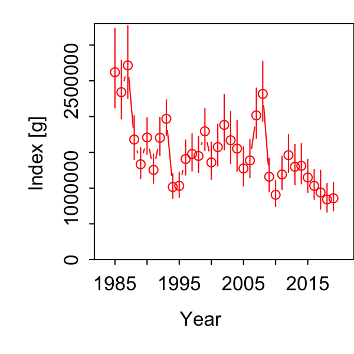
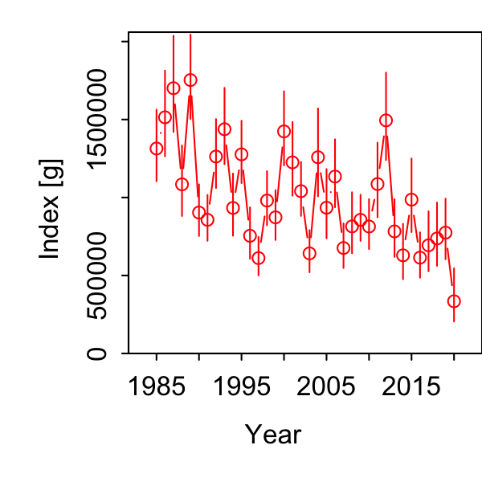
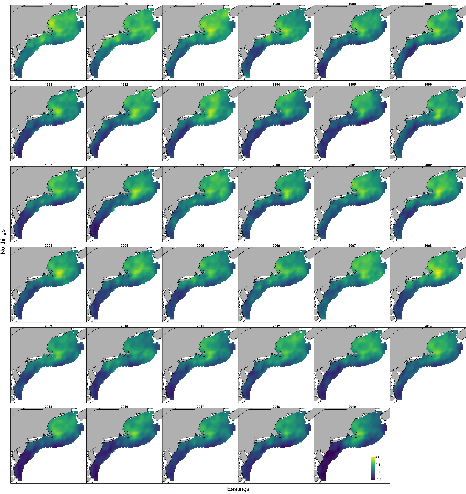
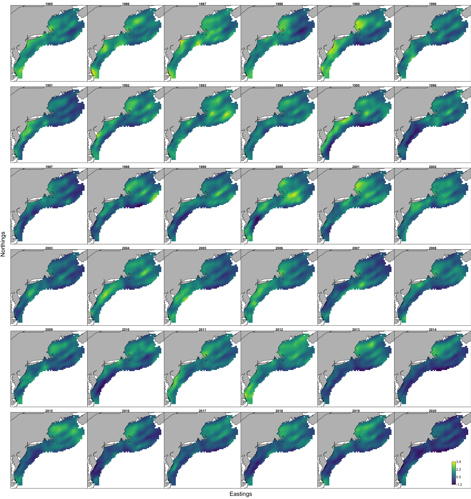

```{r setup, include=FALSE}
knitr::opts_chunk$set(echo = TRUE,
                      message = FALSE,
                      warning = FALSE)

library(tidyverse)
library(here)
#library(DT)
#library(pdftools)
#library(patchwork)
#library(ggiraph)

#library(ecodata)
#library(VAST)
```

Having built an initial dataset of haul-specific mean bluefish prey weight per stomach for the [updated piscivore list](https://sgaichas.github.io/bluefishdiet/UpdateVAST_Inputs.html) from both NEFSC and NEAMAP, now we'll run a few configurations to see if spatial and spatio-temporal random effects make sense to estimate the prey index in VAST.

Following what @ng_predator_2021 did for herring, we apply a Poisson-link delta model to estimate expected prey mass per predator stomach. However, we use 500 knots, estimated by k-means clustering of the data, to define the spatial dimensions of each seasonal model.   

Model selection follows @ng_predator_2021 using REML. 

I updated the script each time for index standardization model, using 500 knots to speed things up (run from script `VASTunivariate__bfp_allsurvs_modsel.R`). This is the most recent version:

```{r, code = readLines(here("VASTunivariate_bfp_allsurvs_modsel.R")), eval=F}
```

We'll scrape the settings and parameter estimates from each folder to compare AICs:

```{r}
# from each output folder in pyindex, 
outdir <- here("pyindex")
moddirs <- list.dirs(outdir) 
moddirs <- moddirs[-1]
# keep folder name
modnames <- list.dirs(outdir, full.names = FALSE)

# function to apply extracting info
getmodinfo <- function(d.name){
  # read settings
  modpath <- stringr::str_split(d.name, "/", simplify = TRUE)
  modname <- modpath[length(modpath)]
  
  settings <- read.table(file.path(d.name, "settings.txt"), comment.char = "",
    fill = TRUE, header = FALSE)
  
  n_x <- as.numeric(as.character(settings[(which(settings[,1]=="$n_x")+1),2]))
  grid_size_km <- as.numeric(as.character(settings[(which(settings[,1]=="$grid_size_km")+1),2]))
  max_cells <- as.numeric(as.character(settings[(which(settings[,1]=="$max_cells")+1),2]))
  use_anisotropy <- as.character(settings[(which(settings[,1]=="$use_anisotropy")+1),2])
  fine_scale <- as.character(settings[(which(settings[,1]=="$fine_scale")+1),2])
  bias.correct <- as.character(settings[(which(settings[,1]=="$bias.correct")+1),2])
  
  #FieldConfig
  if(settings[(which(settings[,1]=="$FieldConfig")+1),1]=="Component_1"){
    omega1 <- as.character(settings[(which(settings[,1]=="$FieldConfig")+2),2])
    omega2 <- as.character(settings[(which(settings[,1]=="$FieldConfig")+3),1])
    epsilon1 <- as.character(settings[(which(settings[,1]=="$FieldConfig")+4),2])
    epsilon2 <- as.character(settings[(which(settings[,1]=="$FieldConfig")+5),1])
    beta1 <- as.character(settings[(which(settings[,1]=="$FieldConfig")+6),2])
    beta2 <- as.character(settings[(which(settings[,1]=="$FieldConfig")+7),1])
  }
  
  if(settings[(which(settings[,1]=="$FieldConfig")+1),1]=="Omega1"){
    omega1 <- as.character(settings[(which(settings[,1]=="$FieldConfig")+3),1])
    omega2 <- as.character(settings[(which(settings[,1]=="$FieldConfig")+4),1])
    epsilon1 <- as.character(settings[(which(settings[,1]=="$FieldConfig")+3),2])
    epsilon2 <- as.character(settings[(which(settings[,1]=="$FieldConfig")+4),2])
    beta1 <- "IID"
    beta2 <- "IID"
  }
  
  
  #RhoConfig
  rho_beta1 <- as.numeric(as.character(settings[(which(settings[,1]=="$RhoConfig")+3),1]))
  rho_beta2 <- as.numeric(as.character(settings[(which(settings[,1]=="$RhoConfig")+3),2]))
  rho_epsilon1 <- as.numeric(as.character(settings[(which(settings[,1]=="$RhoConfig")+4),1]))
  rho_epsilon2 <- as.numeric(as.character(settings[(which(settings[,1]=="$RhoConfig")+4),2]))
  
  # read parameter estimates, object is called parameter_Estimates
  load(file.path(d.name, "parameter_estimates.RData"))
  
  AIC <- parameter_estimates$AIC[1]  
  converged <- parameter_estimates$Convergence_check[1]
  fixedcoeff <- unname(parameter_estimates$number_of_coefficients[2])
  randomcoeff <- unname(parameter_estimates$number_of_coefficients[3])
  
  
  # return model atributes as a dataframe
  out <- data.frame(modname = modname,
                    n_x = n_x,
                    grid_size_km = grid_size_km,
                    max_cells = max_cells,
                    use_anisotropy = use_anisotropy,
                    fine_scale =  fine_scale,
                    bias.correct = bias.correct,
                    omega1 = omega1,
                    omega2 = omega2,
                    epsilon1 = epsilon1,
                    epsilon2 = epsilon2,
                    beta1 = beta1,
                    beta2 = beta2,
                    rho_epsilon1 = rho_epsilon1,
                    rho_epsilon2 = rho_epsilon2,
                    rho_beta1 = rho_beta1,
                    rho_beta2 = rho_beta2,
                    AIC = AIC,
                    converged = converged,
                    fixedcoeff = fixedcoeff,
                    randomcoeff = randomcoeff
  )
  	
	return(out)

}

# combine into one table for comparison

modselect <- purrr::map_dfr(moddirs, getmodinfo)


```

Now compare the AIC for the 500 knot models to see if including the spatial and spatio-temporal random effects in the first and second linear predictors improved the model fit. Model structures tested include with and without anistropy (2 fixed parameters), and with and without spatial and spatio-temporal random effects in the second linear predictor or both linear predictors. This follows the model selection process outlined in @ng_predator_2021. 

NEAMAP is now included in the analysis. We have only NEAMAP data for 2020-2021 in Fall and for 2021 in Spring.

```{r}

# only compare AIC for the 500 knot models
modselect.500 <- modselect %>%
  filter(n_x == 500) %>%
  mutate(season = case_when(str_detect(modname, "fall") ~ "Fall",
                            str_detect(modname, "spring") ~ "Spring",
                            TRUE ~ as.character(NA))) %>%
  mutate(converged2 = case_when(str_detect(converged, "no evidence") ~ "likely",
                                str_detect(converged, "is likely not") ~ "unlikely",
                                TRUE ~ as.character(NA))) %>%
  group_by(season) %>%
  mutate(deltaAIC = AIC-min(AIC)) %>%
  select(modname, season, deltaAIC, fixedcoeff,
         randomcoeff, use_anisotropy, 
         omega1, omega2, epsilon1, epsilon2, 
         beta1, beta2, AIC, converged2) %>%
  arrange(AIC)

DT::datatable(modselect.500, rownames = FALSE, 
              options= list(pageLength = 25, scrollX = TRUE))
```

All of the models converged. Similar to the preliminary run with only NEFSC diet data and the previous predator list, models with anistopy, spatial and spatio-temporal random effects are most supported by the data.

## Selected Model Results

Note that these do not have catchability coefficients applied yet, so are not final models. 

### Fall Index



### Spring Index



### Fall predicted ln-density



### Spring predicted ln-density


All results in the respective pyindex/allagg_fall_500 and allagg_spring_500 folders.

The full results are on [google drive](https://drive.google.com/drive/folders/1mEu4wPBlLUf32C3DdV8lmYx4C4f4hra2) rather than github to save space.

## References
